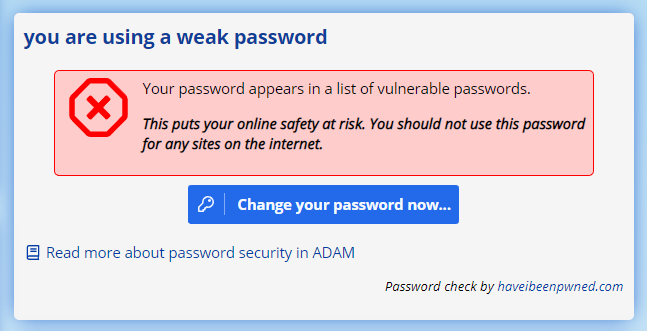

# Passwords and Security Information {#h-rovswd9fg460}

## How does ADAM store passwords? {#h-bq4mv1a3zjdo}

ADAM stores passwords in its database using a “one-way salted hash” algorithm.

-   A “hash” is essentially the result of a long series of computations and operations. The same input will always generate the same output.
-   Because it is a “one-way” algorithm, that means that it is impossible to take the “hash” and work backwards from it. Therefore, it is not possible to determine what your original password was.
-   Because it is “salted”, even if two or more people do have the same password, someone looking at the database would see different hash values and not know.

## What about passkeys? {#h-7cnfab4ir1wi}

A passkey is an alternative to a password. Where a password is something you know (and that ADAM has to store, in hashed form, on its server), a passkey is something your device holds — ADAM only ever sees a public-key proof that the device gave consent. Because there is no shared secret to leak or to phish, passkeys are considered considerably safer than passwords.

Enrolling a passkey does not change anything about your existing password — the password remains valid and is still stored, hashed, exactly as described above. The two methods sit alongside each other: you can log in with whichever is more convenient at the time, and remove the passkey later if you no longer want it. See [Passkey Authentication](passkey-authentication.md#h-68qerlruak0n) for the full walkthrough.

## How can you tell if I give you the right password? {#h-mqxivxggoh6h}

Very simply, we perform the same algorithm on the password you provide when you log in to the system and see if we end up with the same hash. If they match, then you must have provided the correct password. If they don’t, then you gave an incorrect password.

As an analogy: how could you tell if someone used the same ingredients to make two different cakes? Once the cakes are baked (baking is the one-way operation in this scenario), you can’t see the ingredients any more. However, a skillful taster will be able to compare the flavours of the two cakes to see if they taste exactly the same.

## Is my password ever written down or stored anywhere? {#h-f2ddtjkafo0r}

Never in anything that could be considered permanent storage.

To be clear, when you type in your password, your computer encrypts the login request and sends that to the ADAM server which decrypts it into memory. The password is then checked against your account (see one-way hashing above) for validity and, if it hasn’t already been checked before, ADAM will check your password against the [haveibeenpwned.com](https://www.google.com/url?q=https://haveibeenpwned.com/Passwords&sa=D&source=editors&ust=1778246676393486&usg=AOvVaw0CIzvUxx-D-5zq9Ryoqhgf) password service which checks passwords against a database of known breached passwords.

If you are technically minded, you can read the [technical details](https://www.google.com/url?q=https://haveibeenpwned.com/API/v2%23PwnedPasswords&sa=D&source=editors&ust=1778246676393831&usg=AOvVaw072VEy9cJvWjaVPB7lx50F) of how we manage this [without compromising your password security](https://www.google.com/url?q=https://blog.cloudflare.com/validating-leaked-passwords-with-k-anonymity/&sa=D&source=editors&ust=1778246676394039&usg=AOvVaw3qvsORu21vpdIIWNloDqy6).

!!! warning
    In the process of checking your password, ADAM stores a SHA-1 hash of your password in the database until such time as the password is checked. SHA-1 hashing is a common, secure, but unsalted mechanism of one-way hashing a password. This hash is required by the haveibeenpwned.com service and is used solely for that reason. The checks happen every 5 minutes. The storage space is located entirely in temporary memory and is not written to disk. The data for password checks is not backed up.

## ADAM tells me there is a problem with my password. Why? {#h-ew9mw0a78pk2}

When you log in to ADAM with a new password, ADAM will check your password against the [haveibeenpwned.com](https://www.google.com/url?q=https://haveibeenpwned.com/Passwords&sa=D&source=editors&ust=1778246676394989&usg=AOvVaw2NHdxnpFd6S_ayJU7oOKCx) database of over 500 million compromised passwords. If it discovers that the password has been used before, it records how many times it has been used. We’re hoping it isn’t there at all!

When you visit your landing page, if the password has been used before, ADAM will display a warning similar to this one:

### I login to ADAM with my network password. Must I still change it? {#h-5lrnbofochgx}

***Yes!***

The fact remains that if you’ve chosen a weak password, that password may make it easier for hackers to compromise the security of the ADAM database by simply logging in with your details and getting access to everything that you can see.

Some schools have ADAM login by quering the password with their network server instead of having ADAM manage a separate password for them. In these instances, ADAM will still check the quality of your password but it can’t give you the opportunity to change it.

In these instances, you should update your network password. When you next log in to ADAM, your new password will be checked.
