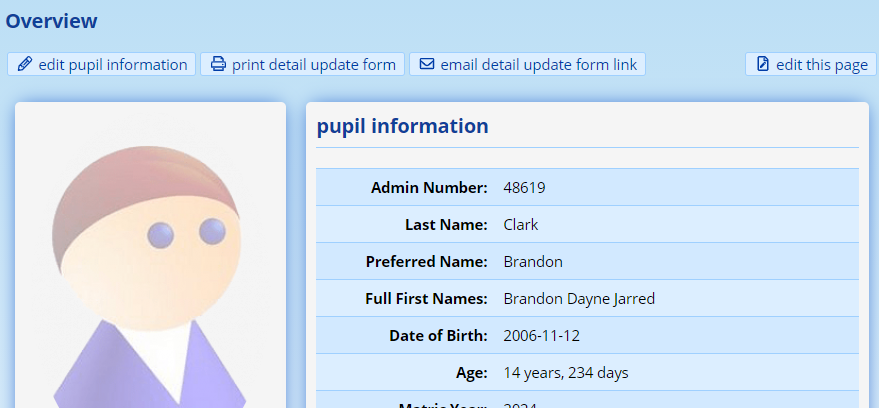
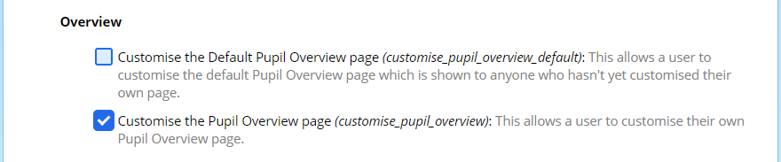
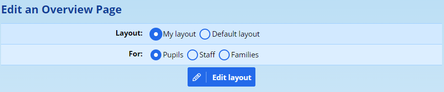
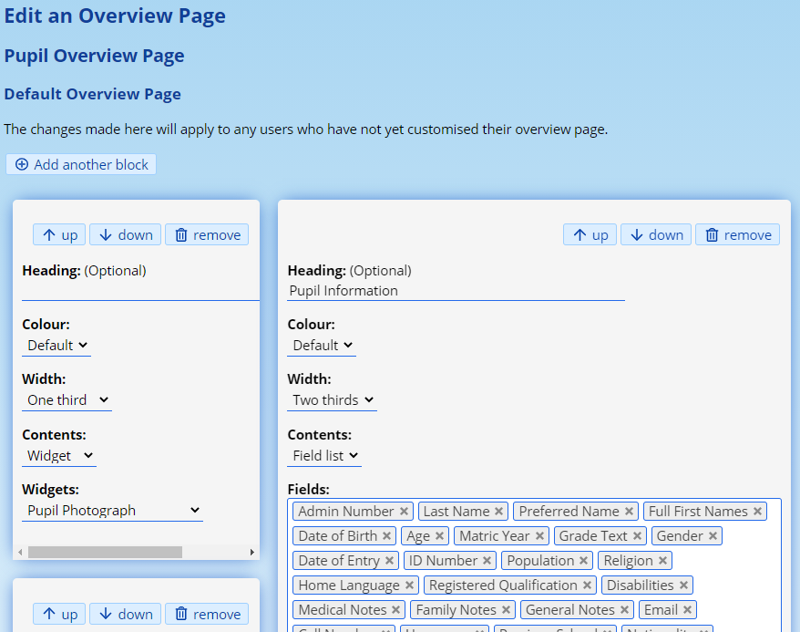
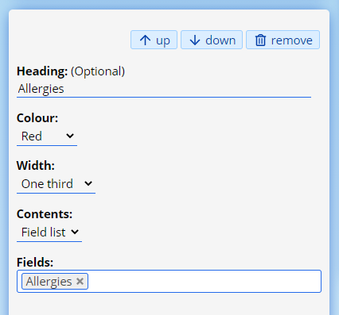
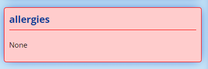

# Profile Overview Customisation

ADAM allows each school and, potentially, each staff member, to update the overview screens for staff, pupils and families as required.

Those with the necessary privileges will see an “edit this page” option to the top right of the profile screen as shown below on the example pupil profile:

## Assigning the Privileges to Staff

There are six privileges in total to allow for the customisation of the screens, divided into two categories:

1.  The ability to personalise one’s *own profile page* for each of “staff”, “pupils”, and “families”.
2.  Then there is also the option to edit the *default profile page* for each of “staff”, “pupils” and “families”.

!!! warning
    The default page is the view that all staff members will see unless they’ve customised their own overview page.

It would be feasible to allow most teachers the privileges to customise their own overview screens if they want to.

!!! warning
    *Note that they can only ever get access to the information that has been allowed for them to view via the* *[scratch list privileges](scratch-lists.md#controlling-access-to-scratch-list-fields)**.*

To [assign the privileges](security-administration-for-staff.md#security-administration-for-staff), open the **privileges** view of the appropriate staff group and under “Pupil Admin”, “Staff Admin” or “Family Admin”, look for the **Overview** heading. Then assign the appropriate privileges:

Note that, as normal, a site administrator will automatically get access to the ability to edit the default page and their own page.

## Changing the Overview Page

<iframe src="https://www.youtube.com/embed/fOtliGrFp0M" frameborder="0" allow="accelerometer; autoplay; encrypted-media; gyroscope; picture-in-picture" allowfullscreen></iframe>

If you click on the **edit this page** link, ADAM will take you to the overview editing page. Note that if you have privileges to edit both the default page and your own page, ADAM will stop to ask you which page you wish to edit:

The first option on this screen allows you to choose between “**My layout**” and the “**Default layout**”.

Make the appropriate choice and click on **Edit layout**.

The process of editing a default vs a personal layout are identical. The only difference is that when editing a personal layout, ADAM will give you the option of reverting that layout to the default layout by deleting your personalisation options.

The top left option allows you to add a new block to the screen. Note that this block is added to the bottom of the list.

Within each block are three options to change the position (moving it up and down) and remove it entirely from the screen. No confirmation will be required here, but if you have made a mistake, don’t save your work!

Then, within each block, are several options.

-   ADAM provides an optional **header** field. This will be displayed at the top of the block. Note that this is not required. Where ADAM shows the photograph, for example, we have not put a heading there.
-   The second option is the **colour** of the block. Some simple options are provided (red, green, yellow and blue). The default is white.
-   The **width** of the block determines how wide the block will be when displayed. ADAM should adjust the width of the block as you change it to give you an idea of what your final page will look like.

!!! warning
    The appearance and arrangement of these blocks on the actual page will, of course, depend on the contents of those blocks. ADAM will attempt to arrange them as best as it can. Thus, be aware that this screen may not be a perfect representation! But you are welcome to come back and change the order of the blocks if you need to.

-   Finally, one can choose whether to display a list of fields or to display one of the available widgets that are available.

-   When choosing to display a **field list**, one or more of the scratch list fields can be chosen. Staff will only see the fields that they have been [given privileges to see](scratch-lists.md#controlling-access-to-scratch-list-fields). If only one field is chosen, the name of the field is not shown and the contents of that field are shown in a plain paragraph. Make sure to use the heading to give context. As an example, see how the default *Allergies* block is set up:

Note that its appearance is Red and its field list contains a single field. This will show as follows on the overview screen:

-   When choosing to display **widgets**, please select the appropriate widget from the list.

When done, click on the **Save** button.

## Reverting a personalised overview screen to the default view

A user can choose to revert their view to the default view at any point. To do this they should click on the **edit this page** link. On the customisation page, they should click on the option **reset this view to the default**.

Note that no confirmation is asked for and the view will automatically be reverted to the default settings.

If the person leaves the page now, without clicking on the **Save** button at the bottom, their view will continue to follow the default view and will reflect any changes that are made to the default view as they are made. If they *do*, however, save this view, they will have a personalised copy of the default which will not update if changes are made.
