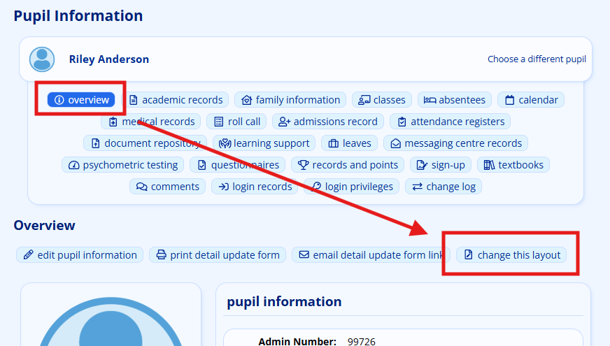
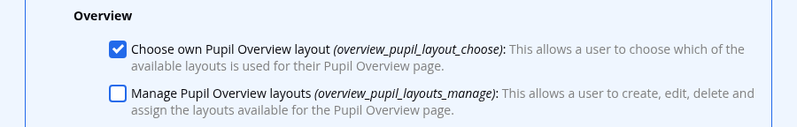
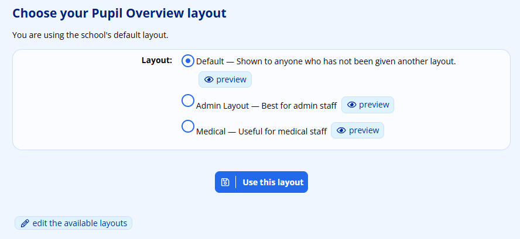
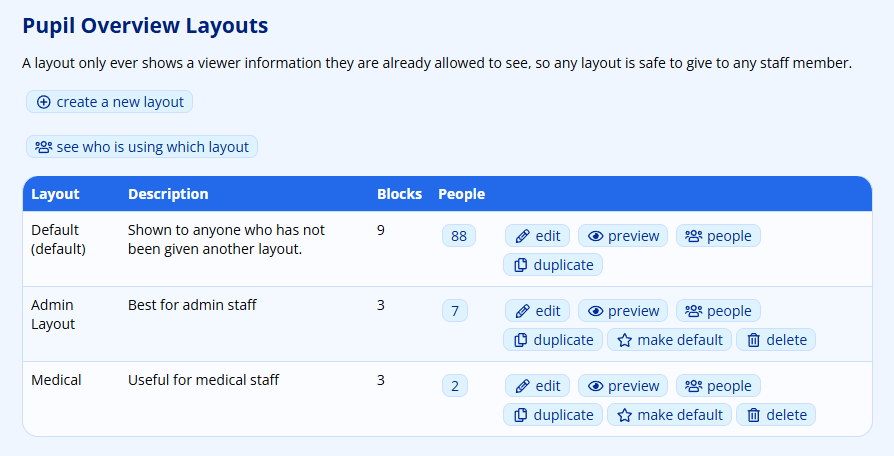
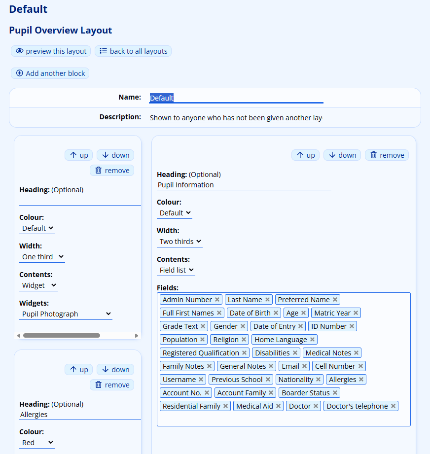
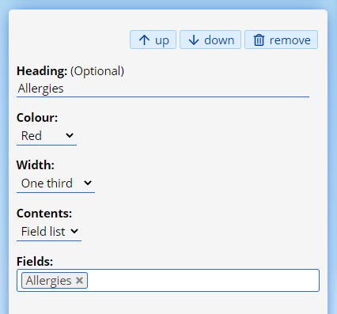
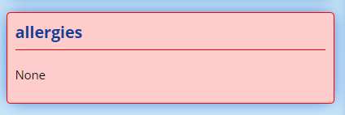
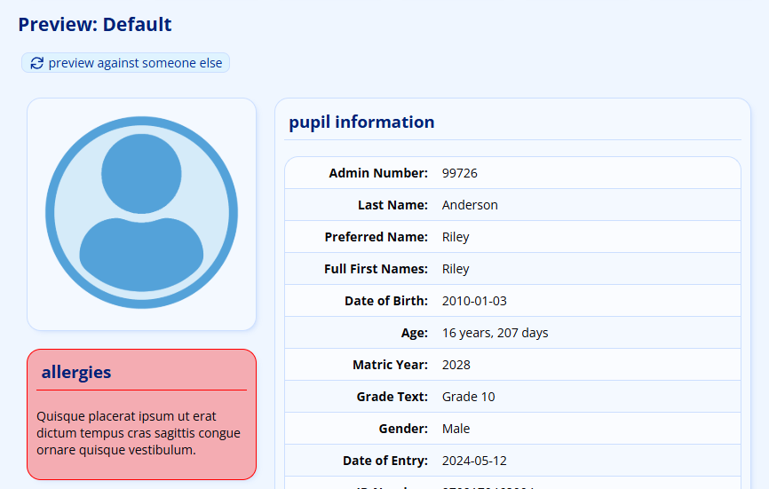

# Profile Overview Layouts

The overview screen of a pupil, a family or a staff member is built from a **layout**: a named,
reusable arrangement of blocks that decides which information appears on the page and how it is
laid out.

Layouts are designed centrally. Somebody at the school — usually an administrator — creates the
layouts that are available, and staff members then choose which of those layouts they would like to
use. A staff member never builds a page of their own from scratch; they pick one from the list. An
administrator can also put staff members onto a layout directly, rather than waiting for them to
choose.

!!! note
    A layout only ever shows a viewer the information that they are already allowed to see. If a
    layout contains a field that a particular staff member may not view, that field is simply left
    out for them. This means that **any layout is safe to offer to any staff member**.

## Which Layout a Staff Member Sees

Every staff member has, at most, one layout of their own for each screen. ADAM uses the first of
these that it finds:

1.  The layout on their record — whether they chose it themselves or an administrator put them on
    it.
2.  Otherwise, the school's default layout.

Most staff have nothing on their record at all, and simply follow the default. This is why an
administrator can improve the default layout and have the change reach everybody who has not made a
choice of their own, without disturbing the people who have.

!!! warning
    There is only one layout per person per screen, so an administrator who puts somebody onto a
    layout **replaces whatever they had**, including a layout that person had chosen for themselves.
    Nothing is kept underneath to fall back on. The staff member can of course choose again
    afterwards, if they have the permission to.

!!! note "Upgrading from an earlier version of ADAM"
    Earlier versions of ADAM let each staff member customise their own overview page, and had a
    single "default" page for everyone else. Those personal customisations have been converted into
    ordinary named layouts — each named after the person who made it, for example *"Jane Smith's
    Pupil Overview"* — and each person has been set to use their own one. **Nobody's overview screen
    changes as a result of the upgrade.**

    A school where customising was popular will therefore see a long list of layouts on the first
    day. These are ordinary layouts: once their owner has moved to one of the school's layouts, the
    old one can simply be deleted.

## Assigning the Permissions to Staff

There are six permissions in total, two for each of the three overview screens:

-   **Manage Pupil / Family / Staff Overview layouts** — create, edit, duplicate and delete the
    layouts that are available for that screen, and decide which staff members are on which layout.
-   **Choose own Pupil / Family / Staff Overview layout** — choose which of the available layouts to
    use for that screen.

Being able to manage the layouts implies being able to choose one, so the second permission does not
also have to be granted to an administrator.

To [assign the permissions](security-administration-for-staff.md#security-administration-for-staff),
open the **permissions** view of the appropriate staff group and, under **Pupil Admin**, **Staff
Admin** or **Family Admin**, look for the **Overview heading**.

It is entirely reasonable to give most teachers the "choose own" permission, and to keep the "manage"
permission for the handful of people who look after the school's layouts.

!!! warning
    A staff member can only ever see the information that they have been allowed to view through the
    [scratch list permissions](scratch-lists.md#controlling-access-to-scratch-list-fields), whichever
    layout they are using.

As usual, a site administrator automatically has all six permissions.

## Choosing Your Own Layout

Open any pupil, family or staff overview screen and click on **change this layout** at the top of
the page.

ADAM lists every layout available for that screen, with its description, and shows which one you are
using at the moment and why — whether it is one you chose yourself, one your administrator set for
you, or the school's default. Where you have permission to view the profiles concerned, each layout
also offers a **preview** link so that you can see what it looks like before committing to it.

Select the layout you want and click on **Use this layout**.

If you are on a layout of your own, or on one an administrator set for you, an option appears to
**go back to the school default**. Clicking it takes the layout off your record, so that you follow
the school's default again — and you will pick up any later improvements made to it.

## Managing the Available Layouts

If you have the permission to manage layouts, the same **change this layout** screen offers a link to
**edit the available layouts**. This opens the catalogue of layouts for that screen.

The catalogue lists each layout with its description, how many blocks it contains and how many staff
members are currently using it. The default layout is marked as such. The **People** count is itself
a link, and opens the list of the staff members it counts. Each row offers the following actions:

-   **edit** — change the layout's name, description and blocks.
-   **preview** — see the layout rendered against a real pupil, family or staff member.
-   **people** — see the staff members who are using this layout, and move them to another one.
-   **duplicate** — take a copy of the layout, as a starting point for a new one.
-   **make default** — promote the layout to be the school's default.
-   **delete** — remove the layout entirely.

The last two are not offered for the layout that is already the default.

Above the table, **see who is using which layout** opens the same list for every staff member at
once, rather than for a single layout.

### Creating a New Layout

Click on **create a new layout**, give the layout a **Name** and a **Description**, and click on
**Create**. The name is what staff members see when they choose a layout, and the description is
shown alongside it, so it is worth spending a moment on both: *"Register teacher's view — contact
details and today's absentees"* helps a teacher choose far more than *"Layout 3"* does.

ADAM then takes you straight to the block editor so that you can add some content.

### Editing the Blocks

The block editor is where the page is actually assembled.

The **Name** and **Description** of the layout appear at the top of the screen and can be changed
here at any time.

The **Add another block** option adds a new, empty block to the end of the page.

Each block carries three small controls in its top right corner to move it **up**, move it **down**,
or **remove** it from the page. No confirmation is asked for — but nothing is written until you save,
so if you make a mistake, simply leave the page without saving.

Within each block are the following options:

-   **Heading** — an optional heading displayed at the top of the block. It is not required; the
    photograph block, for example, has no heading.
-   **Colour** — the colour of the block. The choices are **Default**, **Red**, **Yellow**, **Green**
    and **Blue**.
-   **Width** — how wide the block should be: **One third**, **Half**, **Two thirds** or **Full
    width**. The editor adjusts the block as you change this, to give you an idea of what the
    finished page will look like.
-   **Contents** — whether the block shows a **Field list** or a **Widget**.

-   A **Field list** block shows one or more of the scratch list fields. Staff will only see the
    fields they have been
    [given permissions to see](scratch-lists.md#controlling-access-to-scratch-list-fields). If only a
    single field is chosen, the field's name is not shown and its contents appear as a plain
    paragraph — so use the heading to give it context.
-   A **Widget** block shows one of the ready-made panels that ADAM (and its modules) provide, such
    as the photograph, the family information panel, the current period's marks, or a module's own
    card. Choose the one you want from the **Widgets** list.

As an example, this is how the familiar red *Allergies* block is put together — a red, one-third
block containing a field list of exactly one field:

Which appears on the overview screen like this:

When you are happy, click on the **Save** button at the bottom of the screen.

!!! warning
    How the blocks actually arrange themselves on the finished page depends on what is in them.
    ADAM arranges them as best it can, so the editor is not a perfect representation of the result.
    Use the preview to check, and come back and reorder the blocks if you need to.

!!! note
    A layout with a very large number of blocks and fields can produce a form too big for the server
    to accept. If that happens, ADAM refuses the save and tells you so, rather than quietly losing
    the blocks that fell off the end. Use fewer blocks, or fewer fields per block, and try again.

### Previewing a Layout

Click on **preview this layout** (in the editor) or **preview** (in the catalogue or on the layout
chooser). ADAM asks you to choose a pupil, family or staff member, and then renders that person's
overview screen using the layout.

!!! note
    The preview shows what **you** would see. A staff member with fewer permissions will see less.
    Previewing is only available to people who are allowed to view the profiles concerned in the
    first place.

### Seeing and Changing Who Uses What

Click on **see who is using which layout** above the catalogue for the whole staff, or on **people**
next to a single layout for just the people on that one. (From a single layout, **show everybody**
widens it out again.)

The list names every current staff member, the layout they are on, and how they came to be on it:

-   **own choice** — they chose this layout themselves.
-   **assigned** — an administrator put them on it.
-   **following the default** — they have no layout of their own, so they get the school's default.

To move people, tick them in the list, choose where they should go next to **Move selected to:**,
and click on **Move selected**. The destination can be any layout, or **Follow the school default**,
which takes the layout off their record so that they follow the default from then on.

This is how you would give, say, every register teacher the layout suited to their work, without
waiting for each of them to find it for themselves.

!!! warning
    Moving somebody replaces whatever they had, **including a layout they picked for themselves**.
    They are not asked, and their old choice is not remembered. If they have the permission to choose
    their own layout, they can simply pick another one afterwards.

### Making a Layout the Default

Click on **make default**. From then on, that layout is used by anybody who has no layout of their
own and has not been put onto one. There is exactly one default layout per screen, so the layout
that was previously the default becomes an ordinary layout again.

### Deleting a Layout

Click on **delete** next to the layout. ADAM protects a layout that is still in use:

-   The **default layout cannot be deleted**. Make another layout the default first.
-   A layout that **staff members are still using cannot be deleted**. Move them to another layout
    first, using **people** — ADAM tells you how many people are affected.
