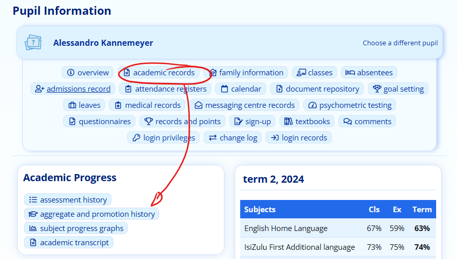
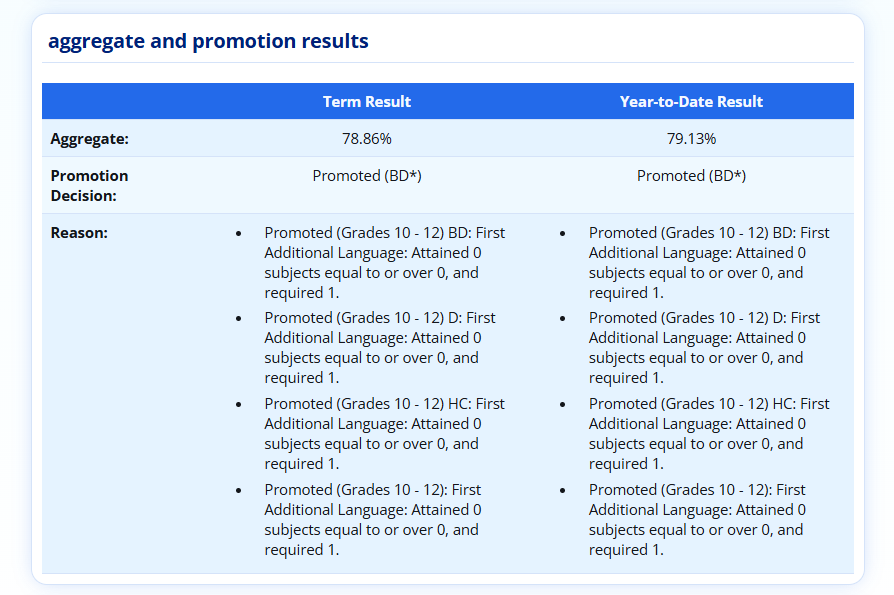
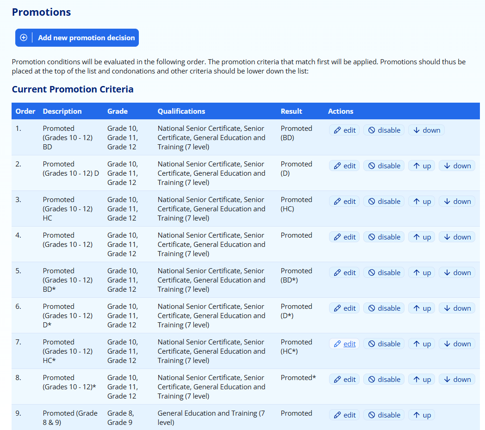
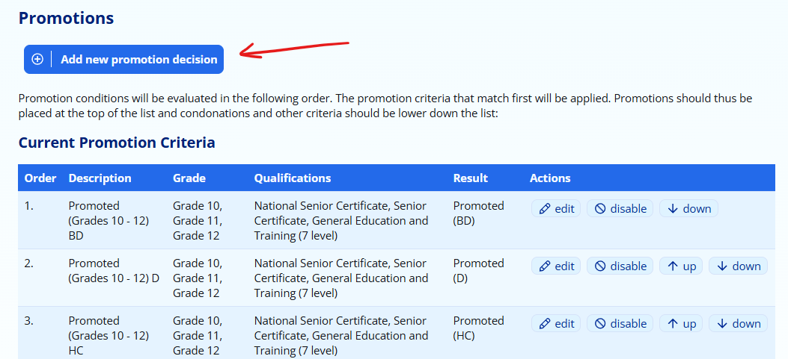
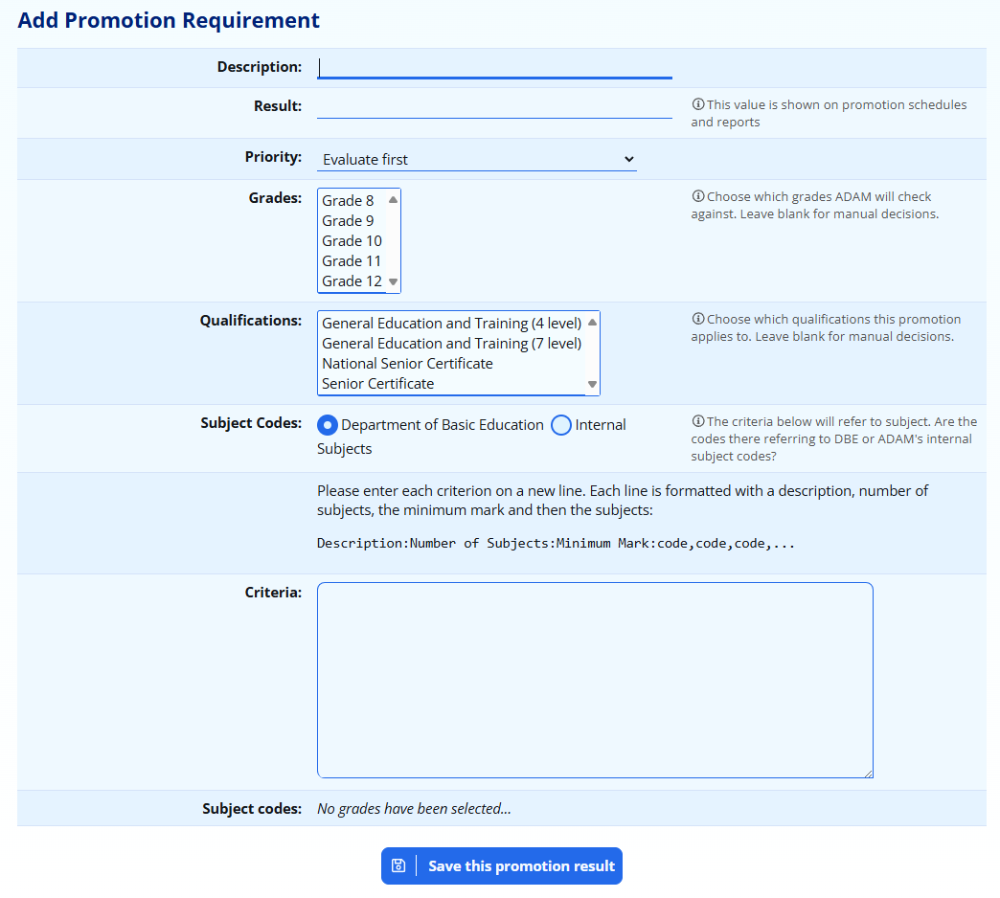
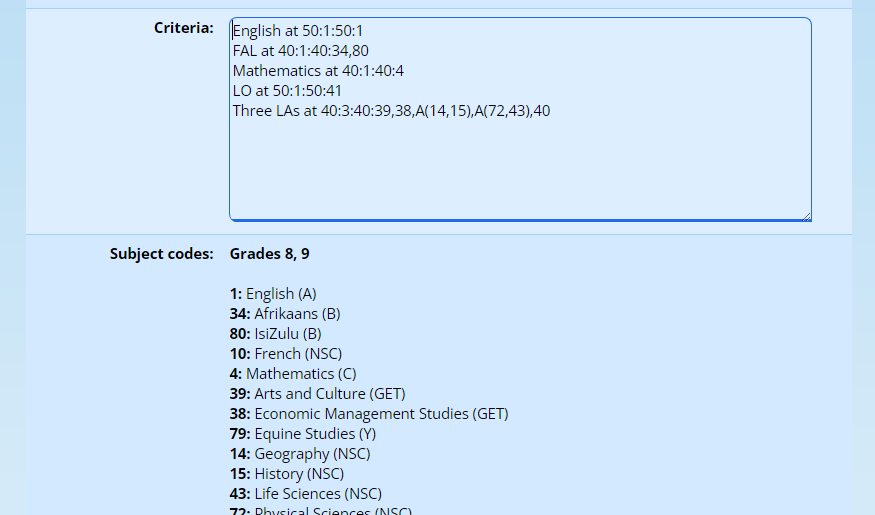
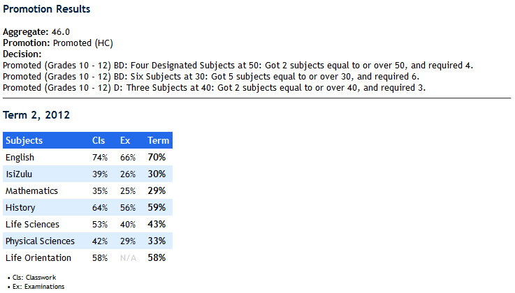

# Promotion Requirements

The promotion decisions are based on ADAM’s Promotion Requirements. The set of criteria for a pupil are based on that pupil’s grade and their qualification. If they are not specifically registered for a qualification, then the default qualification as set in the [Reporting Period Settings](reporting-period-administration.md#reporting-period-administration) is used.

## Interpreting ADAM’s promotion decisions

In the pupil’s **detailed academic history** page (Navigate to their **Pupil Info** page → **academic records** → **aggregate and promotion history**), ADAM will show the promotion criteria for a term as well as its reasoning for the decision.

The reasons appear in a list below the result:

In the example above, although the pupil has been listed as “Promoted (BD\*)”, you can see that there are various reasons listed below. In this case, ADAM lists the promotion decision that was checked (the first is “Promoted (Grades 10 - 12) BD”) and decides that it can’t award that result because the “First Additional Language” criterion was not met. In this case, ADAM was hoping to see 1 subject “over 0” - in other words, it is simply checking that the subject is offered. Because of this, the normal “BD” promotion decision cannot be awarded.

ADAM continues to check, in turn, whether the pupil meets all the criteria for each promotion decision and will list the reasons that they do not meet each one.

ADAM awards then pupil the first promotion result for which they meet all the criteria. This promotion result is not included in the list of reasons.

Where a pupil has been listed as failed, note carefully the checks that ADAM lists. This may give you a clue as to why the pupil did not pass. Specifically, make sure that the pupil belongs to the qualification you imagine they should (or “default”) in the [pupil details](pupil-information.md#editing-a-pupil) and that there are appropriate promotion requirements for that grade and qualification.

ADAM will only check against promotion criterion that match the pupils’ grade and qualifications.

## Recalculating promotion decisions

ADAM will, under normal circumstances, automatically recalculate the promotion decisions for pupils. This happens whenever a mark is added or changed for a pupil. It can take up to 5 minutes for the recalculation to take place, but is normally quicker than that.

There are times, however, when the promotion decisions are not automatically updated and you may therefore wish to force a manual recalculation of these for a grade.

Head to **Reporting → Promotion Results → Recalculate Aggregates and Promotions**.

ADAM will ask you to specify which grade and which reporting period you’d like to have the decisions updated for. You can, once you’ve chosen those details, also specify which pupils you’d like to be recalculated, or you can select the whole grade.

ADAM will then recalculate the promotion decisions according to the current promotion requirements for that grade and qualification.

## Managing Promotion Decisions

The promotion requirements can be found on the **Administration → Academic Administration** **→  Edit promotion requirements**.

You can add a new promotion decision using the button at the top.

Editing or disabling the conditions can be done with the buttons next to each decision.

To change the order of the promotion decisions, use the “up” and “down” options next to each decision. ADAM checks these decisions in order and will award the pupil with the first matching decision. It is therefore important that these are listed from “most difficult to achieve” at the top of the list, to “easiest to achieve” at the bottom.

## National Senior Certificate Promotion Criteria

ADAM comes with default National Senior Certificate promotion criteria already added to the system but which are initially disabled. If you want to make use of these settings, you can, but you must enable the criteria first and ensure that they are displayed in the correct order. Make sure also, that they are set to look at the correct grades and qualifications, based on your school’s needs.

While you are able to change the settings of these particular criteria, please be advised that we may well override the settings in future updates. If you want to modify them, we strongly suggest that you copy these and make your own set to ensure that they are not unwittingly overwritten without your knoweledge.

## Promotions for Pupils with Immigrant Status

ADAM allows for multiple different promotion criteria to be used, even within a single grade. This includes pupils who have immigrant status and are permitted to offer an additional subject in the pace of an First Additional Language.

### Creating a Qualification

The first step is to create a specific qualification that will be used to “house” the promotion criteria that will need to be applied to pupils with immigrant status. The details of adding and otherwise [managing qualifications is dealt with elsewhere in this documentation](#creating-a-qualification). Make sure to replicate the same symbol sets so that ADAM knows the marks that are referred to by each symbol.

### Overriding the Qualification for Individual Pupils

To save time, the qualification is normally set as part of the Reporting Period Settings. This allows you to broadly specify the promotion criteria that should be applied to the members of each grade.

However, it is possible to tell ADAM that for specific pupils, a different qualification will apply. Again, assigning a specific qualification [to an individual pupil is dealt with elsewhere](academic-qualifications.md#changing-an-individual-pupils-qualification).

### Creating the Promotion Criteria

The last step is the most complicated and this will involve copying the existing promotion criteria and modifying them to take the additional subjects into account.

## Creating your Own Promotion Criteria

Navigate to **Administration → Academic Administration → Edit the promotion requirements**.

At the top of the screen, click on **Add new promotion requirement**:

The following screen will appear:

For each decision, enter the following information:

-   **Description:** this is an internal description of the promotion decision for your records. It does not get used when publishing or displaying reports.
-   **Priority:** the priority of the promotion decisions is crucial. ADAM tests these promotion decisions in order and will award the first one that works for a pupil. As such, the *hardest* promotion criteria should be set first and the *easiest* ones later.
-   **Grades:** select one or more grades that should consider this promotion criterion. You must have at least one grade, otherwise the promotion criteria will not be used.
-   **Qualifications:** select one or more qualifications that should consider this promotion criterion. You must have at least one qualification selected.
-   **Result:** this is the text that is printed on the report and in mark schedules. It will typically say something like “Promoted” or “Promoted with Bachelor Degree Pass”.
-   **Subject Codes:** the promotion criteria that are added at the bottom of the screen in the **Criteria** box are all based on subject codes. You can tell ADAM whether you want to use the Department subject codes (based on the DBE subject link in the subject settings) or ADAM’s internal subject code. The contents of the **Criteria** box are discussed below.

## Explanation of Syntax of the Criteria

In each of the criteria are a number of lines that are essentially colon “:” delimited lines. If a line cannot be delimited accurately into 4 sections (i.e. contains three “:” characters) it is ignored and has no effect on the criteria.

Example:

Five Subjects at 30:5:30:134,133,145,82,153,138,139,142,125,136,137,85,135,107

-   The green text is a description and is meaningless to ADAM. It’s only purpose is to describe the condition for human readability. This is used later by ADAM to give context to the reasons for its decision.
-   The red number represents the number of subjects that ADAM must find.
-   The blue number is the minimum mark that must be attained in that subject for ADAM to count is as one of the “found” subjects.
-   The black numbers are a comma separated list of subject ID codes that ADAM will search through.

In this example, ADAM must find 5 subjects with a minimum mark of 30 from the list provided in order to satisfy this criterion.

### Where are the subject codes?

The list of subject codes will appear below the **Criteria** entry box. They will only appear once you have selected the Grades for which the promotion criteria are to apply since then ADAM can determine which of the many subjects you may have are actually used by those grades - this is in an attempt to simplify the process of finding the correct codes.

### What is the difference between an Internal Subject Code and a DBE Subject Code?

Internal Subject Codes are those used internally by ADAM to refer to each subject. Some schools prefer to have different versions of English, for example, for the different phases within the school. Each of these subjects would have a different Internal Subject code.

Because the Department of Basic Education need to know that the multiple versions of the different “English” subjects all refer to the same core subject (perhaps “English Home Language”?), each subject can optionally be assigned to a DBE subject in its [subject settings](subjects.md#editing-a-subject). This means that in the promotion criteria when you refer to a DBE subject code, ADAM will automatically consider any subject that has been linked to that particular official subject.

Schools that offer customised and foreign curriculums are not always able to assign these links to DBE codes because there are no equivalent subjects in the DBE. For example, IB offers English Literature as a subject but this is not specifically equivalent to “English Home Language”.

### How strict is the syntax?

If ADAM can’t match the syntax, it ignores the line. Thus any comments can be entered simply on the line. Do not enter a comment at the end of the line because the whole line will then be ignored.

In the examples below, comments are CAPITALISED for ease of reading only.

Also, indented lines in the examples below, indicate a long, continued line that should be entered on the previous line as one line.

### Templates for Typical Promotion Requirements

The following requirements are based on [official guidelines](https://www.google.com/url?q=https://www.education.gov.za/Portals/0/Documents/Policies/PolicyProgPromReqNCS.pdf?ver%3D2015-02-03-154857-397&sa=D&source=editors&ust=1778246676418656&usg=AOvVaw2TW4RV5LN7kxgY4MBAEub7). All these promotion criteria are linked to DBE codes and so all criteria need to be set to use DBE codes.

#### Promoted (Grades 10 – 12) BD

NSC SUBJECT OFFERING

One official language at HL Level:1:0:1,4,7,10,13,16,19,22,25,28,31

Two official languages :2:0:1,2,4,5,7,8,10,11,13,14,16,17,19,20,22,23,25,26,28,29,31,32

Mathematics or Maths Lit:1:0:35,77

Life Orientation:1:0:42

Three Elective Subjects :3:0:44,45,46,52,53,54,80,99,43,48,55,3,6,9,12,15,18,21,24,27,30,33,47,59,61,62,63,64,65,66,67,68,69,73,74,83,84,85,161,162,163,87,89,90,91,92,93,94,96,97,98,49,56,78,57,60,70,86,50,72,75,82,51,71,95,58,100,101,102,76,79,81,88

BACHELOR'S DEGREE REQUIREMENTS

English or Afrikaans at 30%:1:30:1:1,2,4,5

Home Language at 40%:1:40:1,4,7,10,13,16,19,22,25,28,31

Five Subjects above 30% :5:30:2,5,8,11,14,17,20,23,26,29,32,35,77,42,44,45,46,52,53,54,80,99,43,48,55,3,6,9,12,15,18,21,24,27,30,33,47,59,61,62,63,64,65,66,67,68,69,73,74,83,84,85,161,162,163,87,89,90,91,92,93,94,96,97,98,49,56,78,57,60,70,86,50,72,75,82,51,71,95,58,100,101,102,76,79,81,88

Four 20cr Subjects Above 50% :4:50:1,2,4,5,7,8,10,11,13,14,16,17,19,20,22,23,25,26,28,29,31,32,35,77,44,45,46,52,53,54,80,99,43,48,55,3,6,9,12,15,18,21,24,27,30,33,47,59,61,62,63,64,65,66,67,68,69,73,74,83,84,85,161,162,163,87,89,90,91,92,93,94,96,97,98,49,56,78,57,60,70,86,50,72,75,82,51,71,95,58,100,101,102,76,79,81,88

#### Promoted (Grades 10 – 12) D

NSC SUBJECT OFFERING

One official language at HL Level:1:0:1,4,7,10,13,16,19,22,25,28,31

Two official languages :2:0:1,2,4,5,7,8,10,11,13,14,16,17,19,20,22,23,25,26,28,29,31,32

Mathematics or Maths Lit:1:0:35,77

Life Orientation:1:0:42

Three Elective Subjects :3:0:44,45,46,52,53,54,80,99,43,48,55,3,6,9,12,15,18,21,24,27,30,33,47,59,61,62,63,64,65,66,67,68,69,73,74,83,84,85,161,162,163,87,89,90,91,92,93,94,96,97,98,49,56,78,57,60,70,86,50,72,75,82,51,71,95,58,100,101,102,76,79,81,88

DIPLOMA REQUIREMENTS

English or Afrikaans at 30%:1:30:1,2,4,5

Home Langauge at 40%:1:40:1,4,7,10,13,16,19,22,25,28,31

Five Subjects above 30% :5:30:2,5,8,11,14,17,20,23,26,29,32,35,77,42,44,45,46,52,53,54,80,99,43,48,55,3,6,9,12,15,18,21,24,27,30,33,47,59,61,62,63,64,65,66,67,68,69,73,74,83,84,85,161,162,163,87,89,90,91,92,93,94,96,97,98,49,56,78,57,60,70,86,50,72,75,82,51,71,95,58,100,101,102,76,79,81,88

Three Subjects Above 40% :3:40:2,5,8,11,14,17,20,23,26,29,32,35,77,42,44,45,46,52,53,54,80,99,43,48,55,3,6,9,12,15,18,21,24,27,30,33,47,59,61,62,63,64,65,66,67,68,69,73,74,83,84,85,161,162,163,87,89,90,91,92,93,94,96,97,98,49,56,78,57,60,70,86,50,72,75,82,51,71,95,58,100,101,102,76,79,81,88

#### Promoted (Grades 10 – 12) HC

NSC SUBJECT OFFERING

One official language at HL Level:1:0:1,4,7,10,13,16,19,22,25,28,31

Two official languages :2:0:1,2,4,5,7,8,10,11,13,14,16,17,19,20,22,23,25,26,28,29,31,32

Mathematics or Maths Lit:1:0:35,77

Life Orientation:1:0:42

Three Elective Subjects :3:0:44,45,46,52,53,54,80,99,43,48,55,3,6,9,12,15,18,21,24,27,30,33,47,59,61,62,63,64,65,66,67,68,69,73,74,83,84,85,161,162,163,87,89,90,91,92,93,94,96,97,98,49,56,78,57,60,70,86,50,72,75,82,51,71,95,58,100,101,102,76,79,81,88

HIGHER CERTIFICATE REQUIREMENTS

English or Afrikaans at 30%:1:30:1,2,4,5

Home Langauge at 40%:1:40:1,4,7,10,13,16,19,22,25,28,31

Five Subjects above 30% :5:30:2,5,8,11,14,17,20,23,26,29,32,35,77,42,44,45,46,52,53,54,80,99,43,48,55,3,6,9,12,15,18,21,24,27,30,33,47,59,61,62,63,64,65,66,67,68,69,73,74,83,84,85,161,162,163,87,89,90,91,92,93,94,96,97,98,49,56,78,57,60,70,86,50,72,75,82,51,71,95,58,100,101,102,76,79,81,88

Two Subjects Above 40% :2:40:2,5,8,11,14,17,20,23,26,29,32,35,77,42,44,45,46,52,53,54,80,99,43,48,55,3,6,9,12,15,18,21,24,27,30,33,47,59,61,62,63,64,65,66,67,68,69,73,74,83,84,85,161,162,163,87,89,90,91,92,93,94,96,97,98,49,56,78,57,60,70,86,50,72,75,82,51,71,95,58,100,101,102,76,79,81,88

#### Promoted (Grades 10 – 12)

NSC SUBJECT OFFERING

One official language at HL Level:1:0:1,4,7,10,13,16,19,22,25,28,31

Two official languages :2:0:1,2,4,5,7,8,10,11,13,14,16,17,19,20,22,23,25,26,28,29,31,32

Mathematics or Maths Lit:1:0:35,77

Life Orientation:1:0:42

Three Elective Subjects :3:0:44,45,46,52,53,54,80,99,43,48,55,3,6,9,12,15,18,21,24,27,30,33,47,59,61,62,63,64,65,66,67,68,69,73,74,83,84,85,161,162,163,87,89,90,91,92,93,94,96,97,98,49,56,78,57,60,70,86,50,72,75,82,51,71,95,58,100,101,102,76,79,81,88

NSC REQUIREMENTS

Home Langauge at 40%:1:40:1,4,7,10,13,16,19,22,25,28,31

Five Subjects above 30% :5:30:2,5,8,11,14,17,20,23,26,29,32,35,77,42,44,45,46,52,53,54,80,99,43,48,55,3,6,9,12,15,18,21,24,27,30,33,47,59,61,62,63,64,65,66,67,68,69,73,74,83,84,85,161,162,163,87,89,90,91,92,93,94,96,97,98,49,56,78,57,60,70,86,50,72,75,82,51,71,95,58,100,101,102,76,79,81,88

Two Subjects Above 40% :2:40:2,5,8,11,14,17,20,23,26,29,32,35,77,42,44,45,46,52,53,54,80,99,43,48,55,3,6,9,12,15,18,21,24,27,30,33,47,59,61,62,63,64,65,66,67,68,69,73,74,83,84,85,161,162,163,87,89,90,91,92,93,94,96,97,98,49,56,78,57,60,70,86,50,72,75,82,51,71,95,58,100,101,102,76,79,81,88

#### Promoted - Language Exemption (Grades 10 – 12) BD\*

NSC SUBJECT OFFERING

One official language at HL Level:1:0:1,4,7,10,13,16,19,22,25,28,31

Mathematics or Maths Lit:1:0:35,77

Life Orientation:1:0:42

Four Elective Subjects :4:0:44,45,46,52,53,54,80,99,43,48,55,3,6,9,12,15,18,21,24,27,30,33,47,59,61,62,63,64,65,66,67,68,69,73,74,83,84,85,161,162,163,87,89,90,91,92,93,94,96,97,98,49,56,78,57,60,70,86,50,72,75,82,51,71,95,58,100,101,102,76,79,81,88

BACHELOR'S DEGREE REQUIREMENTS

English or Afrikaans at 30%:1:30:1,2,4,5

Home Language at 40%:1:40:1,4,7,10,13,16,19,22,25,28,31

Five Subjects above 30% :5:30:2,5,8,11,14,17,20,23,26,29,32,35,77,42,44,45,46,52,53,54,80,99,43,48,55,3,6,9,12,15,18,21,24,27,30,33,47,59,61,62,63,64,65,66,67,68,69,73,74,83,84,85,161,162,163,87,89,90,91,92,93,94,96,97,98,49,56,78,57,60,70,86,50,72,75,82,51,71,95,58,100,101,102,76,79,81,88

Four 20cr Subjects Above 50% :4:50:1,2,4,5,7,8,10,11,13,14,16,17,19,20,22,23,25,26,28,29,31,32,35,77,44,45,46,52,53,54,80,99,43,48,55,3,6,9,12,15,18,21,24,27,30,33,47,59,61,62,63,64,65,66,67,68,69,73,74,83,84,85,161,162,163,87,89,90,91,92,93,94,96,97,98,49,56,78,57,60,70,86,50,72,75,82,51,71,95,58,100,101,102,76,79,81,88

#### Promoted - Language Exemption (Grades 10 – 12) D\*

NSC SUBJECT OFFERING

One official language at HL Level:1:0:1,4,7,10,13,16,19,22,25,28,31

Mathematics or Maths Lit:1:0:35,77

Life Orientation:1:0:42

Four Elective Subjects :4:0:44,45,46,52,53,54,80,99,43,48,55,3,6,9,12,15,18,21,24,27,30,33,47,59,61,62,63,64,65,66,67,68,69,73,74,83,84,85,161,162,163,87,89,90,91,92,93,94,96,97,98,49,56,78,57,60,70,86,50,72,75,82,51,71,95,58,100,101,102,76,79,81,88

DIPLOMA REQUIREMENTS

English or Afrikaans at 30%:1:30:1,2,4,5

Home Langauge at 40%:1:40:1,4,7,10,13,16,19,22,25,28,31

Five Subjects above 30% :5:30:2,5,8,11,14,17,20,23,26,29,32,35,77,42,44,45,46,52,53,54,80,99,43,48,55,3,6,9,12,15,18,21,24,27,30,33,47,59,61,62,63,64,65,66,67,68,69,73,74,83,84,85,161,162,163,87,89,90,91,92,93,94,96,97,98,49,56,78,57,60,70,86,50,72,75,82,51,71,95,58,100,101,102,76,79,81,88

Three Subjects Above 40% :3:40:2,5,8,11,14,17,20,23,26,29,32,35,77,42,44,45,46,52,53,54,80,99,43,48,55,3,6,9,12,15,18,21,24,27,30,33,47,59,61,62,63,64,65,66,67,68,69,73,74,83,84,85,161,162,163,87,89,90,91,92,93,94,96,97,98,49,56,78,57,60,70,86,50,72,75,82,51,71,95,58,100,101,102,76,79,81,88

#### Promoted - Langauge Exemption (Grades 10 – 12) HC\*

NSC SUBJECT OFFERING

One official language at HL Level:1:0:1,4,7,10,13,16,19,22,25,28,31

Mathematics or Maths Lit:1:0:35,77

Life Orientation:1:0:42

Four Elective Subjects :4:0:44,45,46,52,53,54,80,99,43,48,55,3,6,9,12,15,18,21,24,27,30,33,47,59,61,62,63,64,65,66,67,68,69,73,74,83,84,85,161,162,163,87,89,90,91,92,93,94,96,97,98,49,56,78,57,60,70,86,50,72,75,82,51,71,95,58,100,101,102,76,79,81,88

HIGHER CERTIFICATE REQUIREMENTS

English or Afrikaans at 30%:1:30:1,2,4,5

Home Langauge at 40%:1:40:1,4,7,10,13,16,19,22,25,28,31

Five Subjects above 30% :5:30:2,5,8,11,14,17,20,23,26,29,32,35,77,42,44,45,46,52,53,54,80,99,43,48,55,3,6,9,12,15,18,21,24,27,30,33,47,59,61,62,63,64,65,66,67,68,69,73,74,83,84,85,161,162,163,87,89,90,91,92,93,94,96,97,98,49,56,78,57,60,70,86,50,72,75,82,51,71,95,58,100,101,102,76,79,81,88

Two Subjects Above 40% :2:40:2,5,8,11,14,17,20,23,26,29,32,35,77,42,44,45,46,52,53,54,80,99,43,48,55,3,6,9,12,15,18,21,24,27,30,33,47,59,61,62,63,64,65,66,67,68,69,73,74,83,84,85,161,162,163,87,89,90,91,92,93,94,96,97,98,49,56,78,57,60,70,86,50,72,75,82,51,71,95,58,100,101,102,76,79,81,88

#### Promoted - Language Exemtption (Grades 10 – 12)\*

NSC SUBJECT OFFERING

One official language at HL Level:1:0:1,4,7,10,13,16,19,22,25,28,31

Mathematics or Maths Lit:1:0:35,77

Life Orientation:1:0:42

Four Elective Subjects :4:0:44,45,46,52,53,54,80,99,43,48,55,3,6,9,12,15,18,21,24,27,30,33,47,59,61,62,63,64,65,66,67,68,69,73,74,83,84,85,161,162,163,87,89,90,91,92,93,94,96,97,98,49,56,78,57,60,70,86,50,72,75,82,51,71,95,58,100,101,102,76,79,81,88

NSC REQUIREMENTS

Home Langauge at 40%:1:40:1,4,7,10,13,16,19,22,25,28,31

Five Subjects above 30% :5:30:2,5,8,11,14,17,20,23,26,29,32,35,77,42,44,45,46,52,53,54,80,99,43,48,55,3,6,9,12,15,18,21,24,27,30,33,47,59,61,62,63,64,65,66,67,68,69,73,74,83,84,85,161,162,163,87,89,90,91,92,93,94,96,97,98,49,56,78,57,60,70,86,50,72,75,82,51,71,95,58,100,101,102,76,79,81,88

Two Subjects Above 40% :2:40:2,5,8,11,14,17,20,23,26,29,32,35,77,42,44,45,46,52,53,54,80,99,43,48,55,3,6,9,12,15,18,21,24,27,30,33,47,59,61,62,63,64,65,66,67,68,69,73,74,83,84,85,161,162,163,87,89,90,91,92,93,94,96,97,98,49,56,78,57,60,70,86,50,72,75,82,51,71,95,58,100,101,102,76,79,81,88

#### Promoted (General Education and Training Phase)

Home Language at 50%:1:50:1,4

First Additional Language at 40%:1:40:2,5,14

Mathematics at 40%:1:40:35

Three subjects at 40%:3:40:40,41,38,37,39,42

Two subjects at 30% (+3 @ 40):5:30:40,41,38,37,39,42

#### Promoted (Intermediate Phase)

Home Language at 50%:1:50:1,4

First Additional Language at 40%:1:40:2,5,14

Mathematics at 40%:1:40:35

Two subjects at 40%:2:40:38,37,42

### To list all pupils as promoted without performing any checks

#### Details to Enter:

**Description:**        Promoted GENERIC

**Priority:**        Evaluate after … (whatever is last!)

**Grades:**        Select all grades except those that already have promotion requirements

**Result:**        Promoted

#### Criteria to copy-and-paste:

Any subject:0:0:1,2,3,4,5,6,7,8,9,10,11,12,13,14,15,16,17,18, 19,20,21,22,23,24,25,26,27,28,29,30,31,32,33,34,35,36,37,38,39,40,41,42,43,44,45,46,47,48,49,50,51,52,53,54,55,56,57,58,59,60,61,62,63,64,65,66,67,68,69,70,71,72,73,74,75,76,77,78,79,80,81,82,83,84,85,86,87,88,89,90,91,92,93,94,95,96,97,98,99,100,101,102,103,104,105,106,107,108,109,110,111,112,113,114,115,116,117,118,119,120,121,122,123,124,125,126,127,128,129,130,131,132,133,134,135,136,137,138,139,140,141,142,143,144,145,146,147,148,149,150,151,152,153,154,155,156,157,158,159,160,161,162,163,164,165,166,167,168,169,170,171,172,173,174,175,176,177,178,179,180,181,182,183,184,185,186,187,188,189,190,191,192,193,194,195,196,197,198,199,200

## How are the conditions used?

In each promotion criterion, there are a number lines, each with a different criterion. ADAM must be able to apply ALL of the criteria for the promotion decision to be valid.

If ADAM is not able to match a criterion within the list against a pupil’s marks, a note of the *failed* condition is made and this is shown later as part of the detailed explanation of the promotion decision in the pupils “Detailed Academic History” within their profile on ADAM. A screen shot of this is shown below.

In this example, the pupil did not qualify for a “BD” pass because they only have two designated subjects over 50 and they only have 2 (English, History). They also missed six subjects at a minimum of 30% (English is not counted here and Maths is at 29%).

The candidate missed a “D” pass because they required 3 subjects over 40% and they only achieved 2 (excluding English and LO).

Thus the candidate achieved a HC pass.

## How the promotion conditions work together

For a promotion decision to be applied, a pupil must meet all of the criteria that are supplied in that condition. If the pupil does not, the promotion decision is not awarded to them, and thus ADAM begins looking at the next promotion decision to see if that can be applied. ADAM notes the reason that it was not matched in the promotion decision explanation.

ADAM stops looking for a promotion condition as soon as it finds the first one that matches. For this reason, it is important that the most stringent and difficult criteria are placed first.
