# Psychometric Testing

The results from Psychometric Testing are not academic results and so are poorly designed to fit in the mark book. The mark book provides some use for assessments within a term, but does not do well at providing a good long term analysis of the results because of the fact that the results are limited to a single term.

Psychometric Testing in ADAM allows for these results to be recorded against a pupil’s profile and analysed over time to monitor progression.

ADAM can store two forms of results: those that are based on a numerical score (often normalised scores, such as IQ scores) or based on related age (for example, a “reading age” is used to assess a child’s reading ability based on the normal reading ability of children at specific ages).

## Managing Psychometric Test Categories

The categories are useful to provide some virtual containers in which to store your assessments. You can manage these categories by navigating to **Administration → Psychometric Testing → Manage Assessment Categories**.

ADAM contains several default categories which you can either add to or even modify if you wish:

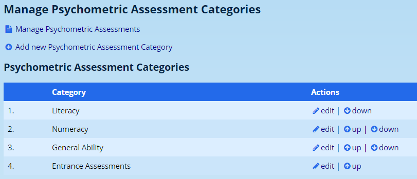

The option at the top of the page allows a short-cut to [manage the psychometric assessments](#managing-psychometric-tests).

Click on the option **Add new Psychometric Assessment Category** to add a new one, or simply click on the **edit** option next to an existing one.

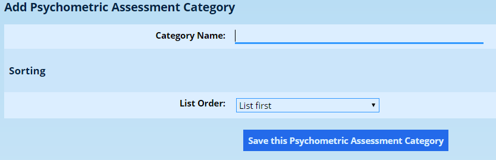

Very limited options are provided here: Enter a name and choose in which order this category should be displayed.

## Managing Psychometric Tests

You can manage the assessments that are configured on the system by navigating to **Administration → Psychometric Testing → Manage Assessments**.

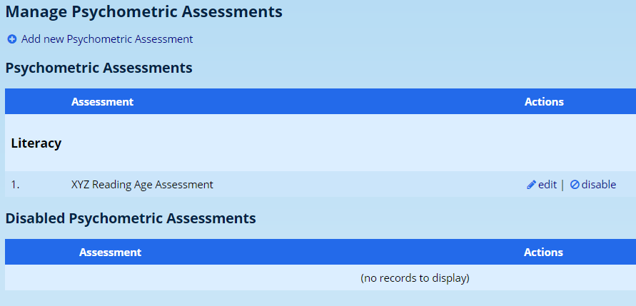

If an assessment results in an array of results it may be useful to set up an assessment for each metric since ADAM can only store one value per metric.

### Adding a new Psychometric Assessment

Click on the option to **Add a new Assessment**.

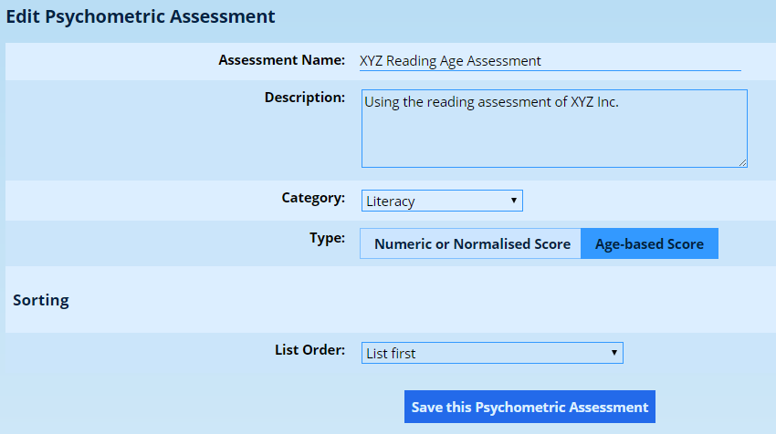

Type in an appropriate **name for the assessment**.

You may type in a **description** for the assessment if you wish. This is not used for any important purposes and can be used to keep your own notes regarding the assessment and its implementation.

You will then choose a **category** for this assessment to fit into. The [management of the categories](#managing-psychometric-test-categories) is covered elsewhere in this document.

The most important aspect of this page is determining whether the test will require a numeric score or an age-based score to be recorded. Numeric scores can be used to store integer values whereas age-based scores will record an age in years and months.

## Capturing Psychometric Test Results

The process for capturing assessment results can be done per individual or per class group.

### For an individual

Navigate to **Pupils → Psychometric Testing→ Record Assessment Results (by pupil)**. Enter the name of a pupil and click on the **Next** button.

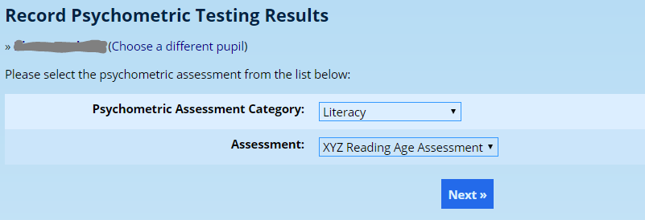

Choose the **Assessment Category** and then the correct **Assessment** from the list. Click on the **Next** button.

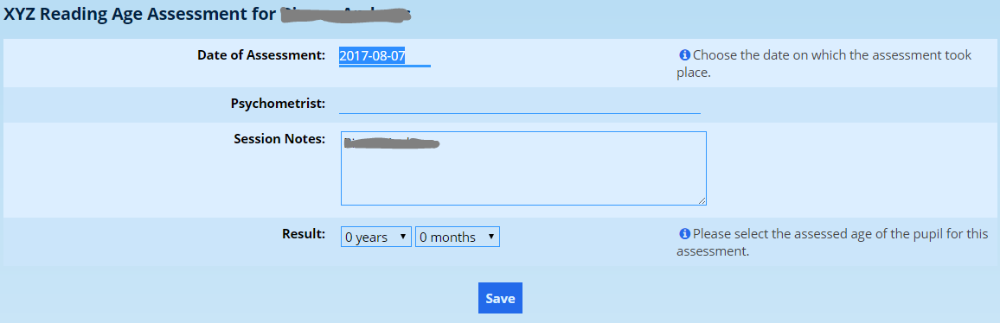

Enter the **date** on which the assessment was conducted as well as the name of the **Psychometrist**, if known.

The **Session Notes** will contain the name of the pupil. These notes will allow you to identify this session from a list later if you need to edit the results and so you are advised against changing them if you don’t need to.

Finally, enter the **result** at the bottom of the screen. In the screenshot above, we are capturing a result for an age-based score and hence are asked to give a result in years and months.

Click on **Save** when you’re done.

### For a class

Navigate to **Pupils → Psychometric Testing → Record Assessment Results (by class)**.

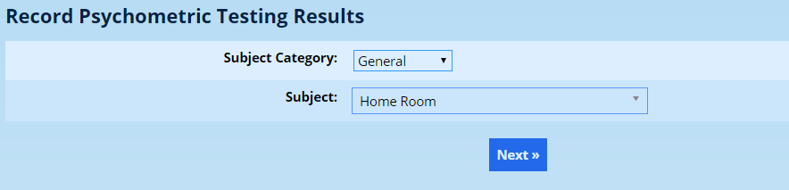

Choose a subject from the list. The actual subject and class that is chosen is irrelevant. All ADAM wants is a group of pupils against which to record results. The name of the class will be used in the assessment notes. It is probably most useful to use a registration class here.

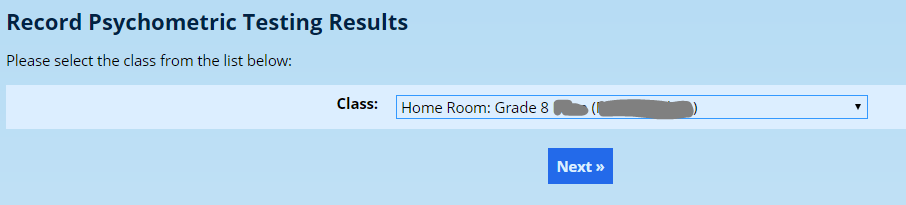

On the next screen, confirm the date of the assessment and the name of the psychometrist.

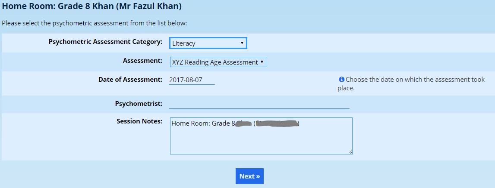

You will notice that there is no place to record results on this screen. Click on **Next** to begin recording the results.

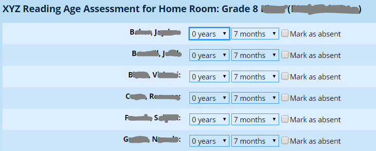

ADAM will automatically show the pupils’ current ages in the dropdown lists. Simply adjust these to the **assessed age**.

If a pupil was **absent** for the assessment, simply check the box to record their absence. This can either be edited later, or added as a separate assessment.

### Attaching the psychologist’s report

As well as recording the result, you can attach the psychologist’s report for the session — for example the educational psychologist’s individual report for the child. A **Report** field (a **Report** column when capturing by class) appears beside each pupil on the capture screens. Click it, choose the file, and ADAM uploads it immediately — there is no separate upload button. Carry on and click **Save** to store the results as usual. Attaching a report is always optional.

Reports are filed privately in the [document repository](document-repository.md#document-repository) under an internal **Psychometric Reports** category. This category is not shown on the Family or Pupil Portal, so these reports are never visible to parents or pupils. The **Report** field is only shown to staff who have permission to add documents to that category — if you do not see it, ask your administrator to grant you access to the **Psychometric Reports** category.

If your school keeps these reports in a different document repository category, an administrator can change where they are filed: on the “**Administration**” tab, under the “**Site Administration**” heading, click “**Edit site settings**” (see [Changing Site Settings](changing-site-settings.md#changing-site-settings)) and open the **Document Repository → Psychometric Reports** section, where the **Target Category** option selects the category. Most schools will not need to change this.

### Editing Psychometric Assessment Results

Navigate to **Pupils → Psychometric Testing → Edit Assessment Results**.

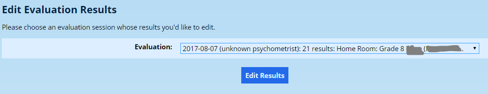

Select the assessment from the list. Please note that only assessments from the last 60 days can be edited. Click on the **Edit Results** button.

Change the results as you would if you were entering the results.

The **Report** field on this screen also lets you manage an attached report. If a report is already attached, its name is shown as a link that opens the document in a new tab; you can choose a new file to replace it, or click **Remove** to detach and delete it (you will be asked to confirm). If no report is attached yet, you can add one here in the same way as on the capture screens.

## Viewing Psychometric Test Results

### For an individual {#viewing-psychometric-test-results-for-an-individual}

In a **pupil’s Information page**, you will be able to view, under the heading **Psychometric Tests**, their results for the assessments that they have undergone.
