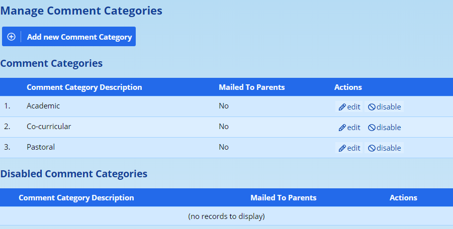
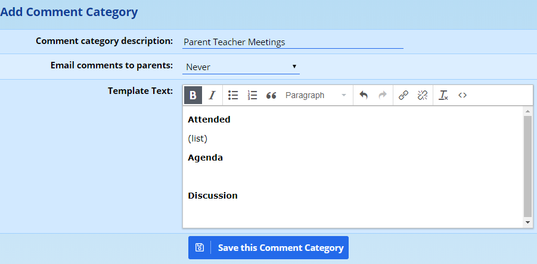
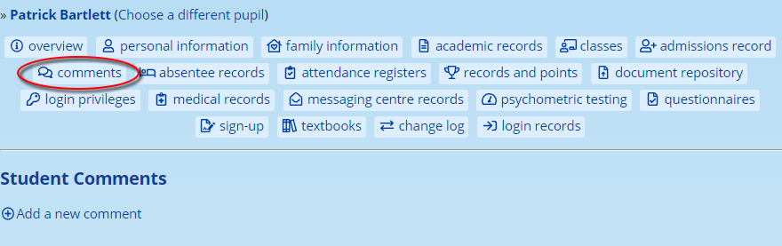
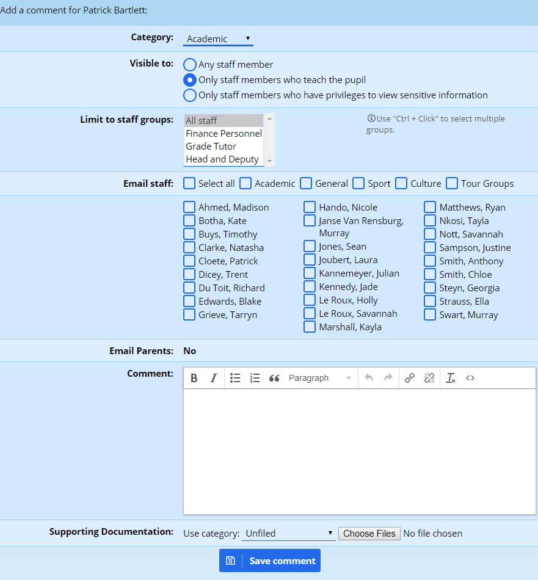

# Pupil Comments

ADAM allows for the recording of categorised incident comments on a pupil’s profile. These are not termly report comments, but rather comments that relate to specific incidences or interventions. Examples of such comments could be feedback on a behavioural incident, comments about a meeting with parents, and so on.

## Comment Categories

The categories into which the comments are placed can be managed by visiting **Administration → Pastoral Administration → Edit the comment categories**.

To edit an existing comment category, click on the **edit** option that appears to the right. **Disabled** comment categories will continue to exist (thereby preserving and captured comments), but the category will not be available for any future comments.

To add a new category, click on the button at the top of the screen.

### Adding and editing Comment Categories

When adding or editing a comment category, the following screen will appear:

The **Comment category description** is the name that the end user will see in the list of available categories and will choose from.

The option to **Email comments to parents** can be set to one of four options, the default of which is “Never”. The options are:

-   **Never**: The entered comment will never be emailed home and no option to allow them to be emailed will be given. Such comments are confidential by nature.
-   **Discouraged**: The user will be given the option to have the entered comment emailed to parents, but the default selection will be set to “No”.
-   **Encouraged**: The user will be given the option to have the entered comment emailed to parents, and the default selection will be set to “Yes”.
-   **Always**: The entered comment will always be emailed to parents and users do not have the option of changing this.

Considering that the main aim of this feature is to provide a space for confidential comments, the generally accepted practice is that such categories should either be set to “Never” or, at its most generous, “Discouraged”. This will prevent comments that are mistakenly placed in incorrect categories from being emailed to parents.

Note also that under the pending POPI legislation, parents do have the right to request all information stored about them. These comments would form part of such a POPI request and, as such, should be treated as if they are publically visible.

In the bottom, add in any **template text** that you would like prepopulated into the comment box on the entry screen. In the image above, an outline for the minutes of a meeting with parents is shown. This could allow you to create quite specific lists and forms to complete.

Once complete, remember to **Save the comment category**.

## Entering Pupil Comments

Pupil comments can either be captured by using the option from the menu (**Pupils → Pupil Administration → Pupil’s personal comments**), from the home page (in the **Your Classes** block, click on **Pupils** next to one of your classes, and then below the pupil’s image and name, click on the **Comment** option), or from the **Pupil’s Info** page, as shown below, by clicking on the **Add a new comment** option:

The following screen is shown:

The **Category** refers to the comment categories that were [described above](#comment-categories).

The next two settings, **Visible to** and **Limit to staff groups** require some explanation because the two settings work in concert with each other to restrict who can see the pupil’s comment. Note that all the staff who can see the comment will be shown in the list below the option **Email staff**. That setting only controls whether they receive an email copy of the comment. Even if they don’t receive an e-mailed copy, *any listed staff member* would see the pupil’s comment appear on their profile.

The **Visible to** option provides a general idea of how sensitive the comment is in terms of who can see it. **Any staff member** would mean anyone that can log in to ADAM using the staff login page. **Staff members who teach the pupil** would include only those where the staff member has been assigned to a class with that pupil in it *in addition to* any staff members who have the privilege to see sensitive comments. The last option, **Only staff members who have privileges to view sensitive comments** would only include the teachers who have those privileges.

The next option will restrict the visibility of the comment to specific privilege groups. The groups listed here are ones that have been given **secondary privilege status** (see [staff privilege groups](security-administration-for-staff.md#managing-security-groups) for more information). On a default setup, schools would only see “All staff” listed as an option here and additional groups would need to be added.

At the option to **Email staff**, the different subject categories are shown. This allows you to quickly select all academic staff, for example.

*Again, remember that this list shows all staff who can see the comment. Any staff who are ticked on this list will receive an additional email alert. If a staff member is listed here at all, they will be able to see your comment.*

The **Email Parents** option may or may not be enabled depending on how the [comment category was set up](#comment-categories).

Below this, there is the space to enter a **comment**. If the comment category has a template assigned with it, the template text should already appear in this box.

*As a safety precaution, once the text in the box is modified in any way, changing the category will no longer update the template. This is to prevent ADAM deleting any of your work by replacing it with a blank template.*

Finally, if the user has [permissions to add documents](document-repository.md#staff-permissions) to any [document repository category](document-repository.md#categories), they will see a **Supporting Documentation** option at the bottom. Note that this only appears if it can be used.

At the bottom is a button to **Save comment** which will add the comment to a pupil’s profile.
