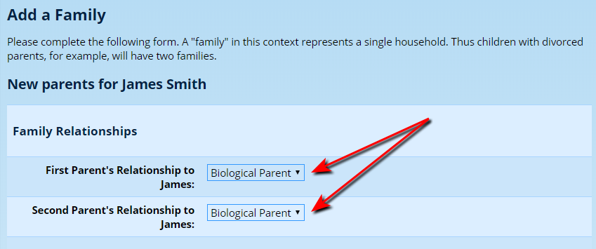
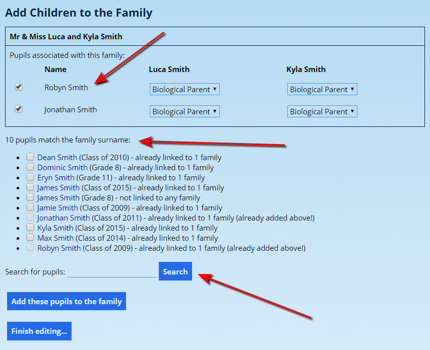
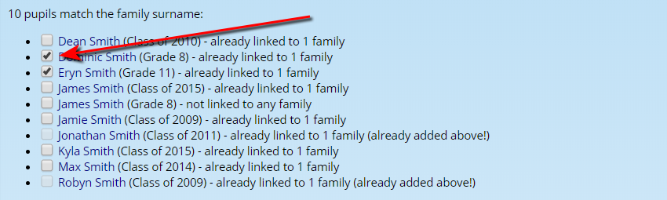
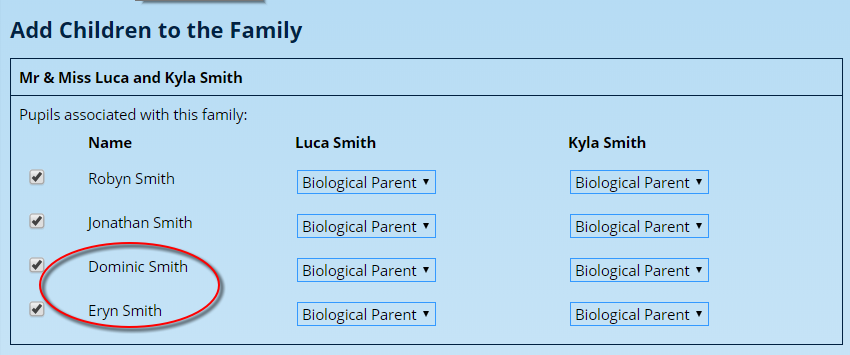
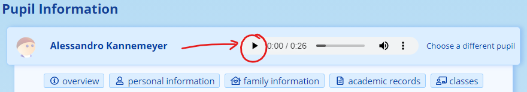
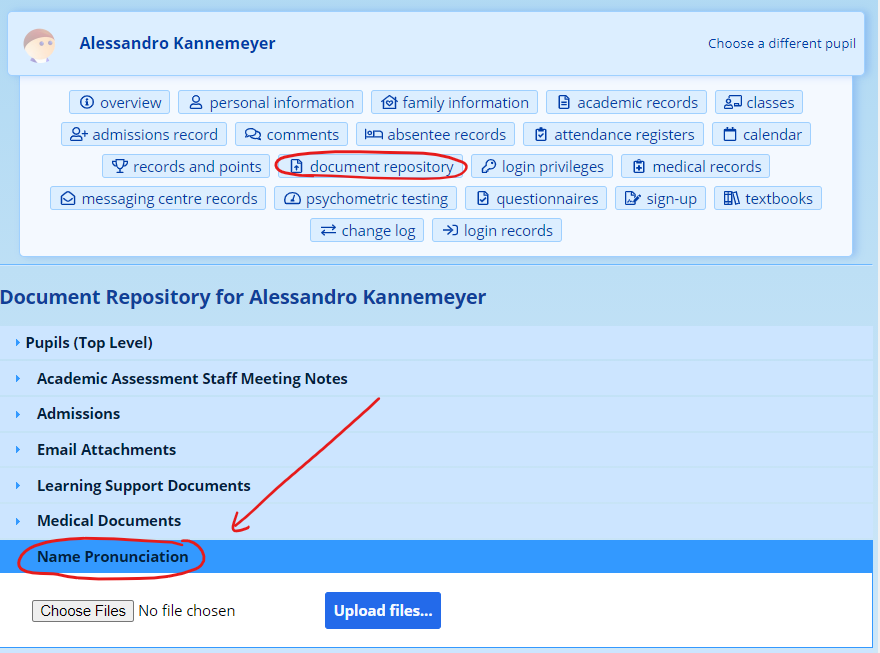

# Pupil Information

## Adding a New Pupil

### Introduction

Some helpful things to remember:

-   Whenever you add a pupil to the database, they will always be added as an “Admissions” pupil. You need to [enrol them into the school](enrolment-process.md#processing-enrolments-of-pupils) separately. The enrolment process for a group of new pupils typically happens after the year-end rollover has been completed. Exceptions would be for pupils who begin their enrolment during the course of the school year.
-   Pupils can be linked to many families or households. Ideally, if parents are separated, they should be treated as separate families, regardless of their official marital status.
-   Pupils can be entered in right at their first enquiry. We will deal with how to manage your admissions process later.
-   Each pupil should only be entered once. If you do enter a pupil more than once, you can delete the extraneous one. See our section on [deleting information](deleting-information.md#deleting-pupils).

To begin the process of adding a new pupil to the database, click on the “**Pupils**” tab, look under the “**Pupil Administration**” heading and then click on “**Add a new pupil to the database**”.

### Some Help with the Pupil Information Fields

When you add a new pupil to the database, there are lots of fields that you might not be able to fill in immediately. You can always come back and edit information if you need. There are some very important entries, however, that you should always fill in:

-   Under the heading **Pupil Information:**

o    Last Name

o    First Name

-   Under the heading **Enrolment Information:**

o    Proposed Entry Date

o    Expected Grade 12 Year (current grade)

The only reason that we require last names and first names is to be able to find the pupil again. ADAM does a lot by simply searching for a pupil’s name. If there is no name, it is difficult for the pupil to be found!

All the other information can be easily changed, but the enrolment information can’t be changed directly from the editing screen. It must be changed from the pupil’s “Registration Information” screen. More on this later, when we discuss “Managing Admissions”.

Most other fields are self-explanatory. However, some are useful to add a bit more information about.

-   Full First Names vs First Name: In this field, the intention of the “First Name” is actually to be a “Preferred” name. However, the title “preferred” often implies a nickname. The intention is that the “First Name” is a formal name, but the name by which they are addressed most often. For example, a child called “Albert Joseph Soap” might go by the abbreviated name “Joe”. In this case, you would enter his “Full First Names” as “Albert Joseph” and enter his “First Name” as “Joseph”. Perhaps it is useful to think of it as such: the “Full First Names” are what appear on the birth certificate, whereas the “First Name” might be how the pupil is referred to in a formal report comment.
-   ID or Passport Number: Please enter these numbers without any spaces. ADAM will warn you if you do put a space. ADAM needs to be able to verify that an ID number is correctly typed, and parents will use this to log in to the Parent Portal. It is easiest to standardise on typing in these long numbers with no spacing.

If you type in a passport number, ADAM will show a warning message that you have not typed in a valid ID number. You can safely ignore this warning – because you are, no doubt, well aware of that fact!

-   Dates: There are several spaces for dates. Each of them follow the “ISO Standard” which is YYYY-MM-DD. You do not have to use the date pickers and you are more than welcome to type in the date yourself. The date picker should update itself with the date as soon as it recognises a valid date.
-   Proposed Date of Entry: When entering a date of entry, there is a rule of thumb that will help you with your enrolments: if a pupil enters the school at the start of the academic year, then you should choose 1 January of the particular year as their enrolment date. If they are coming in at a later stage during the year, feel free to use their actual date of arrival. Doing this will help when it comes to enrolling these new pupils after your year-end process.
-   Registered Qualification: Unless you have good reason to do so, please leave this set to “Default”. Schools with a good reason to change this will know who they are!
-   Contact Information: Please enter the pupil’s information here. Even if, on a detail update form the parents provide their own details (please check!) there is no need to duplicate their information in the pupil’s profile.
-   ADAM Access: Some schools allow their pupils access to ADAM’s Pupil Portal and, in order to allow this, the pupils need a username and password. If you are capturing this information years in advance, you may not be able to tell the user information. Don’t worry to fill this in now; it can be updated by your network administrator later, once the pupil is confirmed as enrolled.
-   Family Information: You may notice, when entering family information for a new pupil that you see, next to “Term Residence” and “Fee Paying Family” that there are “No options available.” This is because the pupil has not yet been linked to parents. We cover this [later on in this manual](#linking-a-pupil-to-a-family).

-   Previous Schooling & Nationality and Permit Information: This information is required for government statistics and is submitted as part of a school’s LURITS submission for enrolled pupils.

Once you are finished entering the above information, click on the “Save” button at the bottom of the screen.

The screen that follows shows some commonly used shortcuts for your convenience:

You do not have to add the new pupils to families immediately; it just depends on your workflow and what feels comfortable for you. The first two of these options are available for you from the “Families” tab also, if you’d prefer to come back to add a family later. Once you’ve added the family, you can then link it to the new pupil.

#### How ADAM works out a pupil’s grade

ADAM uses the pupil’s grade 12 year to determine which grade the pupil is in. ADAM essentially counts backwards to work out the grade from their year of leaving.

If a pupil needs to change grade - perhaps they have been captured incorrectly, or perhaps are repeating a year - all that needs to happen is for the pupil’s Grade 12 year to be changed.

Note that this change will not alter any classes that the pupil is currently registered in, and so immediately after such a change, it is possible that the pupil will be a member of a class in the wrong grade. Simply remove them from those classes and add them to the correct classes for their grade.

After each year is finished, ADAM makes a record of the grade that the pupil completed. This allows us to keep track of any repetitions of grade.

### The Enrolment Process

Once a new pupil has been added to the database, they will automatically be assigned to the default admissions status. The process of progressing a pupil through the [enrolment process](enrolment-process.md#enrolment-process) and finally enrolling the pupil is dealt with elsewhere in this manual.

## Linking a Pupil to a Family

### A Note about Shortcuts

When adding a pupil, we mentioned some short-cuts that appeared at the end of the process. If you followed the shortcut, ADAM will already have linked the pupil to the family, and will have asked about the pupil’s relationship to the two members of the household. These options appear as follows:

The rest of the family adding screen looks the same. Once the family is added, the pupil will automatically be linked.

In the pupil profile, the two family options (fees and residence) will also be set automatically to this family.

If there is a **second household**, this will need to be added separately and it will need to be added manually and linked separately. Additionally, the Pupil Info might then also need to be updated to accurately represent the fee-paying and residence-providing families.

### Linking Pupils to Families

1.  From the **Families** tab, under **Family Administration** heading, click on the option **Link students to a family**. Search for the family by typing in a part of the surname or the first name of one of the parents in the family. A list of children is shown underneath the family in case you don’t know which family you should be choosing.

2.  ADAM will then show a list of pupils currently linked to the family (with their relationships for each parent shown) and below that, ADAM will show a list of all the pupils in the database that have the same surname. This is the list of most likely candidates to link to the family.

3.  If the pupil you are looking for does not have the same surname as the parents, you can type in their name in the “Search for pupils” box, and then press the “Search” button.

4.  From either the surname match list, or the list of pupils that match the searched name, tick the ones that you would like to add to the family.

5.  Click on the **Add pupils to the family** button. These pupils will now be displayed at the top of the page:

6.  Once you have updated their relationship with each parent, you can click on the **Finish editing…** button.ADAM then confirms the actions it is about to take. If you are happy with them, click on the **Save Changes** button.

## Editing a Pupil

In order to edit a pupil’s information, navigate to **Pupils → Pupil Administration → Edit a Pupil’s Information**. Enter the name of the pupil.

A description of the fields that are displayed is [discussed above](#some-help-with-the-pupil-information-fields).

Ensure that you click on the **Save** button at the bottom of the page.

### Changing a pupil’s grade

This is a very uncommon task, but one which does happen, certainly if the promotion decisions are changed after the year-end roll-over is completed.

To change a pupil’s grade, all one needs to do is edit the pupil’s information (see above) and change their **Expected Grade 12 Year**.

Note that this will not change any classes and so you may find, after editing a pupil in this manner, that they still belong to the classes in the wrong grades. You will need to manually remove and assign the pupil to appropriate classes according to their new grade.

!!! warning
    ***Note well for changes made mid-year****: this is exceptionally uncommon and ADAM does not have specific programming to deal with this eventuality. All existing reports issued will have copies stored in the archive. These should remain fixed with the original grade captured. However, should the reports be refreshed or regenerated, it is quite possible that ADAM will pick up the pupil’s new grade and display it on these old reports, giving the impression that the pupil was in the new grade for the whole year.*

## Pupil Name Pronunciation

ADAM contains a specific category in the [Document Repository](document-repository.md#document-repository) which can have digital recordings of the pronunciation of a pupil’s name uploaded. Once uploaded, a media control will appear on the name card in their profile and users can use this to listen to the recording of the name.

Within the pupil’s Document Repository, upload an audio file into the “Name Pronunciation” category:

If multiple files are uploaded, only the most recent file is played when the button is clicked.

If the button is greyed out, it may be because an invalid audio file has been uploaded or the specific browser does not support the playback of that type of file. You are encouraged to upload files in MP3 format for the widest possible support.

*Note that different web browsers may display the media control buttons differently. This is a function of the web browser rather than of ADAM.*

Have a look at the Document Repository documentation for more information on uploading many files at once using the [Bulk Upload feature](document-repository.md#uploading-documents-in-bulk).
