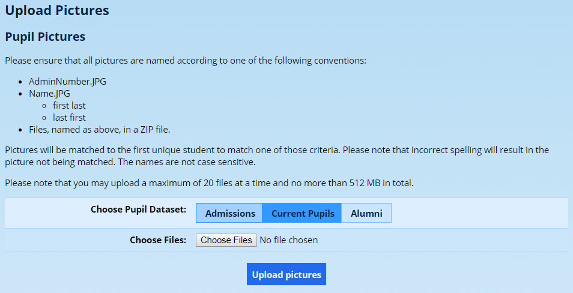
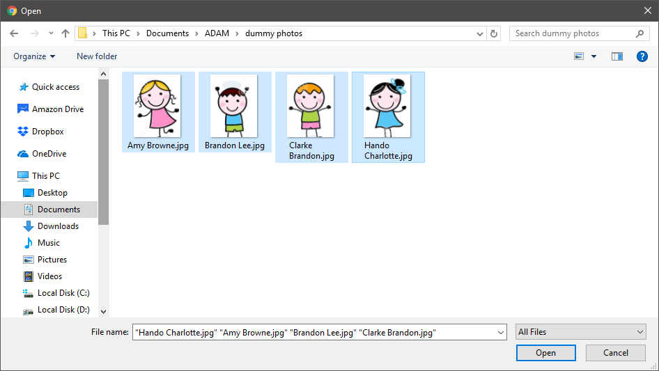
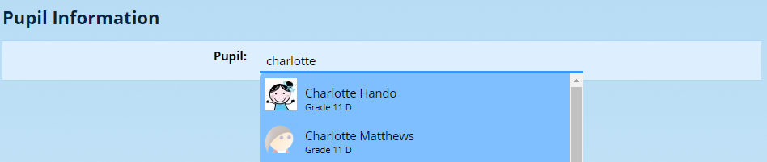

# Pupil Photographs

ADAM stores pupil photographs in the Document Repository and uses one of them as a primary display image for the pupil.

## Naming of Photographs

The photographs should be named in one of three ways that will allow ADAM to identify which pupil it belongs to:

1.  adminNumber.jpg
2.  FirstName LastName.jpg
3.  LastName FirstName.jpg

## Uploading Pupil Photographs

Photographs can be uploaded for Pupils by visiting **Pupils → Photographs → Upload new pupil photographs**.

Make sure to choose which type of pupils (the **Pupil Dataset** option) you are uploading photographs for. The “Current Pupils” option will be selected by default.

Click on the **Choose Files** button. A normal file selection window will appear. Click on a batch of files to upload, bearing in mind the limits that your server has in place. Click on the “Open” button at the bottom (this may differ depending on your web browser)

Finally, click on the **Upload pictures** button.

ADAM will now upload the photographs and match them to pupils in your database.

Note that one pupil above, Brandon Clark was not matched. In this case, his name has been spelled incorrectly in the photograph. Correct any errors and try again.

!!! warning
    You do not have to upload all the files again, just the ones that needed corrections.

Now, when searching for a pupil or viewing their profile, their picture will be displayed:

## Manually Changing Photos

When using the upload feature described above, ADAM will automatically search for a pupil, place the photograph in that pupil’s Document Repository and set the pupil’s current photograph to use that version. However, in some instances, it may be preferable to perform some or all of these operations manually.

Some examples include:

-   A photograph was incorrectly named with the wrong pupil, but the pupil in question has no new photograph.
-   The pupil’s photograph won’t upload or match because of accented or other characters in the pupil’s name.

### Managing Photographs in the Document Repository

Visit the pupil’s information page (**Pupils → Pupil Administration → Pupil Info**) and click on the **Document Repository** heading.

!!! warning
    You will need specific privileges to be able to access the Document Repository.

Expand the **Photographs** section and use the **Choose Files** button to select a new photograph. Click on **Upload File…** to upload the file into the Document Repository.

!!! warning
    One might also take this opportunity of removing any incorrect photographs.

Simply uploading a photograph to the document repository will *not* automatically change the photograph that ADAM displays. This must be done in a second step.

### Changing Which Photograph ADAM Displays

Navigate to **Pupils → Photographs → Change pupil photograph**. Type in the name of the pupil whose photograph you’d like to change.

ADAM will show the current picture at the top and any other pictures that are available at the bottom. This includes the generic image. Simply click on a picture at the bottom to have it selected as the current photograph.
