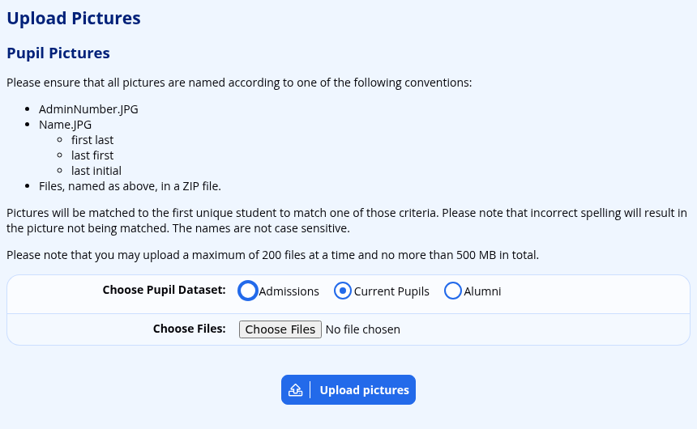
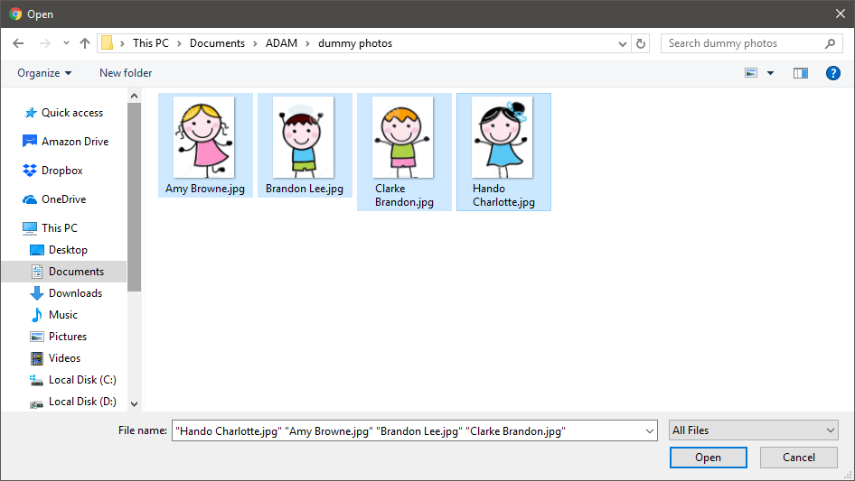
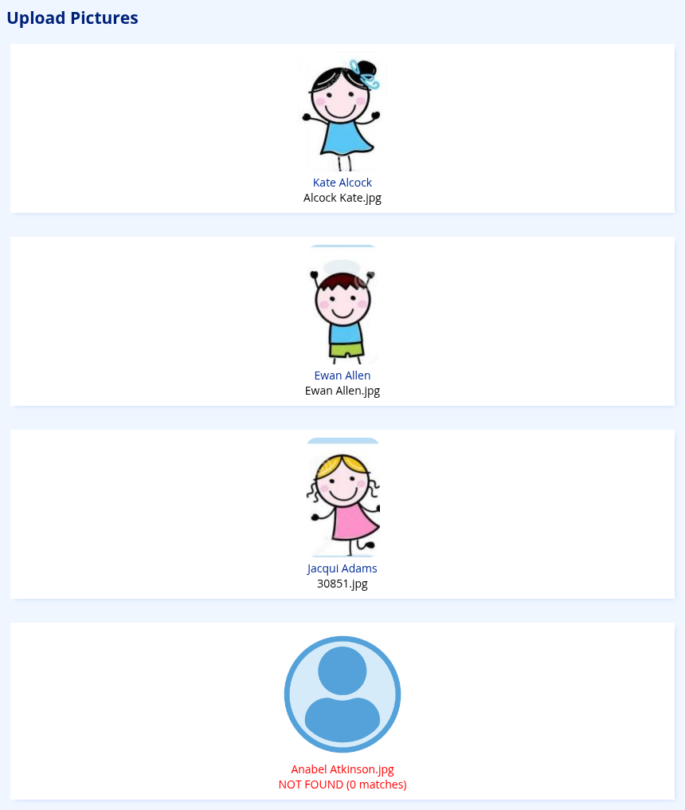
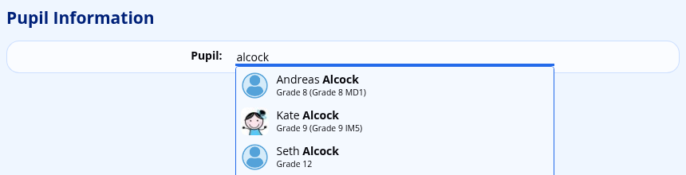
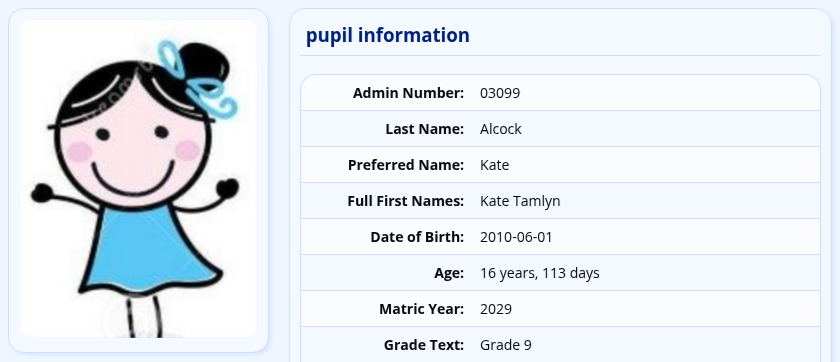
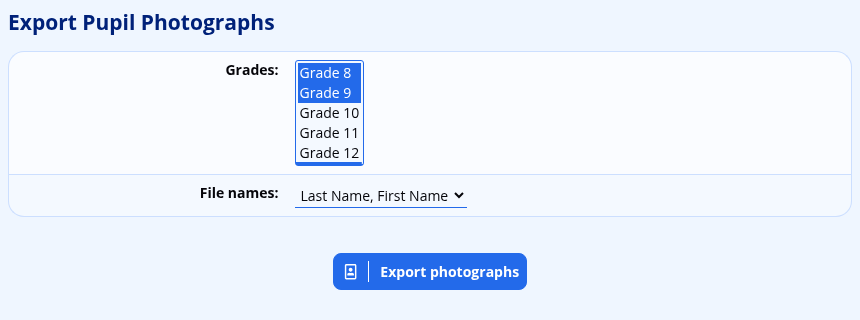
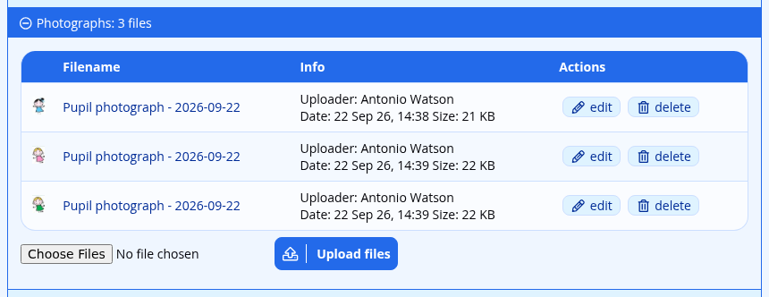
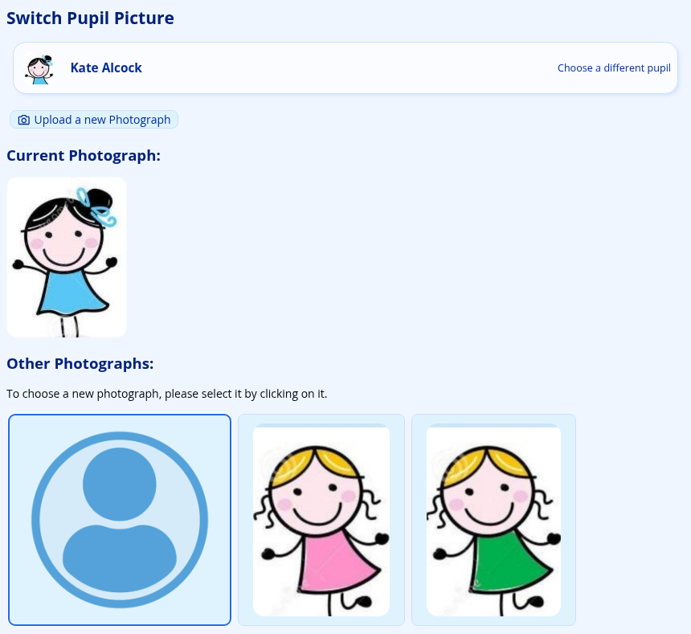

# Pupil Photographs

ADAM stores pupil photographs in the Document Repository and uses one of them as a primary display image for the pupil.

Staff members see this image throughout ADAM. It can also be shown to other families and pupils, in the portal birthday list, but only if the school has switched that on — it is off by default. See [Today’s Birthdays](parent-and-pupil-portal.md#todays-birthdays).

## Naming of Photographs

The photographs should be named in one of the following ways, each of which allows ADAM to work out which pupil the picture belongs to:

1.  AdminNumber.jpg
2.  FirstName LastName.jpg
3.  LastName FirstName.jpg
4.  LastName FirstInitial.jpg — the space is optional, so both “Alcock K.jpg” and “AlcockK.jpg” work
5.  Username.jpg

Capital letters make no difference. A picture is only accepted when exactly one pupil matches its name, so a misspelling, or a name that two pupils in the same dataset share, will leave the picture unmatched.

> [!NOTE]
> You may also place the photographs, named as above, inside a ZIP file and upload that instead. ADAM opens the archive and matches each picture within it. This is the easiest way to send a whole year group at once, because the archive counts as a single file against the upload limits described below.

## Uploading Pupil Photographs

Photographs can be uploaded for Pupils by visiting **Pupils → Names and Faces → Upload new pupil photographs**.

Make sure to choose which type of pupils (the **Choose Pupil Dataset** option) you are uploading photographs for. The “Current Pupils” option will be selected by default, and ADAM only looks for a match within the dataset you choose — a photograph of a pupil who has not yet started will not be matched unless you choose “Admissions”.

The page also states the limits your server has in place: the greatest number of files you may upload at a time and the largest total size. Keep your batches within those figures.

Click on the **Choose Files** button. A normal file selection window will appear. Click on a batch of files to upload. Click on the “Open” button at the bottom (this may differ depending on your web browser)

Finally, click on the **Upload pictures** button.

ADAM will now upload the photographs and match them to pupils in your database.

Each picture that was matched is shown with the pupil’s name, which links to their profile. Note that one file above, “Anabel Atkinson.jpg”, was not matched, because the name has been spelled incorrectly. The number in brackets after **NOT FOUND** tells you how many pupils the name matched: zero means ADAM found nobody of that name, and any number above one means the name is shared and ADAM will not guess between them. Correct any errors and try again.

> [!WARNING]
> You do not have to upload all the files again, just the ones that needed corrections.

Now, when searching for a pupil or viewing their profile, their picture will be displayed:

## Exporting Pupil Photographs

ADAM can hand back the photographs it holds, as a single ZIP file. This is useful when a photographer, a yearbook designer or another system needs the current pictures. Visit **Pupils → Names and Faces → Export pupil photographs**.

Choose one or more grades in the **Grades** list — hold down the Ctrl key (or the Command key on a Mac) to choose more than one. Then choose how the files inside the archive should be named:

-   **Admin Number**
-   **Last Name, First Name**
-   **ADAM Identifier**
-   **Username**

Click on the **Export photographs** button and your browser will download the archive.

Only the photograph each pupil is currently displaying is exported, one file per pupil. Pupils with no photograph are simply left out, and if none of the grades you chose has a single photograph between them, ADAM will tell you so instead of sending you an empty archive.

> [!NOTE]
> The **Admin Number**, **Last Name, First Name** and **Username** options produce file names that ADAM can match again, so an exported archive can be sent to a photographer and the retouched version uploaded straight back through the page above. The **ADAM Identifier** option does not — it is intended for another system that stores ADAM’s own reference.

> [!WARNING]
> This screen needs the **Export pupil photographs** permission, which is separate from the permission to upload photographs. If you cannot see the menu item, ask your ADAM Administrator.

## Manually Changing Photos

When using the upload feature described above, ADAM will automatically search for a pupil, place the photograph in that pupil’s Document Repository and set the pupil’s current photograph to use that version. However, in some instances, it may be preferable to perform some or all of these operations manually.

Some examples include:

-   A photograph was incorrectly named with the wrong pupil, but the pupil in question has no new photograph.
-   The pupil’s photograph won’t upload or match because of accented or other characters in the pupil’s name.
-   An older photograph already in the repository should be displayed again.

### Managing Photographs in the Document Repository

Visit the pupil’s information page (**Pupils → Pupil Administration → Pupil Info**) and click on the **Document Repository** heading.

> [!WARNING]
> You will need specific permissions to be able to access the Document Repository.

Expand the **Photographs** section and use the **Choose Files** button to select a new photograph. Click on **Upload files** to upload the file into the Document Repository.

> [!NOTE]
> One might also take this opportunity of removing any incorrect photographs.

A photograph added to the **Photographs** category becomes the pupil’s display picture as soon as it arrives, whatever route put it there — this screen, the bulk upload described above, or ADAM’s API. The most recently added photograph is the one shown. Equally, deleting the photograph a pupil is currently displaying no longer leaves a broken picture behind: the most recent of their remaining photographs takes its place, and if there are none left they fall back to the generic image.

So you only need the step below when you want ADAM to display a photograph *other* than the newest one. See also [Document Repository](document-repository.md#categories), which describes the two categories that behave this way.

### Changing Which Photograph ADAM Displays

Navigate to **Pupils → Names and Faces → Switch pupil photograph**. Type in the name of the pupil whose photograph you’d like to change.

> [!WARNING]
> To use this function you must be able to **read** documents from the **Photographs** category in the pupils’ Document Repository. If you lack this permission, ADAM explains what is required and, if you hold the necessary administrative rights, offers a link to adjust the category permissions. Otherwise, please ask your ADAM Administrator for assistance.

ADAM will show the current picture under **Current Photograph:** and any other pictures that are available under **Other Photographs:**. This includes the generic image, which is offered first so that you can take a photograph down without deleting it. Simply click on a picture to have it selected as the current photograph.

The **Upload a new Photograph** link at the top of the screen takes you to the upload page described above, and **Choose a different pupil** returns you to the search so that you can move on to the next one.
