# Records and Points Administration {#h-1mrcu09}

ADAM offers a reasonably sophisticated means to deal with the disciplinary and award records that is compatible with many schools’ requirements. The following sections will explain the different features of the system.

## Events vs Points {#h-46r0co2}

Broadly, there are two different kinds of records that can be stored by ADAM. These are broken down into an “event” and a “point”. Distinguishing between the two is best started with some examples:

**Events:**

-   Detention: detentions when detentions are loaded, they indicate that at some future time and date, the pupil will attend a detention.
-   An award made at prize giving: awards are decided on in advance, but are awarded at some specific time and date when the awards ceremony happens.
-   Colours awards: as with the example above, the colours awards are decided in advance and are made at a specific time and date - normally an end of term assembly.

**Points:**

-   Demerits: teachers can record one or more demerits against a pupil’s name.
-   Homework infringements: a teacher can log the dates that a pupil’s homework was not completed. A cumulative total is used for other disciplinary purposes.
-   Service hours: Teachers can log one or more service hours towards a pupil for various activities that they have taken part in.

The key distinguishing elements are:

-   Events are mostly associated with some date in the future to when they were recorded. Importantly, they can record who attended the event (i.e. served their detention or received their certificate) and who might still need to do so.
-   Points either count the number of occurrences (such as homework infringements) or sum a number of points to arrive at a total.

## Managing Records and Points Category Groups {#h-cajckn6q1qyd}

Three default groups are provided: “Good”, “Neutral” and “Bad”. These groups are used only to sort the Records and Points categories and have no other meaning. Some combined primary and secondary schools choose to have groups such as “Junior Primary”, “Senior Primary” and “High School” to help separate out the categories. This also allows different consequences (see later!) for demerits in the prep school vs in the high school.

On the **Administration** tab, look for the **Pastoral Administration** heading and click on the option to **Edit the Records and Points Category Groups**.

On this screen, you can edit existing groups, add new ones and change the order of the groups.

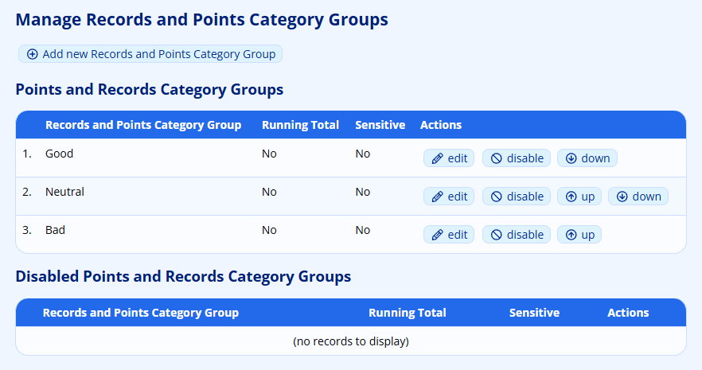

### Adding a New Group {#h-2k7z08lxqzu9}

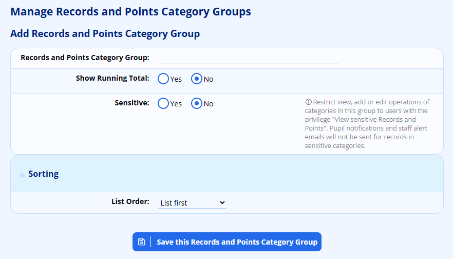

ADAM also allows you to maintain a running total for each group if you would like an indication of a pupil’s records with a very high-level summary.

Schools can optionally restrict categories within a group to be used solely by people who have permission to view sensitive information of pupils within the school.

## Managing Records and Points Categories {#h-7sum2a3v44l3}

This is certainly where most of the work is done when setting up Records and Points for your school.

From the **Administration** tab, look under the **Pastoral Administration** heading and click on the **Edit the Records and Points categories** option.

### Adding a new Records and Points Category {#h-3lnsfyslep9m}

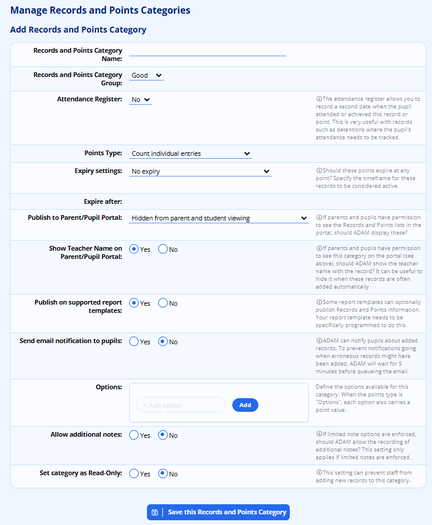

The screen, shown above, has a number of options, explained below:

-   **Records and Points Category Name:** This may be something like “Demerit” or “Detention”.
-   **Records and Points Category Group:** While the group has no effect on the function of the Records and Points Category that you are adding, it does influence the order and grouping of the categories when you come to add and find the lists.
-   **Attendance Register:** Choose whether the category requires an attendance register. Setting this option to “Yes” sets the category as an “Event” so that you can record exactly when the pupil attended this. In the context of a “Detention” this would be the date that the pupil attended the detention. In the case of a positive reward, such as a “Colours Award”, this would be the date that the award was made.
-   **Points Type:** This setting has no effect if you’ve chosen the attendance register option above, since that implies that we must count individual events. However, if you wish to record points, ADAM can either force each entry to be counted as one point or allow a varying number of points to be entered. In other words, the first option, forces each entry to count 1 point whereas the other allows for records to count a variable number of points. If this option is selected, teachers will be able to capture a number of points between 1 and 100.
-   **Expiry Settings:** ADAM will show a running total of points and of events recorded. Setting an expiry date will allow older events not to be counted. The records are never, however, deleted - even if they have expired. Options for the expiry settings are:

-   No expiry: points and events will never expire. The running total will show the total number of points earned.
-   Expire after a number of hours/days: The records will only be counted if they fall within this time period. The actual time period is set in the field below (it is currently hidden in the screenshot above, next to **Expire After**).
-   Expire after a number of calendar weeks/months/years: The records will not be counted if they fall before the first day of the week, month or year. For example, if points are set to expire after one calendar month, then if a pupil has a running total of 10 points on October 31st, their total will drop to 0 on November 1st.
-   Expire at the end of a reporting period: This allows points to expire at the end of a reporting period. *Schools who use multiple concurrent reporting periods should use this setting carefully since there will be unpredictable behaviour when multiple reporting periods are opening and closing at different times.*
-   Expire before the start of this week/month/year: This setting is identical to the calendar periods above, but have a fixed time period of 1 week, month or year.
-   Expire on a specific date: Here, you can specify a date before which all points will expire.

-   **Publish to Parent/Pupil Portal:** The options here change depending on whether there is an attendance register associated with this category or not. If there is an attendance register, an additional option appears: the category can either be shown to parents as soon as it is recorded or alternatively only once the pupil has been marked as present on the attendance register.
-   **Show Teacher Name on Parent/Pupil Portal:** Sometimes, particularly when records related to [consequences](#h-nqnke3xkaiox) are shown to parents, it can be confusing to see the teacher who triggered the consequence shown there. When consequences are awarded, they are automatically assigned to the teacher that awarded them. This can make it seem that a relatively minor infraction caused an over-reaction from the teacher, without the context that this consequence is as a result of a number of other issues. Hiding the teacher’s name prevents this confusion.
-   **Published on Supported Reporting Templates:** This setting will be used by specific reporting templates to draw further information onto the reports. If this is one of the categories that should be displayed on a report, you can change this setting to “Yes”. Note that only supported templates will search for any categories that are set to display.
-   **Send email notification to pupils:** This will alert pupils of the fact that they have received a an entry in the Records and Points module. The email notification is automatically delayed by 5 minutes in case there was an error while adding.
-   **Options:** Normally, when recording an entry for a pupil, the notes field is a free text field. However, you can limit the options available and show cause a drop-down list to show by typing in the allowed options here. Leaving these empty allows the free text field.
-   **Allow Additional Notes:** This applies only if “Limited Notes Options” are set in the line above. This allows a hybrid of teachers being forced to choose a predefined reason, but can still provide context or further information, as it is required.
-   **Set category as  Read-Only:** Things change! If you no longer wish to make use of the records and points that are being recorded by this category, you can mark them as read-only which will keep users from adding new entries for pupils under these categories. The records will still be visible, but won’t have the option to add a new entry shown.

Click the button at the bottom to **Save the Records and Points Category**.

## Adding and Editing Records and Points {#h-111kx3o}

There are several ways to add records and points to a student’s profile.

From the **Pupils** tab, under the **Records and Points Admin** heading, click on the option **Add records or points**. Type in the student’s name and click on the **Next** button.

Choose the category that you wish to record against and, once more, click on the **Next** button.

You can now record the information necessary. Be sure to include a note explaining the reason for the record. Your name is automatically recorded against this entry. When you click on the **Record Records and Points** button, you will see the new record appear in the table below.

If you have permission, or if you added a record to a pupil, you will see an option to “edit” or “delete” the record in the **Actions** column.

When a record is deleted, ADAM will check whether any automatically generated consequences are affected and flag them for review if necessary (see [Flagged Consequences](#h-8jp0qgwsnfzb) below).

## Displaying a Pupil’s Records and Points {#h-1w58o8tdmbuw}

From a pupil’s profile, you can click on the **Records and Points** option and you will see a tabbed summary page of the different categories. Click on each category to see that pupil’s records.

## Records and Points Consequences {#h-nqnke3xkaiox}

Consequences allow ADAM to automatically generate records when a pupil's running total in a category reaches a defined threshold. For example, when a pupil accumulates 5 demerits, ADAM can automatically create a detention record.

### Setting Up Consequences {#h-flci3b78ijqz}

Navigate to **Administration → Pastoral Administration → Edit the Records and Points consequences**.

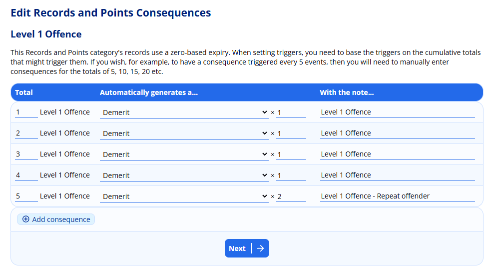

Select the source category (e.g. "Demerits"), then configure one or more threshold rules:

-   **Total** — the running total that triggers the consequence
-   **Automatically generates a...** — the target category (e.g. "Detention")
-   **Qty** — how many points to award in the target category (for points-based categories only, this will not be available if the points type is set to “Points from Options” or “Count individual entries”)
-   **With the note...** — a description attached to the generated record

For categories with a zero-based expiry, you set cumulative thresholds (e.g. 5, 10, 15). For categories with a sliding expiry, you set a single threshold that resets after each consequence is triggered.

Consequences can chain. If a generated consequence record itself triggers another consequence rule, ADAM will follow the chain automatically.

To add further consequences, click on the “**Add consequence**” button at the bottom of the table.

Click on the **Next** button to save the consequences.

### Flagged Consequences {#h-8jp0qgwsnfzb}

When a Records and Points entry is deleted (e.g. because it was added in error), any consequence that was automatically generated from it may no longer be valid. ADAM detects this and flags the affected consequence record for review.

Flagged consequences appear in two places:

-   Inline on the pupil's Records and Points view within their profile — a warning icon appears next to the flagged record's notes. Hovering over the note explains that the source event has been deleted and thus this record may require attention.

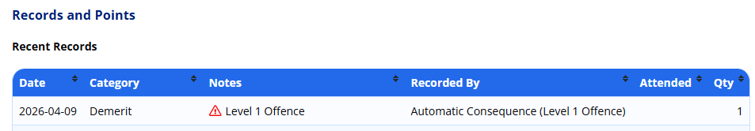

-   Central review queue — navigate to **Administration → Pastoral Administration → Review flagged consequences** to see all flagged records across all pupils:

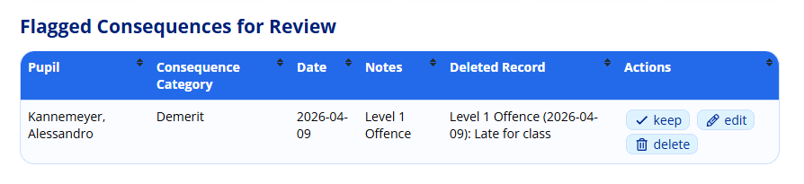

For each flagged consequence, staff with the appropriate permissions can:

-   **Keep** — dismiss the flag; the consequence record remains unchanged
-   **Edit** — modify the consequence record (the flag is cleared on save)
-   **Delete** — remove the consequence record

If a flagged consequence is deleted and it had *itself* triggered further consequences, those downstream consequences will be flagged in turn.

## Records and Points Alerts {#h-h0rxz268pgqp}

Using Records and Points Alerts, ADAM is able to send emails to staff on a regular basis to alert them to records and points that have been added to a pupil’s profile. Alerts are sent at a regular time interval each day to staff members. The exact staff members that are alerted can be configured per alert.

### Timing of the Alerts {#h-s8768adi1qe}

To configure the time at which ADAM sends Records and Points alerts, navigate to **Administration → Site Administration → Edit Site Settings**. On the Site Settings page navigate to the **Cron Settings** tab and scroll down to the **Alerts** section. Within that is a time selector for  **Records and Points alerts times**.

Click to select a time to send the alert. It is possible to send alerts multiple times each day. Alerts will only be sent for items that were added since the last time the assessments were run.

### Creating Alerts {#h-blg23yzkc89}

To create a new alert, navigate to **Administration → Pastoral Administration → Manage Records and Points Alerts**. You will be shown a list of existing alerts, if there are any on your server.

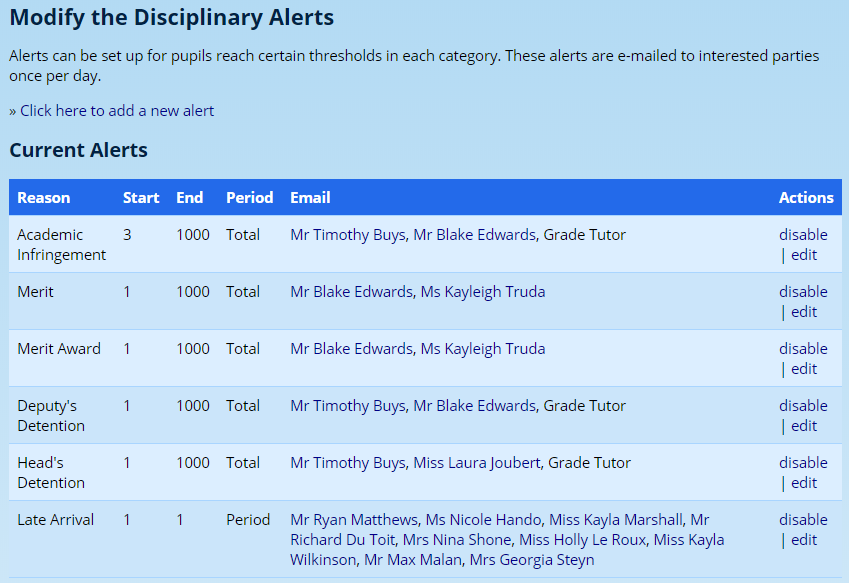

Any existing alerts can be edited or disabled from this screen by clicking on the **edit** or **disable** links to the right of each entry.

To add a new alert, click on **Click here to add a new alert** at the top of the page. The following screen is shown:

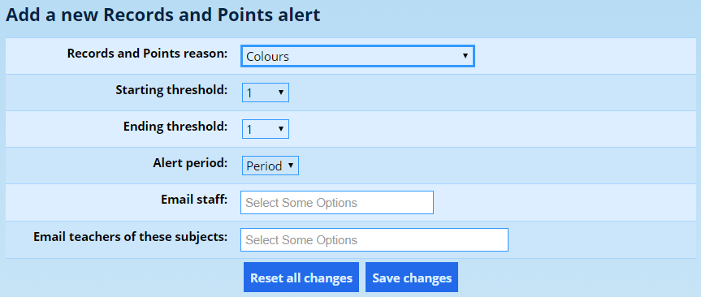

The **Records and Points reason** is the specific category that should generate an alert. If you wanted to be notified when a demerit was awarded to a pupil, you would select “Demerit” from this list.

The **Starting Threshold** and **Ending Threshold** are the totals that a pupil must reach before the alert is triggered. If you want to alert a teacher to every incident, set your Starting Threshold to 1 and your Ending Threshold to the highest value possible (ADAM only lists numbers to 1000 - if you think pupils might get more than that, please contact the developers). If you only want staff members to be notified on the 5th occurrence, then choose “5” for both your Starting and Ending Thresholds.

If you want to be alerted to every 5th occurrence, you will have to add in additional alerts for the 10th, 15th and 20th occurrences - and more if you think a pupil will reach those levels.

The starting and ending thresholds are counted according to the **Alert period**. You can choose to count from the current reporting period (“Period”), the current year, month, week or a pupil’s entire career at your school (“Total”).

The last two options determine who ADAM will send the alerts to.

Choosing a staff member in the **Email Staff** block will cause that staff member to always be emailed. In the case of a detention, for example, this might be the head of discipline.

The second option, **Email teachers of these subjects**, will alert any staff member that teaches the offending pupil for one of the selected subjects. While this may include academic staff, the list of teachers would also be those of subjects like “Registration Class” or boarder house parents. In these cases, you would select “Registration Class” or “Boarding House” and the teacher who has that pupil in his or her class would be notified of the pupil’s alert.

Click on **Save Changes** to save the alert.

## Certificates from Records and Points {#h-p45jqc4m895}

Where a Record and Points category has an attendance register included as part of its setup, ADAM can offer to print certificates for pupils who have had a record added to their profile, but who have not yet been listed as having “attended.” In this context, “attended” could be read as being: “attending the awards ceremony”.

### Uploading Certificate Templates {#h-b2e0uwkhe83d}

Traditionally, this feature was designed to print over a pre-printed certificate. However, with more and more awards being issued electronically, even for archival purposes, it is useful to have a purely electronic certificate that can be emailed.

Navigate to **Admnistration → Document Repository → Upload documents to the Site Repository**. Here, you can upload PDF documents into the “Certificates” category.

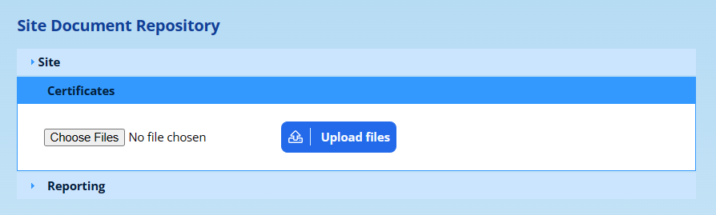

Kindly note the following:

-   The certificates should be one of the standard sizes A4 or A5 (either portrait or landscape). Other will be truncated to fit the size chosen in the print settings.
-   The PDF document must be compatible with PDF Version 1.4 (Adobe 5). If you have a graphic designer working with your certificates, they should be able to export the template in this format for you. If you upload the certificate in a newer format, it *may* work, but it may give unpredictable results and errors.

### Choosing the Printing Settings {#h-9juw4j64wbz8}

Once you’ve chosen the awards for which you want to print certificates, ADAM will show you this screen:

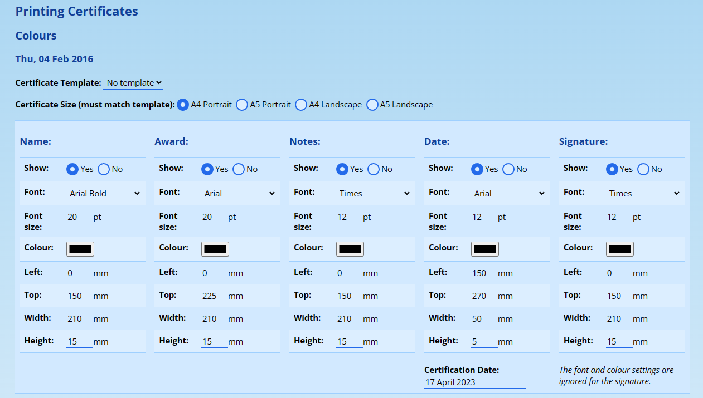

If you have [uploaded any templates](#h-b2e0uwkhe83d), then you will see these listed in the drop-down. If you are printing onto pre-printed certificates, leave this as “No template”.

Choose your desired report size.

Next, for each of the five elements that ADAM can show on the template, choose the settings that apply. You can change fonts and font-sizes. The “Left” and “Top” measurements are how many milimetres these text elements appear from the left and top of the page. The text is then shown in a box with a specific “width” and “height”. Note that the text is centred vertically and horizontally in the box and may overflow.

When you’ve set these up for the first time, ADAM should remember them for subsequent certificate runs - this makes it simpler to generate them in future. However, for the first time, it is often useful to draw some pencil boxes where you expect the text to be displayed and then measure their top left corners for (“left” and “top” measurements) as well as the boxes’ widths and heights.

Note that although the signature element asks for fonts and colours, they are not shown.

Then, below these settings is a list of pupils for whom ADAM will generate certificates. The ones that are ticked will be printed:

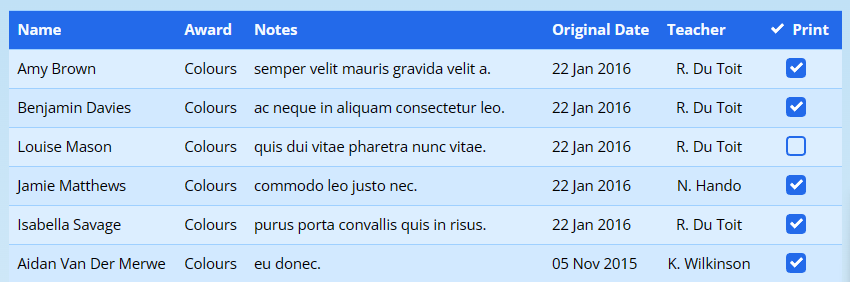

Finally, click on the **Generate certificates** button to have ADAM compile the certificates for you. These can then either be printed or saved. You might also use a free online service to split the PDFs into individual documents so that the certificates can be emailed individually.
