# Report Comments {#h-lwz3zyi4n8aa}

Core to ADAM’s functionality is publishing academic reports.

## Before You Begin, Administrators {#h-5ot2ox1rd4l7}

Administrators should be careful to follow the [Quick Start Guide](quick-start-guide.md#h-sfh7zceeg5gq) before attempting to have staff members capture report comments. If the necessary classes have not been set up, nor the reporting period configured, it will not be possible for teachers to capture their report comments.

## Reporting from Different Perspectives {#h-kyu5rqkocdrf}

Depending on the phase you teach and the reporting comments you are writing, it might be useful to write your report comments in different views. For example:

A Foundation Phase teacher might want to write the comments and enter data for each pupil across multiple different areas of assessment (these would be captured on ADAM as different classes). As such, this FP teacher could report via **Reporting → Report Comments → Report Comments (by pupil)**.

Notice, in the image below, that we are looking at a report belonging to Alessandro Kannemeyer. At the top we have his set of English report results (his teacher in Mr Dicey). Below this, we have his Business Studies report (his teacher is Mr Nkosi):

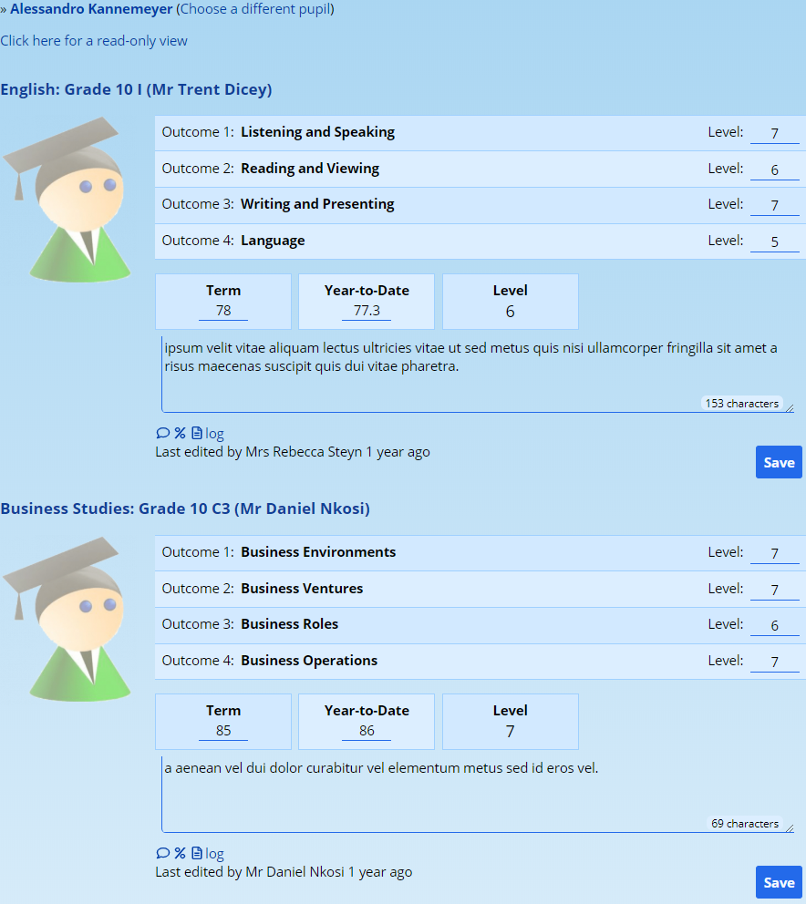

A Senior or FET Phase teacher might find it better to write the report comments of a single class at once and could report via **Reporting → Report Comments → Report comments (by class)**.

Look at the diagram below. Here we are looking at Mr Dicey’s English class. Notice that we start with Alessandro Kannemeyer and that the information is the same as in the previous illustration:

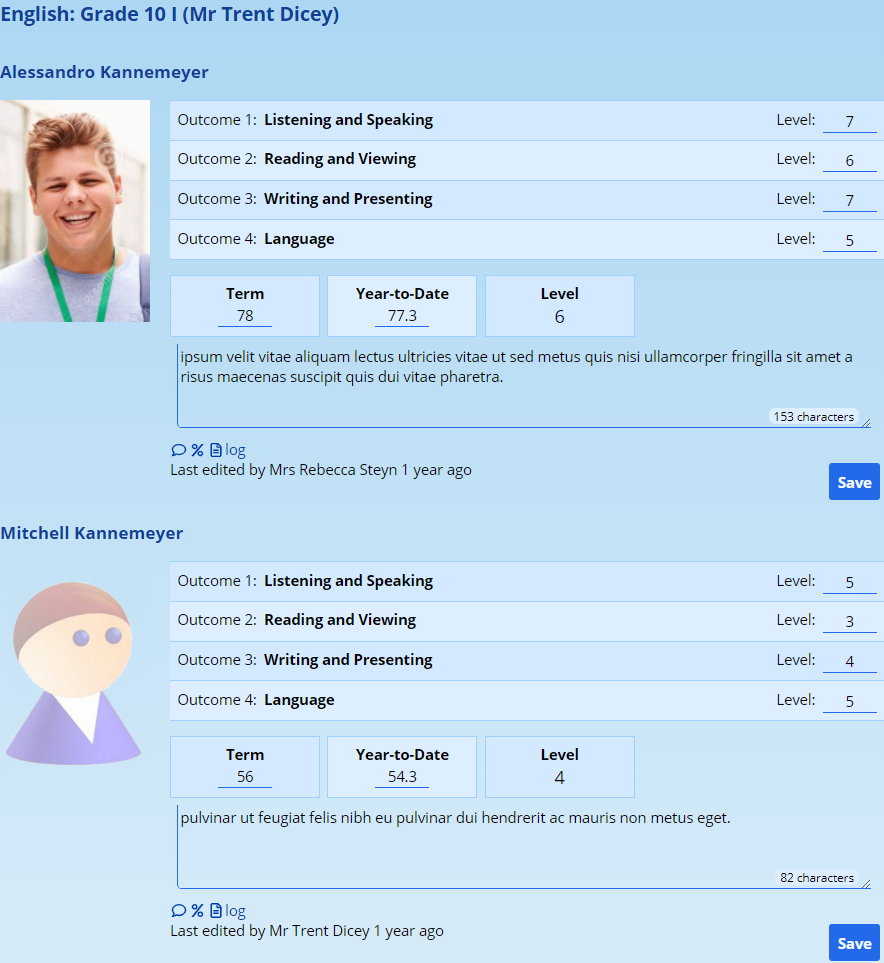

Importantly, how the information is captured here does not impact how it will be used later when applied to the reporting template. If you enter some of your comments in the “(by pupils)” view, that same information will be visible later if you choose to go and enter other comments “(by class)”.

## Basic Principles of the Reporting Screen {#h-q17z4hg4235u}

Regardless of the view you use to enter your comments, the same things will be visible and will operate in the same way. Depending on the reporting period settings that have been configured, you may or may not see the same things as illustrated below. These settings are controlled and configured by your ADAM Administrator to meet the needs of your reporting template. See the [Troubleshooting section](#h-fwy0wsnc9ls7) later on for some helpful hints when things don’t go as expected.

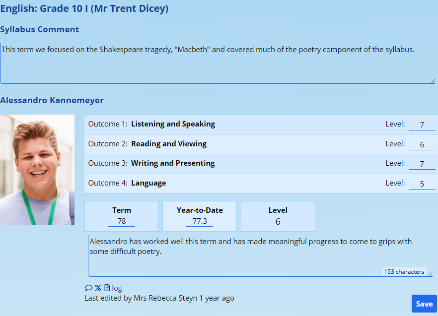

At the top of the screen, when editing reporting comments for a class (this does not show when editing individual pupils’ comments), is the **Syllabus Comment**. This is a general comment that will be added as a paragraph above the pupil’s individual comment - which follows later. Because this comment will be added automatically to the front of each pupil’s comment, it should be limited to something that is general in nature.

Below this, each of the pupils will be listed alongside a photograph of them. Next to the photograph will appear any **Learning Outcomes and Assessment Standards** that require completion. You may be able to type in a symbol or you might be forced to choose one from a drop-down list.

Note that if your marks are stored and generated in the Mark Book, you will see values pre-populated here based on the marks you have captured. You might, therefore, not be given the option of changing the automatically calculated values.

Below the LOs and ASs, you might find a set of **Behavioural Indicators** (not shown above!). These are otherwise known as “Effort scores” or similar. If shown, you can select an appropriate indicator for each of the criterion shown.

We then see blocks for **Term** marks, **Year-to-Date** marks (also referred to as YTD) and **Levels**. If your pupils have made use of the **Goals** module, you will also see a block listing their academic goal in this subject. Similar to the Learning Outcomes, if you have used the mark book in ADAM, you will already see a result shown here. You also might not have the option to edit this result, depending on the settings put in place by your ADAM Administrator.

Below that, we see the comment block where you can type in your comment. A character counter is provided. Your ADAM Administrator might have put a limit on the length of the comment. If this is the case, the character counter will show you characters left and will count down as you type.

There are three icons below the comment block. The “speech bubble” will display the last three comments that were entered for this pupil in this subject:

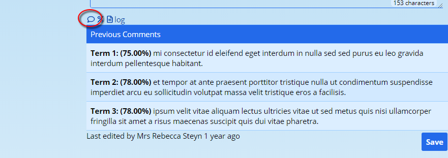

The “percent” % sign will show tyyou the assessments that this pupil has achieved in this subject over the course of the reporting period:

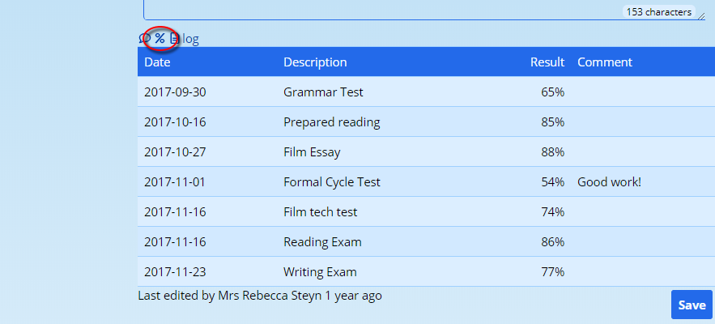

Finally, the “page” icon will show you the marks that this pupil has achieved in other subjects this term. These can be useful if you are writing a pastoral comment that needs to cover overall academic performance:

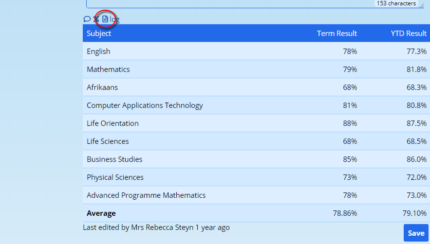

Click on any of the icons again to hide their information.

## Saving Report Comments {#h-yfqxs9bqkvtt}

You will almost never need to click on the “Save” button at the bottom of the report comment! ADAM will save automatically as soon as you “move off” the level, mark or comment. This is indicated in two ways:

A “Saving” message will appear at the bottom of the screen and the block that you’ve edited will turn pink:

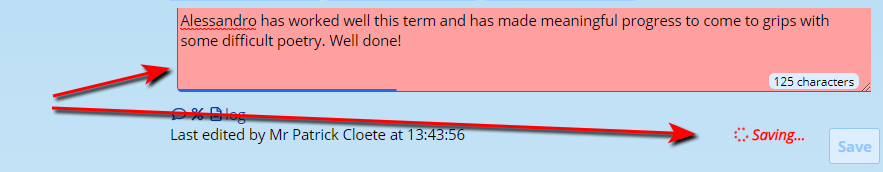

Once saved, the block will turn green and the “Saving…” message will be replaced, briefly, with a “Saved!” message which will disappear. The time that the comment was saved will also change.

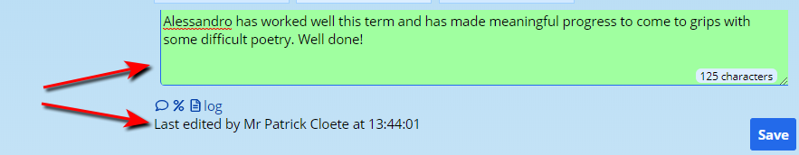

If you do not see these visual clues happening, then your marks are not being saved! If a block stays red for more than 30 seconds without receiving confirmation from the server that it has been saved, an error message will appear.

If you click on the **Save** button, ADAM will attempt to save all aspects of the report for that pupil. If you received an error message when the automatic save happened earlier, clicking on the **Save** button will force ADAM to resubmit the request to save the information. This can be a life-saver! Note that ADAM will NOT attempt to save “green” blocks, even if you click on the button.

### JavaScript Issues {#h-n6im9kx4tz9s}

All this “magic” requires that your web browser be a current version of one of the “ever-green” browsers. These browsers automatically update themselves and apply the latest security patches and features without you having to do anything. These browsers include Google Chrome, Mozilla’s Firefox and Microsoft’s Edge browser. Notably, it does not include Microsoft’s range of Internet Explorer browsers.

Unfortunately, if the JavaScript does not load properly on the page, the magic saving and the error messages alike are all affected. Please watch out for the visual clues. **If it looks like nothing is happening, it might be beause nothing is happening**.

See “[My comments won’t save](#h-ptqlz4itpmd)” in the [Troubleshooting](#h-fwy0wsnc9ls7) section below.

## Autocorrection in Report Comments {#h-ro0undu23j2d}

ADAM understands some magic commands when editing report comments. For example, if you were to write: “^n has produced work of an excellent standard this term”, then ADAM would know to substitute the ^n characters with the pupil’s name:

Will save and show:

In addition to this name swapping, ADAM also supports gender specific autocorrections. The following list is supported by default, but ADAM Administrators can [customise this list](#h-spixugieq9g5).

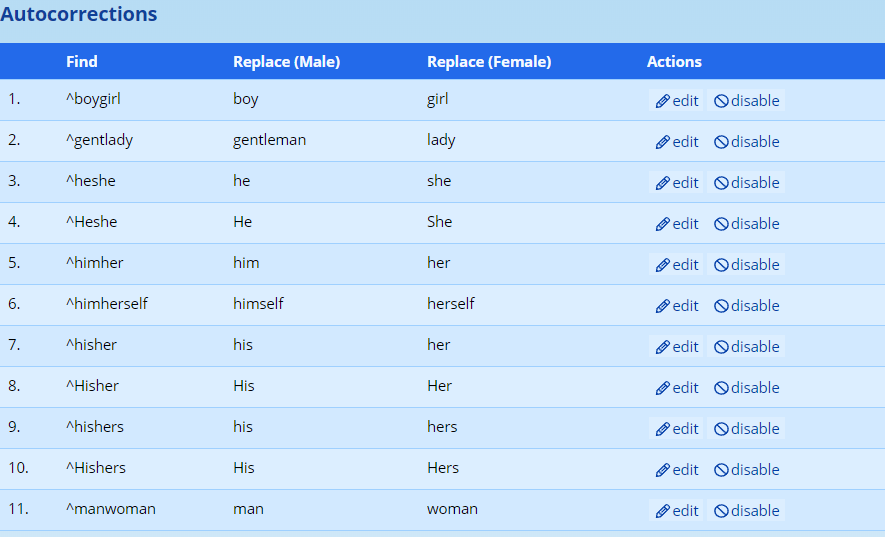

Note that these corrections are case-sensitive, so writing “^heshe” would produce “he” or “she”, but writing “^Heshe” would produce “He” or “She” when replaced.

### Customising the Autocorrection List {#h-spixugieq9g5}

ADAM Administrators can navigate to **Reporting → Report Comments → Manage autocorrection list**.

Two lists are shown - one with enabled and another with disabled autocorrections. These can be moved between lists by using the “enable / disable” options that appear to the right of each autocorrection.

Either click on “edit” next to an existing autocorrection to change it, or click on the “**Add new autocorrection**” link at the top of the screen.

#### The Autocorrection Settings {#h-qrlej3591mm5}

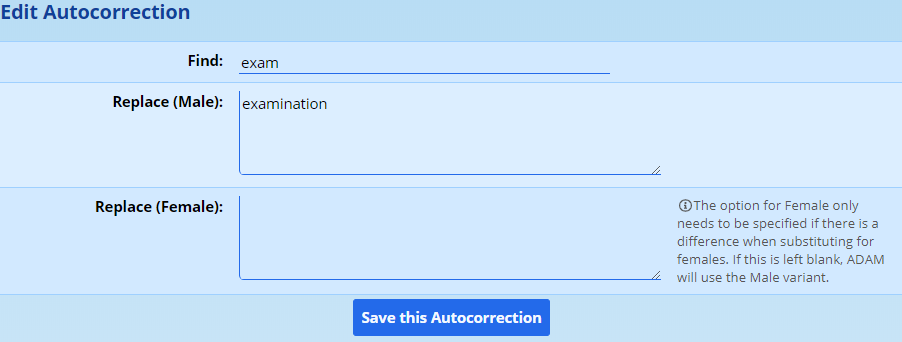

For each autocorrection, you need to supply the text that ADAM should search for in order to replace. This is put in the **Find** box. In the example above, we are searching for the abbreviation “exam” and replacing it with the full text “examination”. This replacement has been entered in the **Replace (Male)** box. You will notice that the “Female” replacement has been left empty. Where none is provided, ADAM will automatically use the “Male” replacement, even when replacing comments for Females.

As a general rule, unless you are dealing with a gender specific replacement, you need only enter information into the first two boxes as illustrated above.

Some schools like to have a bank of comments so that their teachers can enter a numeric code and have that comment appear. If you do decide to do this, please ensure that the codes you use are not likely to appear “normally” in text. It is for this reason that we’ve prefixed all of our codes with the “^” character. This is not special in any way, except that it fits in with the convention already established with the name replacement code, “^n”.

While the “^n” code can appear in these autocorrected comments, one cannot use other autocorrection codes within these. For the technically minded, ADAM will not recurse through the comments.

## Modifying Multiple Report Comments {#h-3spbk7ktd8aa}

ADAM allows you to append, prepend or replace the comments for pupils across multiple selected classes. This is useful for adding in generic-type comments. Appropriate uses are adding a promotion result to the end of the principal’s comment, for example, or helping to prepopulate the Life Orientation comments with some generic - although personalised - comment.

The feature can be found via **Reporting → Reporting → Modify multiple report comments**.

First, choose the reporting period:

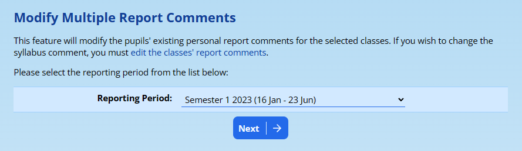

In the following screen, you will type in your comment, choose what you want ADAM to do with it, and the classes that should get the comment:

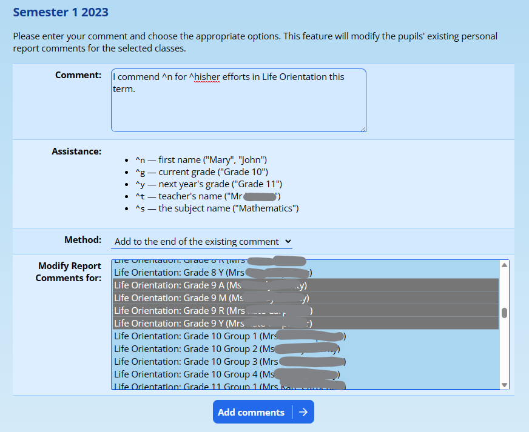

There are three operations that ADAM can perform with your comment:

1.  Add to the end of an existing comment. When this is selected, ADAM will use any comment that is entered for the subject already, and simply add the comment that you’ve provided here to the end of that comment.
2.  Add to the start of an existing comment. When this is selected, ADAM will use any comment that is entered for the subject alread, but will add the comment that you’ve provided here to the start of the comment.
3.  Replace the existing comment. When this is selected, ADAM will ignore the comment that is already entered for the pupils in the selected classes and replace the comment with the one you’ve provided here.

***Please be careful with this feature***, especially when choosing classes that belong to other teachers. This operation will modify the comments and there is no way to undo these changes without going through each comment and looking at its change history to copy the old comment back.

## Troubleshooting Report Comments {#h-fwy0wsnc9ls7}

### My comments won’t save {#h-ptqlz4itpmd}

When entering comments, be observant a and look for the visual clues ADAM provides that your comments are being saved. If you don’t see the visual clues (green blocks, saving messages), then please stop entering your report comments before you enter a whole class which ADAM isn’t saving.

This can happen for one of a number of reasons, normally related to the quality of your Internet connection. Such issues may be caused by proximity to your wifi router (far away means weak signal) or an otherwise congested internet connection. The causes of that probably lie with your Internet Service Provider.

In a number of instances, clearing the browser’s offline files and reloading the page are all that is needed to resolve the issue:

On your keyboard, hold down “Ctrl” and “Shift” while pressing the “Delete” / ”Del” button. Most browsers will then bring up a window that allows you to clear your offline files. Here is the window in Google Chrome:

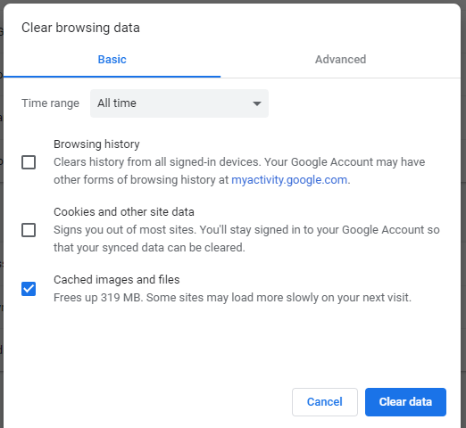

Choose the option to clear “Cached images and files” and click on “Clear data”. You are welcome to clear the other aspects, but these don’t affect how ADAM saves reports. Once completed, click on the **Reporting** tab in ADAM and proceed to enter your comments as you would normally do.

It is important to realise that you must reload the page for the clearing to have any effect. This **will** clear any unsaved reporting comments that you have entered. If you wish, you can copy and paste them into a Word or Notepad window so that you don’t lose them.

With any luck, you will only have one or two comments affected before you notice that they aren’t saving.

### My marks on the reporting screen are wrong and won’t update {#h-d8yv9caez322}

If you change the mark on the reporting screen, ADAM will take special note that you do not want to use the marks generated by the mark book for that particular pupil. Any future requests to update the mark are ignored by ADAM because of the overridden result. When a mark is manually overridden, the following tick box appears on the reporting screen:

To have ADAM revert to a calculated result, simply click on the tick box.

Importantly, **if you are not using the mark book**, please **do not** click on this box. If there are no marks in the mark book and you click on that box, ADAM will calculate an “Absent” result for the pupil and clear the result that you’d previously entered.
