# Report Publishing {#h-fi2p6xd0k2wk}

## Managing Report Templates {#h-25xaf5x26yvq}

Note that before the new templates can be used for reporting, you must first enable them in the reporting template list.

To do this:

1.  Click on the “Reporting” tab.
2.  Under the “Report Period Administration” heading, click on “Manage Report Templates”.
3.  In the section “Disabled Report Templates”, find the new template and click on the “enable” action.

The page will reload and the template should now appear in the top part of the page.

<iframe src="https://www.youtube.com/embed/XJvKcyLhq9U" frameborder="0" allow="accelerometer; autoplay; encrypted-media; gyroscope; picture-in-picture" allowfullscreen></iframe>

Once you have enabled the new templates, please don’t forget to select them as the templates to use in the Reporting Period Settings for the appropriate grades.

### Report Template Settings {#h-xmx7ugsn73co}

Some report templates have certain settings that can be set to change different aspects of the report. Often this will be used to set which staff member’s signature should appear at the bottom, or in which category examination results need to be found. The settings that are asked for differ from template to template.

Head to the template management page: **Reporting → Report Period Administration → Manage Report Templates**. Next to the report, on the right-hand side, you will see a “settings” option next to report templates that have customisable settings:

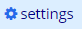

Clicking on this option will provide you with some settings to change. The settings that are available are unique for each template.

Make the appropriate selections for the settings and then save the settings using the **Save** button at the bottom of the page. These changes will now take effect on the template.

**Note:** It may happen that your changes are not reflected immediately. If you are making these changes towards the end of your reporting period, near your publishing date, please make sure to [refresh the archived reports](#h-rxci0hyty6yg) to ensure that the changes you’ve made reflect on the reports that ADAM generates.

## Staff Signatures {#h-6oj305rlncaz}

It is possible to add digital images of staff signatures to report templates. It is very important to note that report templates must support signatures! If yours don’t, please let us know so that we can update your templates to include the electronic signatures.

### Scanning the Signatures {#h-oret7guuouur}

To begin, you will need to scan clear copies of your staff signatures. The following tips will help you get the best results:

-   Sign on a blank A4 piece of photocopy paper
-   Use a black, liquid ink pen (such as a roller ball, fine-liner or even fountain pen). While normal ball point pens can be used, a medium ball point pen will produce a clearer signature than a file point. Avoid blue pens (or any other colours!) and pencil signatures.
-   Scan using your photocopier’s “scan-to-email” function and make sure to increase the contrast as far as possible to make the background as white as possible and the signature as black as possible. Some trial and error to get the best results is likely!
-   Scanning often results in a PDF file. Zoom in as far as possible to see the signature clearly. Then use a screen grabbing tool (Windows includes the perfectly adequate “Snipping Tool” application) to save the signature as a PNG image file. PNG is better than JPG from a quality point of view.
-   Crop the signature as tightly as you can to reduce white space around the edge of the signature. The size of the image is not that important: everyone has a different sized signature!

-   Cropping tightly is important: if there is too much white space below the signature, the signature will appear to float above the signature line. If the signature has too much white space all around it, it may appear very small.

-   If you wish to, and have the ability to, you can convert the background of the signature to be transparent. However, this is only useful if your signatures will appear over an area that is not white.
-   The signature will be automatically be resized on your report to fit its allocated space. Capturing a smaller image to result in a smaller signature will not work. Remember that the signature will be resized to fit the space that is allocated.

-   If you need to make a signature smaller, one tip is to try and add whitespace to the around the image when you crop it - often to the top. Most signatures appear over a signature line and adding whitespace to the bottom of the image will cause it to “float” above the line.
-   If the signature is very wide and flat, try adding whitespace to the sides when you crop to make it appear smaller.

The following is an example of a scanned and cropped signature. The red border is only provided for illustration and should obviously not be part of the final image! The size and quality of the image below work well in our experience.

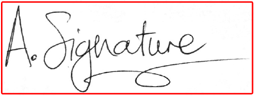

### Uploading the Signatures to ADAM {#h-76xkee657rz}

When asked to display a signature on a report, ADAM will look in the staff member’s Document Repository for a signature - specifically in the “Signaures” category.

The signatures must be uploaded to the individual staff members’ Document Repository.

*Importantly, the person uploading the signatures must have the necessary privileges to add documents to the signatures category of the Document Repository. This person does not need to have “read” access, although “delete” access can be useful to replace an old signature with a newer version if it is required.*

ADAM will use the *first* signature that it finds in this document repository category. This can sometimes be unpredictable if there are multiple versions of the signature. Thus, you are advised to delete any old versions of the signature so that the final choice not left to chance.

Navigate to the staff member’s profile (**Staff → Staff Administration → Staff Info**) and click on the **Document Repository** tab (if you can’t see this tab, ask your ADAM administrator for privileges first). Click on the “**Signatures**” section. Click on the “Choose files” button and locate the copy of the signature on your computer. The click on the **Upload files…** button. The signature should appear in the list of uploaded files.

If you can see the Document Respository tab within the staff profile, but don’t see the “Signatures” category, then you will [need privileges to upload documents to that category first](document-repository.md#h-a6043un8am4k).

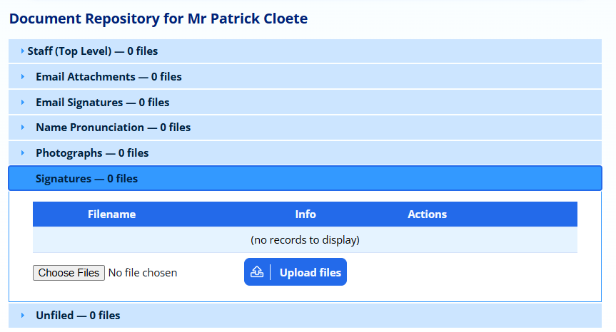

Repeat this process for each staff member that requires a signature.

Once uploaded, you should see a small preview of the signature in the thumbnail. If the thumbnail next to the file does not show the signature, then it is very possible that you have uploaded a format that is not supported. The signature must be either in PNG (preferred) or JPG format.

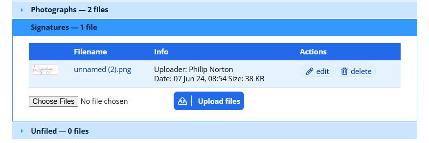

The signature above is ready to go!

### Removing Signatures from Reports {#h-tb0y81w5bn9}

If you wish to remove signatures permanently, your templates may need to be changed. An alternative solution would be to delete the signature scans from the document repository.

### Common Problems with Signatures {#h-hjvlkpe9h0nf}

#### Signature is too big or too small {#h-8w92yfym6qr3}

Most of the problems have to do with the size of the image and the manner in which it has been cropped. As described above, these can generally be fixed by providing a better cropped image.

Remember that ADAM will always re-size the signature to fill the space provided. Uploading a “smaller” image will not affect the ultimate display size and will only result in a blockier signature being displayed.

#### Wrong signature shows {#h-syv4spcn1sk5}

If there is more than one signature in the staff member’s document repository, delete the extra versions to leave only one signature that ADAM can use.

#### No signature shows {#h-h16itm5tg663}

While there can be several problems that lead to this, one common issue is that the wrong type of signature has been uploaded. ADAM requires that the signatures be in PNG (preferred) or JPG format. Occasionally we will see signatures that have been saved into a PDF document or which are in a Word processing document. Neither of these formats will be recognised by ADAM and will not show.

If you still cannot get the signature to display, please contact the ADAM Helpdesk so that we can assist with the resolution of the problem.

## Printing Reports {#h-84i17k8qvsey}

ADAM can print reports by any class or grade group in the school.

*Note that if you choose a class, you* ***must*** *choose a* ***single grade*** *class. This is especially important if the different grades use different templates. ADAM will use the template that for the first pupil on* ***all*** *the other pupils.*

On the **Reporting** tab, under the **Report Publishing** heading, please have a look for the option **Print a class’s reports** or **Print a grade’s reports**.

Choose the appropriate grade or class and continue.

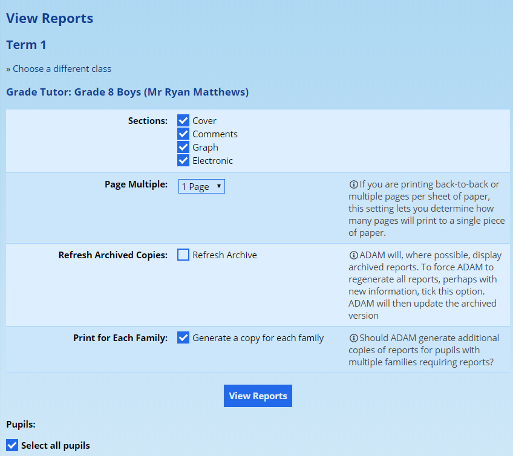

Depending on the report template that is in use, you may get the option to produce various **Sections** of the report. Tick these as required.

The option on the right allows you to force ADAM to make each report fit a certain **page multiple**. This is very useful if you are printing pages that vary between even and odd number of pages depending on the pupil. If you then wish to print back-to-back, setting your “Page multiple” to 2 would ensure that the back page of an odd-numbered page report was left blank and ensure that the next report started on a separate piece of paper.

The option to **Refresh archived copies** will be ticked automatically if the publishing date is in the future. Otherwise ADAM will fetch previously generated copies from the Document Repository, where they exist.

If you wish to have ADAM **print the correct number of reports per pupil** depending on how many families are linked to them and who require reports, then tick this box. Otherwise ADAM will print one copy  per pupil.

You also have the option of producing reports for selected pupils within the class or grade. You can use the checkbox **Select all pupils** at the top to select or deselect all pupils.

Click on the **View Reports** button when you are done. ADAM will now compile a single PDF document with all the reports, ready for printing.

### Hints and Tips for Printing {#h-a3kb06z46fhw}

1.  When your report templates are designed, we typically design on an A4 page (unless by specific arrangement). Many PDF viewers offer the ability to “Fit to Page” when printing a PDF. Be warned that this will adjust the scaling of the page and if your report is meant to be folded or fit certain measurements, this may well distort those measurements.
2.  In a similar vein, when printing reports, please ensure that your printer driver is configured to use A4 paper and not “US Letter”. This seems to be responsible for many other page scaling issues.

## Emailing Reports {#h-hjfh243tfv3g}

ADAM can send emailed reports to each parent of a pupil where the family is set to receive reports and the individual email address of that parent is set to receive reports.  

*Thus there are two settings to check if the emailing process indicates that the parents were not sent reports, or if the parents didn’t receive a report.*

To begin, visit the **Reporting** tab and under the **Report Publishing** heading click on **Email a class’s reports**. (There is no option to email a grade’s reports, so you may want to create some grade-wide classes if you don’t have any).

The process for emailing reports is similar to printing above. Firstly, choose a reporting period:

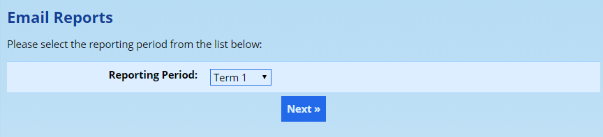

Next choose a class of pupils to send to. Please don’t choose a class that has pupils from multiple grades.

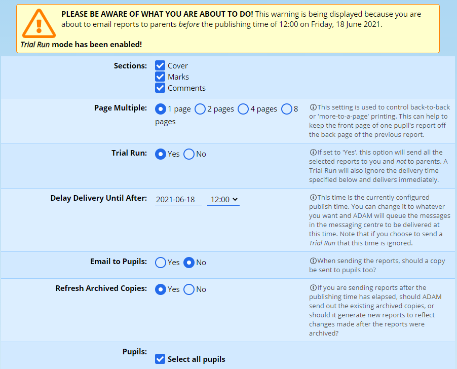

At the top, you can choose which sections of your report you wish to send. Note that these sections depend entirely on how your reporting template is set up and you may not see all the options shown above under the “**Sections**” heading.

The **Page Multiple** value will force ADAM to add blank pages to the end of a report until its length is a multiple of the number chosen here. Typically this is used for printing only, and when printing back-to-back it is sensible to choose a page multiple of 2. Page multiples of 4 or 8 are only useful if you are printing archival copies of the report and wish to print multiple pages on a single side of paper (side-by-side and back-to-back printing, for example, would mean four pages per piece of paper and thus a page multiple of 4 would be useful)

If you wish, you can perform a **Trial Run**. In this case, all the reports will be emailed to your address. This is useful to test with one or two pupils. Note that if the reporting period has not yet reached its publish date, this option is automatically turned on! This relates to the warning that appears at the top of the screen.

ADAM allows you to **delay delivery** of your report emails until a specific time. The time that will display here by default is the report publishing time, but you can choose any time you’d like to. ADAM sends these reports via the messaging centre and so once you click on send here, the same controls that you have for [normal messaging batches](messaging-centre.md#h-m0b84s3v3oxa) are also available to you for your reports (including adjusting the delivery time, suspending delivery indefinitely, or even aborting the batch). Also note that this time is automatically ignored if you choose to send a trial run. In this instance the reports will be delivered to you immediately and no messaging centre batch will be created.

The next option allows you to **email the reports to the pupils** also. Normally ADAM emails them only to their parents. When delivering final reports, the reports are always be emailed to parents and this cannot be disabled. During a trial run, reports are only delivered to the user who initiates the trial run.

The **refreshing of archived copies** causes ADAM to overwrite the archived copy of the report in the document repository. This setting is irrelevant if the publishing date is in the future: ADAM will always update the archived copy. However, if it is *past* the publishing date, ADAM will send out the copy that is in the document repository. This is discussed more in [the section below](#h-rxci0hyty6yg) that deals with report troubleshooting.

You have the option of choosing which pupils’ reports to email. By default all pupils are ticked.

Finally, click on the **Email reports** button at the bottom of the screen. A new screen will load and ADAM will update it with progress. Note that emailing of reports where the reports are being refreshed in the document repository can take a while. Please be patient and let the screen load fully.

## Reports on the Parent and Pupil Portal {#h-jjpghblilhk5}

In order for parents to access their children’s reports on the Parent and Pupil portal, they will need the [correct privileges](security-administration-for-families-and-pupils.md#h-jikjh4kunfbk) in order to do so. Assuming that the privileges are set up correctly, they will have automatic access to the report as soon as the [publish date and time is reached](reporting-period-administration.md#h-1a346fx).

## Creating Custom Reports for Individuals {#h-1ck1h2yyn8s2}

From time to time, a pupil may require a report that needs to be custom made rather than generated on a school template. An example is when a pupil is very new to the school and does not have marks or comments available from all the subjects. In these cases, it might be more useful to create a cusom report for the parents that is unique for this individual pupil.

Such reports might be drawn up in Microsoft Word or Canva as possible examples. The source is not important!

**Save the report as a PDF file** (for best compatibility, we recommend saving it as a PDF version 1.4 document if you are able to - while an old PDF version, it has excellent adoption levels).

Upload the report into the pupil’s **Reports** category within the [Document Repository](document-repository.md#h-3l18frh).

Navigate to **Reporting → Report Publishing → Link Custom Reports to Report Periods**.

Now choose the **grade of the pupil** and the **reporting period** this report  is for.

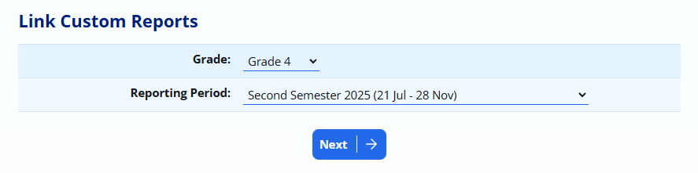

ADAM will then show a list of all the pupils that have reports available for selection. This may not be everyone in the grade. Choose the document that you uploaded earlier.

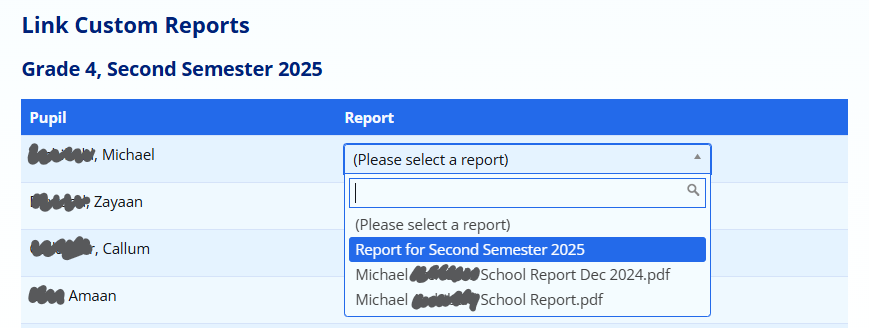

Once done, you can click on the **Save** button at the bottom of the screen. ADAM will confirm how many pupils in that list have custom reports selected.

Once a manual report is selected, ADAM will not override this report with a normal template report.

### Reverting back to a templated report {#h-kfhrowqhnn4z}

If you wish to remove the selected report and revert back to a normal templated report, follow these same steps, but change the report selected to “Please select a report” to indicate to ADAM that no report has been selected.

## Troubleshooting Report Publishing {#h-wcxk9040a90r}

### The report doesn’t show new information! {#h-rxci0hyty6yg}

If you’ve updated a class, changed a comment, revised a mark or even made changes to the report template, but you can’t get the changes to reflect on the report, it’s likely that ADAM is showing you an old version of the report.

Here’s two reasons why ADAM might do this:

#### Reason 1: The reports are already published {#h-jis7e6uu7w9k}

Typically, this happens when the change has been made after the reporting period’s [publishing date](reporting-period-administration.md#h-38czs75) has been reached. Once the publish date is reached, ADAM “locks” the report that it produces to prevent any changes that might be made in error from conflicting with the published version.

You can check whether a report is published (and thus archived) by looking at the pupil’s report list in their profile:

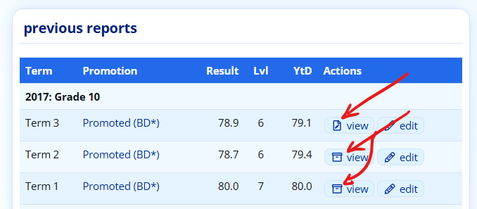

In the example above, the first “Term 3” report is not yet archived because it still has an editing symbol next to the “view” option. In the previous “Term 1” and “Term 2” reports, the icon has changed to an archive box, indicating that you are looking at an archived version of the report.

Some background to this process: Each time ADAM generates the report, it puts a temporary copy in the [Document Repository](document-repository.md#h-3l18frh). This copy is temporary until the publishing date passes and then ADAM marks the archived report as finalised. After this time, any changes that are made to the report and its contents are not reflected on the report because the archived copy is no longer updated.

Sometimes, though, a report is marked as archived by accident. If the reporting period was set up incorrectly, it may be that the publishing date is left as the default option - which would be the date that the reporting period was created.

Even if the publishing date is changed, because the report has already been marked as finalised, it will not be updated automatically. Once a report it finalised, there is no way to mark it as temporary again. In order to update its contents, one of the following three methods must be used.

#### Reason 2: The report data (marks and comments) haven’t changed {#h-fii7sqt2tukr}

If ADAM doesn’t find a reason to re-create the report, it might not do it!

In this instance, no changes have been made to the individual reporting information but rather to the report settings or template as a whole. If ADAM notices that the marks or comments for a report have been changed more recently than when the report was last generated, it won’t request a report refresh and will simply issue the report it last generated.

For example, the reporting period comment which is set in the Reporting Period Settings can be updated but won’t show on the report because ADAM doesn’t recognise that the report has actually changed. This can also happen if there have been updates to the report template but not the actual report contents.

#### Solution: get ADAM to refresh the archived reports {#h-otkb887bg402}

We need to tell ADAM to update the version of the report that it is showing you. There are two ways to do this:

##### Update the reports for a whole class / other group of pupils {#h-fgxg4iqv5iog}

Continue as if you were going to print reports for a class or grade: **Reporting → Report Publishing → Print a Class’s/Grades reports**.

On the report generation screen, click on the option which says “**Refresh archive copy**”. This is useful if you need to change a whole lot of reports at once. You can, of course, just select the single pupil whose report needs updating.

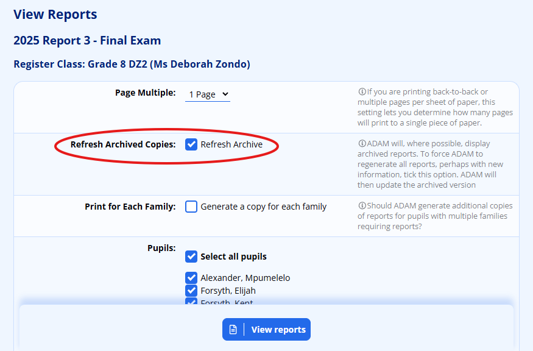

##### Delete the Document Repository copy {#h-jc76b3eu6azx}

The archived report is stored in ADAM’s [Document Repository](document-repository.md#h-3l18frh). When ADAM returns to fetch the archived copy, it will be seen as missing and ADAM will automatically regenerate it using whatever information is currently available.

##### Force a recalculation of averages and promotion results {#h-hj49a2exs6ll}

If the report has not been published, you may be required to force ADAM to manually recalculate the averages across subjects and the promotion results.

This often happens after changes are made to the calculation, promotion requirements.

To effect the recalculation, visit **Reporting → Promotion Results → Recalculate Aggregate and Promotions**.

You will be asked to choose a reporting period and a grade.

##### Force a mark book recalculation {#h-qsnar7rkp45c}

If the report has not been published, forcing ADAM to recalculate both term and Year-to-Date results may update the results of an individual pupil and their report. This often needs to be done if marks were changed in a different reporting period that affect the Year-to-Date results of the current reporting period. ADAM only normally updates marks when the marks in that reporting period change.

To effect the recalculation, visit **Reporting → Promotion Results → Recalculate Marks and Symbols**.

You will be asked to choose a reporting period and a Grade to recalculate. All the marks in all subjects will be recalculated.

Repeat for any other affected grades.

### The report isn’t being emailed! {#h-lln9mujhrm6m}

There are a few things to check.

#### Privilege Groups {#h-hcpowmd5ftpe}

If in the list of names the pupil is crossed out and the message “this family does not have the required privileges to view the report; the report will not be emailed” is displayed next to the pupil, then the [pupil belongs to a privilege group](security-administration-for-families-and-pupils.md#h-jikjh4kunfbk) that does not allow the parents to **view the most recent report**.

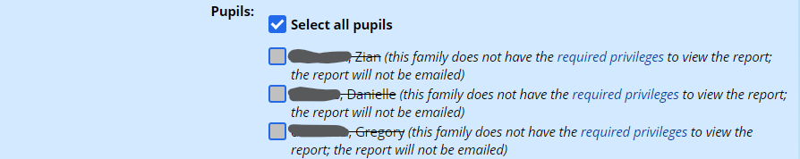

This must be set, even if you don’t allow access to the parent portal. Where schools do make use of the portal, they often will assign non-paying parents to a group that prevents them from accessing reports via the portal. In some cases, schools were still emailing those reports to parents in error. This cross-check ensures that it cannot happen.

#### Email Settings {#h-lcmcs53qtibf}

There are two possibilities here.

Firstly check that the pupil’s family members have email addresses set to receive reports. This can be done by editing the family’s information. Under the email addresses for primary and secondary parents, ensure that at least one email address is set to receive reports:

Also in the family profile information, have a look at the bottom and see if the family as a whole is allowed to receive reports:

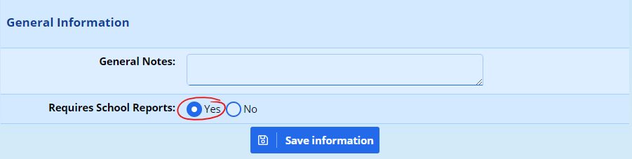
