# Reporting Period Administration

A reporting period is equivalent in many ways to a school term. Each reporting period can produce a single report for each of the grades in the school. If your school requires more than one report per term for any particular grade, it is likely that you will require two reporting periods. To clarify your school’s particular requirements, please contact your ADAM support representative who will discuss your options with you.

## Adding a new Reporting Period

At the start of each new term, a new reporting period needs to be created. These can be created for the year in advance, but it is not advised to create any reporting periods beyond the end of the current academic year.

On the **Reporting** tab, under the **Reporting Period Administration** section, click on the **Add reporting period** option.

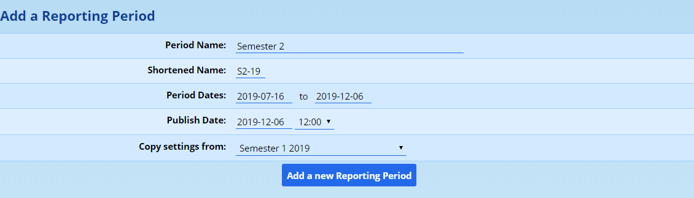

Fill in the appropriate settings for the reporting period. At the bottom, you can also choose which reporting period you’d like to copy the settings from. This enables you to quickly set up a new reporting period with similar settings to a previous report.

These settings are shared across all the grades. They are discussed as follows:

-   The **Period Name** is used in most formal places on the site that refers to this reporting period, including on many of the reporting templates that have been developed. Care should be taken when entering this value. Typically we recommend something along the lines of Term 1, 2012.
-   The **Shortened Name** is used on some of the academic progress graphics and can only be 5 characters long. We recommend using something in the form “T1\-19” to represent Term 1, 2019, or perhaps “S2-19” to represent Semester 2.
-   The **Period Dates** are the start and finish of the term. **The end date is particularly important** since when looking at historical data, ADAM considers the end date of the reporting period to see if a pupil was enrolled in a class for a particular reporting period. The pupil is considered to be enrolled if they were enrolled on the end date.
-   The **Publish Date** and time are used by ADAM to determine at what time parents and pupils are allowed to see these reports on the parent and pupil portal. This date can be set before the end of the reporting period if required. Take note, however, that any changes to classes prior to the end of period date will have an impact on the report.

Once you’re happy with these settings, click on the **Add a new Reporting Period**  button at the bottom. ADAM will now show you some additional settings as well as the grade specific settings for this reporting period. Have a look at the next section, “Editing a reporting period” for more information.

## Editing a Reporting Period

Whether you’ve just added a new reporting period or are editing an existing reporting period, you will see the same screen. Navigate to **Reporting → Reporting Administration → Edit reporting period**.

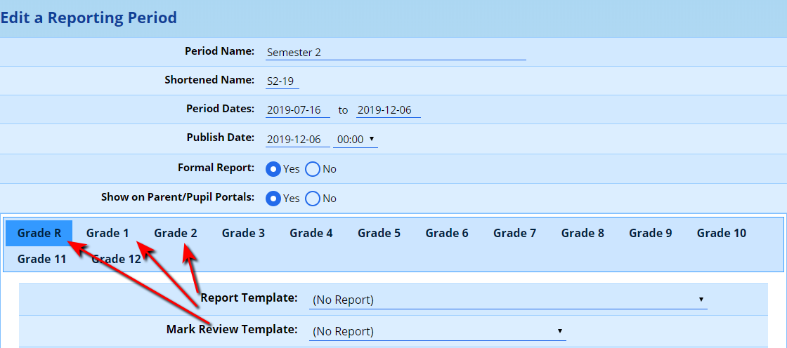

!!! warning
    *If the correct grades are not shown, you can change the starting and ending grades in the* *[Site Settings](changing-site-settings.md#changing-site-settings)**.*

At the top of the screen are the same settings for the reporting period which were set when the [period was added](#adding-a-new-reporting-period). These can be changed here if required.

!!! warning
    Please be circumspect about changing the period’s end date. It can have unintended consequences. ADAM uses this date to see who should be in each class. If you change this date after the fact, you may find pupils “disappear” from their classes because they were not enrolled in those classes on that date.

Additional settings control whether this reporting period is considered a **formal report** (in other words, whether it will collect marks for the pupil, as opposed to, say, comments or other behavioural indicators), and whether the reporting period should be shown at all to parents and pupils on their respective **portals**.

### Report Template Options

Each grade is able to have its own reporting template with its own set of requirements. These appear under the heading **Report Template**:

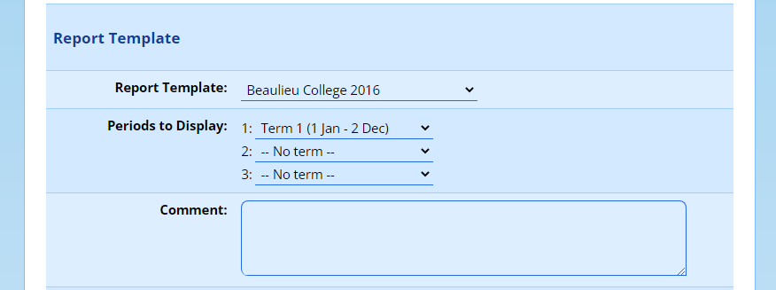

-   The **Report Template** field determines which template will be used with the grade that has been selected. Note that ADAM will only show enabled templates here (unless a selected template has since been disabled, then it, too, will show). See the section on [manging reporting templates](report-publishing.md#managing-report-templates) for more information.

    If a grade is set to have “(No Report)”, then ADAM will not generate reports for them, and their list of historical reports will not reflect a report from this reporting period.
-   If a template has been chosen that displays results from multiple terms (most likely because you have a mark grid which displays information from other reporting periods), you will have the option to enter which terms are displayed and in which order.

    Choose terms in the order they should be displayed. For earlier terms in the year, it is almost certain that at least one or more of the later terms will need to be set as “-- No term --”. If you are setting up a term 2 reporting period, for example, please do not create and set Terms 3 and 4 in that reporting period. While you might not notice anything odd at the time, if you were to produce a historical “Term 2” report, ADAM would then include Term 3 and 4’s results on that report. This can be confusing! How could an end of year mark be present on a Term 2 report?
-   The **Comment** is a comment that typically is added to your report template. It may consist of a message giving notice of the term start dates and so on.
-   The **Qualification** field tells ADAM which qualification is associated with this grade. This impacts how ADAM calculates promotion decisions as well as which symbol set it uses for its results.

### Reporting Screen Options

The next set of options, under the heading **Reporting Screen**, determine what fields ADAM will display on the reporting page for these grades:

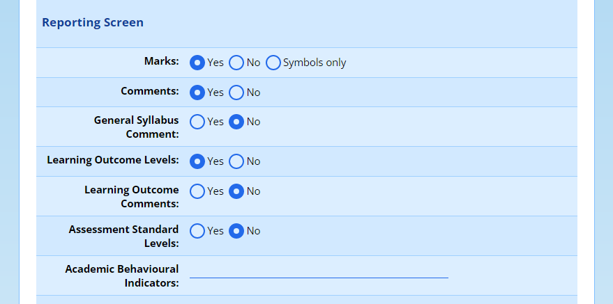

-   The **Marks** field tells ADAM whether marks for the report should be collected or not. “Yes”, indicates that marks are to be collected for this reporting period, “No”, that they aren’t, and “Symbols only” indicates that no marks are collected, but symbols are. Mostly, this is set to “Yes”. Foundation Phase grades would have it set to “No”.
-   The **Comments** field indicates whether comments will be recorded for each subject. Note that if *any* comments are required, then the value of this field must be set to yes, even if many (or most) of the subjects do not require comments.
-   A **General Syllabus Comment** is a comment block that will appear at the top of a class’s reporting screen which allows the teacher to capture a general comment that will apply to all pupils in the class. Unless the template is specifically programmed to deal with it, the general comment will appear as a paragraph before the pupil’s individual comment.
-   It is also possible to have ADAM display the **Learning Outcome Levels**. LO Levels can be drawn automatically from the markbook. Since we have now done away with Outcomes Based Education, many schools prefer to think of Learning Outcomes as “topic areas” instead. Have a look at the section on [managing Learning Outcomes](learning-outcomes-and-assessment-standards.md#managing-learning-outcomes). *Note that your reporting template must specifically support Outcome Levels for them to display.*
-   The **Learning Outcome Comments** field allows a comment to be recorded for each Learning Outcome. *Note that your reporting template must specifically support Outcome Comments for them to display.*
-   The **Assessment Standard Levels** option indicates whether this grade records Assessment Standards for their reports or not. *Note that your reporting template must specifically support Assessment Standard Levels for them to display.*
-   The **Academic Behavioural Indicators** fields allow schools to collect indicators about items such as behaviour, work ethic and so on. There is a field specifically for “Academic” indicators and then a field, in spite of its name, for everything else. To collect these for a report, they should be entered as follows:

Effort:1,2,3,4,5

It is also possible to have more than one behavioural indicator by separating them with a vertical “pipe” character: |

Effort:1,2,3,4,5|Behaviour:Good,Indifferent,Bad|Punctuality:Early,Late

The teachers, in this example, will have five options to choose from for “Effort”, three options to choose from for “Behaviour” and two for “Punctuality”.

Once reporting has started, please be careful when changing any of the descriptions or options for the behavioural indicators.

### Calculation Information and Options

The next set of options is titled **Calculation Information** and allows you to determine how ADAM will calculate the results for these reports:

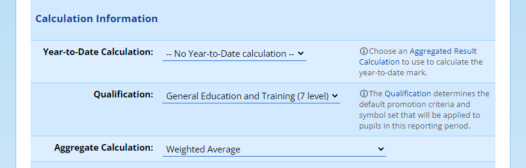

-   The **Year-to-Date Calculation** determines how ADAM calculates the pupils’ year-to-date results (or, at the end of the year, effectively their promotion result). This dropdown shows a list of [Aggregated Results Calculations](aggregated-results.md#aggregated-results). You can choose one here. If you need to set one up first, you can do so and return later to edit this reporting period and select the calculation.
-   The **Qualification** sets a default qualification that should be used for this reporting period. This impacts the levels that are awarded for the differing symbols. For more information, please see the section on [academic qualifications](academic-qualifications.md#academic-qualifications).
-   The **Aggregate Calculation** field indicates how ADAM calculates the aggregate marks. There are four options that can be chosen:

-   Weighted Average calculates an average influenced by the weighting associated with each subject (see [Editing a subject](subjects.md#editing-a-subject)). *This is the normal setting for IP and GET phase pu** pils.*
-   Top 7 Subjects calculates a weighted average using only the top seven subjects.
-   Top 7 Subjects (with compulsory) calculates a weighted average using any subjects that are marked as compulsory for aggregate calculation with the highest from the remaining subjects until 7 subjects have been included. *This is the option typically chosen for* *NSC* *grades.*
-   Top 7 Subjects (with compulsory, Maths/Lit combo) calculates the average using the above calculation with the added step of checking whether a candidate offers both Mathematics and Mathematical Literacy. Using the Umalusi guidelines, if the result for Mathematics is 50% or higher, the Mathematical Literacy result is discarded. If it is not, the Mathematics mark is discarded.
-   Other uses a manually entered calculation to calculate the aggregate. This is [explained in some detail below](#custom-aggregate-calculations).

### Other Settings and Advanced Options

At the bottom, a section on **Other Settings** exists. Here you can toggle the Pupil Goals for the reporting cycle, as well as an option to show the advanced settings (which are shown below):

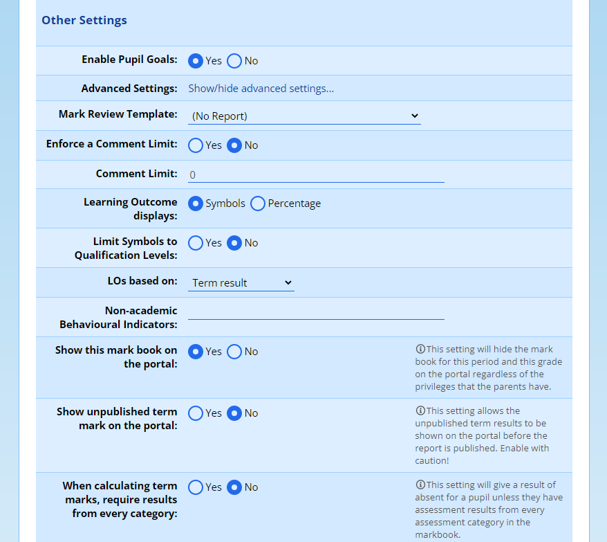

-   If you want to enable the [pupil goals](goal-setting.md#goal-setting) module of ADAM, you can set that option to “Yes”.
-   The **Mark Review Template** field can be ignored for most circumstances. *Since the early days of ADAM, the default mark review template is able to be adapted to meet most schools’ needs and thus this setting is generally redundant. Leave it set on “(No Report)”.*
-   It is possible to **Enforce a Comment Limit** for your comments. Note that this applies to all comments across all subjects in the grade. Once set to “yes”, the **Comment Limit** field is enabled and a value can be entered in there. This is the number of characters allowed in the comment.
-   The **Learning Outcome displays…** field tells ADAM whether to publish the LO symbol or the actual percentage that was attained in that Learning Outcome. This only has an effect if the Assessment Mark Book is being utilised and determines what results from that are carried to the reporting screens. If the Assessment Mark Book is not being used, or Learning Outcomes are not displayed on reports, then this setting can be ignored. Note that the LO results are only calculated as they change. If you adjust this setting towards the end of the reporting period, there is a good chance that the symbols or percentages will not reflect properly. In this case, you can force a [recalculation of the results](mark-book-administration.md#mark-book-results-recalculation).
-   One can **Limit Symbols to Qualification Levels Only**. This can reduce the errors inherent in datacapturing. In some circumstances, it can be too limiting, depending on what your reporting template requires. It is generally save to set this to “Yes”.
-   In most normal circumstances, ADAM calculates a result for each of the **LOs based on** the markbook using the term result. However, an end of year result might elect to have the results calculated based on the promotion result instead.
-   The **Non-academic Behavioural Indicators** fields allow schools to collect indicators about items, but specifically for subjects that are not classified as academic. This follows the same structure as the Academic Behavioural Indicators that were discussed above.
-   ADAM can set an overriding option to **Show this markbook on the portal**. In cases where schools might want to adopt the portal at a future date, but hide existing markbooks, this option should be turned on. Note that it is grade-specific.
-   Some schools choose to show the unpublished term mark on the portal. Many schools opt not to do this so that teachers can adjust weightings later on in the term without raising questions as to why marks have changed. Your school’s academic policy will determine whether this should be turned on or not.
-   In some cases, schools may not wish to publish a mark for a pupil unless they have written an examination. In this instance, ADAM requires that every assessment category has a mark and the final term mark is calculated as absent unless marks from all categories are present.

## Reporting Period Time Frames

Each time, after you add or edit a reporting period’s information, or click on the **Edit reporting period time frames** from the main menu (**Reporting → Reporting Period Administration → Edit reporting period time frames**), you can edit the deadlines associated with each reporting period.

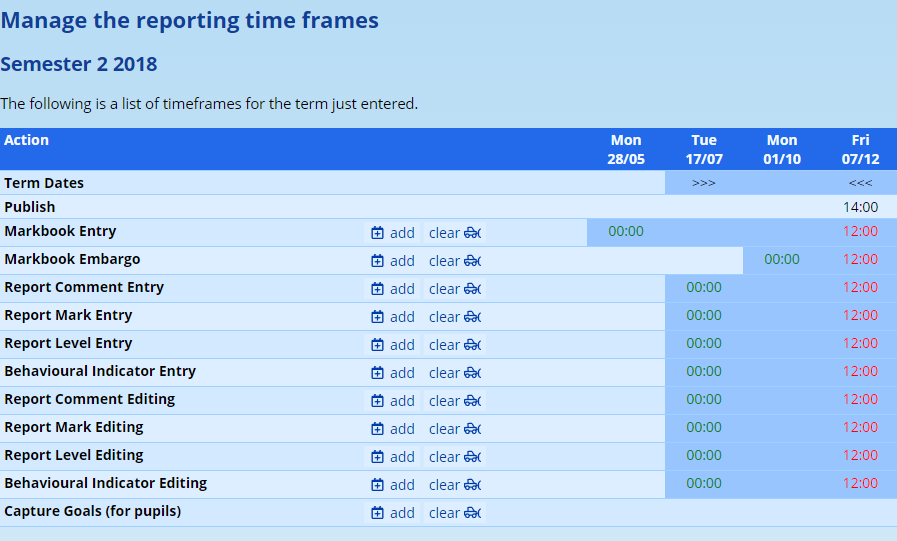

!!! warning
    *The deadlines that require “editing” require privileges to be assigned to staff. See “**[Security Administration](security-administration-for-staff.md#security-administration-for-staff)**”.*

Each line represents a reporting action, which are discussed below, and on each line can be multiple windows, each with a start and end time. The start times are listed in green below the dates on which they take effect, and the end times are shown in red.

As you make changes to the time frames below, be aware that the changes you make take effect immediately.

### Adding Time Frames

To add a window to any particular line, click on the **add** option that appears on that line. A pop-up window will appear. Choose the appropriate dates and times that the window should be active for and click on the **Add time frame** button that appears at the bottom of the window.

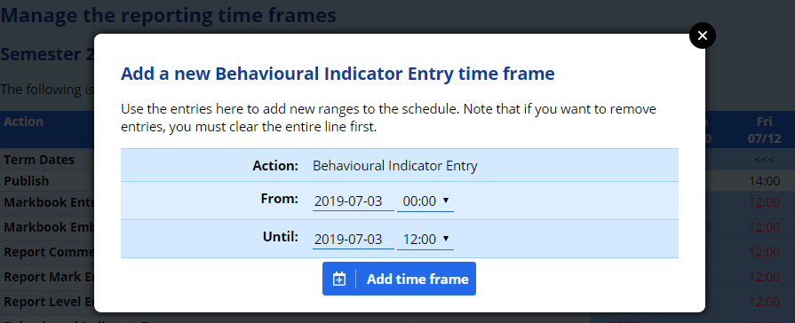

To return to the list of time frames without adding a new time frame, either click on the “X” at the top right, click on the dark area around the window, or press the **Esc** key on your keyboard.

### Clearing Time Frames

Removing the time frames set for any particular reporting action can be done by clicking on the **clear** option on that line.

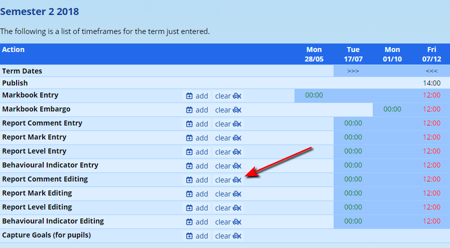

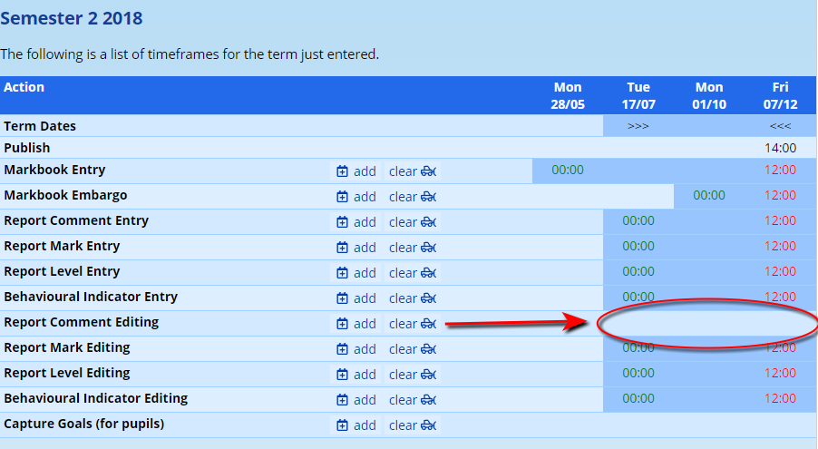

### Multiple Time Frames

It is possible to have multiple windows per reporting action. For example, say that we wanted to have mark book entry closed for a few days before a mid-term academic assembly, but the re-opened afterwards. This temporary closure will ensure that results are not modified while rankings are taking place:

First, we clear the line, and then add the two windows. The final result could look like this:

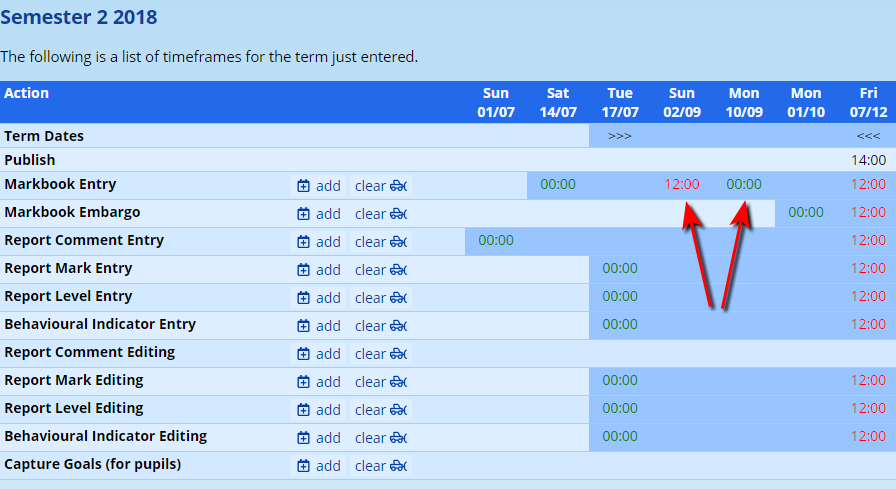

### Adding an Overlapping Time Frame

If you add a time frame that overlaps with an existing window, ADAM will merge them. Consider that we want the report comment entry to begin earlier, on 1 July. Look what happens when we add a time frame from 1 July to 1 August:

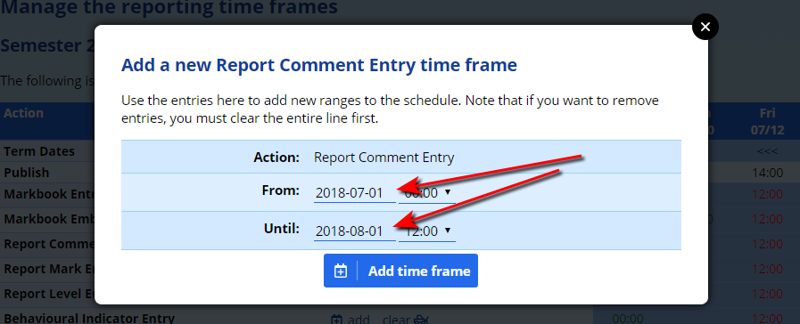

Because the time frame already starts on 17 July, ADAM detects the overlap and merges the two windows. The time frame will now span from 1 July until 7 December - the original ending date:

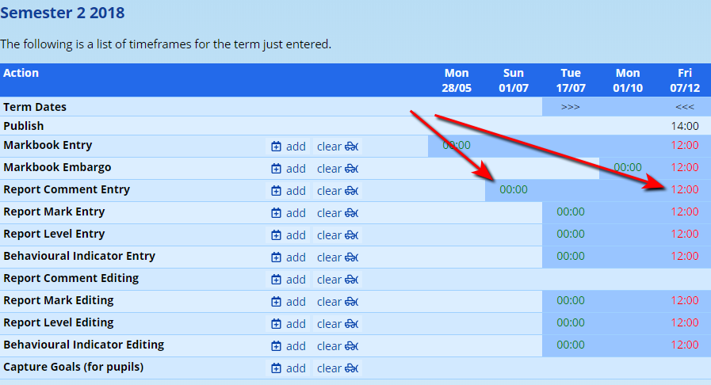

### Reporting Period Actions

There are a number of different deadlines that can be set. Note that apart from Markbook Entry and Merkbook Embargo, all other actions have both an “Entry” and an “Editing” option. Broadly speaking, the Entry option is required for normal teachers to perform their reporting functions, while the Editing is rather for teachers who may be required to Edit comments after the teachers have finished capturing their results. Not all schools use editing teams and thus nor all schools will make use of the Editing options in this list.

#### Markbook Entry

This determines when teachers have access to add marks to the mark book. This is typically closed off before the reports are published in order to allow time for checking of those marks and reports.

#### Markbook Embargo

This deadline is a feature that allows the administrator to block access to any marks that are entered while the embargo was enforced. Typically this is used in examination periods in order to prevent pupil stress.

!!! warning
    Note that the embargo only affects assessments that are dated between the start and end of the embargo. Setting an embargo from “today” will not hide the results from an assessment dated “yesterday”. Either the embargo’s window must be widened, or the assessment edited to move into the embargo window.

If a new assessment is added while an embargo is in force, ADAM will automatically set the results release time of the assessment to match that of the embargo. While this can be changed, the effect of the embargo cannot be overridden.

The time of day set with the embargo is generally ignored except in the results release time mentioned above.

#### Report Comment Entry

This deadline determines when teachers are able to enter their report comments. Normally this will start about a month before the publishing dates and close about a week before the reports are published to give editors and checkers time to read through the comments.

#### Report Mark Entry

Unlike the mark book entry, report mark entry is used when the mark book is not being used. This allows for direct manipulation of the report mark on the report entry screen itself. If the mark book is being used, this allows the mark book’s result to be overridden. In some cases, this is desirable and allows for some marks to be condoned or adjusted without making adjustments to individual assessments in the mark book. If the mark book is being used, there is generally no reason to allow report mark entry.

#### Report Level Entry

In a similar vein to the Report Mark Entry, this privilege is required when Learning Outcomes and Assessment Standards must be entered directly on the reporting screen.

#### Behavioural Indicator Entry

As with the other deadlines discussed above, this provides times when behavioural indicators can be edited. In some schools, it is required that these are done before report comments start, for example.

#### Report Comment Editing

This time frame allows those teachers who specifically have the ability to edit report comments to do their editing. This will allow them to continue with their editing work while report entry is closed off for most other teachers.

#### Report Mark Editing

If report mark entry is enabled, this allows those teachers who specifically have the privileges to edit report marks to do so. When schools use the mark book, this is often the best privilege to give to an Academic Head who would have the ability to decide on condonations. It is worth noting that this should only start once the mark book entry has closed since if any marks in the mark book are adjusted after the editing has taken place, those edits could be overwritten.

#### Report Level Editing

Where schools use Learning Outcome symbols, this allows those teachers who specifically have the privilege to edit learning outcomes to  do so. Again, these teachers can edit once the normal report mark entry time frame has closed.

#### Behavioural Indicator Editing

Similarly, this privilege allows the editing of Behavioural Indicators by teachers who specifically have the privilege to do so.

#### Capture Goals (for pupils)

If set, this setting determines when pupils are able to set and make changes to their goals. See elsewhere in the manual for more information on [Goal Setting](goal-setting.md#goal-setting).

## Custom Aggregate Calculations

This is discussed in its [own separate section](aggregate-calculations.md#aggregate-calculations).
