# Roll Calls {#h-74ctdmgnp3ca}

ADAM allows for roll calls to be taken at school events. Roll calls can be scheduled either from the timetable, from a scheduler (for other non-academic purposes), or on an ad-hoc basis (e.g. sports practices).

*Please note that the Roll Call module is intended to replace the* *[Attendance Registers](attendance-registers.md#h-ypqmq1nus3d4)* *feature in ADAM. The Attendance Registers functionality will be removed during the course of 2026.*

## Choosing A Roll Call {#h-ng4rxdj7pnao}

To take a roll call, there are two routes to the roll call screen.

Firstly, as a class’s teacher or teacher assistant, a roll-call option will appear next to the class in the **Your Classes** widget that appears on your ADAM home page. Simply click on the **Roll call** button to be taken to a roll call screen. If there are multiple roll calls open, a list of roll calls will be displayed for you to choose which one you want to take. If there is only one, ADAM will immediately skip to the page where you can record the attendance for that roll call.

The second method is via the menu: navigate to any one of the **Pupils**, **Staff**, or **Classes** tab, and, under the **Roll Call** heading, click on **Take a roll call**.

A list of all available roll calls will be listed for the logged in teacher. Click on the button next to the appropriate one to take the roll call.

If no roll calls have been automatically scheduled to be taken (either by the Timetable or by a Scheduled Roll Call), teachers still have the option of adding an **On-demand Roll Call** or a **Free-attendance Roll Call**.

### On-demand Roll Call {#h-mk0yi1ularll}

An on-demand Roll Call is a quick way to choose one of your classes and conduct a roll call against it. From the **Take a Roll Call** page, click on the **Add an on-demand Roll Call** button:

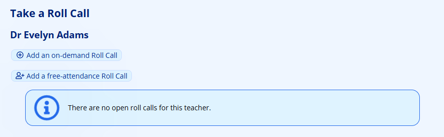

Choose the class you wish to take a roll call for and enter the date and time for the roll call. Note that while it is possible to choose any date and time for the roll call, the normal [scheduling rules will apply](#h-esr5628of73i).

Therefore, if your roll call is entered too far in the past, after a normal roll call should have closed, then this roll call will close too and no roll call will be able to be taken.

If you enter the roll call for a future time and date, the roll call may be captured as still pending and the roll call will not be allowed to be taken until the specified time before, as configured in the roll call settings.

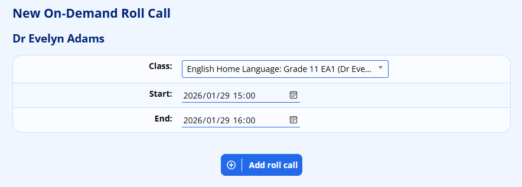

Click on the **Add roll call** button to add the roll call. If the roll call is currently open, you will be taken straight to the screen where you can record your roll call. Otherwise, you will be taken back to the list of roll calls.

Taking the roll call is the same as for [a scheduled roll call](#h-3q3hfdg9y53v).

### Adding a Free-attendance Roll Call {#h-qh8vpnqn43cg}

A free-attendance roll call allows you to dynamically add pupils to a roll call. This is often useful for recording pupils present at events with optional attendance and which might be attended outside of a class structure. Such examples might include:

-   Recording pupil whereabouts during study lessons
-   Recording attendance at support lessons

A free-attendance Roll Call, once the option is selected, will request a name for the roll call and the time and dates that the activity is active for:

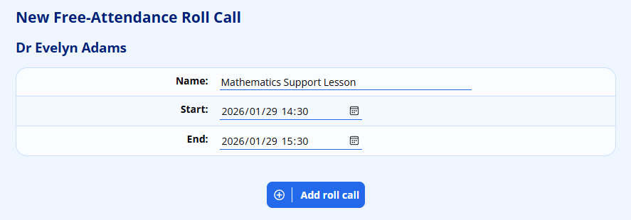

To begin with, no pupils will appear in the roll call:

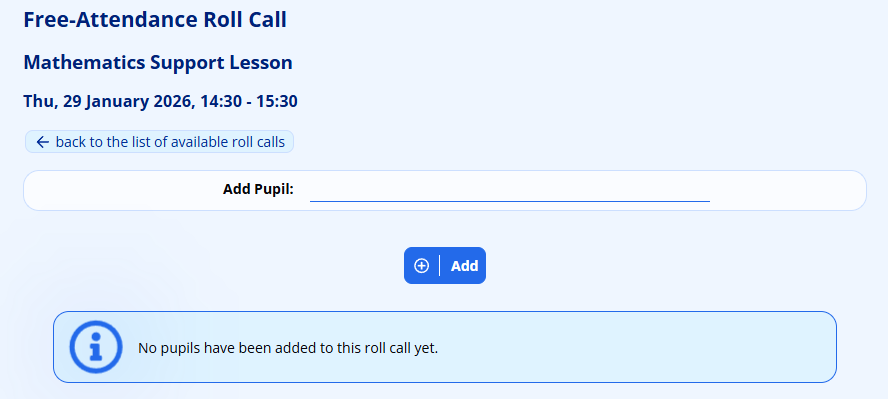

Use the “add pupil” option at the top to search for the pupil. Once found, click on the **Add** button.

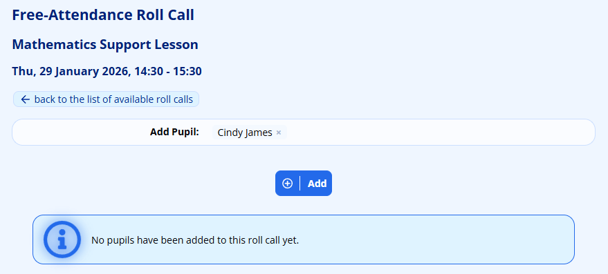

The pupil will now appear on the roll call:

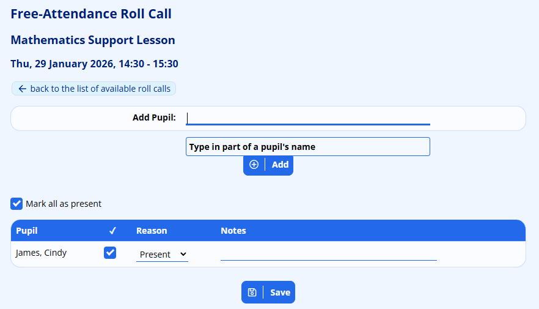

Unlike other roll calls, pupils added to a free-attendance roll call are automatically assumed to be present.

It is possible to mark a pupil as absent for a free-attendance roll call. This might be used to indicate a pupil who was expected to attend, but didn’t.

*While ADAM will add pupils to the roll call, if you wish to change any reasons or add any notes, you must click on the* ***Save*** *button that appears at the bottom. If you make changes to this list, and then add another pupil before you save the changes, those changes will be lost.*

## Taking a Roll Call {#h-3q3hfdg9y53v}

Once you have chosen a roll call, you will see a screen similar to this:

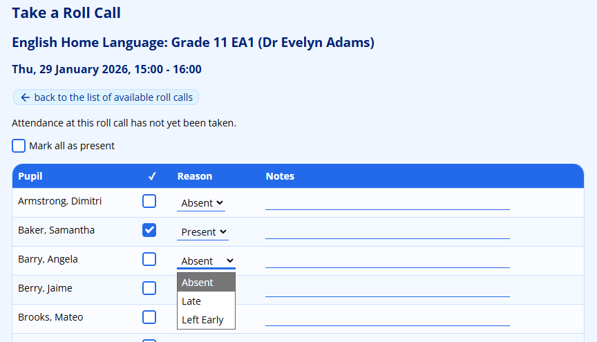

A list of pupils in the class will be shown in alphabetical order. Click on the checkbox to mark a pupil as present. Otherwise, leave the box unchecked to mark them as absent. The reasons in the dropdown list will change depending on whether you have marked the pupil as present or absent. You can change the reason, if you want, and add a note.

Pupils who have been captured as a planned absence will appear on the list and their entry will be marked in orange to highlight that they are expected to be away from this roll call. Depending on the certainty of the absence, it may be possible to override this pre-planned absence, however, it will more than likely be locked for editing.

Note also, that if registers are taken before a planned absence is added to ADAM, the taken register will override the pre-planned absence. This is one of the reasons that taking a register too early can be detrimental to the recordkeeping.

At the top of the table an option appears to **Mark all as present** which can be ticked to immediately highlight all pupils as present.

## Planned Absences {#h-evmfpme954cg}

### Adding a new Planned Absence {#h-qznq60a8fkha}

Where you are aware that a pupil is leaving the school for a period of time, a **Planned Absence** can be added to pre-populate the roll call.

To add a planned absence, navigate to **Pupils → Roll Call → Record planned absences**. ADAM will show you a list of current planned absences. This list includes and absences that will end at some point today, any current and ongoing absences, and any future dated absences.

*Functionality to view a complete list of absences will be added in a future iteration.*

Click on **Add new planned absence** at the top of the screen to add a new planned absence, and search for the pupil’s name in order to continue.

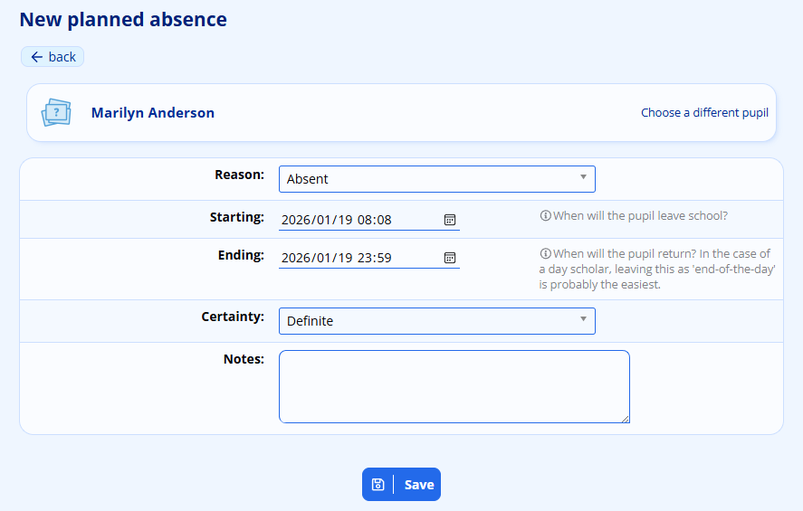

-   **Reason**: This is the reason that will automatically be recorded in any roll calls that happen during the pupil’s absence.
-   **Starting** and **Ending**: these indicate the time that the pupil will leave the school and the time that they will return. In the case of a day scholar leaving school, often a return time is not specifically relevant. ADAM will automatically select 23:59 on the same day to mean “*the rest of the day*”.
-   **Certainty**: allows you to define whether teachers can override this particular absence in their roll calls or not. If you choose **Definite**, then ADAM will not allow the teacher to change this record when capturing their roll call.
-   **Notes** allows you to put additional comments to explain this absence. Please be aware that these notes will be seen by the teacher taking the roll call and so should not contain overly sensitive information.

Click on **Save** to add this planned absence. The planned absence should now appear in the list of absences:

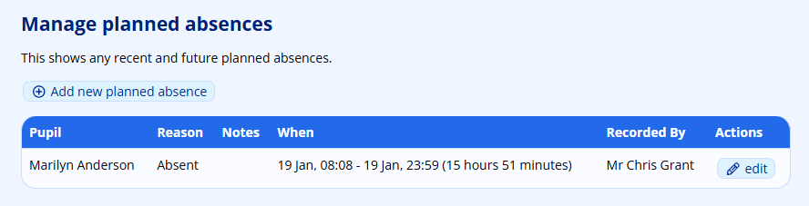

### Editing a Planned Absence {#h-2es0kci0a38x}

Click on the **edit** icon next to the planned absence that you wish to edit.

Make the changes that you need and click on the **Save** button to record the changes.

Please note well:

-   If you edit the times so that the planned absence is no longer “recent” (e.g. by selecting an **Ending** date that is long past), then the planned absence will no longer appear in the list of planned absences. Adding a new planned absence can replace the recently edited absence.
-   Changing a planned absence has no bearing on any roll calls that have already been taken. For example, if we edit a planned absence at 1pm to change the return time from 2 pm to 12 noon, any roll calls that opened between 12 noon and 1 pm, when the change was made, will not be impacted. This does imply that prompt alteration to planned absences will be necessary.

### Absences from Other Modules in ADAM {#h-gkry6r8vq4e0}

Apart from the roll call module monitoring planned absences, other modules in ADAM also contribute to absences and help to pre-populate the roll call. The idea is to allow for a complete summary of where a pupil is at any point in time.

#### Absentee Module {#h-5a5fg6ffgzyn}

If pupils are marked as absent in the absentee module, they will show as absent for all their roll calls on that day.

#### Leave Module {#h-wn0mpm39hlpo}

Any pupil who is listed as being on leave in the Leaves module (mostly used by boarding schools) will show as being on leave in their roll calls. Note that in the [Site Settings](changing-site-settings.md#h-3j2qqm3) (**Cron Settings → Roll Call → Reason to show for Leaves**) you must select the absentee reason that ADAM will use for a pupil on Leave. You might need to create your own [absentee reason](absentee-administration.md#h-i74ma3ruchb0) for this reason, first.

## Configuring Roll Calls {#h-esr5628of73i}

In the [Site Settings](changing-site-settings.md#h-3j2qqm3), The **Cron Settings** tab has a section with **Roll Call** settings.

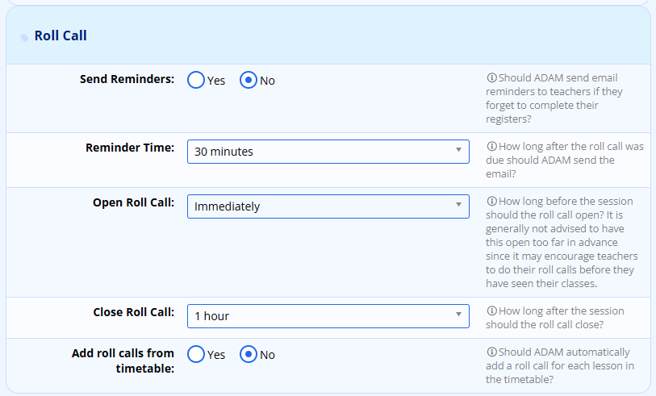

### Email Staff Reminders {#h-pu99dr4nnjc}

The **Send Reminders** and **Reminder Time** settings allow ADAM to send your teachers reminders if their roll calls are not recorded before the time, specified in **Reminder Time**, has elapsed after the close of the roll call session.

The email that is sent to staff can be customised (as can most automated emails sent by ADAM) be editing the **Roll Call** [Email Message Template](email-message-templates.md#h-5rkfadj40kta).

### Opening and Closing Roll Calls {#h-cafv7b7dc06u}

ADAM will allow roll calls to be taken from a specific time before the roll call is due to start (defined by the **Open Roll Call** setting) and will allow the roll call to be completed up until the time specified in **Close Roll Call**. Please make sure that the **Close Roll Call** time is sufficiently greater than the **Send Reminders** time, otherwise your teachers may either be asked to complete a roll call that is going to close imminently, or may already be closed.

If the roll call is closed, no reminder will be sent. This means, for example, if your **Close Roll Call** time is set to 1 hour, but your **Send Reminders** time is set to 2 hours, no reminders will be sent since the roll calls is already closed when the reminders are due to be sent.

### Adding Roll Calls {#h-c8x3b4c278xl}

Each morning at 5am, ADAM scheduled the roll calls that are due to happen each day. At this time, ADAM can optionally look at the timetable module in order to schedule a roll call for each lesson that is scheduled to take place that day. The “start” and “end” of the roll call are based on the start and end times of the lesson, as configured in the daily schedule.

When set to **Yes**, lessons are added. If set to **No** ADAM does not use the timetable and will not create lesson roll calls.

## Scheduling Roll Calls {#h-b88n8hdz302g}

Each morning at 5am, ADAM will look to see what roll calls need to be taken for the day and schedule them. Ideally, any changes that need to be made (such as schedules or special arrangements) will be done the day prior so that roll calls are created accurately.

*Note that because this scheduling is done at 5am each day, if you make any changes to ADAM, the first time you’ll see those changes is tomorrow, after the scheduler has run!*

Roll Calls can be created from three sources:

### On-Demand Roll Calls {#h-7p3gfrisftdt}

If a roll call needs to be taken but has not been scheduled, it is possible for a teacher to add an “on-demand” roll call. To do this, click on the option to “take a roll call”, as normal, and, at the top, choose the option to “Add an on-demand roll call”:

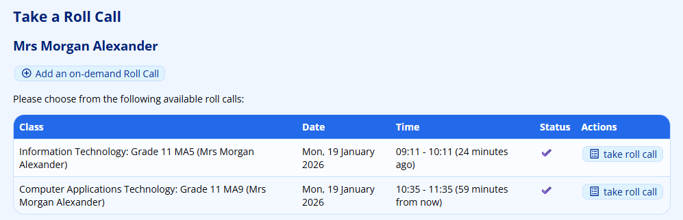

Now choose the **Class** and the **Start** and **End** times for the roll call:

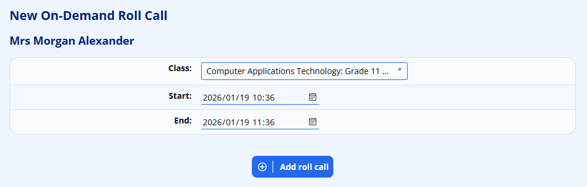

Click on the **Add roll call** button when finished.

If the roll call is able to be taken, according to the times set for opening and closing roll calls, ADAM will immediately display the roll call. If the roll call is not current, then the list of roll calls will be displayed again.

### Timetabled Lessons {#h-vz79qzaxjspb}

ADAM can automatically add all timetabled lessons as roll calls. This must be enabled in the [site settings](#h-c8x3b4c278xl). Any lessons that are scheduled for the day will have roll calls added. This means that if classes go away on tours, for example, that their lessons be [removed from the timetable calendar](timetable-module.md#h-4dyracbn67lz). If there are schedule changes, these should also be adjusted in the timetable.

### Scheduled Roll Calls {#h-s7d9bpj8s590}

ADAM has a basic Roll Call scheduler that allows you to schedule roll calls for specific days in the week for either a single class (e.g. “Marimba Band”), or all classes within a subject (e.g. “Registration Class”).

To add a Scheduled Roll Call, navigate to **Administration → Roll Call → Manage scheduled roll calls**. Click on the **New roll call schedule** to add a new roll-call.

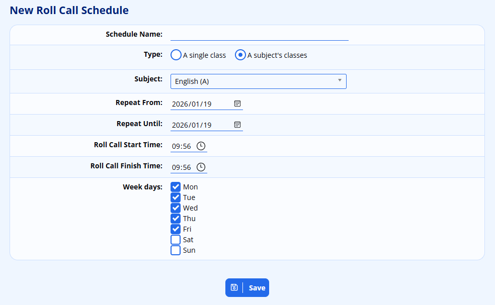

-   A **Schedule Name** allows you to refer back to this schedule more easily in the future.
-   The **Type** specifies whether you want to choose a single class or a subject. If you choose a subject, all classes within that subject will have a roll-call scheduled.
-   The **Repeat From** and **Repeat Until** dates specify when ADAM will start processing this schedule and when it will end. Note that the last roll call will be on the “until” date specified.
-   Add in a **Roll Call Start Time** and a **Roll Call End Time**. These times will determine when teachers can take their roll calls, and so should match up with the expected time frames of the activity or registration session.
-   Finally, specify which **Week days** this roll call is limited to.

**Example:**

A school has a morning roll call that is taken at 07h30 on Monday, Tuesday and Thurday, and at 08h00 on Wednesday and Friday morningsa, two schedules would need to be added: one for each set times:

-   Schedule 1:

-   **Name**: Mon, Tue, Thu Registration
-   **Type**: Subject
-   **Subject**: Registration class
-   **Repeat From**: 15 Jan
-   **Repeat Until**: 30 Mar
-   **Roll Call Start Time**: 07h30
-   **Roll Call Finish Time**: 07h40
-   **Week days**: Mon, Tue, Thu

-   Schedule 2:

-   **Name**: Wed & Fri Registration
-   **Type**: Subject
-   **Subject**: Registration class
-   **Repeat From**: 15 Jan
-   **Repeat Until**: 30 Mar
-   **Roll Call Start Time**: 08h00
-   **Roll Call Finish Time**: 18h10
-   **Week days**: Wed, Fri

Note that the ability to create exceptions (e.g. public and other school holidays) will come in time.

### Free-attendance Roll Call {#h-kl1vg6ruy8au}

ADAM allows a roll call to be taken with no fixed class register. This might be useful for monitoring pupil attendance at support lessons, their whereabouts during free lessons and so on. Pupils who are added to a free-attendance roll call are marked present as they are added, but it is possible to mark a pupil as absent if they were expected to attend but did not show.

## Roll Call Absence Alerts {#h-vlgh6kvxbzm6}

### Overview {#h-ygfdvlwkycuz}

The Roll Call Absence Alerts feature notifies selected staff members when a pupil is marked absent from a roll call. Alerts are sent by email and as a notification on the recipient's staff dashboard, so staff can react quickly to unexpected absences (e.g. a pupil missing their first lesson of the day, or missing a roll call they were expected to attend).

The feature is fully configurable:

-   Schools choose which absence reasons trigger an alert.
-   For each kind of roll call (Timetable, Schedule, Ad-hoc, Free) you decide who is notified — by role (e.g. the marker, the form-class teacher) or by listing specific staff members by name.
-   Individual roll-call series can override the default for their type, or silence alerts entirely.
-   A delay (debounce) holds the alert briefly so that a quick correction — for example, a teacher marking a pupil absent and then changing it to present a moment later — does not send a false alert.

Alerts are only triggered by manual attendance marks (a person clicking "Absent"). Marks created automatically when a roll call is opened (planned absences) do not trigger alerts.

### Quick Start {#h-n3adistam0i8}

To start using the feature on a new ADAM site:

1.  Grant the **Administer roll-call absence alert configuration** privilege to the staff who should manage alerts.
2.  In **Administration → Roll Call → Manage Reasons**, set Alert staff when marked to Yes for each reason that should trigger an alert (typically the reasons that mean "we don't know where the pupil is").
3.  In any tab containing a Roll Call section (Pupils, Classes, or Administration), open **Roll Call → Absence Alert Configuration** and configure the four roll-call types.
4.  Optionally, customise the Roll Call Absence Alert email template under **Administration → Manage Email Messages → Roll Call**.

That's it — the next time a teacher marks a pupil absent with one of the flagged reasons, the configured staff members will be notified after the delay period.

### Step 1 — Mark Reasons That Should Trigger an Alert {#h-emym3ihtt4fj}

The starting point of the feature is the absence reason. Only reasons flagged with Alert staff when marked = Yes will ever cause an alert to be sent.

To configure reasons:

1.  Go to **Administration → Roll Call → Manage Reasons**.
2.  Click Edit on a reason (or add a new one).
3.  Set Alert staff when marked to Yes to make this reason trigger the roll-call absence alert.
4.  Save.

*Note: This is a separate field from Include in alert, which controls the cumulative family digest sent by the existing Absentees module. The two flags are independent — you can use any combination.*

#### Recommended Reason Flags {#h-1b0nu1iux7n3}

**Reason**

**Alert staff when marked**

Unexplained / no reason given

Yes

Late

Yes (your call)

Sick (notified)

No

Authorised absence (school trip)

No

In general, set Yes for reasons that mean "we don't yet know where this pupil is", and No for reasons that represent a known and accepted absence. The goal is to alert staff to surprises, not to spam them with expected events.

### Step 2 — Configure the Type Defaults {#h-adngidhallhy}

Open **Administration → Roll Call → Absence Alert Configuration**. You will see a table with one row for each of the four roll-call types:

**Type**

**What it covers**

Timetable

Roll calls that come from the timetable (subject lessons).

Schedule

Roll calls scheduled by the Roll Call scheduler.

Ad-hoc

One-off roll calls created manually.

Free

Free-attendance roll calls grouped by series (e.g. extra lessons).

Click Edit next to a type to configure its alert defaults. Each form exposes the same set of fields:

#### Enabled {#h-mzxax49ajd83}

Master switch for this type. When set to No, no alerts are ever sent for roll calls of this type, regardless of the other settings.

#### Notification Delay (minutes, 0–240) {#h-f2xidxi133uv}

How long the system waits after a pupil is marked absent before sending the alert. During this window:

-   If the mark is corrected (e.g. changed to "Present" or to a reason that does not trigger alerts), the pending alert is cancelled.
-   If the mark is updated with a new reason that still triggers an alert, the delay restarts from the latest mark.

A delay of 10 minutes is a good default. Setting it to 0 sends alerts immediately and removes the safety net for corrections. The maximum is 240 minutes (4 hours).

#### Role Rules {#h-en1yjyc0soqp}

Each rule, if enabled, automatically picks the appropriate staff member for each individual alert based on who the pupil is and which roll call they were absent from. You can combine any number of rules — recipients are deduplicated.

**Rule**

**Effect**

Notify pupil's Register teacher

Notifies the teacher of the pupil's class for the school's default subject (Register, Form Period, Home Room or whatever your school calls it). The label in the form reflects your school's defaultsubject setting, so it might read "Notify pupil's Form Period teacher".

Notify the staff member who took the roll call

Notifies the marker — the person who saved the absent mark. Most useful when alerts are forwarded to other staff (e.g. heads of year) so the marker remembers who they raised it with.

Notify all roll-call series members

Notifies every staff member listed as a collaborator on the series. Only applies to on-demand (Free) roll calls, since they are the only type that can have a series with collaborators.

Notify the subject teacher

Notifies the teacher of the class being taught. Only applies to Timetable roll calls.

#### Explicit Staff Recipients {#h-nq8jpdc382zo}

A free-form list of staff members to always notify, regardless of the role rules. Use the multi-select picker to add or remove names. The picker lists every currently-employed staff member.

Use this for fixed audiences such as a head of attendance, a year-group co-ordinator, or a deputy head — anyone who should hear about every absence of this type.

#### Saving {#h-wewk75rmzcxg}

Click Save to apply the changes. You will be returned to the index page with a confirmation flash message. Changes take effect immediately — the next absence mark will use the new configuration.

### Step 3 — (Optional) Override a Specific Series {#h-j291hrye5p24}

A roll-call series can override the type default. This is useful for:

-   Silencing alerts on a specific series (e.g. an after-school club where attendance is informal).
-   Adding extra recipients for a high-stakes series (e.g. matric mock exam invigilation).
-   Tightening the delay for a series where speed matters more than the safety net.

To create or edit a series override:

1.  Go to Roll Call → Roll Call Series and open the series you want to override.
2.  Click Absence alert configuration in the action bar.
3.  Configure the form exactly as you would for a type default.
4.  Click Save.

Once a series has an override, all roll calls in that series use the override and ignore the type default. To go back to the type default, open the override and click Remove override.

⚠ Disabling an override silences the series. If you tick the series override but set Enabled = No, alerts are silenced for the series — it does not fall back to the type default. This is deliberate: a disabled override is a positive "do not alert for this series" signal. Use Remove override if you want the series to inherit the type setting again.

### How Alerts Are Delivered {#h-nntr03gf7obd}

Each recipient receives two things for each alert:

#### Email {#h-anf4hrevy3kg}

Sent via the Roll Call Absence Alert email template, which lives under **Administration → Site Administration → Email Templates → Roll Call** and is fully customisable.

Available merge codes:

**Merge code**

**Description**

{pupil\_name}

Full name of the absent pupil.

{rollcall\_name}

Name of the roll call (or the type if it has no name).

{rollcall\_date}

Date of the roll call (e.g. 7 May 2026).

{rollcall\_time}

Start time of the roll call (e.g. 08:30).

{marker\_name}

Name of the staff member who recorded the absence.

{reason\_name}

The absence reason that was selected.

{rollcall\_link}

Internal link to the roll call (path only).

{scope\_kind}

Either type default or series — explains why they were notified.

Recipients can edit the subject and body of this template like any other ADAM email template; the merge codes above are the supported placeholders.

### Landing Page Notification {#h-q8yf98pg90p5}

A row is added to the recipient's Staff Notifications dashboard widget, shown on the main page when they log in. The widget displays up to ten unread notifications, each with:

-   The pupil's name and the roll call.
-   The reason and the marker.
-   The time it was raised (relative — e.g. 5 minutes ago).
-   A link to open the roll call.
-   A Mark read button.

Marking a notification as read removes it from the widget but keeps the row on file. Each notification is private to its recipient — staff cannot mark each other's notifications as read.

### How the Delay (Debounce) Works {#h-pvkj0p7s2w7z}

The delay protects against false alerts caused by quick corrections. Here is the lifecycle of an absence mark:

1.  A teacher marks Pupil A absent at 08:32 with a reason flagged as "Alert staff when marked".
2.  With a 10-minute delay, the alert is scheduled for 08:42.
3.  At 08:35 the teacher realises Pupil A actually walked in late and changes the mark to "Present". The pending alert is cancelled — no email is ever sent.

If the teacher had instead changed the mark from one alerting reason to another (e.g. from "Unexplained" to "Late") at 08:35, the delay would have been reset to 08:45 so the alert reflects the latest reason.

The delay also handles bulk-marking: if a teacher opens a roll call and marks 10 pupils absent in quick succession, all 10 alerts are queued and sent after a single batch delay rather than firing one by one as they tick through.

#### What does not trigger alerts {#h-7q8o3df1cq09}

-   Marks created automatically when a roll call is opened (the system marks pupils absent by default — these are "planned" absences).
-   Marks where the reason has Alert staff when marked = No.
-   Roll calls whose status is cancelled.

### Cron Cadence {#h-hzgx1dw1x5sr}

The dispatcher that sends alerts runs as an automatic cron job. By default it runs every minute, so the time between an alert becoming due (after its delay) and it being delivered is at most one minute plus normal email delivery time.

The cadence is controlled by a setting under **Administration → Site Administration → Edit Site Settings → Absences → Roll Call → Absence Alerts**:

-   Setting name: Cron interval (minutes)
-   Internal name: cron\_rollcallabsencealerts\_interval
-   Default: 1

Increase this value to reduce load on busy servers; decrease (or leave at 1) for the most responsive alerts. Each cron run processes up to 200 queued alerts; if the system needs to handle more, the dispatcher will pick up the remainder on the next tick.

### Email Template Customisation {#h-6jngjz5pyeyi}

To adjust the wording, branding, or layout of the alert email:

1.  Go to Administration → Site Administration → Manage Email Templates → Roll Call.
2.  Open the Roll Call Absence Alert template.
3.  Edit the subject, top HTML, and bottom HTML using the merge codes listed above.
4.  Save.

The default subject is:

Roll call absence: {pupil\_name} in {rollcall\_name}

and the default body explains who was marked absent, when, by whom, and why, with a link to open the roll call. You can replace any of this with your school's preferred wording.

### Frequently Asked Questions {#h-z3jmj5i87l3d}

#### A teacher marked a pupil absent and corrected it almost immediately. Did anyone get an email? {#h-h5kv79zakft0}

No, provided the correction happened inside the delay window (default 10 minutes). The pending alert is cancelled atomically when the mark is updated to a non-alerting reason or to "Present".

#### A teacher kept the absent mark but changed the reason. What happens? {#h-3hym61283xz}

If both reasons are flagged "Alert staff when marked", the delay restarts from the new mark and a single alert is sent reflecting the latest reason. If the new reason is not flagged for alerts, the pending alert is cancelled.

#### Will alerts be sent during school holidays? {#h-q01lqfuu4rhj}

Yes — the dispatcher runs continuously and reacts to whatever absence marks are saved. If you do not want alerts during holidays, you can either:

-   Set Enabled = No on each type for the holiday period; or
-   Avoid taking roll calls during the period.

#### Can I see who has been alerted historically? {#h-srkf2a2aracn}

The cron job retains processed queue rows for 30 days before purging them, and the in-app notifications widget keeps both unread and read rows on file indefinitely. Email delivery records are tracked through ADAM's normal messaging logs.

#### A staff member resigned. Will they still receive alerts? {#h-ajuf46wdyz3v}

No. Before sending each alert the dispatcher checks that the recipient is still a current staff member (via view\_staff\_current). Resigned or former staff are skipped automatically, even if they are still listed as explicit recipients. Removing them from the recipient list is a tidy-up step but is not required for correctness.

#### What happens if email delivery fails for a batch? {#h-qkqqxtodkac1}

The dispatcher commits the email batch before it marks the queue rows as processed. If the commit fails, the queue rows are left in place and the next cron tick will retry them — so transient mail-server problems do not silently drop alerts.

#### Does the landing page notification get sent if the email also fails? {#h-qtoe6u13wf3c}

The landing page notification is created during the same processing step as the email. If the cron tick fails partway through, neither has been committed yet and the alert is retried on the next run. If the email batch succeeds but a downstream notification insert fails, the row is not marked processed and will be retried — note that some recipients may then receive a duplicate email on retry. In normal operation both are delivered together.
