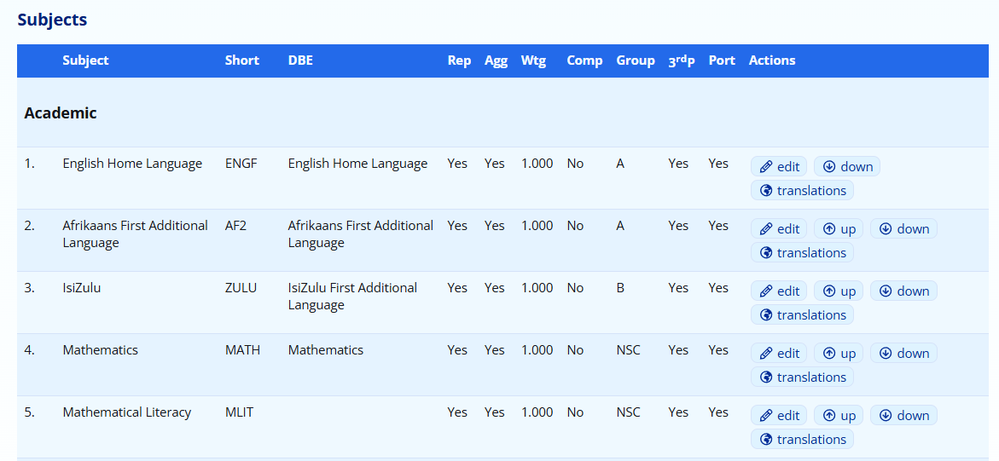
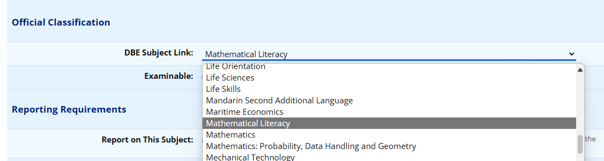
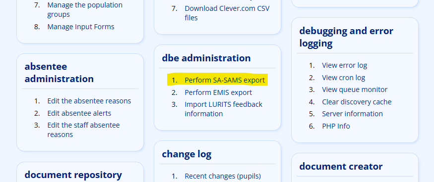
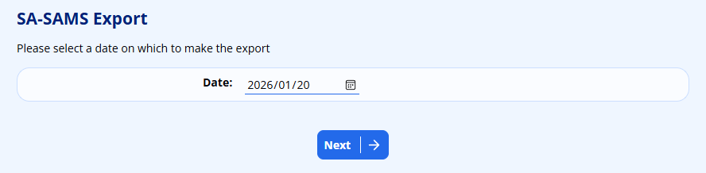
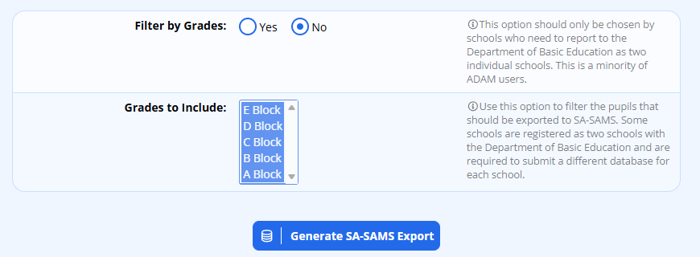
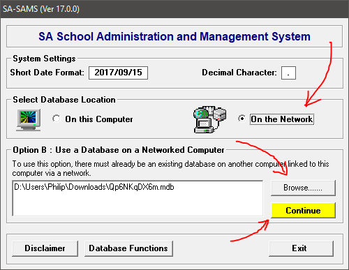

# SA-SAMS Export

ADAM allows for school data to be exported to an SA-SAMS compatible database. This database can be used for submission to district offices of the provincial departments of education for their reporting purposes.

## Submitting Information to District Offices

District offices will require print-outs and signatures from schools staff in order to accept the submitted databases and thus *ADAM EduTech is not able to assist with getting your schools SA-SAMS database to your local district office*.

Some schools have sent notifications that their district offices require them to run additional software to extract information from the SA-SAMS database. Other district offices seem to require the entire database. Please clarify with your district office what is required.

**We are unable to provide you with any support for using SA-SAMS.** You are encouraged, as far as possible, to make use of the support channels provided by your district office in order to best comply with their requirements. Each district office has the prerogative to request different information and ask you to follow different procedures. Unfortunately, we are simply unable to keep track of what each district office requires.

## General Principles Regarding Privacy of Information

ADAM exports a set of data that is required to have it pass the internal checks that are done by SA-SAMS. The district offices are mostly interested in learner and staff information. Therefore, we purposefully submit as little information as we can regarding parents. In fact, only the name of the first parent is submitted, with no contact information or ID numbers.

ADAM makes no attempt at exporting any assessment results to SA-SAMS. This is because ADAM’s markbook is so fundamentally different to SA-SAMS’s very structured markbook (which is drawn up by the letter to meet the CAPS assessment requirements). Should your school require to submit results of any form (including ANA results), these will need to be captured manually into SA-SAMS.

ADAM does export absentee information for Staff and Pupils, although if you do not use ADAM for your staff absentees - which seems to be a common pattern - then ADAM will simply submit your staff as being present on all teaching days.

## Getting Started

In order to get started, you will need to [verify your School Information](school-information.md#school-information) stored in ADAM. There are some significant changes to what is required for LURITS reporting and so your are encouraged to go through this information carefully if this is your first SA-SAMS submission. Once entered, it is not likely that you will need to revisit this information on a regular basis.

Check the school’s information by visiting **Administration → Site Administration → Edit School Information**. Pay special attention to the fact that there are three tabs of information and there is information on all of those tabs that needs to be completed.

## Subject Configuration

An important step before you do your export is to ensure that all subjects in ADAM are linked to their corresponding Department of Basic Education subjects. This allows ADAM to ensure that the correct codes are used when submitting information, even though you might prefer to name them slightly differently.

Navigate to **Subjects → Subject Administration → Edit the Subjects**.

ADAM will show you a list of subjects. You will notice that the third column has the heading “DBE”. This column should show the official name of the subject, if it has been linked. If it has not been linked, the column will be blank.

In the example above, notice that Mathematical Literacy, listed fifth in the table, does not have an entry in the DBE column.

To fix this, please click on the **edit** button next to any subject, and then choose the appropriate subject from the list for the **DBE Subject Link** option:

More details on how to edit subjects can be found [elsewhere in this documentation](subjects.md#editing-a-subject).

### A note to schools who offer non-CAPS aligned curriculums

Some district offices will complain that the pupils from schools who offer Cambridge International Curriculum (CIE) or International Baccalaureate (IB) are not registered for any subjects because the subjects that are offered by the school simply have no DBE equivalents. Some district offices will be understanding of this fact, and others will insist, against all understanding, that pupils must be registered for some subjects.

Without advocating for or against any particular “solution”, some schools have found that their district offices are satisfied if by linking their curriculum subjects with a “similar” DBE subject. This gives the appearance that pupils are registered for some subjects at least.

Note that in spite of doing this, it is often impossible for these schools to ensure that all pupils offer a full, or valid, CAPS curriculum offering. This does not seem to be a primary concern at the District Office level.

## Verifying Information in ADAM

ADAM performs some fairly basic checks on the information that is passed over to SA-SAMS. The warning messages are currently mainly limited to ID number validation checks, although there are a few others that are run.

If ADAM reports an error, you may still continue. There may well be staff and pupils whose ID numbers cannot be verified in time for submission and ADAM will do its best to work around these problems.

It should also be said that as yet, we have not had any of these databases submitted to the district offices for processing and so we are unable to guarantee that this export process currently works as it should. What we do know is that the information seems to be accepted by the SA-SAMS software as valid and thus our assumption is that if it is good enough for the software, it will be good enough for the district office to extract its information from. We cannot guarantee that your district office will be happy to accept information that has verification errors.

To verify the information visit: **Administration → DBE Administration → Perform SA-SAMS Export**. ADAM will then show its validation report.

The first note is that if a pupil or teacher is marked as a South African citizen, they should have an ID number that validates. Their genders and dates of birth are also checked against their ID numbers for possible errors. If they do not, their reason for not having an ID number will be marked in SA-SAMS as “Other”.

Pupils also need unique administration numbers. ADAM will identify and alert you to any that do not.

## Performing the Export

Choose an effective date for the Export.

*Note that by choosing a date in December, ADAM will automatically include progression information for your pupils.*

ADAM will then show a verificaiton report. Kindly note that this is not as thorough as the SASAMS checks that will be done with your deployed database, but does provide a good starting point for issues. Try to correct as many errors as you can.

If your school is required to submit more than one application for each of your different phases, please make sure to use the “Filter by Grades” option and choose which grades to include in this export. Note that only teachers who are involved with the pupils in the selected grades will be included in the SA-SAMS export.

Once you have corrected as much information as you can, click on the button at the bottom of the screen to generate the SA-SAMS export.

Please be patient while the database is compiled.

### Some notes about the performance of the database export

The database is not compiled on your server. This is because the variation of servers that ADAM is installed on, and that most of them are not Microsoft servers, makes it too difficult to maintain the necessary procedures on every server to export to a very specifically formatted Microsoft Access Database. Thus, to simplify our task, we have centralised the creation of these databases to happen on one centralised, properly configured server.

Your ADAM server will gather the necessary information that is to be stored to the database. This information is passed to a central server for insertion into the database. Currently this server is a temporary server hosted within our development workshop. This has a downside in that our network and internet connection need to be up and running in order for you to generate your database. We appreciate that this may cause frustration if something untoward does happen with our infrastructure but kindly ask for your patience as we iron out the kinks. Hosting this service in a cloud-based environment will improve this availability, but at a cost. Please bear with us as we make the transition.

Once our server has received your school’s data, it will import it into the SA-SAMS database. This database is sent back to your server and is made available for download.

Please click on the download link that is provided. Note that ADAM will only allow this database to be downloaded once. It is then removed from your server. This is done for privacy reasons. If the database is not downloaded within 10 minutes of it being generated, it will also be removed.

In summary, the process works as follows:

1.  You click on the “Generate Export” button.
2.  Data is compiled on your server.
3.  Data is transmitted to our central server.
4.  Our central server imports your data into an SA-SAMS database.
5.  Our server returns the SA-SAMS database to your server.
6.  Your server provides a download link to the SA-SAMS database.
7.  You download the database.
8.  Our server deletes its copy of the database.

## When Things Go Wrong

If the database is removed by one of the mechanisms described above, you will know because your browser won’t start downloading a file, and instead you will be directed back to the verification screen with the button to begin the export again.

If your export results in an error, you will be frustrated by the lack of insight that the error message provides. If you do get an error message, please do try the export again, but if it results in an error message, please send an email to [help@adam.co.za](mailto:help@adam.co.za) stating your school and, most importantly, the time that you tried to generate the database.

While we wish everyone an error free experience, this is the first iteration of this feature and we kindly ask your patience as we iron out any unexpected bugs and issues that may arise!

## What To Do Next...

Now that you have downloaded the database, you will need to open it with the SA-SAMS software to verify that the information has been imported correctly and that your database is valid and meets the SA-SAMS requirements. Sadly, this is beyond the scope of this help document and you are requested to pass queries about the operations and functions of SA-SAMS to your district office for resolution.

Information on where to download SA-SAMS and how to use it can be found [on the Tuthong website](https://www.google.com/url?q=http://www.thutong.doe.gov.za/administration/Administration/tabid/1570/Default.aspx&sa=D&source=editors&ust=1778246676653008&usg=AOvVaw0RkbFqbAw7IP9OIHMOKOhB).

There are **three** components to the installation and you must run the setup in sequence:

1.  Install the SA-SAMS base installation (“first time installation, Installation File”)
2.  Install the “EdusolSAMS Spread” package
3.  Install the latest “SA-SAMS version”

!!! warning
    *Note that, when you open SA-SAMS, you should see a version number in the title bar. Below, it shows “17.0.0.The first two digits correlate to the current calendar year: 17 corresponds with 2017.* ***If you do not see a version number in the title bar****, it indicates that the installation of the three components, discussed above, is not complete.*

Once installed, look for the “**EdusolSAMS**” icon in your Start menu. When opening the database, choose the “**On the Network**” option and then click on the  “**Browse…**” button to find the database you saved:

Click on “**Continue**” to open the database.

The details to log into this database are as follows:

**Username**

administrator

**Password**

admin

*Please note that once you’ve opened the database, SA-SAMS will require you change this password to something more complicated. Please don’t lose the password: we cannot help recover it and a new export will need to be performed.*

From this point, you will need to follow the specific instructions from your district office.
