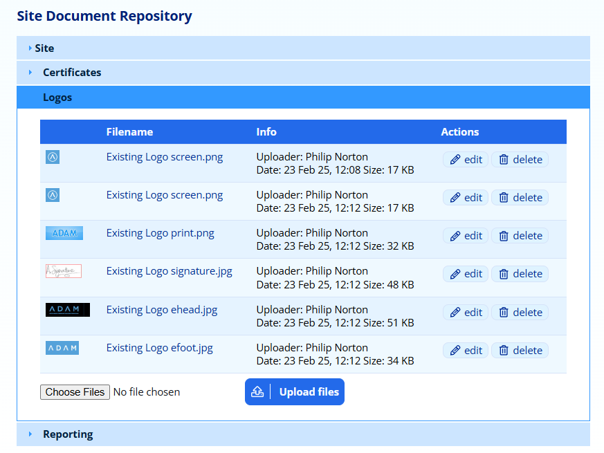
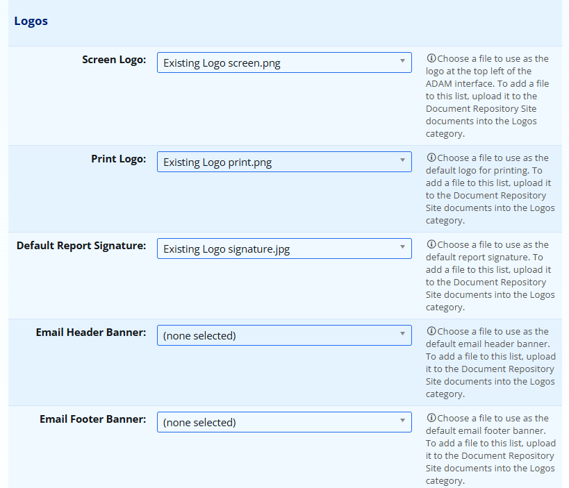

# School Logos {#h-2mn7vak}

Uploading and changing the school logo that is shown on ADAM, shown on your reports (in many, but not all instances) and uploading banner and footer images for your email communications, is done via a two step process.

## Uploading Images to the Document Repository {#h-fsgefwtc6f4p}

Any logos should be uploaded to the Site Document Repository, into the Logos category. Navigate to **Administration → Document Repository → View the Site Document Repository.**

In the **Logos** category, upload your new school logo.

Click on the **Choose Files** button, find the file you want to upload and then click on the **Upload files** button.

We recommend PNG format for onscreen and print logos. PNG format also allows for transparent backgrounds.

*Please also be aware of the size of the image you upload. The image should not be taller than 250 pixels. If you upload a very large image, it may cause performance issues since it will take a long time to download. This may be especially noticeable on mobile devices which may not have a quick internet connection.*

## Choose the Correct Logo to be Displayed {#h-mmiu8zg5scb8}

Once uploaded, navigate to the Site Settings: **Administration → Site Administration → Edit the Site Settings**. On the **General** tab, scroll down to the **Logos** section. Using the drop-downs, choose the logo that you would like to use for each one.

If you would rather not have a logo, leave the selection as “(none selected)”.

Remember to click on the **Save settings** button at the bottom of the page.
