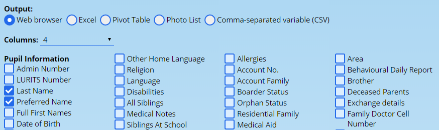
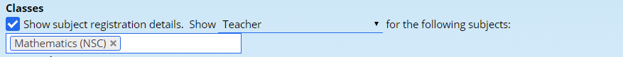
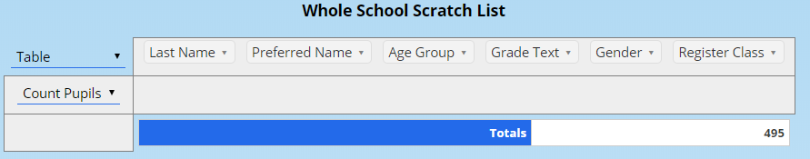
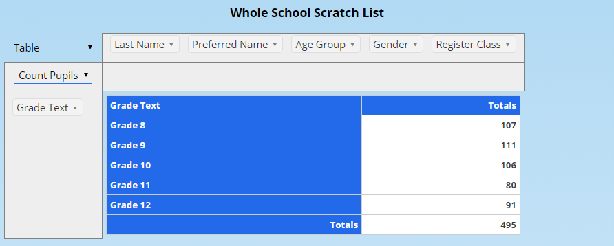
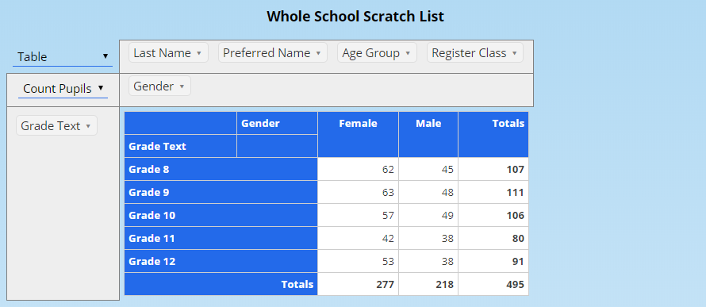
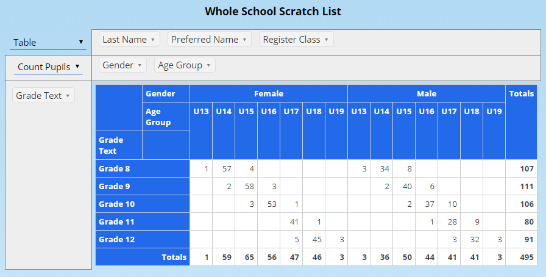
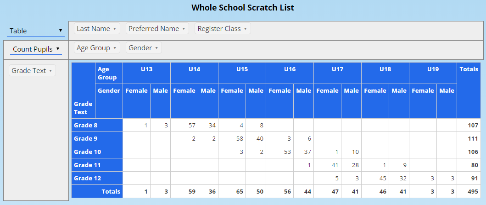
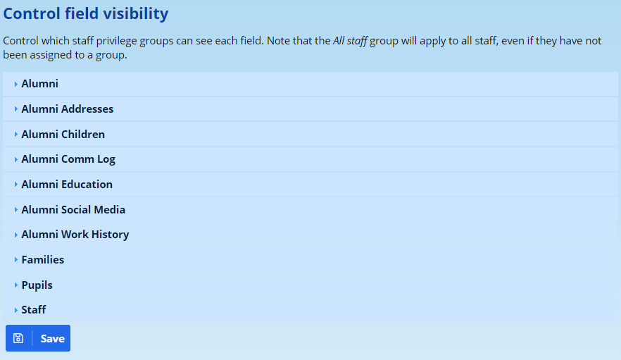
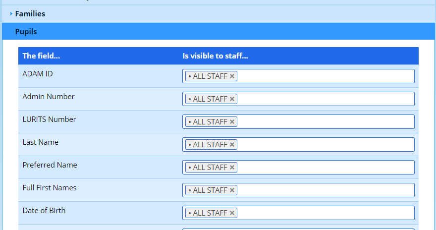
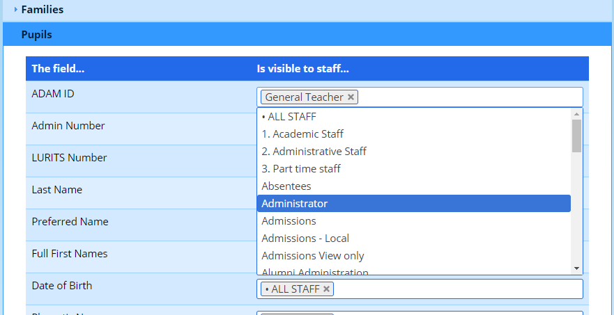

# Scratch Lists

A “scratch list” is often referred to as simply a class list. However, they go beyond just class lists in that you can produce a scratch list for a grade or even using a filter. You can choose a number of different field and output mechanisms when producing a scratch list.

## Choosing Your Data

There are a number of different ways to start off producing a scratch list, depending on what information you want and how you want the lists grouped.

### Pupil Scratch Lists

These can be produced by class, by subject, by grade, by age group, by filter or simply choosing everyone in the school.

To generate these lists, navigate to the appropriate sections:

-   Class lists:

-   The class lists of a single teacher: **Classes → Scratch Lists → A teacher’s class lists**
-   The class lists of the different classes in a subject (e.g. all the English classes): **Classes → Scratch Lists → A subject’s class lists** or **Subjects → Scratch Lists → A subjects’ class lists**. It is also possible to produce *all* the academic (or “Sport”, or “General” -- any subject category) class lists by using the option on **Subjects → Scratch Lists → A subject category’s class lists**
-   The eldest children (in the school) by class: **Classes → Scratch Lists → Eldest children by class**
-   Historical class lists (only by subject): **Classes → Scratch Lists → Historical class lists**

-   Subject Lists:

-   All the class lists of a single subject (e.g. all the English classes): **Classes → Scratch Lists → A subjects’ class lists** or **Subjects → Scratch Lists → A subjects’ class lists**
-   All the pupils registered for a subject in a grade (e.g. All of the Grade 11 Mathematics pupils): **Subjects → Scratch Lists → A subject’s list by grade.**

-   Grade lists:

-   The pupils in one (or more) grades: **Grades → Scratch Lists → Grade List**

-   Whole school lists:

-   A whole school list: **Pupils → Lists and Labels → Scratch list (whole school)**
-   An historic school list: **Pupils → Lists and Labels → Scratch list (whole school, historic)**
-   A list using filters: **Pupils → Lists and Labels → Scratch list using filters**
-   A list of birthdays in the school (grouped by month): **Pupils → Lists and Labels → Birthday scratch list**

-   Age Group Lists:

-   **Pupils → Scratch Lists → Age Group List** *or* **Grades → Scratch Lists → Age group lists**

-   Random Lists (e.g. for prizes, or random testing):

-   **Pupils → Scratch Lists → Generate random names list** (this is the first step, once generated, you can view the list of names using the option **View previously generated random names list**).

-   Admissions Lists:

-   View a list of pupils by registration status: **Pupils → Scratch Lists → View Registration Status scratch List**
-   View Admissions pupils for a particular year, and grade:  **Admissions → Lists and Labels → Admissions scratch lists**

-   Alumni:

-   View a list of all the pupils who graduated in a particular year:  **Alumni → Lists and Labels → Alumni scratch lists**
-   View a list of all the pupils who *left* in a particular year: **Alumni → Lists and Labels → Leavers’ scratch lists**

### Staff Scratch Lists

Staff scratch lists can only be produced in one way (compared to the many available ways mentioned above for pupils). The lists are found at **Staff → Lists and Labels → View staff scratch list**.

### Family Scratch Lists

It is also possible to produce scratch lists with families as the primary area of focus at **Families → Lists and Labels → Family scratch list by Grade**.

This is essentially no different from the pupil grade list mentioned above, except that families are listed first and in order of family surname.

## Choosing the List Options

Each scratch lists will have a slightly different path from the options you choose above. This manual will not attempt to describe them all! However, once you have made the choices for which subject, teacher, class, grade and so on, there are some standard options that you will be faced with at the end which bear some discussion. The options might change for pupils, alumni, families and staff, but the principles will remain the same.

Below the button which would otherwise produce and display the scratch lists to you, there are several options that you can customise.

### Output:

ADAM allows you 5 different ways to display your data. These are:

-   **Web browser:** This is the most common option and is selected by default. The lists will be generated in a new window and can be printed directly from your web browser. If there are multiple lists (e.g. more than one class), then each list will automatically start on a new pag when printed, even though it might look as if they are running into each other on the screen.
-   **Excel:** ADAM will create an Excel spreadsheet of your class lists for you to download. You can then manipulate these as you require. If you have selected multiple lists (e.g. more than one class), then each class will appear on its own worksheet or tab in the spreadsheet.
-   **Pivot Tables:** Pivot Tables are excellent mechanisms to summarise your data. If you are more interested in “how many” rather than “who”, consider a pivot table. Note that if you choose a pivor table, only the first list you choose is considered. [We discuss the pivot tables in more detail later on.](#pivot-tables)
-   **Photo List:** This will include a photograph of each pupil in your list. If you include multiple classes or lists, each will start on a new page when you print them.
-   **Comma-separated Variable (CSV)**: This is the least commonly used output format as most people prefer dealing with the data in Excel format. Users who require CSV output are likely to know why and what they will do with it. It’s normally a safe assumption that most users will never choose this option.

### Columns:

In the Web browser and Excel output modes, you can choose for ADAM to include a number of blank columns. These can be used to record marks, ticks and so on (in fact, this “scratching” is why the lists are called what they are). If you don’t want any blank columns, you can change this to “No extra columns”. You can have a maximum of 20 columns. If you require more, you will have to take your list into Excel for manipulation there.

### Field Information:

In the screen shot above, you will notice that there is the heading **Pupil Information**. Some of the fields are ticked and will be ticked when you first get to this screen. If you need any additional information to appear on your list, you can simply tick the field.

If you are using the pivot table, [discussed later](#pivot-tables), then you should choose the different fields that you want to summarise your information by.

### Class Registration Information:

Additionally, if you select a list of pupils that involves currently registered pupils (i.e. not admissions lists or alumni), then there are additional options right at the bottom of the screen:

For some schools, this is turned on by default, for others it isn’t. In the image above, the option is not ticked and therefore is not turned on.

Here you can choose whether ADAM should show information about subject registrations for the pupils in the list. For example, you chould choose to show a list of pupils with their Mathematics teachers by:

-   Tick the box on the left (“show subjct registration details”), if it is not already ticked
-   Change the “Class Description” to “Teacher”
-   Remove the default selected class in the list and choose “Mathematics”

Your final set of options should look like this:

Other common uses are to see which second languages a pupil is registered for. We could change the settings to include both Afrikaans and IsiZulu:

Where a pupil is registered for one of the subjects (say “Afrikaans”) their class details (we’ve chosen “Class Description” above) will appear in the “Afrikaans” column. The Zulu column for that pupil would be empty. The opposite would be true for pupils who take Zulu and not Afrikaans.

This is often used when printing lists for Cycle tests where these tests are written in a registration class venue. The testing teacher would produce scratch lists for each Register Teacher (using the option “**Classes → Scratch Lists → A subject’s scratch lists**” and choose “General / Registration Class” as the subject. In the scratch list options, they would choose to show the registration details of **their** specific subjects. This allows the registration class teacher to see which pupils should be writing that cycle test.

## Pivot Tables

In order to work through the pivot tables, we will make use of an example to illustrate the functionality. We need to know the number of learners in each grade, broken up be age and gender.

-   Because we are looking to summarise information across the whole school, let’s start with a Whole School Scratch List: **Pupils → Scratch Lists → Whole School Scratch List**.
-   Choose the **Output** for the scratch list to be **Pivot Table**.
-   In the field options, choose the fields that we want to summarise by: tick the boxes for Age Group, Gender and Grade Text (there are other fields that show similar information - we would not choose “Age” for example, because that includes the pupils’ age in years and days which is too details for our analysis).
-   Click on the **Show List** button.

ADAM will show the following on your screen (obviously your numbers will be different!):

Notice that the fields we’ve selected are displayed along the top of the table. If you select many of them, they may appear down the left column.

We tell the pivot table how to summarise our data by dragging these field names into either the header space (the empty space to the right of “Count Pupils”) or the row space (the empty space below “Count Pupils”).

For example, if I drag the “Grade Text” field into the row space, ADAM will summarise the information by Grade, adding each grade on a different row:

Now, lets break up each grade into Male and Female columns by dragging the “Gender” field into the column space:

If we drag “Age Group” down into the column space, next to Gender, note what happens:

You can change the order of the fields within either the column space or the row space. Note what happens if the “Age Group” field is dragged to before “Gender”:

It’s the same information, but just arranged slightly differently. See now that instead of each age group appearing beneath each gender, we now have each gender appearing below each age group.

## Controlling Access to Scratch List Fields

The Scratch List fields are used widley across ADAM to show information about pupils, staff and families. However, it may be desirable to limit the information that specific teachers can see, specifically in light of the POPI Act. ADAM Allows you to restrict the fields that the groups of teachers can see. These changes will impact both the scratch lists that are generated and other areas in ADAM where the values are shown.

<iframe src="https://www.youtube.com/embed/Aup59n6XZhM" frameborder="0" allow="accelerometer; autoplay; encrypted-media; gyroscope; picture-in-picture" allowfullscreen></iframe>

*Note carefully that people who have the privileges to add and edit pupils, families or staff will always be able to see all the information on the respective editing screens. However, they may still be restricted from creating scratch lists with that information.*

Navigate to **Administration → Database Administration → Manage scratch list field privileges**.

A list of data types will appear. Click on one of the headings to expose the fields that exist under each heading:

Next to each field, you can choose the groups that are able to see each group. You can select one or more groups for each field.

It is not necessary to select any other groups if you choose “ALL STAFF” as one of the groups.

Once you have finished customising the groups that can see each field, click on the **Save** button at the bottom of the screen.

An immediate consequence of this is that the scratch list fields will update to only show the fields that have been selected.
