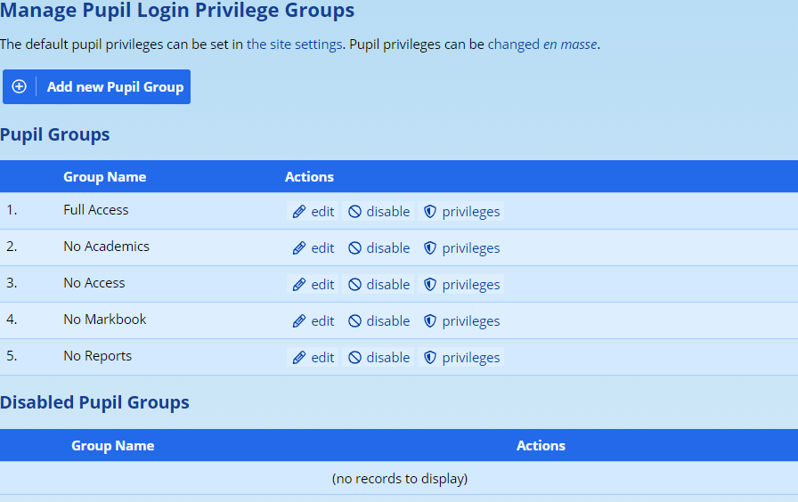
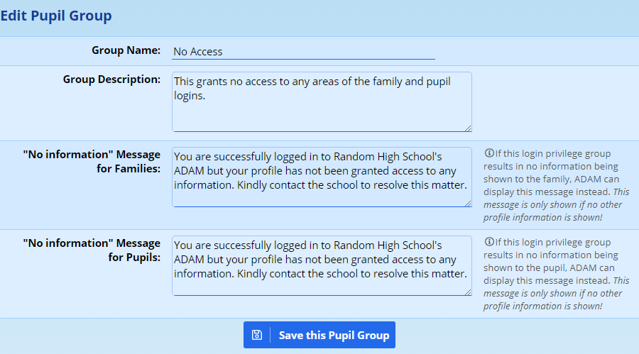
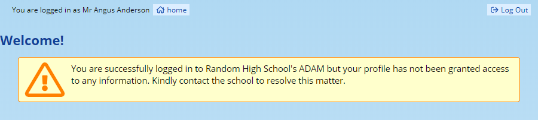
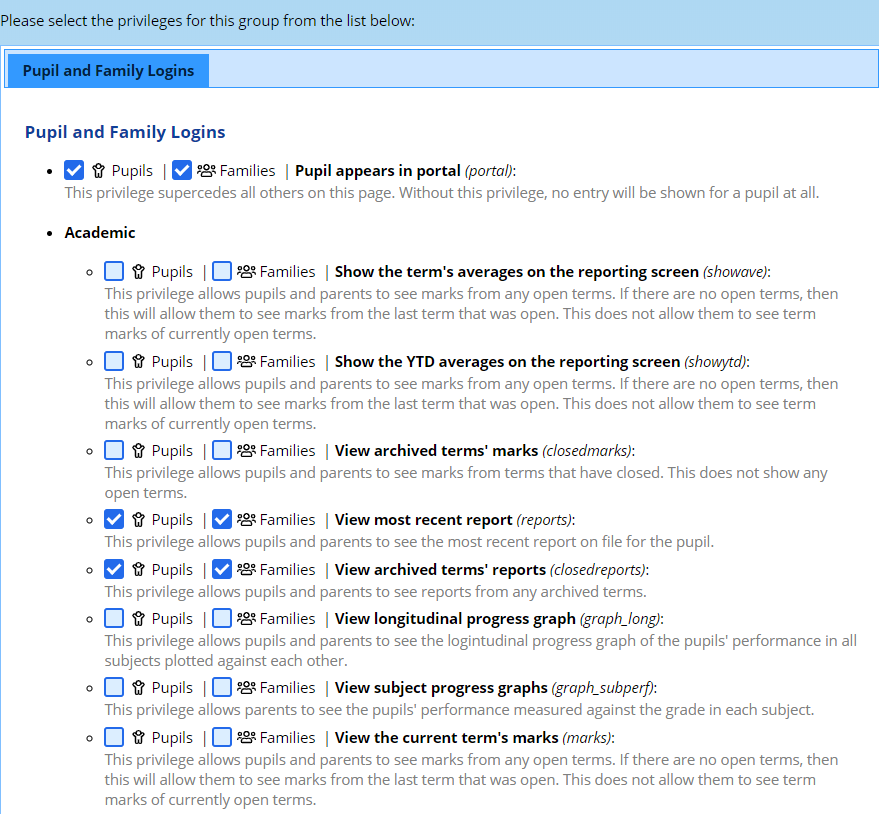
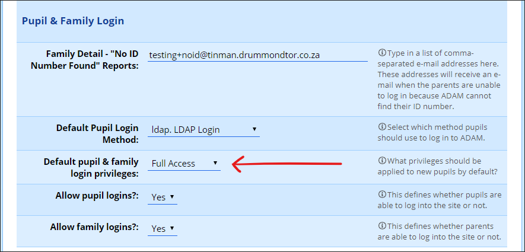
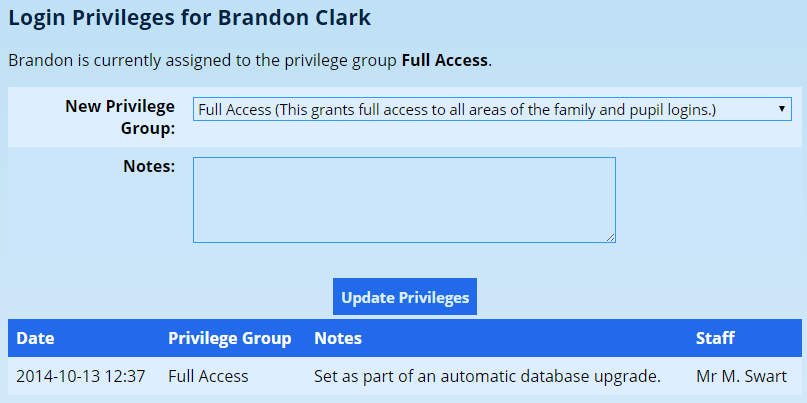
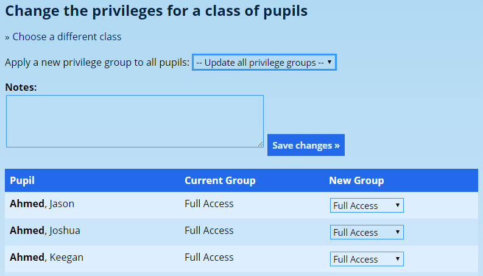

# Security Administration for Families and Pupils {#h-mg1sc7iv8w2n}

While the heading of this section refers to “Families and Pupils”, in fact, it is *only pupils* that are assigned login privileges. The privileges are then assigned to them or their parents. Thus an important point to note at the start is that it is not possible to set up different access for different parents of the same pupil. That means that if one parent can see the pupil’s profile, all the pupil’s other parents will see the same information for that pupil. This is also true for pupils linked to multiple families.

## Login Group Principles {#h-ag51jwa9tmdj}

Unlike [staff privileges](security-administration-for-staff.md#h-3ls5o66), pupils can only belong to one security group. This can be changed individually, per pupil, or can be set for a whole class. Note that giving staff privileges to change privileges for a whole class should be cautioned against since they might inadvertently override a privilege group for an individual that they might not be aware of.

## Managing Login Groups {#h-jikjh4kunfbk}

Navigate to the **Pupils** tab, and under the **Security** heading is an option to **Manage privilege groups**. Clicking on this link, brings up a list of security groups:

Next to each group is an option to **edit**, **disable** or manage the **privileges** of the specific groups. At the top of the table is an option to add a new login group.

If a pupil is a member of a disabled group, even though their login will be successful, they will not see anything when they login to ADAM.

### Adding or Editing a Login Group {#h-gneg2m92w2o1}

The information required to add a new group is very simple.

Simply provide a **group name** and, if you wish, an optional **group description** for the group. The description is not used anywhere, but may serve as a reminder to you or another administrator of the purpose of the new group. The group name is used to refer to this group in other places in ADAM, so it is important that it is clear and conveys its meaning well.

Two **“No information”** message boxes are also shown. These messages are shown on the login screen to a user who does not have permission to see any information on their login, an example shown below:

If you are creating a privilege group that is meant to give access to a parent or pupil, then ADAM will ignore these messages entirely as soon as one of the privileges gives permission to a parent. These messages are only displayed to a parent if no privileges are granted to the pupil.

If the group is meant to block access, then this message can provide context. It would therefore be possible to have different groups for different reasons. If a parent hasn’t paid the school fees, one could assign them to a group specifically to address that issue, as opposed to a pupil who has perhaps been suspended due to disciplinary issues.

*Please note that if a family has multiple pupils and each has no access but from groups that have different messages, each message will be concatenated together (although no duplicate messages will be shown). Additionally, these messages will only be shown if NO pupil or family information is permitted to be shown in the profile. Where a family has multiple children and one has access but others don’t, these messages will* not *be displayed.*

Once done, click on **Save this Pupil Group**.

### Managing Privileges {#h-elrz8ead6nwq}

If you click on the option to manage a group’s **privileges**, you will see a list of available pupil privileges, including any options that might be already selected for the group. Most options include a description of what they allow, but there are a few issues to note.

Most options in the list will have separate tick boxes for “Pupils” and “Families”. There are some exceptions to this, however, where this distinction doesn’t make sense. For example, it is never possible for a pupil to see into their parents’ document repositories or see records of communications sent to parents.

The **first option is the most important** since it governs whether the pupil’s record will show in the portal or not. Everything else can be ticked (all “Pupil” and all “Family” options in the lists that follow), but the pupil will simply not appear. An example of how this might be used: in a prep school, families are allowed to see some information, but there is no reason for a prep school pupil to log in. Thus the “Pupil” option at the top would remain unticked. This means that even if they did log in, ADAM would show an error message explaining that no information is allowed to be shown.

## Assigning pupils to login groups {#h-w7nsqkb3n95f}

When a pupil is first added to the database, their account is preemptively assigned to the default privilege group as configured in Site Settings. This can be changed but be aware that this setting will only impact pupils who are added to the database *after* the change is made.

### Changing the default group {#h-pnbel36i6psu}

Navigate to **Administration → Site Administration → Edit the site settings**. On the **Security** tab of the settings, scroll down to the heading **Pupil & Family Login** and change the setting **Default pupil & family login privileges** to reflect the appropriate group. Any [additional groups](#h-gneg2m92w2o1) that have been added to ADAM will also show.

Save the settings once you’re done.

If you wish to change privilege groups for pupils who may already be on the system, this can either be done individually or by class. Both are discussed below.

### Assigning pupils to groups individually {#h-h7str6wctvvh}

Navigate to the pupil’s information page and click on the “Login Privileges” section. You will see the current privilege group that has been assigned to the pupil, an option to assign a new group and, below that, a history of the pupil’s privilege changes:

To assign a new group to the pupil, simply select it from the dropdown list at the top of the page, enter a note if required, and click on the “Update Privileges” button.

### Assigning pupils to groups by class {#h-dhbrfm3k0p0c}

From the **Pupil** tab, look under the **Security** heading and click on the option **Change pupil login privileges for a class**.

Choose the class of pupils whose privileges you would like to change.

In the list that is shown, you will see the pupils’ current privilege group as well as a potential new privilege group that will be applied when you click on the **Save changes** button. If the “Current Group” column is blank, it is because the pupils have not yet been assigned a privilege group.

You can either go and change individual pupils or use the option at the top to update all pupils to a new privilege group. You can add a note, if required.

Once completed, click on the **Save changes** button.
