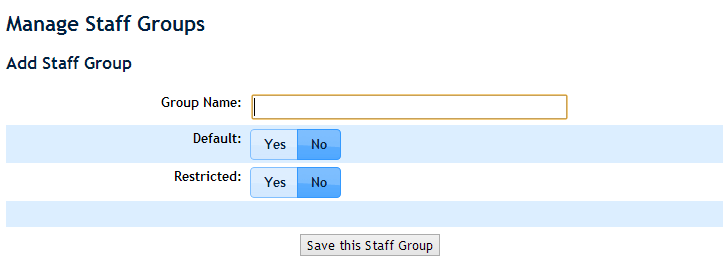
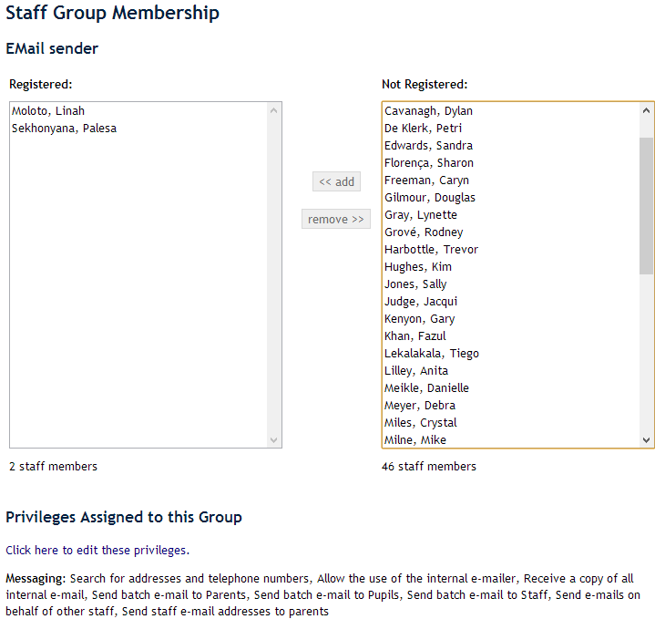
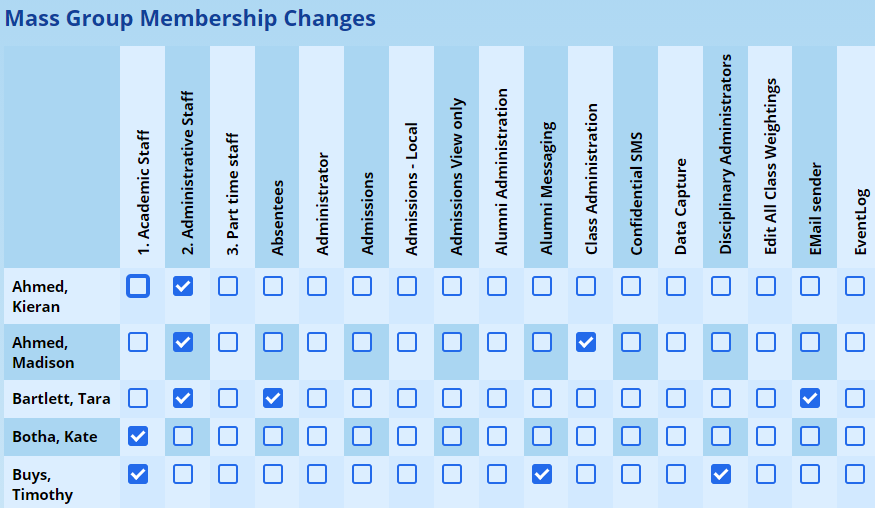
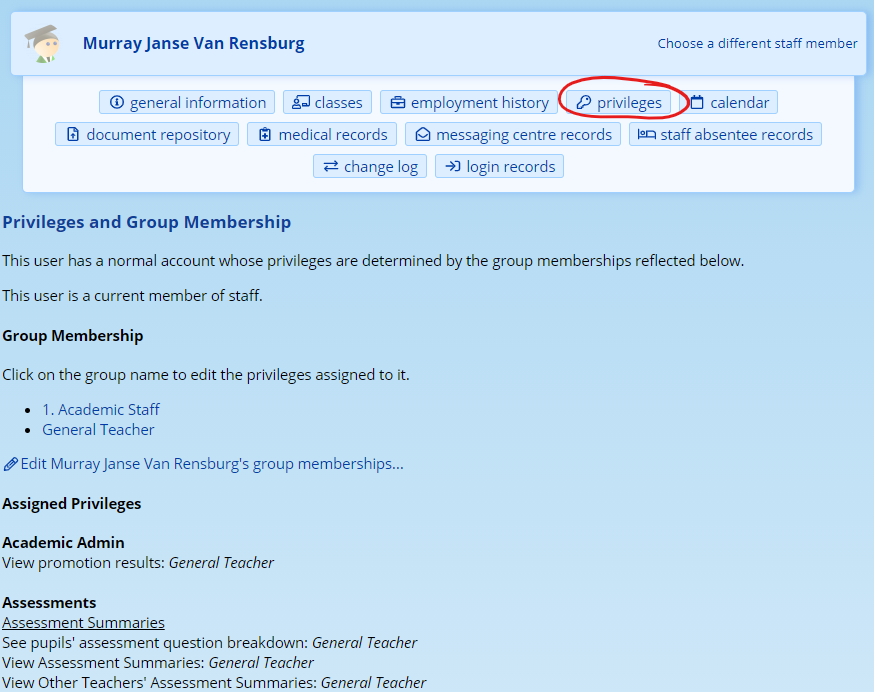
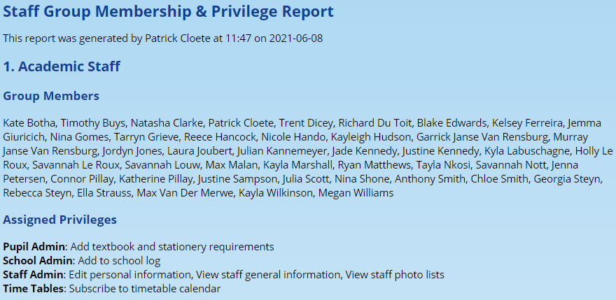

# Security Administration for Staff

## Security Principles

ADAM has a two-tiered privilege system for staff.

1.  Site Administrative Users
2.  Normal Users

### Site Administrator sers

Within the site administrative users, two types exist: these are effectively hidden and visible users. Hidden users are administrative users who are not (generally speaking) employees of the school. This might include a generic “admin” user, for example. The visible admin users are normally also teachers at the school.

**The site administrator has, automatically, access to every feature and function in ADAM. It is not possible to block any features from an administrative user and thus this privilege should be granted with great care.**

Administrative users can only be created by written request to the ADAM support staff. Requests should be made by the school principal or an authorised staff member. Please allow 2 working days for such privilege changes.

### Normal users

Normal users, on the other hand, have no automatic access to the system and privileges must be assigned to them. To save administrative overhead, some of these privileges are assigned automatically, and others must be assigned manually.

Privileges are never assigned directly to a user. Instead, privileges are assigned to a security group and then users are either added or removed from groups. A group can have many privileges assigned to it, and a staff member can be assigned to many groups.

!!! warning
    Parents and Pupils use a separate authentication system and so there is no chance that parents will be able to get access to information that has not specifically been approved for parent access.

## Security Group Principles

### Additive Privileges

Privileges in ADAM are “additive”.

If a user belongs to a group that grants a specific privilege, it cannot be taken away by the fact that a user also belongs to another group. It is not possible to specifically deny or remove a privilege from a user based on their group membership.

To remove a privilege from a user, they must be removed from the group (or groups) that assign them those privileges.

### Default Privileges

Security groups can be set as “default” groups. Any new users that are added automatically become members of groups that are set as “default”. One default group will exist on any new installation of ADAM called “General Teacher”. This assigns normal privileges to staff.

You may wish to revise the privileges that this group is assigned.

## Managing Security Groups

Security Groups can be managed from the “**Administration”** tab by clicking, under the “**Staff Groups”** heading, on the “**Manage staff groups”** option.

### Adding a new Staff Group

At the top of the page is a link to “Add new Staff Group”.

The following screen should appear:

The group name can be anything you like. Enter something that will tell you about what privileges the group assigns. This will help you later when you determine which groups you need to add a staff member to.

!!! warning
    We recommend using a description of the “role” that privilege groups will provide users. For example, instead of creating a privilege group that describes a “person” (e.g. not “Jane’s Privileges”, nor “secretary privileges”) rather create a group that link to specific function such as “SMS Sender” or “Report Editing”.

*Remember that people can belong to as many groups as you like.*

The option for **“default”** is to say whether you want all new users to automatically become a member of this group. Note that setting a group to “Default” will *only* affect new users and any existing users will *not* be a member of this group until they are manually added.

The option for **“Restricted”** has to do with who can assign people to this group. As a good rule, if the group is going to be used for privilege assignment (as opposed to creating a group to use for easy messaging and list printing of specific staff), then it should be set as a restricted group.

Privilege groups can be assigned as **“Secondary Privilege”** groups. This allows these groups to be used for comments entered for pupils on the pupil profile. You can probably leave this set to “No” for most instances.

Once you’ve named your group and chosen the settings, click on the button at the bottom.

### Editing a group

Editing a group allows you to change the name and settings of the group (see above in how to add a group).

### Disable a group

If you wish to disable a security group so that it cannot be chosen as a new group and to ensure that the privileges that it assigns are ignored, simply click on the “**disable**” link next to the group. The group will move out of the top list into a list below with the heading “Disabled Staff Groups”. You can re-enable the group by clicking on the “enable” link.

!!! warning
    Note that disabling a group does not affect the membership of the group. If you re-enable a disabled group, the original members will regain the privileges that are associated with that group.

### Changing the Privileges of a Group

Navigate to the “[Manage Staff Groups](#managing-security-groups)” page.

By clicking on the **privileges** link next to one of the groups, it is possible to change the privileges that are assigned by that group.

The privileges are separated on to different tabs and under different headings. Ticking a privilege will link it to the group and, of course, to any users that are members of the group.

Descriptions of each privilege are given next to the privilege. If you require more assistance with privileges, please contact [help@adam.co.za](mailto:help@adam.co.za) for more information about your specific query.

### Changing Membership of a Group

By clicking on the **membership** option next to each group, you will be presented with a screen similar to this:

Each of the existing members of the group are listed on the left (there are two in the diagram opposite) and those who are not in the group are listed on the right.

To add members to the group, select their names from the list on the right and choose the “**<< add**” option. Their names should then move from the right to the left.

To remove, members, select their names from the list on the left and choose the “**remove >>**” option. Their names should move from the left to the right.

!!! warning
    Remember that you can highlight multiple names by holding down “Ctrl” on your keyboard while you click on the names.

### Editing Group Memberships in bulk

To see which staff members are members of the groups, it can be useful to see this in a single report. This report is possibly easier to deal with when copied and pasted into a spreadsheet which will allow for more custom formatting to make the report easier to read.

Navigate to **Administration → Staff Groups → Edit group membership en masse**.

This screen will show all the security groups along the top of the screen, and all the staff members going down. Make any changes and click on **Save** at the bottom of the screen.

## Auditing Staff Privileges

ADAM provides a few techniques for staff to have their privileges audited and checked. Because the privileges are assigned to groups, it is important to understand that staff members get privileges by virtue of the groups that they belong to in ADAM. If a privilege is added or removed from a group, it will affect all the members of that group.

Remember that site administrators do not get their privileges via the Staff Group mechanism. A site administrator is allowed to perform any action in ADAM regardless of what their privileges indicate they should be able to do. Please [read more about Site Administrators above](#site-administrator-sers).

### Individual Privilege Audits

To investigate the privileges of a staff member, navigate to the staff information page: **Staff → Staff Administration → Staff Info**. Search for the staff member you want, and visit the **privileges** section:

With the user above, we can see that they are a “normal account” (i.e. not a site administrator) who belongs to two groups, including the “General Teacher” group.

An option is provided to **[Edit the group memberships](#changing-membership-of-a-group)** for this teacher.

At the bottom is a list of privileges that are available to the teacher because of this. Next to each privilege, in *italics* is the name of the group, or groups, that have assigned the privilege concerned to the staff member. To remove a privilege from a staff member, then either they need to be removed from the group that is assigning that privilege, or the [privilege needs to be removed from the group](#changing-the-privileges-of-a-group).

### Auditing Group Membership in bulk

To view the group memberships on a single screen, navigate to **Administration → Staff Groups → View group membership matrix**.

Here, a readonly view of the [mass editing screen](#editing-group-memberships-in-bulk) is shown.

It may be easier to deal with this report in a spreadsheet. You can copy and paste it there.

### Auditing Group Privileges in bulk

To view all the privileges that are assigned to all the groups in a table, navigate to **Administration → Security Administration → View group privilege matrix**.

It may be easier to deal with this report in a spreadsheet. You can copy and paste it there.

### A Summary view of membership and privileges

For an easier-to-read report, although perhaps more difficult to cross-check, can be found at **Adminstration → Security Administration → View group privilege report**. This report shows all the members of each group and all the privileges assigned to each.

