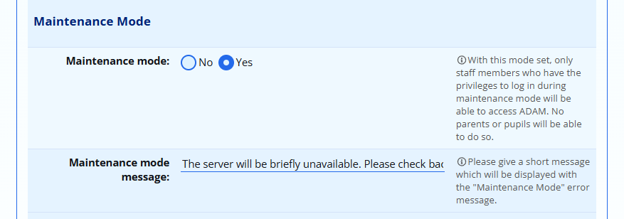
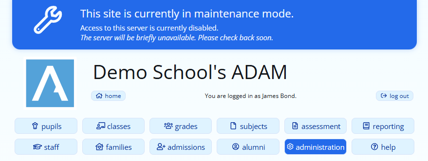
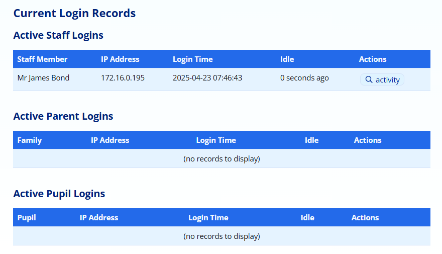
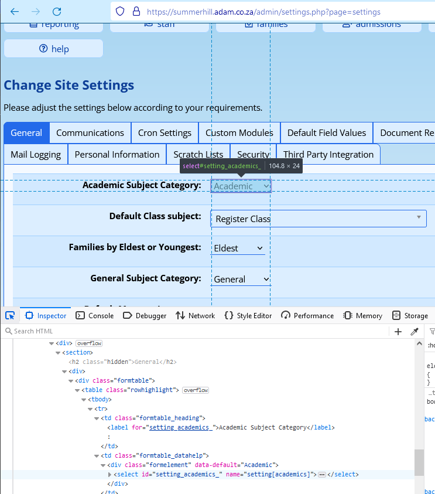

# Server Setup and Configuration {#h-unpopmkkkk2z}

If you host your ADAM server on our cloud platform, you probably won’t need to worry about this section. However, if you’re hosting ADAM locally on your own server, it may be necessary to change some of the settings.

## Maintenance Mode {#h-e2rl9x6lrmbb}

ADAM has a “Maintenance Mode” which will prevent most users from logging into the system. This can be useful for times where you need to undertake maintenance on your ADAM server, or even just restrict access to the server temporarily.

### Enabling and Disabling Maintenance Mode {#h-bjjmegmzbdie}

Navigate to the Site Settings (**Administration → Site Administration → Edit Site Settings**). On the **General** tab, scroll down to find the **Maintenance Mode** heading.

Enable or disable Maintenance Mode by changing the setting to “Yes” to enable Maintenance Mode, or “No” to disable Maintenance Mode.

The **Maintenance Mode Message** can be customised to give users a better understanding of why ADAM is in maintenance mode and perhaps when you expect to be finished.

Once done, click on the **Save Settings** button that appears at the bottom of the screen.

When Maintenance Mode is enabled, a banner will appear across the top of the screen:

*Note that Maintenance Mode will only prevent new users logging in, but will not automatically log out old users.*

Before any significant work is undertaken, you are advised to consult the list of logged in users to determine whether any specific users may be busy with critical work.

The list of logged in users can be obtained from **Administration → Login Records → View logged in users**.

This will show a list of all staff, families and pupils who are currently logged into ADAM. Next to each, appears an **activity** icon which allows you to get an approximate idea of what they are busy with.

### Allowing Certain Users Access While in Maintenance Mode {#h-i8y0wjjvtv4q}

Some schools use Maintenance Mode to prevent access to the server at short notice. However, there might be reasons for specific staff members to have access to ADAM while most other users are not permitted to log in. While logins are blocked for most users while the server is in Maintenance Mode, ADAM does have a privilege that can be assigned to a group of users that will allow that group to log in while the server is in Maintenance Mode.

This permission should be given sparingly, since if too many people have it, it may negate the entire point of Maintenance Mode which is to restrict access to ADAM.

The privilege is found on the **Site Admin** tab of the staff privileges, is called “**Log in while in Maintenance Mode**”.

Note that Site Administrators will always be able to log in, even when the server is in Maintenance Mode.

## Setting up an ADAM server {#h-8q4x8u2gss8q}

Maintaining your own ADAM server will require some expertise in managing, maintaining and configuring a Linux operating system from yhe command line. The skills required to manage the server include:

-   Installing the Linux operating system
-   Familiarity with managing a Linux server from a command line interface
-   Installation and updating of server applications
-   Configuring the network firewall to allow secure access to the ADAM server from outside the network. This also invludes being capable of modifying the server configuration accordingly

For proper functioning and access to all its features, ADAM requires the following:

-   Access to HTTP 80 and HTTPS 443 ports from outside your netowrk to allow staff and parents to avvess ADAM from home.
-   Access to SSH from outside your network so ADAM can be updated with bug fixes and patches.
-   These two requirements above necessitate reliable internet access with a fixed external IP address. A firewall capable of managing these requirements is therefore a necessity.

Where schools opt to manage their own servers, all server support options will be excluded from the Service level Agreement and any work required to manage your server will be charged for on an ad hoc basis.

We require that you run ADAM on an Ubuntu Server operating system, with Ubuntu 24.04 LTS being the current recommended version. This server should be used only for ADAM and no other software. We cannot guarantee that other software will conflict with ADAM if running on the same server.

-   Apache: 2.4
-   PHP: 8.2

-   PHP 8.4 will be a requirement for new servers from July 2025.

-   MySQL: 8.0

In order for the server to receive updates, we require that the server is accessible from the greater internet via SSH. As part of the server setup in the initial stages of onboarding your school with ADAM, we will assist you in configuring the server to only allow certificate-based authentication.

## Editing the configuration file {#h-x27qf2tjfh9}

*Please don’t edit the configuration file unless you are confident in what you are doing.*

The configuration file is found in the ADAM source folder.

The following minimum settings are required:

-   db\_user: this is the username that ADAM will use to authenticate to the MySQL server.
-   db\_pass: this is the password that ADAM will use to authenticate to the MySQL server. If your password contains non-alphanumeric characters, you are advised to enclose the password in “double quotes”.
-   db\_host: this is the IP address or hostname of the MySQL server. In almost all instances, this will be 127.0.0.1, or localhost.
-   db\_name: this is the name of the MySQL database that ADAM will store your school’s data in.
-   url: this is the URL from which your ADAM server will be accessed. Note carefully that this must be an HTTPS URL and be aware that it must be the same externally and internally from your LAN in order for the HTTPS certificate protection to work.

Any of the site settings can be overridden in the configuration file. This prevents an errant user from being able to change that setting either maliciously or accidentally.

To override a setting, you will need to know its setting code. This can be found with some HTML DOM inspection in your favourite web browser. In popular browsers such as Chrome and Firefox, this can be done by pressing “Ctrl + Shift + C” on your keyboard. This will open the Developer Tools panel. Move your mouse over, and click on, the field where the value is:

In the example above, the “Academic Subject Category” control has been selected. Note in the white panel at the bottom, the highlighted line which contains the text:

name="setting\[academics\]"

This is the part of relevance for us. In your configuration file, you could then write (taking note that the category ID for Academic subjects is 1):

settings\[academics\] = 1

For example. Note, please, the plural “settings” is required in the configuration file even though the name attribute makes use of the singular “setting”.
