# Sign-up Module {#h-3qwpj7n}

The Sign-up module is designed to allow staff, pupils and parents the ability to sign up for lists, events and appointments. The sign-up module has the following data structure:

-   Event Category

-   Events

-   Appointments

Here is an example of how this might translate into real-life - using the same colour coding as above:

-   Support Lessons

-   Maths

-   Monday 5 Apr
-   Tuesday 6 Apr

-   Afrikaans

-   Monday 5 Apr, 14h00
-   Tuesday 6 Apr, 14h00

-   Catering Lists

-   Hot Lunches

-   Monday 5 Apr
-   Tuesday 6 Apr

-   Clubs and Societies

-   Term 1, 2015

-   Agricultural
-   Bridge
-   Computers

-   Sports

-   Term 1, 2015

-   Tennis: Social
-   Tennis: Team
-   Waterpolo

-   Teacher Meetings

-   Mr Smith

-   Monday 21 April, 14h00
-   Monday 21 April, 14h10

As can be seen in these examples, it is possible to have a wide variety of appointment types – some are time-dependent and others are not.

## Terminology: Event Categories vs Events vs Appointments {#h-hlg1s5yll43u}

These three terms are easily confused. ADAM and this documentation makes very specific use of them. We have used them to represent a hierarchical structure. The top level being “Event Category” and the bottom level being “Appointment”.

Every event must have an element of all three. It might seem odd that an “Event” should have “Appointments”, particularly if the event is a once-off occasion. However, in order to be consistent in our handling of the many different possibilities, this is a strange anomaly that exists. However, don’t worry: if you understand that a once-off event must have an appointment, then you are most of the way to understanding how it all fits together. ADAM will guide you through the process of adding events and appointments, with some guidance about which options to choose.

Here are some examples to illustrate the differences to you.

-   In the scenario where we are creating a signup sheet for parents to book meetings with teachers at a parent-teacher evening, the “Event Category” would be “Parent-Teacher Meetings”, each teacher would then have an “Event” within this category. The “Event” is then broken down into the 5-minute “Appointments” that are available. I.e. Parent-Teacher Meetings → Mrs Smith → 18h45 to 18h50
-   When signing up pupils for sports teams, the “Event Category” would be “Sports Teams Signups”. Each sport would be an “Event” and each “Appointment” could be a term or season. I.e. Sports Teams → Cricket → 1st Term
-   When signing up pupils who wish to attend a voluntary presentation by a visiting speaker, the “Event Category” might be “Visiting Speakers”, the “Event” might be the name of the speaker and the appointment would be the date of the presentation (this also allows there to be multiple presentations, for example). I.e. Visiting Speakers → Nelson Mandela Foundation → Tuesday 5th, 7pm.
-   In boarding schools, pupils often need to request permission to visit venues such as the library. Here, the “Event Category” might be “Evening Prep”, the “Event” might be “Library” or “Computer Lab” and the appointment would be the date of the visit. I.e. Evening Prep → Library → Thursday 14th.

## Managing Event Categories {#h-261ztfg}

On the “**Pupils”** tab, under the “**Sign Ups”** heading, click on the option to “**Manage event categories**”.

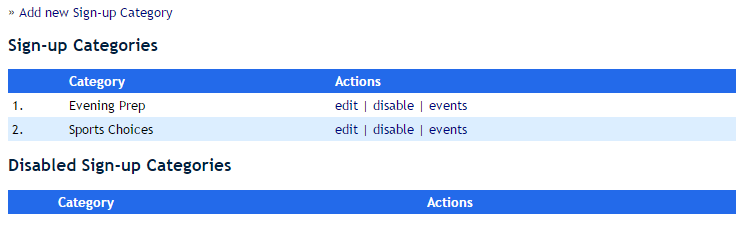

### Adding a new Signup Category {#h-l7a3n9}

At the top of the page, click on the “**Add new Sign-up Category**” link.

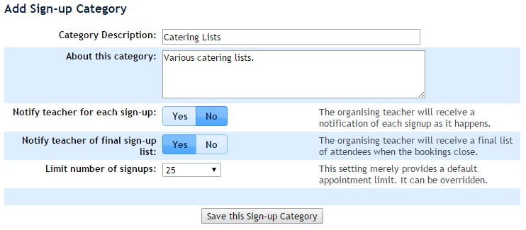

The fields have the following meanings:

-   **Category Description:** This is the name of the category and is used in the displaying and sorting of events and appointments.
-   **About this category:** This field is a note field and is not used for display purposes.
-   **Notify teacher for each sign-up:** If this option is set to “Yes”, the organising teacher will receive an email after each pupil signs up for the event. Please choose this setting carefully as a wildly popular event could cause a lot of mail to be delivered.
-   **Notify teacher of final sign-up list:** If this option is set to “Yes”, then the organising teacher will receive a list of signed-up participants when the booking time closes.
-   **Limit number of signups:** This option sets a default limit for each appointment (it is easily overridden later). This serves to prevent an activity being oversubscribed.

Click on “**Save this Sign-up Category**” to save it.

Once saved, you should be taken back to the “Sign-up Categories” list shown above. Click on the “events” option in the table next to the new category.

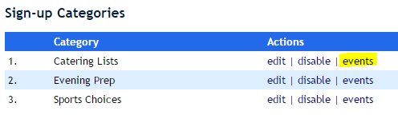

### Creating Events {#h-356xmb2}

This will display any events that have been created for this category. Because ours is still new, it shows nothing. Click on the link “**Add a new event**”.

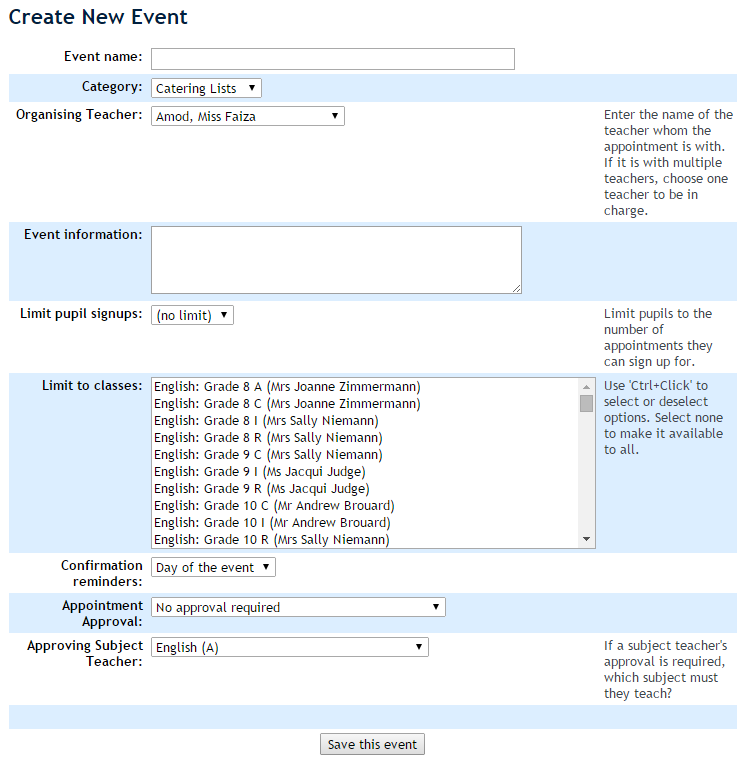

The fields on this page are explained as follows:

-   **Event Name:** Type in the name of the event. See the list on page  for examples of event names.
-   **Category:** This should already reflect the category of the event, but you can change it if you need to.
-   **Organising Teacher:** Please select the organising teacher from the list. This teacher will receive attendance lists and more from the appointments that will be scheduled later.
-   **Event Information:** The information for this event will be shown to pupils and should explain what the event is about.
-   **Limit Pupil Signups:** This will prevent pupils from signing up for too many appointments. If these are schedules for one-on-one appointments, for example, you may wish that a pupil only signs up for only one of them.

Please note that only future appointments count towards a pupil’s limit. If an appointment passes, it will no longer count towards the pupil’s limit and they may be able to sign up for further appointments. If you wish to avoid this, then all bookings should be set to close before the first appointment takes place.

-   **Limit to classes:** The event and its appointments will only be shown to pupils who are members of the selected classes. If no classes are selected, it will be available to all pupils. It may be useful, for example, when setting up appointments for pupils to see teachers to limit those appointments to appear for pupils taught by the organising teacher.
-   **Confirmation Reminders:** This can be used to send out reminders to people who signed up for appointments. *PLEASE NOTE: THIS IS NOT YET FUNCTIONAL.*
-   **Appointment Approval:** It may be possible that your appointment or sign-up requires teacher approval. If this is the case, it is possible to set either the organising teacher or another teacher that teaches the pupil, to approve the appointment.

For example, it may be necessary for the pupil’s Home Room Teacher to approve sign up to an extension activity. In this case, one would choose “Approval by another subject teacher required” and in the “**Approving Subject Teacher**” dropdown, choose the “Home Room” subject. When a pupil signed up for this event, an email would be sent to their Home Room teacher requesting their approval. The subject that is in this list is otherwise ignored.

Click on the “**Save this event**” button.

### Creating Appointment Slots {#h-1kc7wiv}

After saving a new event, you are automatically taken to this screen:

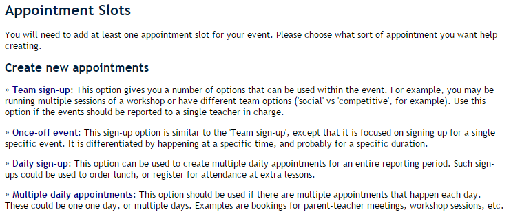

This screen allows you to choose the type of appointment you require. There are four options. Each displays slightly different information and is displayed slightly differently to the user. Use the descriptions to guide you to which appointment type would best suit your needs.

We will work through each example:

#### Team sign-up {#h-u92qdmyd64ts}

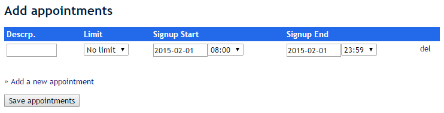

-   In this instance, the **Description** is the most important option since it will differentiate it from the other appointments.
-   The **Limit** will default to what you set in the event category. You can override it here on an appointment-by-appointment basis.
-   Please ensure to choose the signup **start** and **end** dates and times carefully. ADAM currently does not check for poorly chosen entries (such as things that close before they open). When the signup end date is reached, ADAM will automatically send the organising teacher a list of attendees.

Below the table is an option to “**Add a new appointment**”. Clicking on this will duplicate the row, including the signup start and end dates. Before you add new appointments, set the sign-up start and end times to appropriately before you add new appointments!

Use the “**del**” option on any row to remove the appointment, except that ADAM won’t let you remove the last row in the appointment table. Every event must have at least one appointment in order to be useful!

Here is an example of what a “Team sign-up” set of appointments may look like:

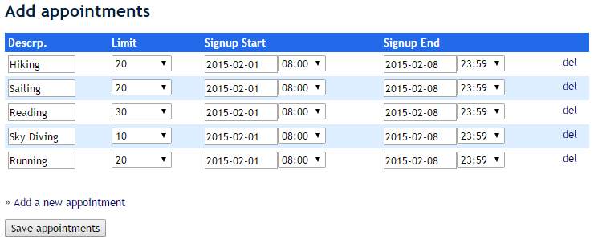

Notice that the limits on each appointment are entirely independent of each other. In this example, each activity has approximately one week to sign up for the activities, with each providing a limit to the number of spaces available for that. Only 10 people, for example, can sign up for “Sky Diving”.

#### Once-off Event {#h-qtgexcv6ukls}

This is a single event which generally has a time and date associated with it, but which happens only once. This might be attending a specific presentation or activity.

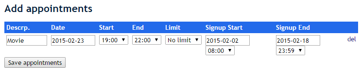

With this particular appointment type, there is no option to add a second appointment.

#### Daily Signup {#h-b3peajugzk04}

This option allows you to create similar appointments on successive days.

For this particular type of appointment, a description is not necessary since it will be possible to distinguish between the appointments based on their date. Notice that here there is only a date for the appointment and no time, since it is assumed that the time is either constant or irrelevant to the sign-up.

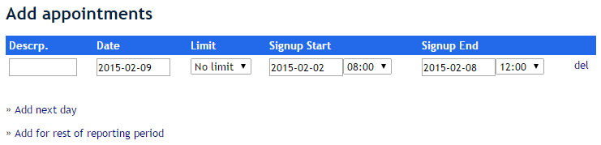

Clicking on the “Add next day” option will add a new appointment for the next *weekday* date. It will also advance the sign-up *end date* by a day also, but keep the signup start date the same. In the example below, on the second entry, ADAM kept the sign-up start date for the event the same (2 Feb), but changed the end date to a day later (9 Feb).

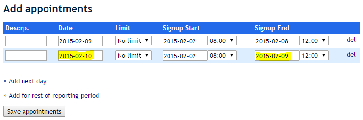

Clicking on the option for “**Add for rest of reporting period**” will again add in options for all *weekday* appointments from the last date in the form until the end of the reporting period.

If you wish to add in weekend appointments, these can be done manually at the bottom of the form. It does not matter that these might be out of order. Simply click on “Add next day” (which will add a “week day”) and then change the date of that appointment to be a weekend.

Additionally, if you wish to delete certain appointments (e.g. no Fridays), then this must also be done manually by clicking on the “**del**” option next to the rows that you don’t want. Each event must have at least one appointment, so you won’t be able to delete the last entry.

#### Multiple Daily Appointments {#h-wck7ndhd69jn}

This option allows you to set starting and finishing times for your appointment and to add in consecutive appointments based on the previously entered appointment. Here is an example of an appointment slot for pupil meetings:

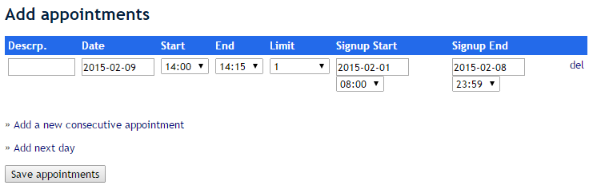

By clicking on the “**add a new consecutive appointment**” option, ADAM will create a new appointment that starts where the previous one ends and for the same duration as the previous appointment. Note that it does not affect the signup start or end time:

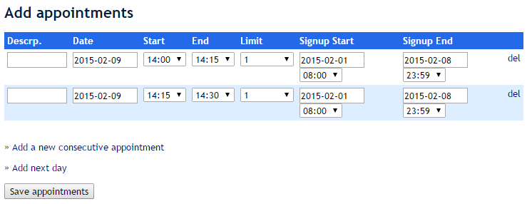

If, however, you click on the option “**Add next day**”, ADAM will add in a new appointment for the next day, but at the same time as the last appointment. The signup ending time is also changed:

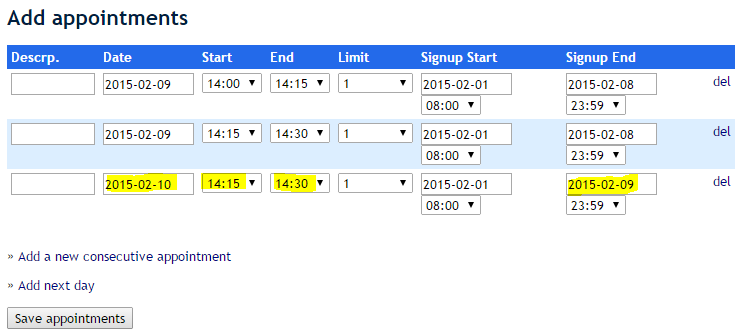

Therefore you may have to adjust the appointment time before adding in new consecutive appointments.

Once you’re happy with your appointments, click on “**Save appointments**”. Importantly, nothing is saved until you click on that button.

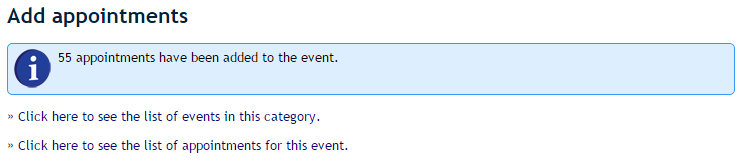

Clicking on the option “see the list of appointments for this event” will show you the list of appointments we created:

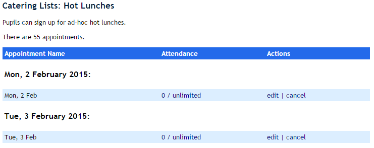

Next to each option, the number of people that are signed up for the event are shown, and the options to edit or cancel the event.

To see a list of people who are attending the event, click on the **number of attendees**.

To edit the appointment, click on the “**edit**” link. *CURRENTLY THIS DOES NOT WORK*.

To cancel the appointment, click on the “**cancel**” link. Any pupils who might already have signed up for this appointment will receive an email notifying them that the appointment has been cancelled.

## Navigating through without creating a new event {#h-44bvf6o}

We navigated through all the screens above by creating a new event. If you need to get back to any of them, use the menu items on the **“Pupils”** tab under the “**Sign Ups**” heading.

-   To see a list of events, click on “**View category events**”. From there, you will be able to view and edit events. You can also see the event appointments from that screen.
-   Alternatively, the third option “**Manage appointment slots for an event**” will also allow you to view the appointments, attendance lists and to cancel specific appointments.

## Signing Pupils Up for an Event {#h-2jh5peh}

Staff members can sign up pupils for events, and pupils can sign themselves up for events. Note that both staff and pupils will require privileges to access these sections. Information on [how to set up staff privileges](security-administration-for-staff.md#h-3ls5o66) is available, as is information on [how to assign pupil privileges](security-administration-for-families-and-pupils.md#h-mg1sc7iv8w2n).

### Individual Pupils {#h-id50ajw9wdio}

Navigate to the pupil’s profile and click on the “**Sign-Up**” link:

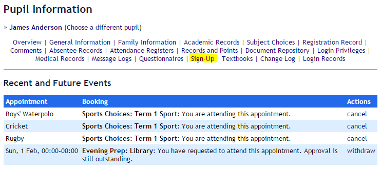

The top of the page shows any recent and upcoming events that the pupil has signed up for. Notice that for the last one, the pupil has signed up for it, but approval for the event is still pending.

Below this is a list of all sign-up events that the pupil can sign up for. Click on the “**sign up**” link next to any even to sign up.

Note that future appointments, for which bookings are not yet open, are shown, indicating when bookings will open and for how long. No sign up link is available for these.

If a pupil is already signed up for an event, they will see “**cancel**” next to the event. This will remove their names from the list.

Appointments that are full, and have no more space left, also have no option to sign up. Also note that if an event has a limit for the number of appointments that a pupil can sign up for, once they reach that limit all other appointments in that event are closed to them. If they cancel one appointment, however, they will then be able to sign up for another.

### By Class {#h-bo9ljrsvlpmu}

Navigate to the **Classes** tab and under the **Sign Ups** heading, click on the option **Sign up for an event by class**.

Choose an event category, then the event and finally the appointment. The choose the class for which you want to sign up pupils. Note that if an event has specifically had classes specified for it, then only those classes will be available in the dropdown list.

Finally, click on the **sign up** link next to a pupil’s name to sign them up for the appointment.

If there is a limit to the number of pupils that can sign up to the appointment, the **sign up** links will disappear when the limit is reached.

Also be aware that in spite of a page reporting that an event has a number of spaces available, this does not take into account other staff members who might be signing up pupils concurrently.

### On the Pupil Portal {#h-5q4rc1wmk2qu}

When pupils log in to the pupil portal, if they have been given permissions to access the sign-up module, they will click through to see all the available appointments that they can sign up for. They simply need to click on the **sign up** link next to the appointments that they wish to sign up for.
