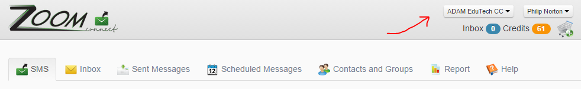
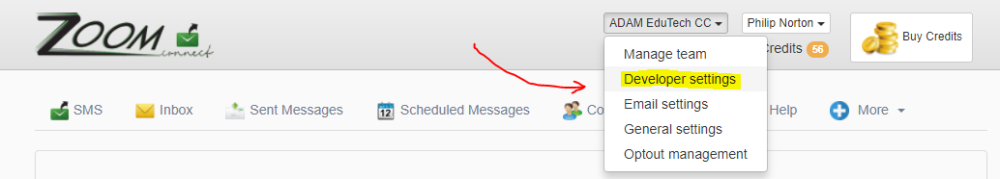
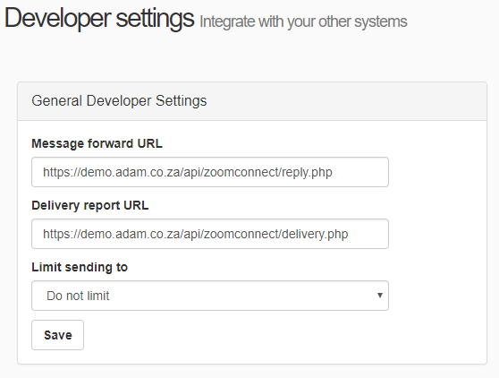
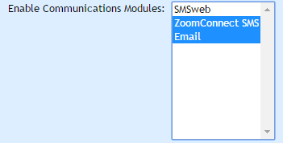
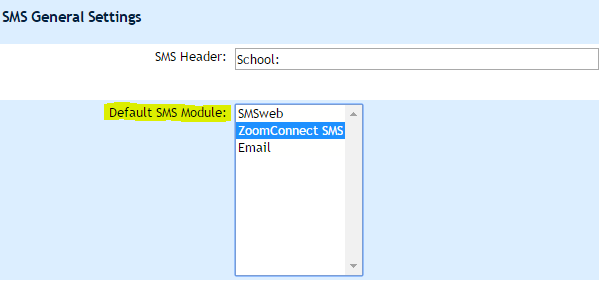
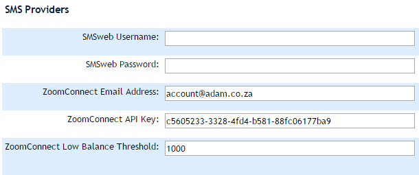
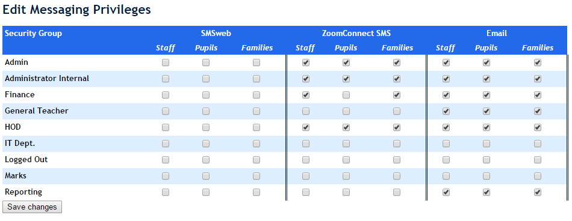
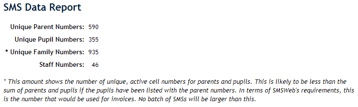

# SMS Services {#h-1pgrrkc}

ADAM uses three third party service providers to send SMS messages from the Messaging Centre. These are:

-   SMSWeb: [http://www.smsweb.co.za](https://www.google.com/url?q=http://www.smsweb.co.za&sa=D&source=editors&ust=1778246676736054&usg=AOvVaw1iUgcGfxkM-YH6iZc63kyS)
-   ZoomConnect: [http://www.zoomconnect.com](https://www.google.com/url?q=http://www.zoomconnect.com&sa=D&source=editors&ust=1778246676736304&usg=AOvVaw0V3gqpXxOfwuum7JkBPeNu) 
-   SMSGuys: [http://www.smsguys.co.za](https://www.google.com/url?q=http://www.smsguys.co.za&sa=D&source=editors&ust=1778246676736525&usg=AOvVaw3YZBG0o7lGmDxPf3XZ5e4E) 

The three service offer different pricing models and it is up to the school which model they wish to use.

Schools must sign up for an account directly with the provider and purchase credits directly from them. ADAM merely passes the messages to your chosen provider at which points your credits are deducted and the messages sent.

## SMSWeb Setup {#h-awfi1msb9u62}

Please let us know if you are setting up an SMSweb account and we will gladly assist!

### Configuring the SMS Service {#h-49gfa85}

On signing up with SMSweb, they will provide you with a username and password. These details should be entered into the site settings (see [Changing Site Settings](changing-site-settings.md#h-3j2qqm3)).

*Check to see which teachers have the* *privileges to send SMS messages* *and that they are aware of the school’s policy for communicating with parents.*

## ZoomConnect Setup {#h-184mhaj}

Part of the process of signing up to ZoomConnect will provide you with a username and password to access the ZoomConnect portal.

Begin your signup process at [https://www.zoomconnect.com/](https://www.google.com/url?q=https://www.zoomconnect.com/&sa=D&source=editors&ust=1778246676738212&usg=AOvVaw0h2-CY5Gq2_qdv1w1ecw-Q) 

### Before you begin {#h-3s49zyc}

Your ADAM server will need unhindered web access to the internet in order to be able to communicate with the ZoomConnect servers. The message transfer happens using normal HTTP/HTTPS calls and so your firewall needs to be configured to allow that traffic.

*If you host your own ADAM server: Note that ADAM will run on your server as a system service and so any firewalls that require authentication, even if that happens transparently, will generally not allow this traffic through. In these instances, whitelisting the ADAM server’s IP address may be necessary.*

### Configuring ZoomConnect {#h-279ka65}

-   Log into the ZoomConnect portal, which you can find at: [https://www.zoomconnect.com/zoom/login](https://www.google.com/url?q=https://www.zoomconnect.com/zoom/login&sa=D&source=editors&ust=1778246676739193&usg=AOvVaw2M9I5olrnfp4PXwJsTifmp) 
-   Click on the “Company Name” at the top right of the screen. A dropdown list will appear. Select the “Developer settings” from this list:

And then:

-   You will need to make a note of the API token which will be used later in ADAM. This will be a long text value. It is advisable to copy-and-paste this value directly rather than copy it manually. **If you do not see an API token present**, click on the button to “Regenerate” API token.

*It is important to note that, once you have configured ADAM with this API token, if you choose to regenerate it in future, ADAM will no longer be able to communicate with the ZoomConnect server until such time as you configure ADAM with the new token. This process is discussed below.*

-   In the “Message Forward URL”, enter the public URL for your ADAM server, followed by the following: **/api/zoomconnect/reply.php**

-   **Example:** https://demo.adam.co.za/api/zoomconnect/reply.php

-   In the “Delivery Report URL”, enter the public URL for your ADAM server, followed by the following: **/api/zoomconnect/delivery.php**

-   **Example:** https://demo.adam.co.za/api/zoomconnect/delivery.php

-   Save the settings.

### Configuring ADAM {#h-meukdy}

-   From the “Administration” tab, open the “Site Settings”, and navigate to the “Communications” tab.
-   Under the “Communications” heading, look for the “Enabled Communications Modules” setting. Ensure that ZoomConnect is selected. You may wish to disable SMSWeb, unless you are using both systems. Hold down “Ctrl” to select additional modules and deselect modules.

-   Find the heading “SMS General Settings” lower down on that page and change the “Default SMS Module” to “ZoomConnect”.

-   Scroll to the bottom to the heading “SMS Providers”.
-   In the field “ZoomConnect Email Address”, type in the email address associated with your ZoomConnect account.
-   In the field “ZoomConnect API Key”, paste in the API token that you copied from the ZoomConnect website. Note, again, that if you regenerate the API token in the ZoomConnect website, you will need to paste the new token here before it will work again.

-   **Save** the Settings
-   On the “Administration” tab, under the heading “Staff Groups”, look for the option “**Edit messaging privileges**”.
-   This page allows you to decide which modules each group is allowed to use and to send to which particular set of users.  Ensure that the appropriate groups are given the appropriate privileges under the “ZoomConnect” settings. You may wish to remove any settings from other SMS modules while you are there.

-   **Save** the changes.

## SMSguys Setup {#h-b1by14vh9fes}

@todo - Please lest us know if you are setting up an SMSguys account and we will gladly assist!

## SMS Statistics Report {#h-2olpkfy}

A statistics report is available to see how many cell numbers on your system are enabled to receive SMS messages from the messaging centre. To see the report, navigate to “Administration” and under the “Database administration” heading, click on “View SMS statistics”.

The report lists the total number of *unique* parent numbers and pupil numbers. Note that where numbers have been duplicated (e.g. mum’s cell number entered as the pupil’s cell number), this will be detected by the system and only one SMS sent per batch. It is for this reason that the parent numbers added to the pupil numbers do not necessarily add up to the “Unique family numbers” total.

## Sending SMS Messages {#h-13qzunr}

Sending SMS messages is done through the messaging centre. Please see more information about Messaging Centre.
