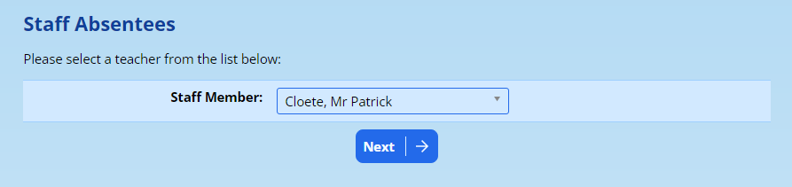
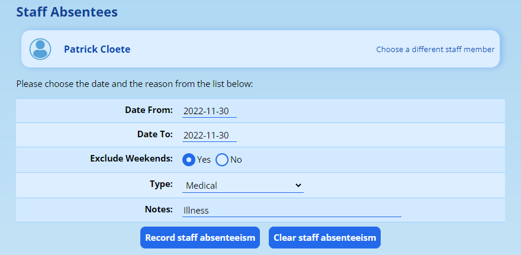

# Staff Absentees {#h-sejx81ujf53h}

ADAM is able to record staff absentee information for staff. This information is largely collected in order to submit it with [SA-SAMS exports](roll-calls.md#h-74ctdmgnp3ca).

While leave can be recorded on ADAM, it is important to realise that ADAM is not an HR package and thus cannot manage the leave owing to a staff member.

## Recording absentee information {#h-n8sxy35pmz0y}

Navigate to **Staff → Staff Absentees → Add absentee records (individual)**. Choose the staff member to add absentee records for and click on **Next**.

Next, confirm the start and end date of the absence. If a range of dates is provided, ADAM can be instructed to **Exclude Weekends** from the absence.

Choose the **type** of absence and provide a **note** for your future reference.

Click on the **record staff absenteeism** button to save the records.

## Clearing absentee records {#h-sf7fghmlh68n}

If an absentee record was added in error, it can be removed by first selecting the date range to remove and then clicking on the **Clear staff absenteeism** button.
