# Staff Information

## Adding new staff to the database

To add a new staff member to ADAM, click on the “**Staff**” tab and, under the “**Staff Administration**” heading, click on “**Add a new teacher**”.

There are several sections that will appear in the next screen, and we’ll discuss them individually:

1.  General Information
2.  Contact Information
3.  Qualification Information
4.  Registration Information
5.  Employment Information
6.  Custom Fields (this might not appear – see Custom Data Fields on page  for more information)

### 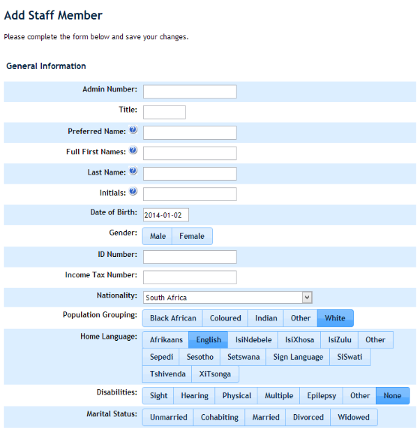

### General Information

In this section, you will enter simple information about the teacher of staff member. The following points are worth noting:

**ID Number:** if the teacher is a foreign national, please enter their passport number here. ADAM *will* produce a warning message saying that the number that is entered is not a valid South African ID number. This is not a problem since we know that we are entering a passport number.

The fields for **Population Grouping**, **Home Language**, **Disabilities** and **Marital Status** are used for reporting to the Department of Basic Education through the LURITS system.

### Contact Information

This section includes contact information for the teacher.

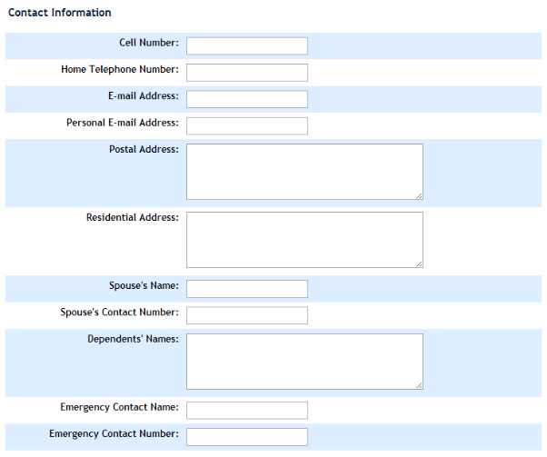

Please take note of the following:

**E-mail address** is the only field that ADAM uses to send emails to staff. The **Personal E-mail Address** field is only for information.

**Dependents’ Names** should be listed one per line.

All phone numbers in ADAM should be entered as simple 10-digit numbers. Do not use any spacing or punctuation. For example, we prefer “0821112222” to “(082) 111 2222”. Whenever ADAM has to display a telephone number, it automatically spaces it out for you.

### Qualification and Registration Information

The next section collects information about the qualification levels of the teachers. Some of this information might seem redundant but this is because of the different reporting mechanisms that the Department of Education requires.

The SACE and PERSAL Numbers should be entered without spaces or punctuation.

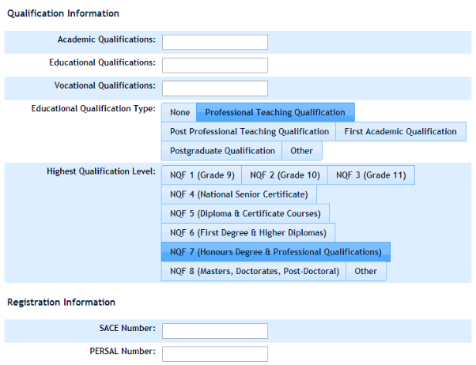

### Employment Information

This is the most important part, as far as ADAM is concerned, of adding a new staff member to the database. The information that is captured here will determine even if they can log in to ADAM or not, so it must be captured carefully!

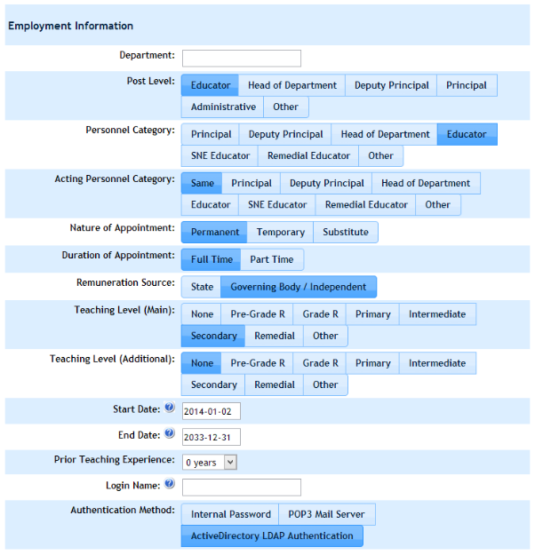

All the headings from **Department** to **Teaching Level (Additional)** are for Departmental uses and so should be captured carefully.

ADAM will automatically fill in today’s date as the **Start Date** for a teacher. If you know the start date of a teacher, please capture it accurately. This is so that ADAM can work out the length of time teachers have worked at the school automatically.

The **Prior Teaching Experience** is a field that determines how much teaching experience a teacher has had *before* the started teaching at your school. With this number and the calculation that ADAM works out from the teacher’s start date, ADAM can also determine the total amount of teaching experience that a teacher has.

The **Login name** is an important field. This is the username that the teacher will use to login to ADAM. If you are using an external authentication mechanism such as a POP3 Mail Server (see page ) or an Active Directory Server (see page ), then this username *must* match the username on that service. See also Staff Logins on page .

Finally, the **Authentication Method** tells ADAM how this user should log on. It is possible to have different teachers using different methods, if necessary. However, ADAM should choose, by default, the most common setting on your server when you add a new staff member.

You will also have the chance to add in an initial password for the user. This is only necessary if you are adding in a user that will use the **Internal Password** option. Remember that if the user using either POP3 Mail Server or Active Directory LDAP Authentication then their password is never stored in ADAM and ADAM asks that other service each time whether the password supplied by the user is correct.

### Custom Fields

If you have created any custom fields, please note that they will appear below this information in the next section.

### Finishing the process

Once you have entered all the information necessary for a staff member, simply click on the button at the bottom: “Add staff member”.

ADAM should then display a “Success!” message to you. A link is provided to quickly add another staff member. This will take you to the start of the process.

## Staff who leave the school

If a staff member leaves the school, it is usually desirable that they should not be able to login to ADAM anymore.

The way to stop this is simply to terminate their employment contract. Visit the staff member’s information page and click on **Employment History**:

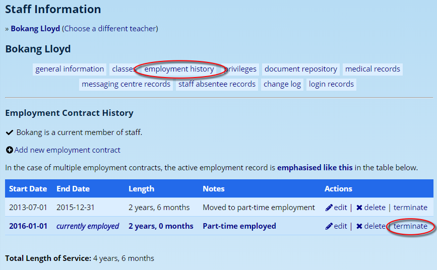

If there are multiple employment records, as appear in the screenshot above, one will be highlighted in bold. Click on the **terminate** option.

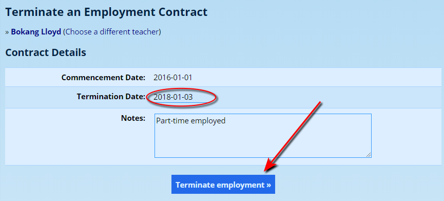

Ensure that the termination date is accurate, and click on the button **Terminate employment** at the bottom of the screen.

## Staff security permissions

Please see [Security Administration](security-administration-for-staff.md#security-administration-for-staff)

## Online Staff Update Forms

In order to keep staff information up to date, many schools resort to giving staff the privileges to edit staff information. This is not advised since all staff then have the privileges to edit, and see, any other staff member’s personal details.

ADAM offers an online update form for staff, very similar in function to the parent detail update forms.

!!! warning
    Staff must have the necessary privilege to update their information. In the staff privileges, the privilege can be found in the “Staff Admin” section, called “Edit personal information (staff\_edit\_own)”.

There are three steps in the process:

1.  Send out emails to staff, asking them to update their information.
2.  Staff click on the links in those emails, log into ADAM, and update any information that has changed.
3.  An email is then sent to an administrative contact who is in a position to approve and update the new information.

### Setting up ADAM:

Before you begin, please make sure that ADAM has been configured with the email address of the person who will be responsible for verifying and approving this information. This is configured in “Site Settings”, under the “General” tab.

Add in one or more email addresses (separate them with commas if you have more than one) into the block for “Staff Detail Update Mail Recipients”:

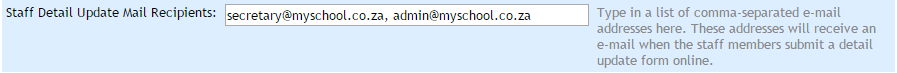

Save the site settings!

### Distribute the detail update requests:

1.  Navigate to the “**Staff**” tab and under the heading “**Staff Administration**”, click on the option “**Send online detail update form emails**”.
2.  A list of current staff is shown. Select those who should receive a link to update their information:

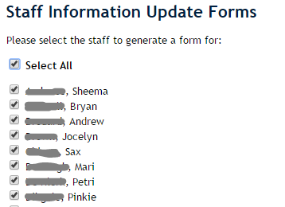

3.  Click on the “Email online update links” button. The selected staff will now receive a personalised copy of the following email:

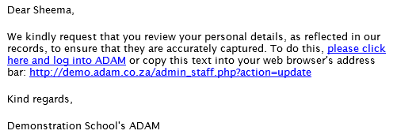

### Updating the Information:

Staff can either update their information by clicking on the provided link in their email, or, at any time can click on the option “Update your personal information” located on the “Staff” tab under the heading “Staff Administration”.

When staff update their information, they will see a screen similar to the edit staff screen, but with only their personal information. When they click on the “Save information” button at the bottom of the screen, their details are not updated immediately. Instead they are sent to the specified email addresses who will come and approve the information.

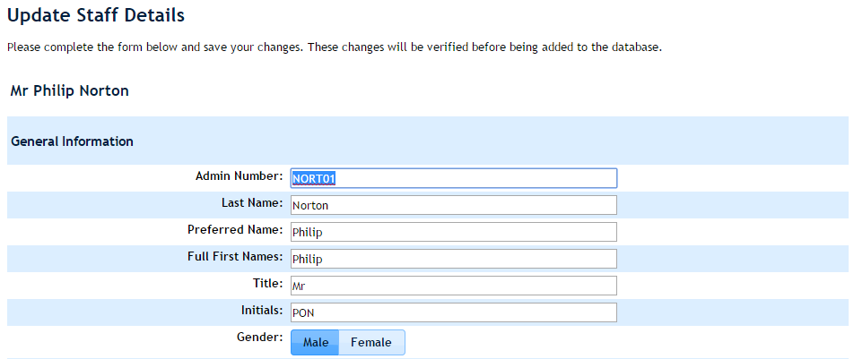

### Approving the Information:

ADAM will send the following email to the specified email addresses when a staff member updates their information:

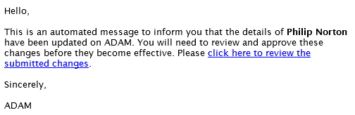

If they click on the link, or - from the ADAM menu on the “**Staff**” tab under the heading “**Staff Administration**”, click on the option “**Review submitted changes**”

A list of unapproved changes will be displayed:

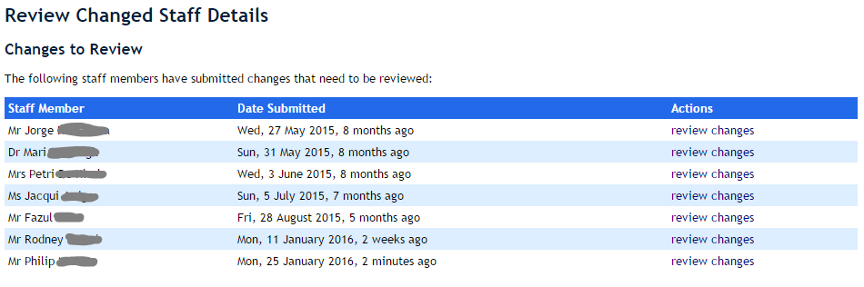

Clicking on the option to “review changes” will show the information that was changed and allow the reviewer to make further changes to that information:

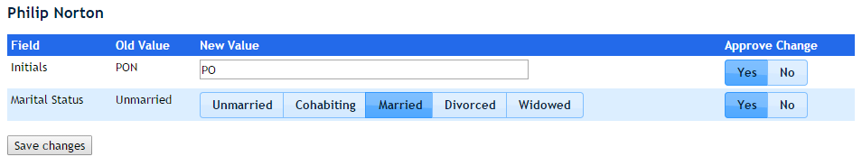

Changes can also be ignored completely by setting “Approve Change” to “No”.

Click on “Save changes” when done. The changes are now recorded in the system.

Note that in the change log, the reviewer will be recorded as the person making those changes.

## Staff Signatures for Reports

Many report templates allow for the automatic placement of electronic signatures. Each teacher will need a signature scanned and uploaded onto the ADAM. Please see the section in [Report Publishing](report-publishing.md#staff-signatures) for more information.

## Staff Name Pronunciation

ADAM contains a specific category in the [Document Repository](document-repository.md#document-repository) which can have digital recordings of the pronunciation of a staff member’s name uploaded. Once uploaded, a media control will appear on the name card in their profile and users can use this to listen to the recording of the name.

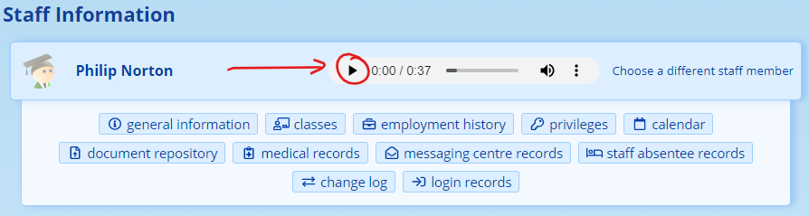

If multiple files are uploaded, only the most recent file is played when the button is clicked.

If the button is greyed out, it may be because an invalid audio file has been uploaded or the specific browser does not support the playback of that type of file. You are encouraged to upload files in MP3 format for the widest possible support.

*Note that different web browsers may display the media control buttons differently. This is a function of the web browser rather than of ADAM.*

Have a look at the Document Repository documentation for more information on uploading many files at once using the [Bulk Upload feature](document-repository.md#uploading-documents-in-bulk).
