# Staff Information

## Adding new staff to the database

To add a new staff member to ADAM, click on the “**Staff**” tab and, under the “**Staff Administration**” heading, click on “**Add a new staff member**”.

There are several sections that will appear in the next screen, and we’ll discuss them individually:

1.  General Information
2.  Contact Information
3.  Qualification Information
4.  Registration Information
5.  Employment Information
6.  Custom Fields (this might not appear – see Custom Data Fields on page  for more information)

### 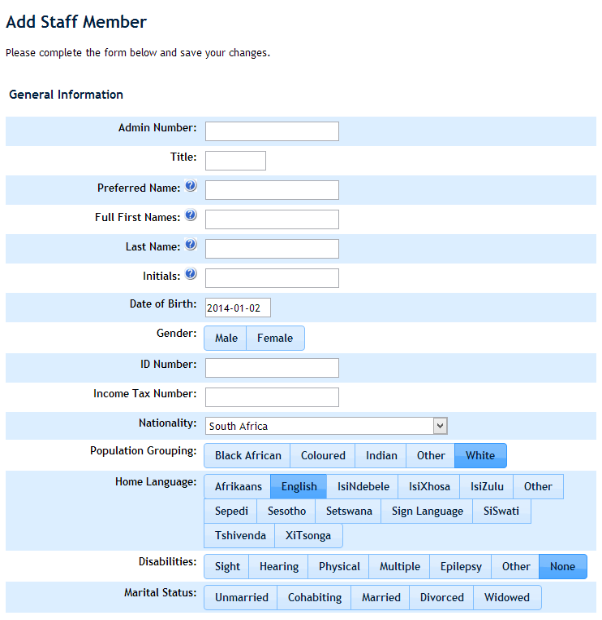

### General Information

In this section, you will enter simple information about the teacher of staff member. The following points are worth noting:

**ID Number:** if the teacher is a foreign national, please enter their passport number here. ADAM *will* produce a warning message saying that the number that is entered is not a valid South African ID number. This is not a problem since we know that we are entering a passport number.

The fields for **Population Grouping**, **Home Language**, **Disabilities** and **Marital Status** are used for reporting to the Department of Basic Education through the LURITS system.

### Contact Information

This section includes contact information for the teacher.

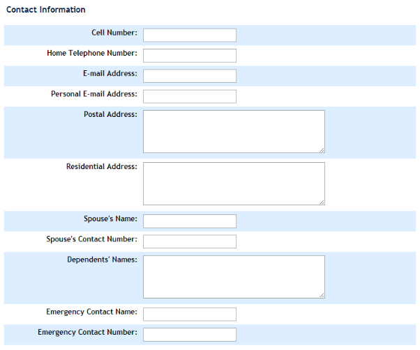

Please take note of the following:

**E-mail address** is the only field that ADAM uses to send emails to staff. The **Personal E-mail Address** field is only for information.

**Dependents’ Names** should be listed one per line.

All phone numbers in ADAM should be entered as simple 10-digit numbers. Do not use any spacing or punctuation. For example, we prefer “0821112222” to “(082) 111 2222”. Whenever ADAM has to display a telephone number, it automatically spaces it out for you.

### Qualification and Registration Information

The next section collects information about the qualification levels of the teachers. Some of this information might seem redundant but this is because of the different reporting mechanisms that the Department of Education requires.

The SACE and PERSAL Numbers should be entered without spaces or punctuation.

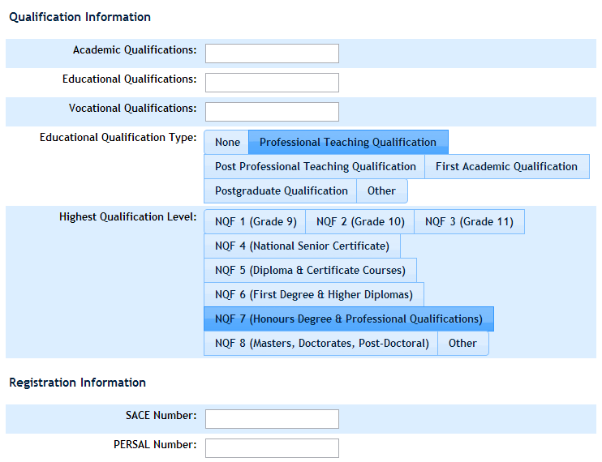

### Employment Information

This is the most important part, as far as ADAM is concerned, of adding a new staff member to the database. The information that is captured here will determine even if they can log in to ADAM or not, so it must be captured carefully!

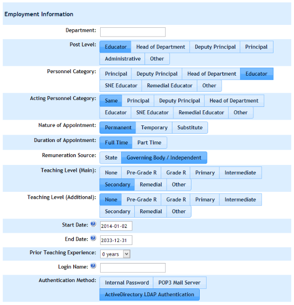

All the headings from **Department** to **Teaching Level (Additional)** are for Departmental uses and so should be captured carefully.

ADAM will automatically fill in today’s date as the **Start Date** for a teacher. If you know the start date of a teacher, please capture it accurately. This is so that ADAM can work out the length of time teachers have worked at the school automatically.

The **Prior Teaching Experience** is a field that determines how much teaching experience a teacher has had *before* the started teaching at your school. With this number and the calculation that ADAM works out from the teacher’s start date, ADAM can also determine the total amount of teaching experience that a teacher has.

The **Login name** is an important field. This is the username that the teacher will use to log in to ADAM. If you are using an external authentication mechanism such as a POP3 Mail Server (see page ) or an Active Directory Server (see page ), then this username *must* match the username on that service. See also Staff Logins on page .

Finally, the **Authentication Method** tells ADAM how this user should log on. It is possible to have different teachers using different methods, if necessary. However, ADAM should choose, by default, the most common setting on your server when you add a new staff member.

You will also have the chance to add in an initial password for the user. This is only necessary if you are adding in a user that will use the **Internal Password** option. Remember that if the user using either POP3 Mail Server or Active Directory LDAP Authentication then their password is never stored in ADAM and ADAM asks that other service each time whether the password supplied by the user is correct.

### Custom Fields

If you have created any custom fields, please note that they will appear below this information in the next section.

### Finishing the process

Once you have entered all the information necessary for a staff member, simply click on the button at the bottom: “**Save information**”.

ADAM then confirms that the staff member was added, and offers you a set of links to carry on with: **Add another staff member**, **Edit another staff member**, a link to the new staff member’s profile, and a link to change their permission groups.

## Employment contracts

ADAM does not keep a simple “employed” or “not employed” marker against a staff member. It keeps a *list* of employment contracts, each one with a commencement date, an optional termination date, and a note. A staff member is treated as **current** when they hold a contract that has already started and has not yet ended.

This matters because being current is what gives someone access:

-   Only current staff members can log in. Somebody with no current contract is turned away at the login screen, even though their login name and password are still stored.
-   Only current staff members count as staff elsewhere in ADAM. They are the ones offered when a class is given a teacher, and the ones who appear in staff lists and in security group listings.

Because it is a list and not a switch, a staff member can leave and return, work a series of fixed-term contracts, or be signed up now for a post that only starts next term.

### Viewing a staff member’s employment history

Click on the “**Staff**” tab and, under the “**Staff Administration**” heading, click on “**Staff Info**”. Choose the staff member from the list, and then click on **Employment History**.

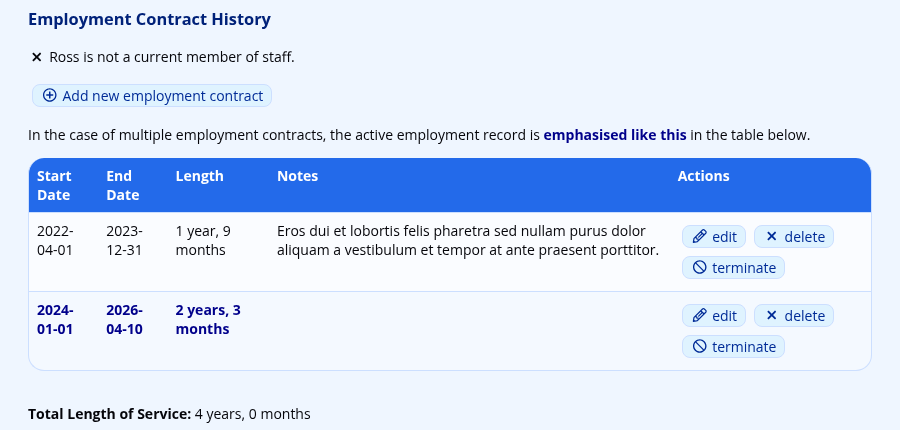

The employment history of a staff member who has left the school.

Reading this screen:

-   The line just below the heading tells you whether ADAM treats this person as a current member of staff right now.
-   Each row is one contract. An **End Date** of *currently employed* marks the contract the staff member is working under now; where that contract has a known end, ADAM adds “set to end on” and the date. A contract that has not started yet reads *to be indefinitely employed*, or gives the date it is set to end.
-   Where there is more than one contract, the record that ADAM is currently using is emphasised in bold.
-   **Total Length of Service** adds together every period the staff member has worked, so a person who has left and returned keeps credit for their earlier service. Contracts that have not started yet are not counted.
-   The **Actions** column offers **edit**, **delete** and **terminate** for each contract. These are discussed below.

!!! note
    You need the permission “View staff sensitive information (staff\_info\_sensitive)” to see this page at all, and “Edit staff member (staff\_edit)” for the **Add new employment contract** link and the actions in the last column. Without the second permission the page is read-only.

### Staff who leave the school

If a staff member leaves the school, it is usually desirable that they should not be able to log in to ADAM anymore.

The way to stop this is simply to terminate their employment contract. Visit the staff member’s information page and click on **Employment History**:

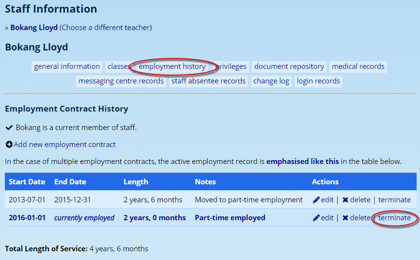

If there are multiple employment records, as appear in the screenshot above, one will be highlighted in bold. Click on the **terminate** option.

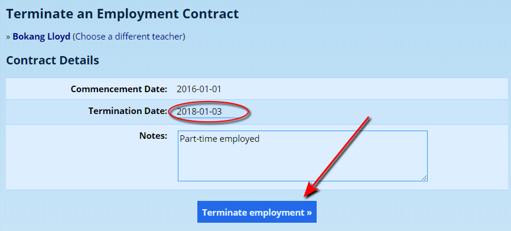

Ensure that the termination date is accurate, and click on the button **Terminate employment** at the bottom of the screen.

If the termination date you enter is today or in the future, the contract stays current until that date has passed. ADAM re-checks employment records every hour, so access ends on the correct day without anybody having to remember to come back and do it. See [Cron Service](cron-service.md#cron-service) for more about these background checks.

At the moment a contract stops being current, three things happen:

-   Any sessions that the staff member has open are closed immediately. They do not keep working until they happen to expire.
-   Any browser they had marked as trusted for two-factor authentication is forgotten, so that a remembered device cannot be used to get back in.
-   Their security group memberships are left exactly as they were.

That last point is deliberate, and it is worth understanding. ADAM relies on the concluded contract to keep a past staff member out, rather than on stripping their permissions away. It is what makes re-engaging somebody straightforward — but it also means that adding a new contract restores every permission they used to have, at the moment the new contract starts. If somebody returns to a different post, check their group memberships as well. See [Security Administration](security-administration-for-staff.md#security-administration-for-staff).

### Re-engaging a staff member who returns

When a former staff member comes back, **do not add them again as a new staff member**. Doing so creates a second, unconnected record, and splits their service history, their documents, their change log and their past marks and comments across two people. Instead, add a new employment contract to the record they already have.

#### Step 1: Find the staff member

Former staff members are still in ADAM, but they are kept out of the way. In the drop-down lists used to choose a staff member — including the one on “**Staff Info**” — they appear at the bottom of the list, under a heading that reads **Previous Staff Members**:

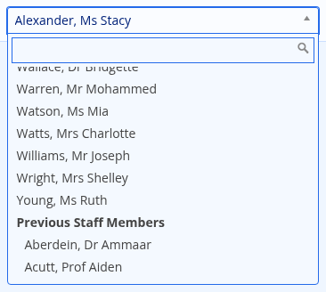

Past staff members appear under their own heading at the end of the list.

#### Step 2: Add the new contract

Open their **Employment History** page and click on **Add new employment contract**.

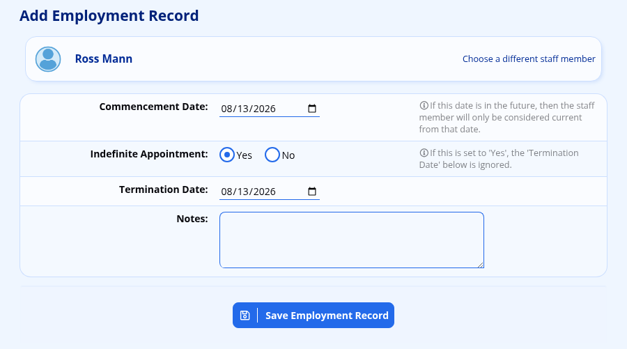

-   **Commencement Date** is the day the staff member starts again. If you put a date in the future here, the staff member is only treated as current — and can only log in — from that date onwards. This is the safe way to prepare a return in advance.
-   **Indefinite Appointment** should be set to **Yes** for an open-ended appointment. When it is **Yes**, the **Termination Date** is ignored entirely.
-   **Termination Date** is only used when **Indefinite Appointment** is set to **No**, for a contract with a known end.
-   **Notes** are shown in the Notes column of the employment history, and are a good place to record the post or the reason.

Click on **Save Employment Record** to finish.

!!! warning
    If you set **Indefinite Appointment** to **No**, make sure the **Termination Date** is not earlier than the **Commencement Date**. ADAM will not store a contract that ends before it begins, and the new record simply will not appear in the history. Always check the employment history afterwards.

#### Step 3: Check the result

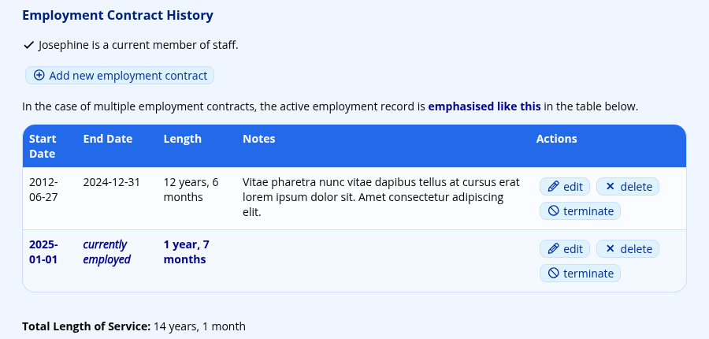

The same staff member’s history after a new contract has been added.

Both periods are now listed, the new contract is emphasised as the active one, and **Total Length of Service** covers both spells.

There is nothing else to switch back on. A staff member’s login name, authentication method and password are stored against the person and not against the contract, so they are all unchanged. They will be able to log in exactly as before, using the same login name, from the commencement date of the new contract. Because their trusted browsers were forgotten when they left, they will be asked for a two-factor code again the first time they log in.

Two things are worth checking on a return:

-   **Their personal details.** Contact numbers, addresses and qualifications may have changed while they were away. See [Online Staff Update Forms](#online-staff-update-forms) below for a tidy way to have them confirm their own details.
-   **Whether their information has been erased.** ADAM can be set to remove the personal information of past staff members after a period, using the setting **Delete personal information from past staff members**, found in “Site Settings” under “Data Management” in the “Data Retention” section. If a staff member returns after that period has passed, their personal details will have to be captured again. Their work in ADAM — marks, comments and assessments — is not affected.

### Overlapping contracts

Two contracts for the same staff member cannot cover the same dates, and ADAM will quietly adjust the records to prevent it. Most often this happens when somebody on an open-ended contract is given a new one: because the old contract has no termination date, ADAM closes it on the day before the new contract begins.

This is usually exactly what you want, but it does mean the dates you see afterwards may not be quite the dates you typed. Look over the employment history once you have finished making changes.

### Fixed-term contracts and renewals

When a fixed-term contract comes to an end and the staff member is staying on, you have a choice:

-   **Extend the existing contract.** Click on **edit** next to the contract and move the **Termination Date** out, or set **Indefinite Employment** to **Yes** to make the appointment permanent. Use this when it is really the same appointment continuing.
-   **Add a new contract.** Use **Add new employment contract**, starting the day after the current one ends. Use this when the terms have changed, or when there is a genuine break in service. The history then shows both periods separately.

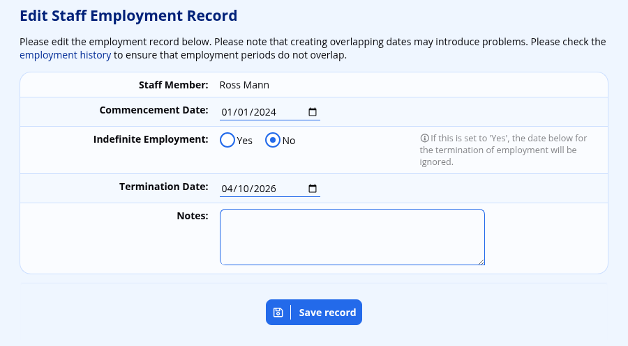

Editing an existing contract.

Take care to leave no gap when you intend none: a staff member with no current contract, even for a single day, cannot log in on that day.

### Deleting an employment record

The **delete** action is for records that were captured in error — a contract entered against the wrong staff member, or entered twice. It is **not** the way to record that somebody has left; use **terminate** for that, so that the history of their service is kept.

Deleting a record cannot be undone. Two further points are worth knowing:

-   Every staff member must have at least one employment record. If you delete the only one, ADAM immediately creates a replacement to take its place.
-   If you delete the record that is currently active, ADAM chooses one of the remaining records to become active instead.

### Finding current, past and future staff

Two lists on the “**Staff**” tab, under the “**Lists and Labels**” heading, are useful when you are working with employment contracts.

“**Staff scratch list by contract**” lists staff by the state of their contracts. Tick any combination of the three options:

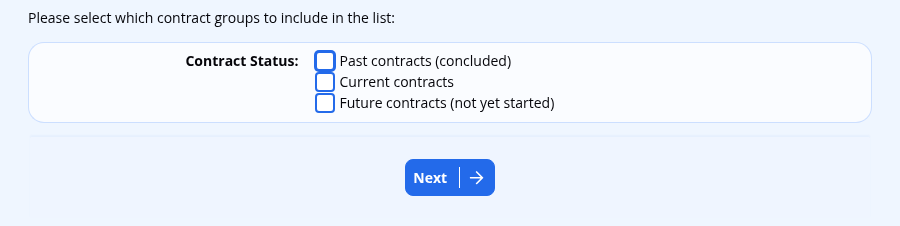

-   **Past contracts (concluded)** finds everybody who has a contract that has already ended — the list to use when you are looking for a former staff member.
-   **Current contracts** finds the staff employed today.
-   **Future contracts (not yet started)** finds staff whose contracts begin at some point in the future, which is a useful check after preparing returns or new appointments in advance.

“**Historical staff scratch list**” asks you for a date and then lists the staff who were employed on that day.

See [Scratch Lists](scratch-lists.md#scratch-lists) for what you can do with a list once you have made one.

## Staff security permissions

Please see [Security Administration](security-administration-for-staff.md#security-administration-for-staff)

## Online Staff Update Forms

In order to keep staff information up to date, many schools resort to giving staff the permissions to edit staff information. This is not advised since all staff then have the permissions to edit, and see, any other staff member’s personal details.

ADAM offers an online update form for staff, very similar in function to the parent detail update forms.

!!! warning
    Staff must have the necessary permission to update their information. In the staff permissions, the permission can be found in the “Staff Admin” section, called “Edit personal information (staff\_edit\_own)”.

There are three steps in the process:

1.  Send out emails to staff, asking them to update their information.
2.  Staff click on the links in those emails, log into ADAM, and update any information that has changed.
3.  An email is then sent to an administrative contact who is in a position to approve and update the new information.

### Setting up ADAM:

Before you begin, please make sure that ADAM has been configured with the email address of the person who will be responsible for verifying and approving this information. This is configured in “Site Settings”, under the “General” tab.

Add in one or more email addresses (separate them with commas if you have more than one) into the block for “Staff Detail Update Mail Recipients”:

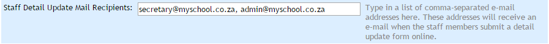

Save the site settings!

### Distribute the detail update requests:

1.  Navigate to the “**Staff**” tab and under the heading “**Staff Administration**”, click on the option “**Send online detail update form emails**”.
2.  A list of current staff is shown. Select those who should receive a link to update their information:

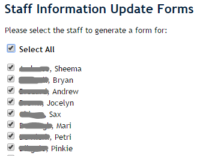

3.  Click on the “Email online update links” button. The selected staff will now receive a personalised copy of the following email:

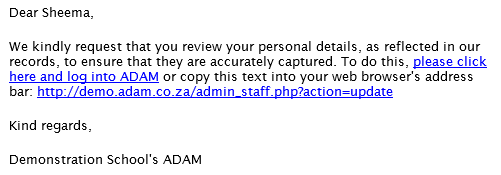

### Updating the Information:

Staff can either update their information by clicking on the provided link in their email, or, at any time can click on the option “Update your personal information” located on the “Staff” tab under the heading “Staff Administration”.

When staff update their information, they will see a screen similar to the edit staff screen, but with only their personal information. When they click on the “Save information” button at the bottom of the screen, their details are not updated immediately. Instead they are sent to the specified email addresses who will come and approve the information.

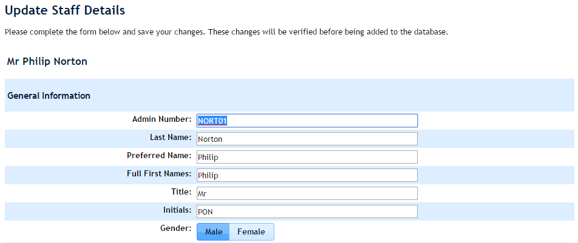

### Approving the Information:

ADAM will send the following email to the specified email addresses when a staff member updates their information:

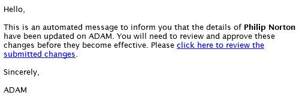

If they click on the link, or - from the ADAM menu on the “**Staff**” tab under the heading “**Staff Administration**”, click on the option “**Review submitted changes**”

A list of unapproved changes will be displayed:

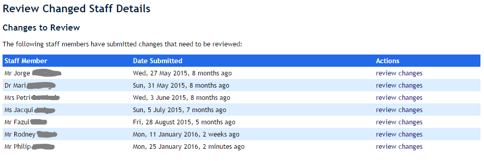

Clicking on the option to “review changes” will show the information that was changed and allow the reviewer to make further changes to that information:

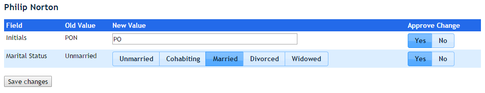

Changes can also be ignored completely by setting “Approve Change” to “No”.

Click on “Save changes” when done. The changes are now recorded in the system.

Note that in the change log, the reviewer will be recorded as the person making those changes.

## Staff Signatures for Reports

Many report templates allow for the automatic placement of electronic signatures. Each teacher will need a signature scanned and uploaded onto the ADAM. Please see the section in [Report Publishing](report-publishing.md#staff-signatures) for more information.

## Staff Name Pronunciation

ADAM contains a specific category in the [Document Repository](document-repository.md#document-repository) which can have digital recordings of the pronunciation of a staff member’s name uploaded. Once uploaded, a media control will appear on the name card in their profile and users can use this to listen to the recording of the name.

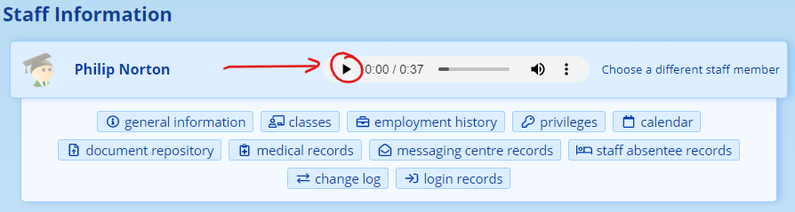

If multiple files are uploaded, only the most recent file is played when the button is clicked.

If the button is greyed out, it may be because an invalid audio file has been uploaded or the specific browser does not support the playback of that type of file. You are encouraged to upload files in MP3 format for the widest possible support.

*Note that different web browsers may display the media control buttons differently. This is a function of the web browser rather than of ADAM.*

Have a look at the Document Repository documentation for more information on uploading many files at once using the [Bulk Upload feature](document-repository.md#uploading-documents-in-bulk).
