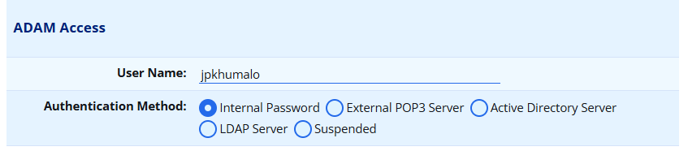
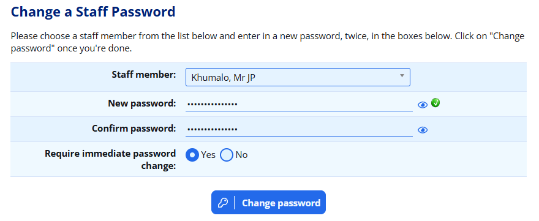
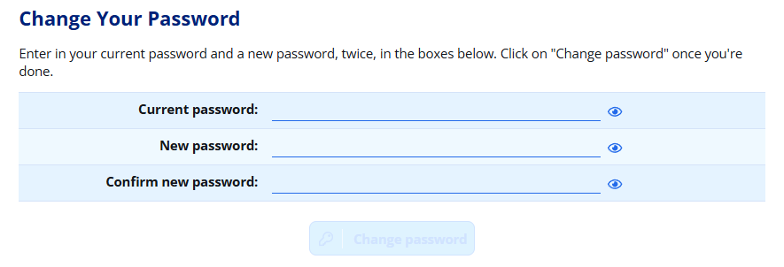
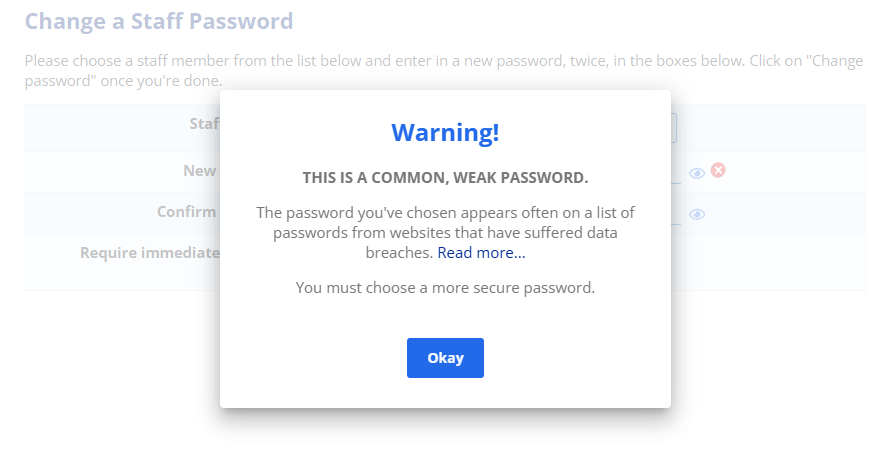

# Staff Passwords {#h-cuxr7xfmvhp2}

There are a number of ways that ADAM can authenticate staff members. This is normally done with a password that ADAM manages (an “internal” password), but ADAM can delegate the password management to other systems such as Active Directory. Staff can also enrol a [passkey](passkey-authentication.md#h-68qerlruak0n) on each of their devices, which lets them sign in with a fingerprint or face scan rather than a password.

This page covers password-based logins. For information on enrolling and managing passkeys — including how an administrator can revoke a passkey on a lost or stolen device — see the [Passkey Authentication](passkey-authentication.md#h-68qerlruak0n) page.

## Checking Usernames and Authentication Methods {#h-87mj6iu0gpko}

In order for a staff member to make use of an internal password, it is important to check that their username and authentication type is set up correctly in their profile. Navigate to **Staff → Staff Administration → Edit a staff member’s information**.

Find the section called “**ADAM Access**” and make sure that a username is set, and that the Authentication Method is set to “Internal Password”:

## Resetting a Staff Member’s Password {#h-ylobzxjdgrit}

If a staff member forgets their password, it is not possible to recover it. It is, however, possible to reset the password to something new. To change a staff member’s password, navigate to **Staff → Security Administration → Change a teacher’s password**.

Enter the new password twice into the “Password” fields. You can also decide whether the staff member should be forced to change their password when they next log in. This is recommended!

Once you’re happy, click on the “**Change password**” button.

## Changing Your Own Password {#h-xziujx3xvnnw}

If a user wishes to change their password, they can do so by visiting: **Staff → Security Administration → Change your password**.

The user will need to enter their existing password and then enter a new password, twice.

To save the password, click on the **Change password** button that appears at the bottom.

Note that if the password entered does not conform to the password policy, the button will be disabled. Read more [below about the password policy](#h-30voois3siuv).

## Common Issues {#h-x1hfremg64hv}

### Password Policy {#h-30voois3siuv}

Temporary passwords set here must still fit in with ADAM’s password policy, even if the staff member is going to have to change it.

ADAM does not enforce a certain number of special characters, upper case letters and so on, but it does check the passwords entered against a database of passwords that have been previously compromised. This means that some surprisingly “normal” passwords will be accepted, and yet some more complex ones might not be.

The logic here is that if the password appears in this database, it has been used before - sometimes by many people - and so if someone is going to hack into your account, this particular password is likely to appear on the list of passwords that a hacker will try first.

If you see a message like this, it means that the password you have chosen already appears in a database of common passwords and should not be used. Please choose another password.

### Incorrect Username {#h-9mw07rh9y0rh}

Please double check the username is correct. Also double check that the user is using the correct username. It is surprising how many times the user is using a different username to the one that is configured in ADAM.
