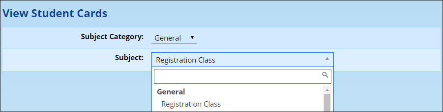
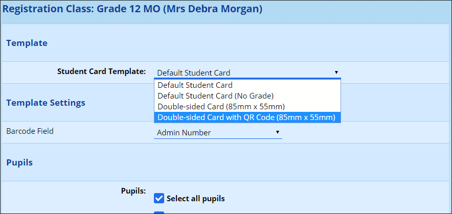

# Student Cards

ADAM can print out student cards based on predefined templates. To have a template specifically designed for your school, please get in touch with us!

A few simple templates are provided. Navigate to **Pupils → Lists and Labels → Print student cards.**

Choose the group of pupils that you would like to print cards for. It may be quicker to use a group that contains a whole grade, for example.

Choose the template that you want and complete any of the required settings:

For the two “Double-sided” cards, graphics in the ratio 85:55 can be uploaded to the [Site Document Repository](document-repository.md#site-document-repository) and selected. They should be uploaded into the “Site” category.
