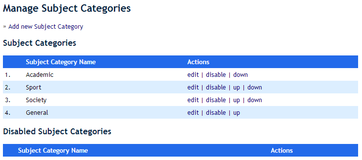
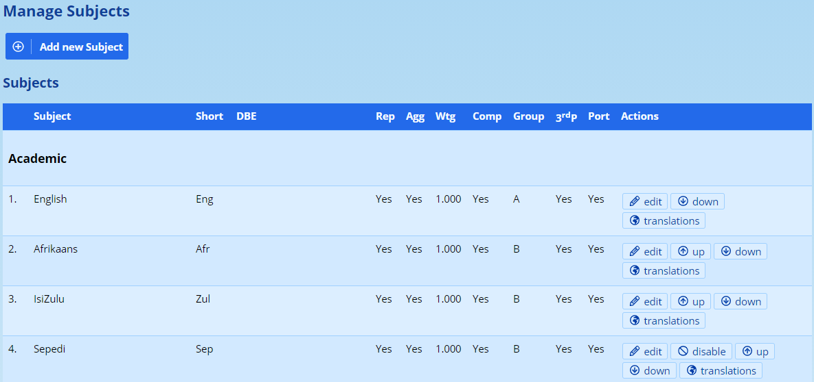
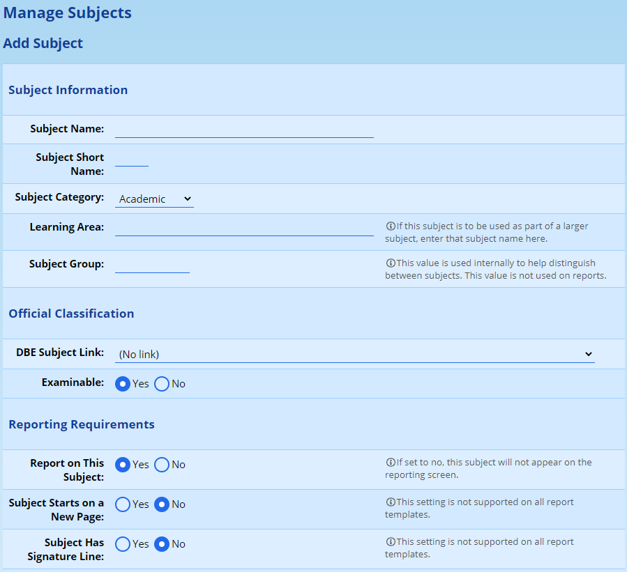
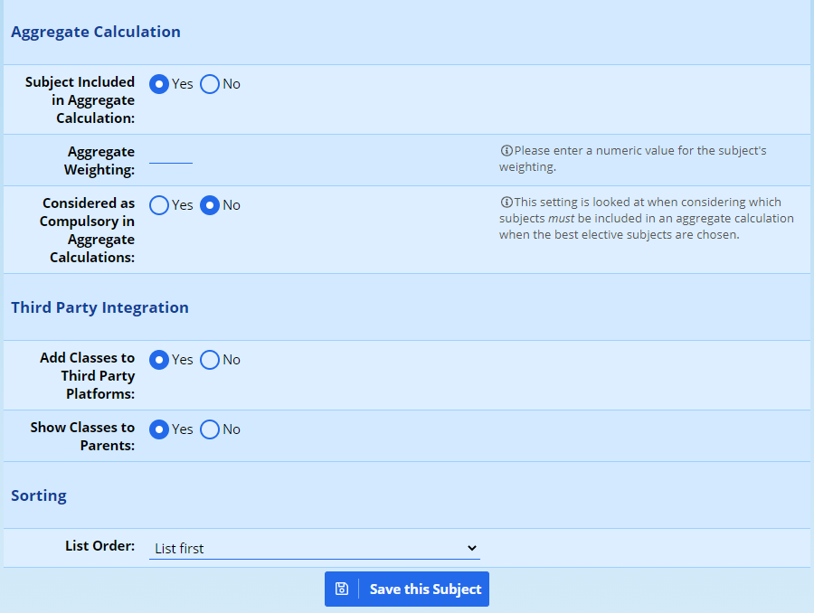
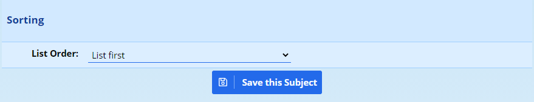
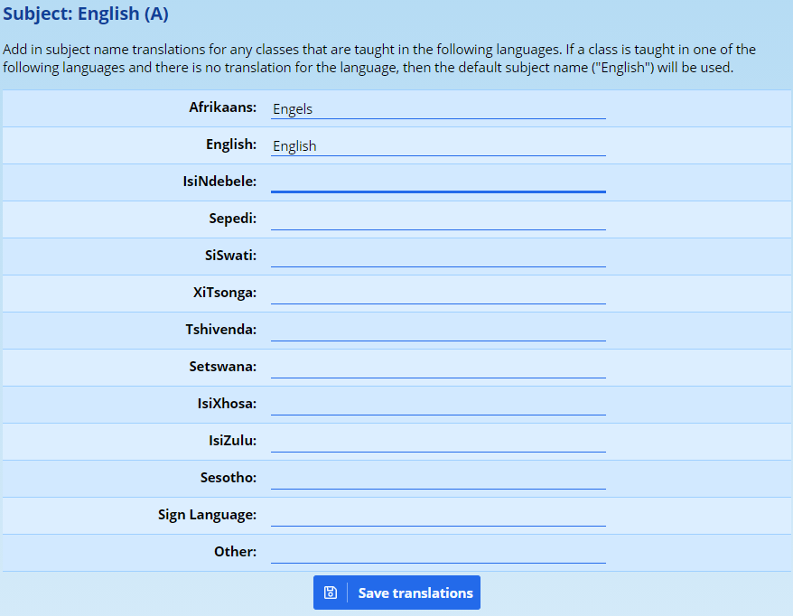

# Subjects

A subject can be thought of as any activity or pursuit that a student is associated with. The most common form that subjects take on is that of an academic subject such as English, History or Physical Science. However sports can also be thought of as subjects as well as other extra-curricular or cultural activities. In addition a reporting item like “Principal’s Comment” can also be thought of as a subject. Subjects can (but don't have to be) reported on also. Thus it is possible for comments to be captured for sports teams and other activities.

Classes, within this paradigm, then form the groups of pupils within that activity. Thus we might have "Red House" and "Blue House" as two groups (or classes) within the subject 'Sports House'."

## Subject Categories

Each subject is associated with a subject category. These categories exist for purposes of logical organisation and reporting. The default subject categories in ADAM are as follows:

-   **Academic** – subjects in this category are usually the normal teaching subjects which have marks or some kind of levels that are reported on.
-   **Sport** \- subjects in this category are sports and are not usually associated with a mark or any levels but may well be reported on (including a comment). This can also include sports houses.
-   **Society** – extra-curricular activities like societies or cultural activities.
-   **General** – subjects which do not fall into any of the above categories. These typically include register class and principal’s comment.

These categories are especially important in terms of reporting. Many report templates use these categories to decide how to display and format the subject in question. Subjects in the “Sports” category may be treated differently from subjects in the “Academic” by a template.

These categories can be managed by clicking on the **Subjects** tab, under the **Subject Administration** section, click on the **Edit the Subject Categories** option.

From this screen subject categories can be added, edited, re-ordered and disabled. The order of these categories is largely redundant and for display purposes only. These categories are fully customisable and can be changed to suit your school’s needs.

## Managing the Subjects

To manage the subjects, click on the **Edit the subjects** menu option, found on the **Subjects** tab under the **Subject Administration** heading. You should see a screen that looks similar to this:

At the top of the screen, there is an option to **Add a new Subject**.

To change an existing subject, click on the **edit** link next to the appropriate subject.

To disable a subject, click on the **disable** link next to the subject that you want to disable.

If you want to change the ordering of the subjects, you can use the **up** and **down** options next to each subject.

If you have a parallel medium school, the option to enter **translations** will be important.

Each of these functions is discussed in more detail below.

### Adding a new subject

A new subject can be added by clicking on the **Subjects** tab, under the **Subject Administration** section, click on the **Edit the Subjects** option. Clicking on the link near the top **“Add a new subject”** will show the screen depicted alongside.

<iframe src="https://www.youtube.com/embed/Wc0_U8x9F-I" frameborder="0" allow="accelerometer; autoplay; encrypted-media; gyroscope; picture-in-picture" allowfullscreen></iframe>

For more information about this screen, please see the “**Editing a subject**” section below.

### Editing a Subject

The following information is asked for when adding or editing a subject. A description of what is required is given next to each subject below:

-   **Subject Name**

-   This is the name of the subject. It should be written here as it is to appear on any printed reports or class lists.

-   **Subject Short Name**

-   The short name is a very brief descriptive name of the subjects. This is most important for Academic subjects, but other subjects do use it. Consider using a three- or four-letter abbreviation, for example, “English” might be “Eng”.

-   **Subject Category**

-   This determines which subject category this subject belongs to. The choice is, by and large, arbitrary, but special note should be made of the following:

-   All Academic subjects must belong to the category “Academics”.
-   Any general summary comments that appear on a report which are not academic subjects, such as a headmaster’s comment, should be added to the “General” category.

-   **Learning Area**

-   This is a throw-back to the South African NSC system. In some schools, Learning Areas are still used where subjects might be taught separately but their marks are aggregated on the report. This is particularly the case with, as an example, History and Geography counting towards Social Sciences. In a situation like this, both History and Geography should contain the text “Social Sciences” (spelling is vital - they must be the same!) in their Learning Area blocks.

-   **Subject Group**

-   This is a reference text only. Some schools have a subject such as Mathematics which is offered in different phases of the school (e.g. Junior Primary, Senior Primary, High School). One possible reason for this is the ordering of subjects - one phase might was English before Maths, another might need it after, and so it might be simpler to have two separate subjects so as not to confuse the issue. In this instance, the “Group” would help users to differentiate the different subjects. One could use descriptions such as “High School”, “Prep”, “Senior”, “Junior” or any other text that will serve to clarify the two identically named subjects.

-   **DBE Subject Link**

-   If an Academic subject is being entered, it may happen that your school wishes to have a slightly different name than is recognised officially by the Department of Basic Education. To avoid confusion, find the official subject in this list. If the subject is non-academic or leads to a non-South African qualification, such as an IGCSE subject, then this can be omitted.

-   **Examinable**

-   Once again, this is a South Africa-specific field. It should only be set for Academic subjects. It has no impact on the functioning of ADAM and is used to report to the DBE only.

-   **Report on this Subject**

-   This is an important field. Any subjects that are to appear on the final printed report should have this field set to “Yes”. Note that setting this to “Yes” does not force it to appear on a report. A pupil must either achieve a result for the subject or have a comment written for it. For example, if a pupil is registered for a subject in error, but is not awarded a mark nor has any comment written, then the subject won’t appear on the final report.

-   **Subject Starts on a New Page**

-   This setting is supported by only some specific reporting templates. If you are using a reporting template that does support this (when we design your templates we will let you know!), this will force the subject to start on a new page in the template.

-   **Subject Has Signature Line**

-   This setting is supported by only some specific reporting templates. If you are using a reporting template that does support this (when we design your templates we will let you know!), this will generate a signature line below the subject.

-   **Subject Included in Aggregate Calculation**

-   This setting only applies to Academic subjects. When your aggregate calculation is set to use one of the default options, if this is set to “No”, then the subject will be ignored when an aggregate calculation is performed. Note that if you use a “custom aggregate calculation” (again we will let you know if this is necessary) then this setting is ignored anyway.

-   **Aggregate Weighting**

-   This setting only applies to Academic subjects. When your aggregate calculation is set to use one of the default options, this subject will be weighted accordingly. Note that if you use a “custom aggregate calculation” (again we will let you know if this is necessary) then this setting is ignored anyway.

-   **Considered Compulsory for Aggregate Calculation**

-   This setting only applies to Academic subjects. When your aggregate calculation is set to use one of the default options, this subject will be weighted accordingly. Note that if you use a “custom aggregate calculation” (again we will let you know if this is necessary) then this setting is ignored anyway.

-   **Add Classes to Third Party Platforms**

-   This setting only applies if you make use of Moodle and / or Google Apps synchronisation from ADAM. If you do, and this is set to “Yes”, then Moodle or Google Apps will have the classes, their teachers and their pupils all synchronised across to the respective platforms.

-   **Show Classes to Parents**

-   This causes the class to be shown on the parent and pupil portal. In some instances, schools will use classes for purposes of grouping pupils for administrative purposes. These groups have no material impact on the pupil, but the parents could see the group, plus contact details of the teacher concerned. This may be a secretary or similar who might have no real dealing with the pupil. In these instances, one can choose to hide all classes in this subject from parents.

-   **List Order**

-   This simply allows you a faster way to change the order of the subject instead of having to click **up** or **down** repeatedly for a subject. This list allows you to choose its new position in one go.

Once you are happy with the information, you can now click on the **Save this Subject** button to save the details you’ve captured.

Once you have created your subjects, you are now ready to [create classes](class-management.md#class-management).

### Changing the Order of Subjects

The order that the subjects are listed in here is used throughout ADAM and on the reports themselves.

When looking at the list of subjects, as [described above](#managing-the-subjects), subjects can be moved using the **up** and **down** options next to each subject. This is only useful for moving a subject a small number of places. If you need to move the subject more than a few positions, click on the **edit** option next to the subject and change its sortorder to reflect its desired position in the list:

When complete, click on **Save this Subject**.

### Translating Subject Names

If your school is parallel medium and you wish to have the names on subjects appear on the report in the language of teaching and learning, then you can click on the **translations** option next to the subject and enter in the translated names for the subject in each of the eleven official languages:

Click on **Save translations** when done.

Importantly, the language of teaching and learning must be set correctly for the class concerned. The restriction here is that each class can only be taught in a single language and if a dual language exists, it would have to be captured as two individual classes on ADAM, one for each language. Have a look at [editing classes](class-management.md#editing-an-existing-class) for more information.
