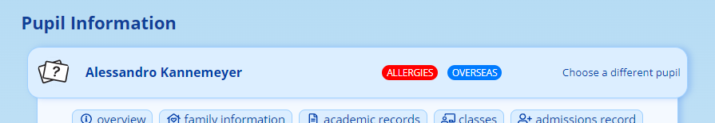
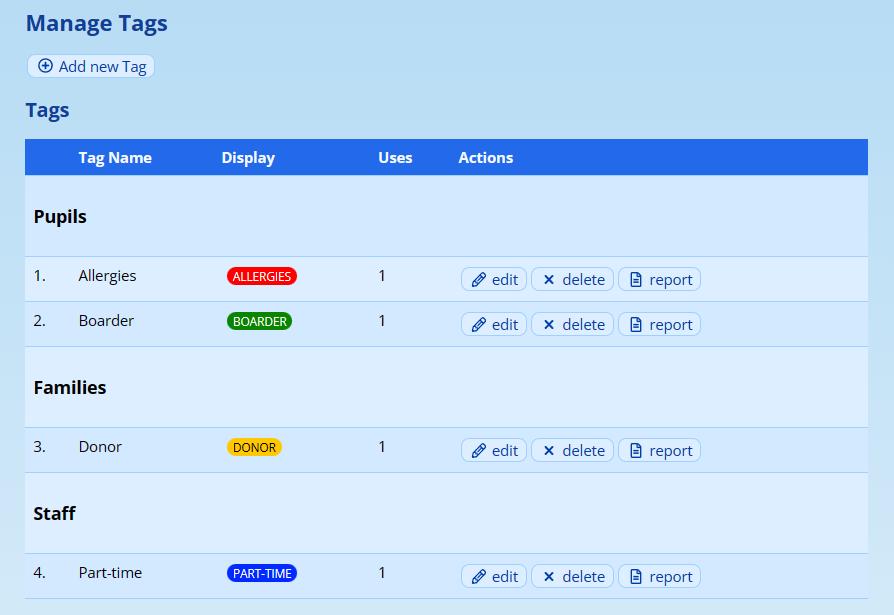
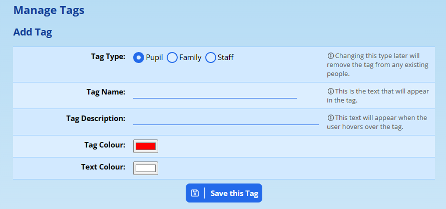
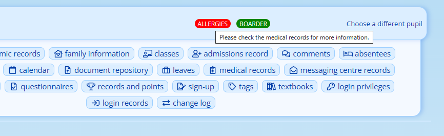
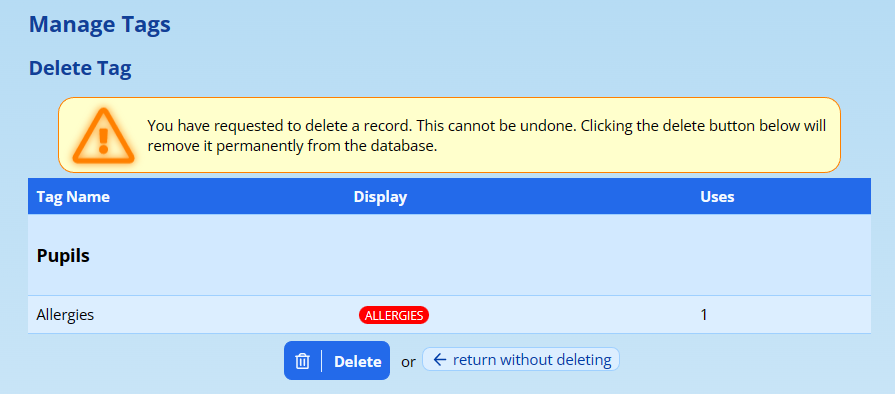
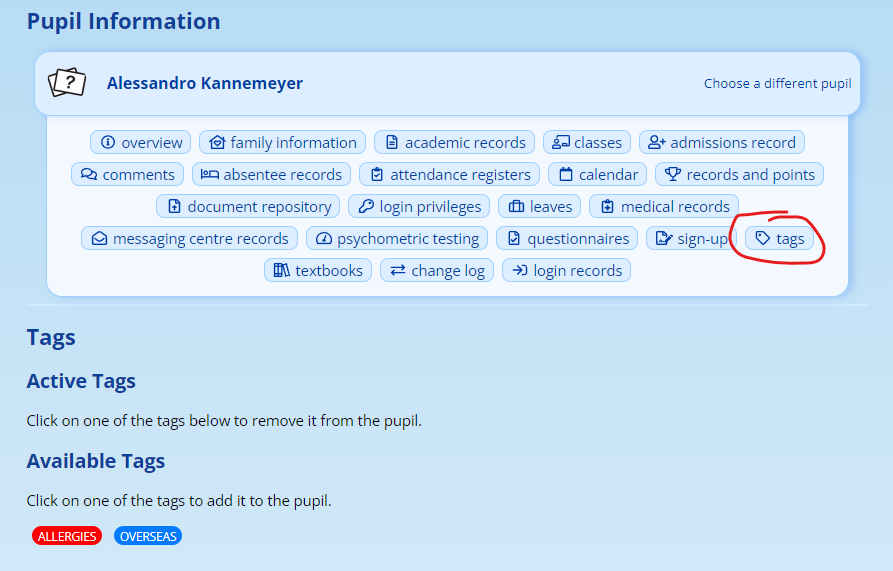
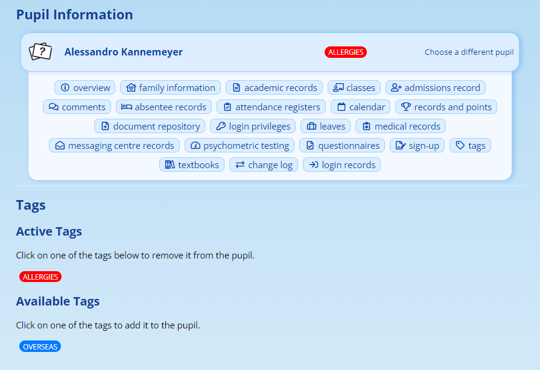

# Tags for Pupils, Families and Staff {#h-6kgjz9jr8cqy}

ADAM can add tags to pupils’, families’ and staff name banners so that whenever the profiles are viewed, the tags can be quickly and easily seen to alert your staff to important information regarding that profile.

While there are privileges to control who can see which type of tags (i.e. a staff member can be assigned the privilege to view family tags), there is no control regarding *which* families or *which* tags they can see.

Please consider, carefully, using these tags to store personal, private or sensitive information.

## Managing the Tags {#h-tfmgjn2evp31}

Navigate to **Administration → Tags → Manage Tags**.

### Adding a new tag {#h-i4dhs5hqynyi}

To add a new tag, click on the “**Add new Tag**” link at the top of the screen.

Decide whether the tag is to be used for Pupil profiles, Family profiles or Staff profiles. If you require the same tag for multiple types of profiles (e.g. “Allergies” may apply to Pupils *and* Staff), then you will need to add the tag multiple times, once for each type of profile.

Give a name for the tag (limited to 50 characters), and a description. The description is visible if you hover the mouse over the tag when viewing a profile:

You can also choose a background colour and a foreground colour. Please make sure that your foreground colour is sufficiently contrasted with the background so that it is legible!

Click on **Save this Tag** to see the changes. ADAM will show a preview of the tag in the next window.

### Editing a tag {#h-hfwsnwhvw603}

From the list of tags, click on the **edit** option to the right of the tag you’d like to edit:

You can then adjust the name and colours associated with the tag. Note that any pupils who are assigned to this tag will automatically show the changed tag immediately.

!!! warning
    If you edit a tag and change its type - for example, from being a “Pupil” tag to being a “Family” tag, ADAM will remove the tag from all pupils when you save your changes. There is no way to undo this.

### Deleting a tag {#h-bqohdlv8y3g4}

Next to the tag in the table, click on the **delete** button.

You will be asked to confirm your actions. Note that every pupil who is assigned to the tag will lose the tag and there is no way to undo this action. Once deleted, the tag is gone! A deleted tag would have to be manually recreated and re-assigned to the necessary pupils.

## Assigning Tags to a Profile {#h-39ewlr3bcwwp}

Navigate to the profile and click on the “**Tags**” option.

If you do not see a “tags” option on their profile, check first that some tags have been created. You may not have the necessary privileges to assign tags. Below the image shows a pupil profile that we are assigning tags to, but the tag screen is identical on all profile types.

A list of active and available tags are shown. Click on an “Available Tag” to assign it to the profile. You can click on an “Active Tag” to de-assign it.

## Privileges For Tags {#h-lj1ezzb3vqt9}

When the module is initially opened, no privileges will have been assigned to any staff and thus the tag feature won’t be visible to them.

Assigning privileges is [discussed elsewhere](security-administration-for-staff.md#h-thw4kt).

The following privileges control the Tag module:

-   Site Admin → Tags:

-   Manage Tags: This allows the staff member to create tags, delete tags and edit tags.
-   View the Tag Report: This allows the staff member to view a report listing all the people that are assigned to that tag. Note that they must also have appropriate scratch list privileges since ADAM will use that module to generate the lists.

-   Pupil Admin → Tags:

-   Add Tags to Pupils: This privilege allows the user to assign and remove tags from a pupil profile.
-   View Pupil Tags: This privilege allows the tags to be shown in the pupil’s profile banner to user. If they don’t have this privilege, they will not see any tags. *This privilege should probably be assigned to most staff members.*

-   Staff Admin → Tags:

-   Add Tags to Staff: This privilege allows the user to assign and remove tags from a staff profile.
-   View Staff Tags: This privilege allows the tags that are assigned to the staff member to be shown to the user. If they don’t have this privilege they will not see tags in the staff profiles.

-   Family Admin → Tags:

-   Add Tags to Families: This privilege allows the user to assign and remove tags from a family profile.
-   View Family Tags: This privilege allows the tags that are assigned to the family to be shown to the user. If they don’t have this privilege they will not see tags in the family profiles.
