# Third Party Integration

## API Integration with ADAM

ADAM provides a RESTful JSON API which technical users can make use of. For more information, please see the [dedicated section discussing the API](api-access-to-adam.md#api-access-to-adam).

## Clever Integration with ADAM

@todo

## DevMan Integration with ADAM

The DevMan module has several API endpoints that are customised for DevMan’s specific needs.

### Create an API Token for DevMan

Follow the instructions for [creating a new API Token](api-access-to-adam.md#managing-api-tokens-in-adam).

The API Token will need access to all the following end-points. Use the “Ctrl” button on your keyboard while you click on each of them.

-   XDevMan/alumni/get
-   XDevMan/alumnus/get
-   XDevMan/currentpupils/get
-   XDevMan/leavers/get

### Configuring DevMan

The DevMan team will need to know your ADAM server’s web address as well as the API Token that you’ve created.

**We strongly recommend that you do NOT send the API Token by email, and instead use some means of encrypted or access-controlled communication.**

## Ed-Admin Integration with ADAM

The Ed-Admin module is not enabled by default and it will need to be enabled before it can be used. To enable the integration, please navigate to **Administration → Site Administration → Edit site settings** and click on the **Custom Modules** tab. Enter the module name **edadminsync** 

If there are existing custom modules enabled, leave a space between existing modules and this module name. The order of the custom modules, if there is more than one, does not matter. Click on **Save Settings** to save these settings.

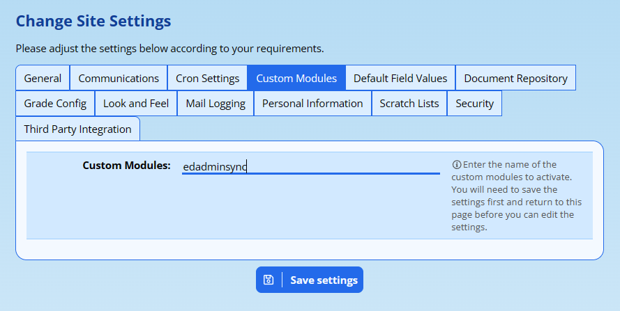

### Configuring the Integration

Navigate back to the Site Settings: **Administration → Site Administration → Edit site settings** and click on the **Custom Modules** tab. A set of settings will appear beneath the **Ed-Admin Sync** header:

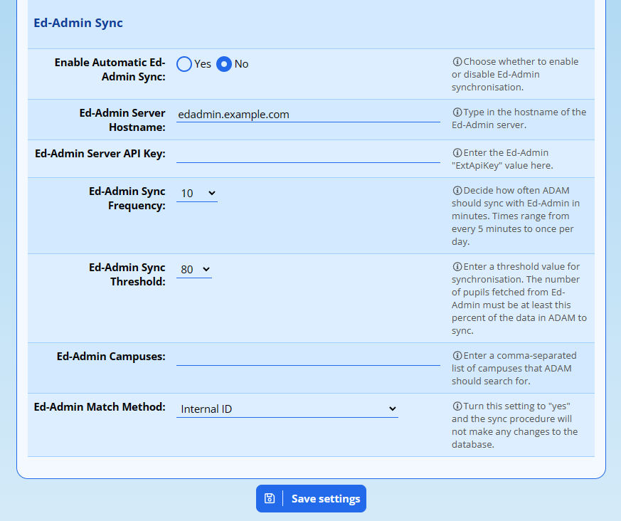

The settings are discussed below:

-   **Enable Automatic Ed-Admin Sync:** This will cause ADAM to syncrhonise data automatically from Ed-Admin at an interval determined by the **Ed-Admin Sync Frequency** interval. To start with, it is strongly recommended that schools leave this to “No” until they have conducted a few manual synchronisations are are happy that the process is working.
-   **Ed-Admin Server Hostname:** ADAM needs to communicate with your Ed-Admin server and so it needs to know where it is. The host name is its address on the internet. Do not enter any “https://” prefix, or any trailing slashes.
-   **Ed-Admin Server API Key:** Your Ed-Admin server will have a special password that can be used by APIs to communicate with your Ed-Admin database and get information. ADAM will need to know what that API Key is for it to communicate with Ed-Admin. It is a long string of random letters. Copy and paste it into this box.
-   **Ed-Admin Sync Frequency:** If you’ve chosen automatic sync in the first setting, ADAM will use this setting to determine how often it should check for updates. This setting is ignored if automatic synchronisation is disabled.
-   **Ed-Admin Sync Threshold:** Large and sudden changes to your database can often mean that something has been misconfigfured. As a security precaution, ADAM will check this threshold to ensure that it is not going to remove data in error. This number is treated as a percentage and ADAM must find at least 80% of its current students returned in the Ed-Admin data set. If there is fewer, it means the change is too large and ADAM ignores the update, thinking it is suspicious. The manual update ignores this setting on the understanding that you know what you’re doing!
-   **Ed-Admin Campuses:** If you are limiting your synchronisation to one or more campuses, you can enter these here, comma separated. For staff, they must have one of these values either as their campus value, or as one of their “Areas of Work”. This allows staff to feature in multiple campuses, if required.
-   **Ed-Admin Match Method:** Consult ADAM support for the best value that will work for your school. The default, *Internal ID*, is almost never a good idea if you only started synchronising data later, once the two databases ADAM and Ed-Admin were both fully established.
-   **Ed-Admin Grade Definitions:** While there is a field here that can be manually edited, please rather see the section below on [Setting up Grade Definitions](#setting-up-grade-definitions).

Once done, click on **Save Settings**.

### Setting Up Grade Definitions

Grade definitions are an important step that allows ADAM to understand which grades the pupils belong to. This is not always obvious to tell because Ed-Admin allows grades to include campus definitions and more which can be confusing to ADAM.

Navigate to **Administration → Import & Export → Perform Ed-Admin Sync**.

Click on the option to “Perform synchronisation check for Grades”.

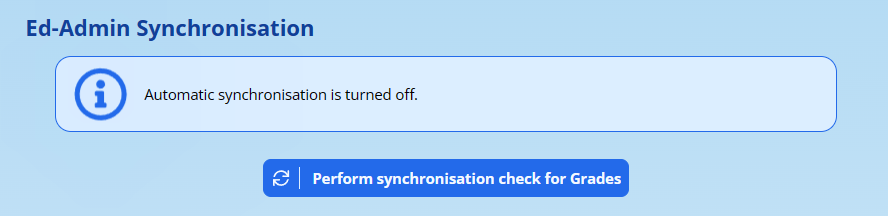

ADAM will query the Ed-Admin database to find a list of all grades that are in use. It will then show these grades with corresponding drop-down options next to each. Please choose the grade that ADAM should apply to those descriptors.

*Note: The order that the grades appear in will vary from server to server. Please be careful in case the order is not sequential.*

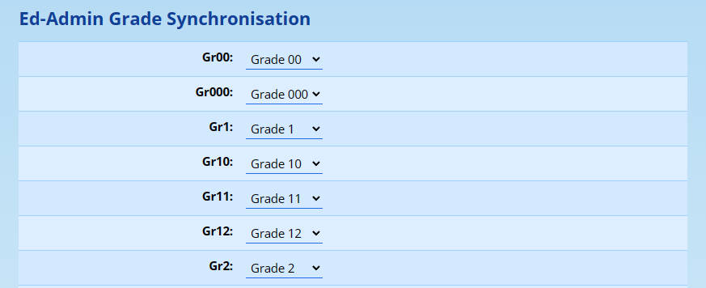

Once done, click on the **Save** button at the bottom of the page.

It is recommended to check your Grade settings before doing a synchronisation.

### Running a Manual Synchronisation

Navigate to **Administration → Import & Export → Perform Ed-Admin Sync**.

Choose whether to import Staff or Pupils by clicking on the appropriate button to begin the process:

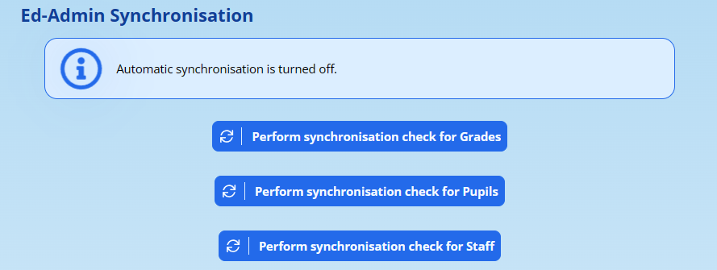

If you do not see these buttons, and rather only see the option to “Perform a synchronisation check for Grades”, then you must complete this step first. [Instructions are above](#setting-up-grade-definitions).

A list of pupils or staff will appear. Use the options at the top of the list to select which pupils or staff should be synchronised. If no pupils or staff can be retrieved from Ed-Admin, a warning will appear:

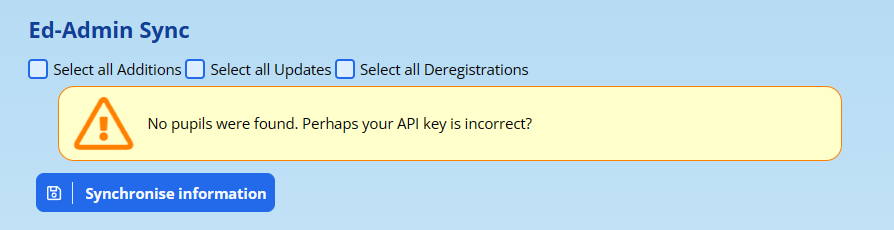

If this happens, check your settings and try again.

In spite of the tick boxes at the top, pupils/staff can be individually selected/deselected from the list for synchronisation.

Click on **Synchronise Information** to begin the process of pulling the information into ADAM.

### Changes in the Change Log

ADAM stores all changes to pupil and staff information in the change log. By conducting a synchronisation with Ed-Admin, the changes will be logged against the current user who will appear, in terms of that log, to be the user who made the changes.

## Google Integration with ADAM

@todo

## Moodle Integration with ADAM

Please see the separate section on [Moodle Integration](moodle-integration.md#moodle-integration).

## Papyrus Integration with ADAM

ADAM is able to integrate with the cloud-based library management system, [Papyrus](https://www.google.com/url?q=https://www.papyrus.co.za/&sa=D&source=editors&ust=1778246676833937&usg=AOvVaw3t_CgjBmywu3G25xtDxoQ2).

ADAM first needs to be configured to allow Papyrus access to the data in its database.

### Create an API Key for Papyrus

Follow the instructions for [creating a new API Key](api-access-to-adam.md#managing-api-tokens-in-adam).

The API Key will need access to all the following end-points. Use the “Ctrl” button on your keyboard while you click on each of them.

-   APIRequests/test/get
-   DataQuery/get/get
-   Pupils/image/get
-   Staff/image/get

### Create Data Query Secrets for Papyrus

Two DataQuery Secrets [need to be created](api-access-to-adam.md#create-a-data-query-secret): one for staff, and one for pupils. The secrets must all be associated with the API Key that you created in the first step.

The fields required by Papyrus are:

-   Pupils

-   Admin Number
-   Last Name
-   Preferred Name
-   Date of Birth
-   Age Group
-   Grade
-   Email

-   Staff

-   Admin Number
-   Last Name
-   First Name
-   Full First Name
-   Title
-   Gender
-   Initials
-   Position
-   Department
-   Appointment Nature
-   Teaching Subjects
-   Email Address

### Configuring Papyrus

Before you can configure Papyrus, please make sure you have completed the steps above. You will need your ADAM server’s URL address, the API token you generated, and the two secrets generated above. With this information in hand, contact Papyrus for instructions on how and where to enter this information.

## Wonde Integration with ADAM

[Wonde](https://www.google.com/url?q=https://www.wonde.com/za/home/&sa=D&source=editors&ust=1778246676836843&usg=AOvVaw0wynRTi95MY6YrdlDX-b-e) provides a go-between platform to synchronise information from ADAM to a variety of other service providers. In order to achieve this, Wonde needs to be given permissions to view and access the data in your ADAM database. Wonde needs access to the [ADAM API](api-access-to-adam.md#api-access-to-adam) in order to retrieve information from the database.

### Create an API Key for Wonde

Navigate to **Administration → Security Administration → Manage API Tokens**. Click on the option to **Add new API Token**:

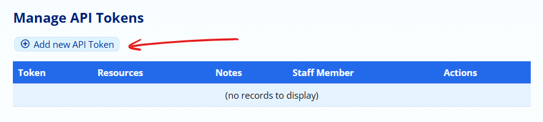

The API Key will need access to all the following **Resources**. Use the “Ctrl” button on your keyboard while you click on each of them.

-   DataQuery/get/get
-   FamilyRelationships/gamily/get
-   Pupils/image/get
-   Staff/image/get
-   XDevMan/currentpupils/get

In the Notes field, put the text “Wonde Integration”.

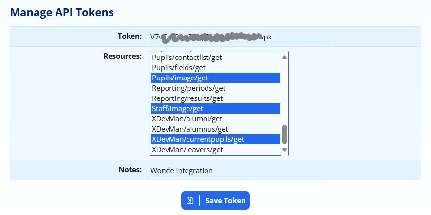

Click on the **Save Token** button.

Once saved, your API Token list should include an entry like this. The most important part is to ensure that the list of resources is identical to the list shown below:

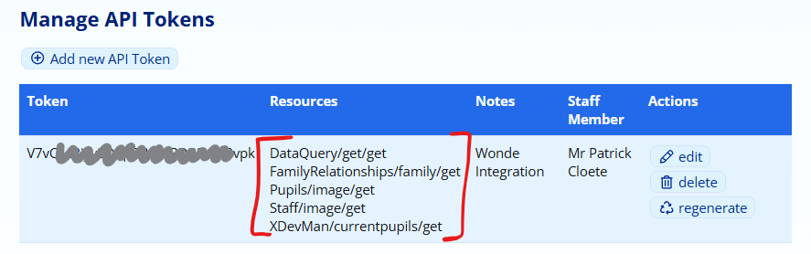

### Create Data Query Secrets for Wonde

You must first create an API Token (described [above](#create-an-api-key-for-wonde)) before you can proceed.

Three Data Query Secrets need to be created:

-   one for staff,
-   one for pupils, and
-   one for families.

Each secret allows access to specific fields from the ADAM database. Each secret is associated with a unique set of fields that you will need to configure.

Navigate to **Administration → Security Administration → Manage Data Query API Fields**.

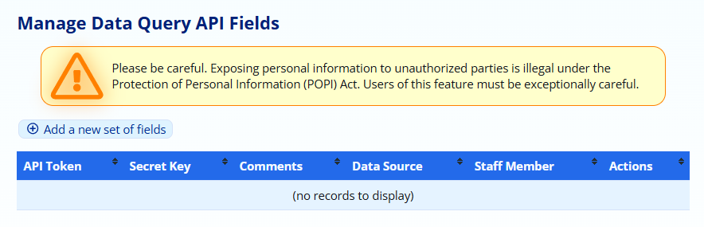

The following steps need to be repeated three times.

Click on **Add a new set of fields**.

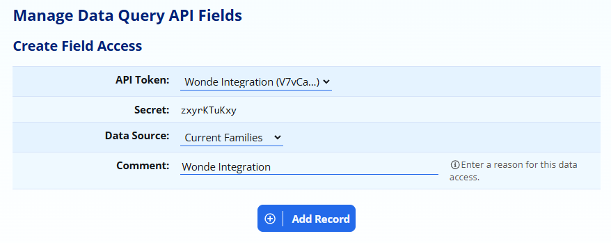

Ensure that the **API Token** shows the same “Wonde Integration token that you created in the first step.

Each of the three secrets that you create will use a different data source. The first will be **Current Pupils**, the second will be **Current Families** and the third will be **Current Staff**.

Put “Wonde Integration” as your **Comment** and then click on **Add Record**.

You will then see all the fields related to the data source that you chose. Here, we have fields relating to families:

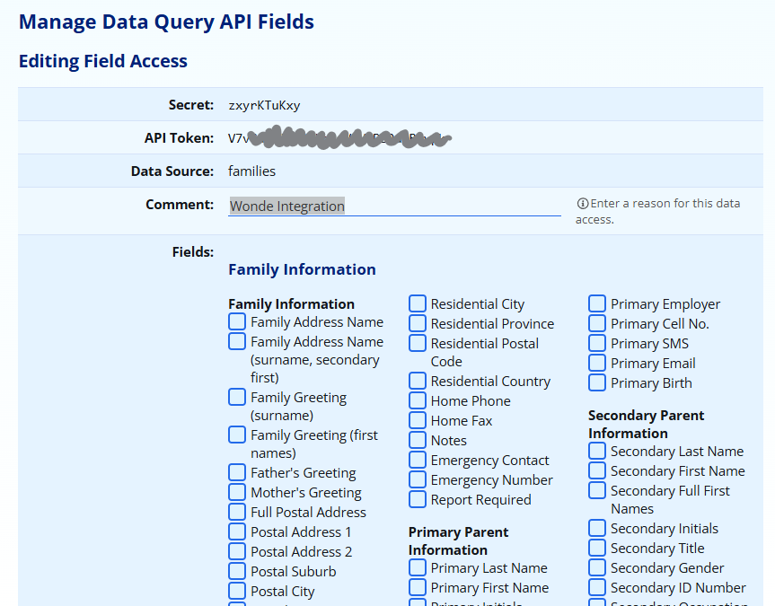

At the bottom of this list, click on “Show additional fields”. Some greyed fields will appear in the list.

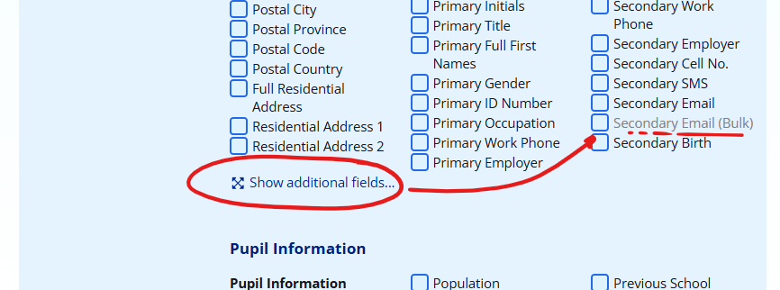

Tick all the fields so that Wonde has access to all the information *(NB: for family information, don’t tick the pupil fields that appear at the bottom - this is unneeded - and similarly, for pupils, don’t tick family information that appears at the bottom)*:

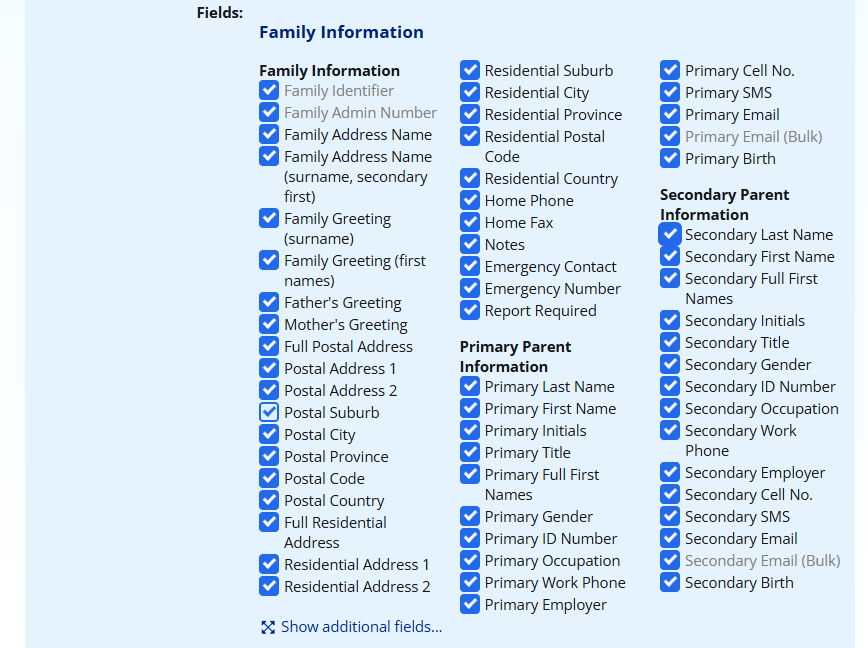

Click on **Save Details** at the bottom of the list.

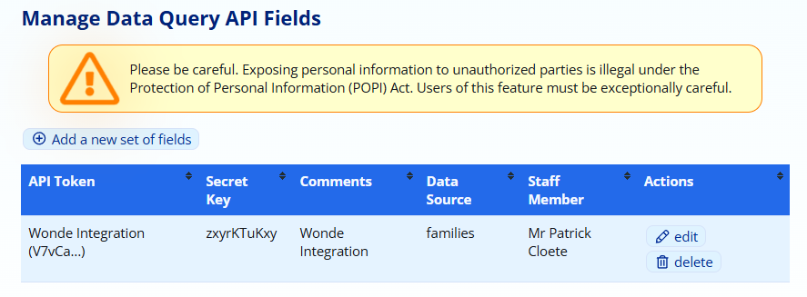

The data source and secret now appear in the list. Repeat these steps for the other two data sources.

### Information to Share with Wonde

You need to give Wonde the following information:

-   Your ADAM server URL where you log in (e.g. [https://demo.adam.co.za/](https://www.google.com/url?q=https://demo.adam.co.za/&sa=D&source=editors&ust=1778246676842681&usg=AOvVaw0K9RKOk_VWPhjr6Ku2CvXA));
-   The API Key that you created in the first step; and
-   The three Secret Keys that you created in the second step.

People who have access to this information will have access to all personal and private information that is stored about your pupils, families and staff members. It is therefore strongly recommended that you transmit this information to Wonde using secure means and, specifically, **we strongly recommend that you do not share this information by email**.

## SOCS Integration with ADAM

[SOCS](https://www.google.com/url?q=http://www.misocs.com/&sa=D&source=editors&ust=1778246676843442&usg=AOvVaw3m8FmvYn0TwYO9fiwJh4ss) is an online co-curriculum and calendar management system that many schools use to manage sports fixtures and programmes. ADAM is able to make information available to SOCS in their required format.

### SOCS Export

To get the exports working, you will need to do the following:

1.  In [Site Settings](changing-site-settings.md#changing-site-settings), under the **Third Party Integration** tab, look for the “SOCS” section.
2.  Enter a **Secret Key**. This is just a long random string of characters that will be the secret password for SOCS to access ADAM. We recommend at least 20 random characters. This does not need to be memorable since you will never need to type this in. Here is a website that can help you [generate a string of random characters](https://www.google.com/url?q=https://www.random.org/strings/?num%3D10%26len%3D20%26digits%3Don%26upperalpha%3Don%26loweralpha%3Don%26unique%3Don%26format%3Dhtml%26rnd%3Dnew&sa=D&source=editors&ust=1778246676844517&usg=AOvVaw060cJRQZQUUAoG73trP9TS).
3.  If you have sports houses captured as classes in ADAM, configure the subject as needed. If you don’t, and if your pupils’ houses are not important, you can leave this as your default registration class. The **Sports House** setting is on the **General** tab in the Site Settings.
4.  Save these changes to your Site Settings.
5.  Send the URL to your SOCS export to your SOCS contact. The URL is described in more detail below.

### The SOCS URL

You need three components to make up the URL:

1.  Your server’s ADAM address. For example:

https://demo.adam.co.za

2.  Next you add the following text to the URL, exactly as it appears:

/api/socs/

3.  Finally you add your secret key (please don’t add this one!):

abcdefghijklmnopqrst

Your final URL will look like this:

https://demo.adam.co.za/api/socs/abcdefghijklmnopqrst

Test your link by copying and pasting it into the address bar of your web browser. You should see output that looks similar to this:

<Pupils>
 <Pupil>
   <Firstname>John</Firstname>
   <Middlenames>James</Middlenames>
   <Knownname>John</Knownname>
   <Surname>Doe</Surname>
   <Initials>JJ</Initials>
   <Gender>M</Gender>
   <YearGroup>10</YearGroup>
   <Formname>Grade 10</Formname>
   <Housename>Blue House</Housename>
   <EmailAddress>pupil\_1754@adam.co.za</EmailAddress>
   <UniquePupilIdentifier>55012</UniquePupilIdentifier>
 </Pupil>
 <Pupil>
   ...

If you get a “403 - Forbidden” error, it is likely that your secret key is incorrect.

If you get any other error (notably, a “404 – Not Found” error), that will indicate that your URL is incorrect.

Once you have verified that your URL works, send this to your SOCS representative and they will provide further information on how to perform synchronisations from within the SOCS portal.

### Pupil Identification to SOCS

ADAM will use the pupil’s “administration number” as configured in their profiles to uniquely identify a pupil to SOCS. If the administration number changes, then SOCS will treat this as a new pupil having entered the school and the previous one of having left.

Notably, if you’ve been using SOCS before, the admin numbers that were in use must match otherwise the pupils won’t match and historical information will be lost! The synchronisation process will assume that the pupils are new pupils and will delete the pupils it can’t match.

## SportCap Integration with ADAM

[SportsCap](https://www.google.com/url?q=https://www.sportscap.co.za&sa=D&source=editors&ust=1778246676847900&usg=AOvVaw17YgDMPz3Hacb7-H7DM3rd) is a sports and fixture management system for schools with direct integration to the SA Rugby “BokSmart” system. SportsCap can pull information directly from ADAM to populate its database.

### Requirements:

-   An API Token that allows access to the three DataQuery endpoints:

-   DataQuery/get/get
-   DataQuery/getone/get
-   DataQuery/getsince/get

-   Two [DataQuery Secrets](api-access-to-adam.md#create-a-data-query-secret) both linked to the API Token above, one for Pupils and the other for Staff. The fields required are:

-   Pupils:

-   ADAM Idenfitier *(click “show additional fields”)*
-   Last Name
-   Preferred Name
-   Date of Birth
-   Gender
-   ID Number
-   Population

-   Staff:

-   ADAM Identifier *(click “show additional fields”)*
-   Last Name
-   First Name (Preferred)
-   Gender
-   Population
-   ID Number
-   Birth
