# Timetable Module {#h-hpdeljllmcbc}

The timetable module displays current timetables in ADAM for staff and pupils, and allows both to subscribe to their timetables using third-party calendar software, including Google Calendar, Microsoft Outlook and the Calendar App on iPhones and iPads.

## Creating a Timetable {#h-klnf623z9grp}

<iframe src="https://www.youtube.com/embed/cYVtdd6xuyk" frameborder="0" allow="accelerometer; autoplay; encrypted-media; gyroscope; picture-in-picture" allowfullscreen></iframe>

The process of creating a timetable is a reasonably simple one. Usefully, one school can have multiple timetables so it is possible for schools with combined prep and high schools to enter and manage their timetables separately or with different numbers of schedules etc.

Start by visiting the **Administration** tab. Look under the **Timetables** heading and click on **Manage Timetables**

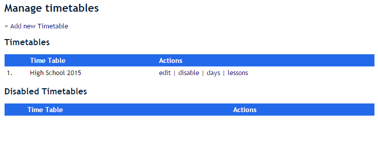

To add a new timetable, click on the **Add new Timetable** option at the top of the page.

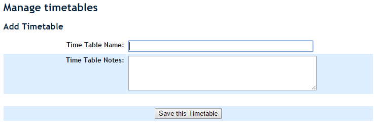

#### Adding Days to a Timetable {#h-wytf6nddw5vn}

A timetable will be made up of a number of days. It is useful to clarify some terminology at this point.

Timetables that have a simple five-day schedule where Mondays are Mondays (which sounds obvious!) or perhaps have a two week schedule where Mondays could be “Monday A” or “Monday B” are said to be **fixed timetables**. Some schools use a rolling schedule where the first day of school is “Day 1” which is followed by “Day 2”. Once you reach the end of a cycle, you start back at “Day 1” again. These are called **rolling timetables**.

This difference will be important later when setting up the calendar.

Once you have added your timetable, click on the **days** link that appears next to it:

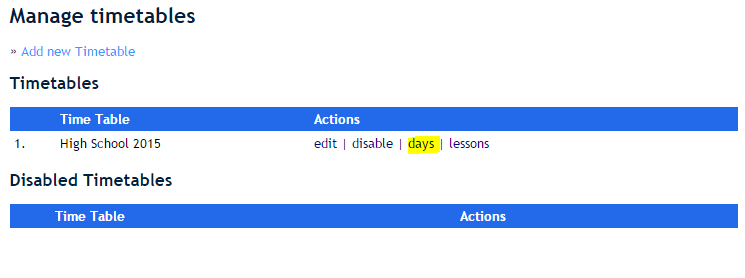

On the next screen, enter as many days as you need for your timetable:

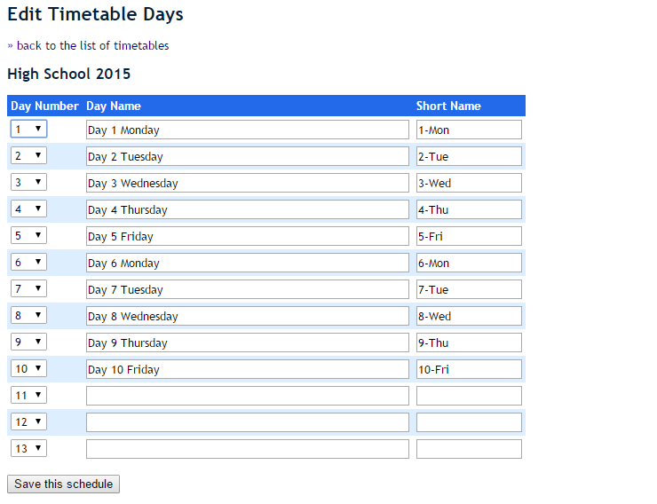

Initially, only 10 days will be shown. If you require more days, simply save the first ten and then three blank days will be added to the bottom. You can continue to add an indefinite number of days.

Once you are satisfied with your days, you can click on the **Save this Schedule** button at the bottom of the screen.

## Creating Daily Schedules {#h-5gedwwc8rueo}

<iframe src="https://www.youtube.com/embed/VI3cl1n0mBA" frameborder="0" allow="accelerometer; autoplay; encrypted-media; gyroscope; picture-in-picture" allowfullscreen></iframe>

A daily schedule refers to the times for the lessons on a particular day. Many schools have a “week day” schedule and a slightly different “Friday” schedule (perhaps because of an assembly). Some schools also have different schedules for different grades - this often happens when boarders eat lunch in two sessions in the dining hall.

You can create as many schedules as you need. Make sure to name them clearly so that you can easily refer to them later.

Importantly, at a minimum, a schedule applies to one grade on one day. A single grade cannot have multiple schedules on the same day.

To add a new schedule, navigate to **Administration**, then under the **Timetables** heading, click on **Manage Schedules**.

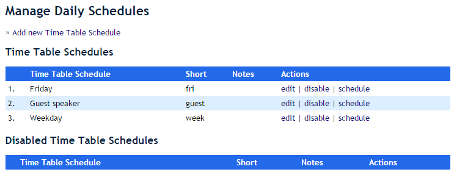

To add a new schedule click on the **Add new Timetable Schedule** link. To edit one, please click on the corresponding **edit** option.

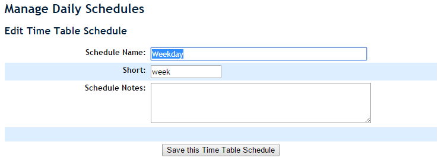

Note that if you disable a schedule that is already in use (either for a day gone by or perhaps a day still coming in your timetable calendar), it will not have any impact. However, it will no longer show as an option for an available schedule when you edit the day in the calendar.

To edit the times for a schedule, click on the corresponding **schedule** link shown on the right in the table of schedules that you’ve created.

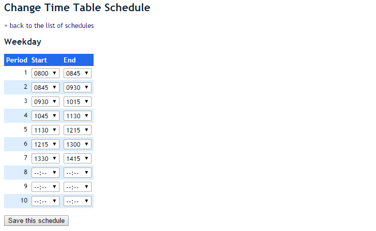

For each lesson, simply enter the start and end times.

Note that if, for example, a certain schedule requires that you move lesson 7 to the start of the day, that this is easily achieved. It is also possible to drop a lesson. The schedule below illustrates two points:

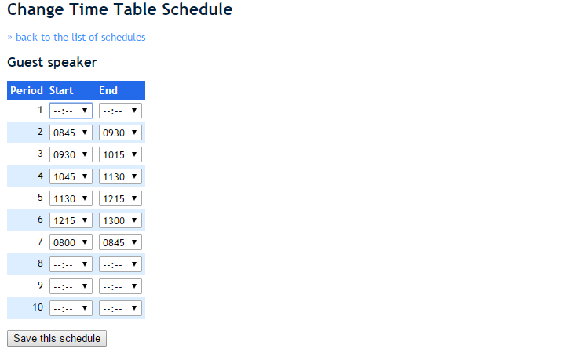

Firstly, note that lesson 1 has no times associated with it. In this schedule, there will not be a lesson 1. Note also the start and end times of lesson 7. This lesson will be scheduled to happen first in the day, ending at 08h45 and this is then followed by lesson 2 which starts at 08h45.

## Adding Lessons to the Timetable {#h-p9iuvz2tl7vr}

<iframe src="https://www.youtube.com/embed/wkhb8lUUIfc" frameborder="0" allow="accelerometer; autoplay; encrypted-media; gyroscope; picture-in-picture" allowfullscreen></iframe>

The steps above setup the framework for the timetable. It is now time to capture the actual lessons.

From the **Manage Timetables** menu option, click on the **lessons** link next to the corresponding timetable.

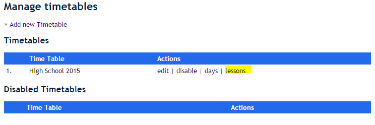

Next to each grade, ADAM shows the number of classes that have been assigned to lessons. Click on the **edit** link to edit a particular grade’s timetable:

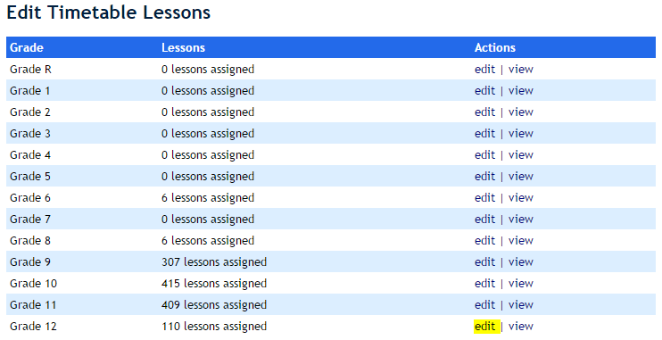

At the top of the screen is a list of all the classes that are assigned to that grade as well as all the classes that have no grade assigned:

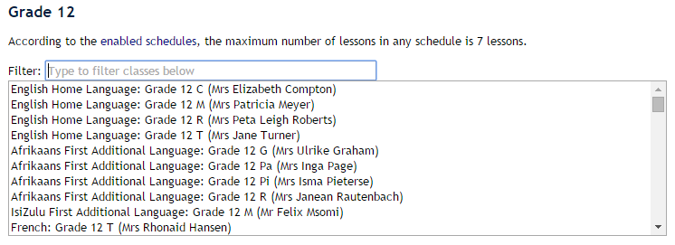

The filter box at the top allows you to type in any part of the name as it is displayed in order to limit the classes that are shown. You can filter by typing in part of the subject name, part of the teachers’ names or even part of the class description. If, for example, your timetable has a group of subjects that are always timetabled together, often called “lines” or “choices” in high school timetables, you might include the “line number” in the class description. For example, this school includes the descriptor “L6” for “Line 6”:

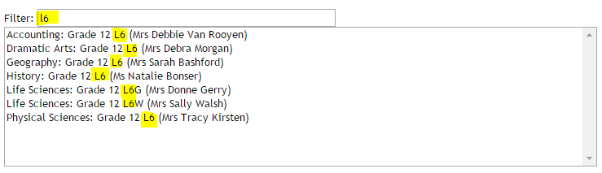

The box of classes allows you to select multiple classes by holding down “Ctrl” on your keyboard while you are clicking on the different classes you want. You can deselect a class by “Ctrl+Click”ing it again.

Once you have selected the correct classes, you need to tick the boxes in the grid below when those classes are taught:

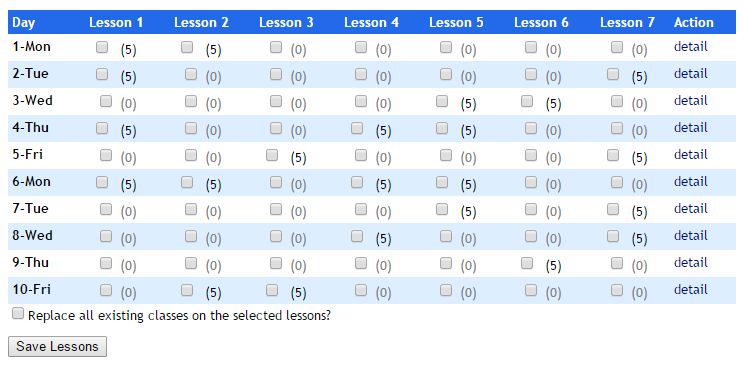

Please take note that all classes will be **added to existing classes** in the period. If you wish to remove a class, you will need to click on the box at the bottom and all the ticked lessons will be **replaced** with the lessons that you selected at the top.

By hovering your mouse over one of the numbers in brackets (an indication of how many classes are taught in that lesson, according to this timetable), you will get a notification of which classes are selected.

You will also notice that all other lessons that share the same combination of classes are also highlighted:

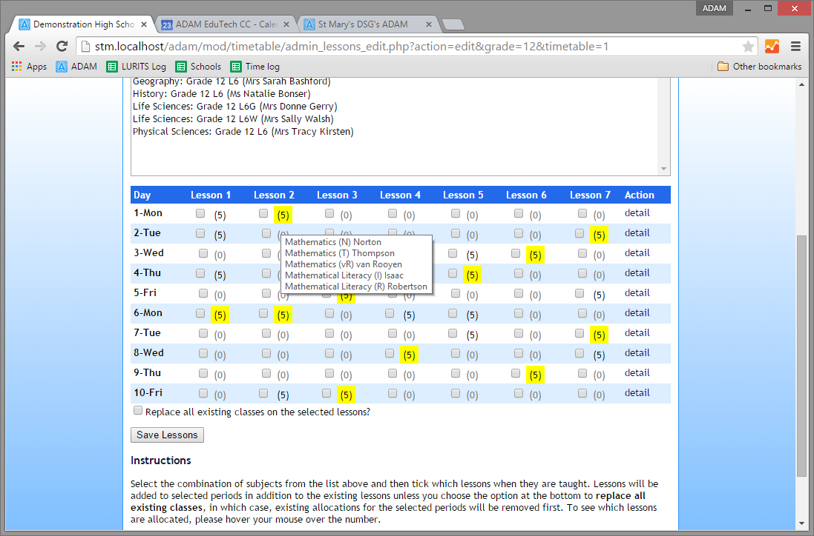

The diagram above shows all the Mathematics lessons in the timetable (note the message that is shown in the hover-hint).

One can click on the check-boxes individually, but by clicking on the yellow number, it will also tick all the other matching (highlighted) tickboxes. This allows you to change multiple lessons easily if there are mistakes.

## Adding Days to a Calendar {#h-4dyracbn67lz}

<iframe src="https://www.youtube.com/embed/A79nSgj-gEA" frameborder="0" allow="accelerometer; autoplay; encrypted-media; gyroscope; picture-in-picture" allowfullscreen></iframe>

Once you have set up each grade with their timetable it is important to tell ADAM which dates correspond with which days in the timetable and, of course, with which schedule.

On the **Administration** tab, under the **Timetables** heading, click on the **Manage calendar** option.

Firstly, it will help to identify the type of timetable that your school uses. These are either “fixed” or “rolling”.

-   A **fixed timetable** is one that operates off a week-based cycle. This might be 5 days or 10 days with a “Week A” and “Week B”-type setup. In these cases, Mondays are Mondays (could be Monday A or Monday B, but still a Monday). If a public holiday falls mid-week, the day that it falls on is generally lost as a teaching day, and does not affect the other days around it.
-   A **rolling timetable** is one that operates off a cycle of a number of days. Seven-day cycles are popular, but certainly there are other options. In this case, the school term starts with “Day 1” and proceeds through the timetable until the last day is reached and then they start again with Day 1. Day 1s are not fixed to Mondays. If a public holiday falls mid-week, the timetable carries on around it. If it was Day 2 before the holiday, it will be Day 3 on the day after it.

#### Adding multiple days to the timetable {#h-c6bg6nfu6swk}

Click on the option to add multiple dates to the calendar.

1.  Choose the start and end date for the term.
2.  **If you use a rolling timetable** please indicate which dates should be excluded from the calendar. This would include public holidays and other schools days that you might not have formal academic teaching on. If you use a **fixed timetable**, please ignore this block. Placing dates in here will cause your fixed timetable to fall out of sync with the working week.
3.  Choose which days of the week are school days. This is likely to be Monday to Friday for most schools. *Note that this does not prevent Saturday school from being scheduled, but if your Saturdays are not a dedicated part of your timetable, they should be excluded here and added later.*
4.  Select all the cycle days that should apply. Note that if you have more than one timetable active (e.g. prep and high school), you will see all the available days here. It is important to choose days from a single timetable! You can only schedule one timetable at a time. Use the “Ctrl” button on your keyboard to select multiple days.
5.  Choose which grades you would like to work with. If you have a timetable that involves separate schedules for juniors and seniors (perhaps they have different break times), then you will need to repeat this process for juniors and seniors separately.
6.  Choose the first day of the cycle. This should correspond with the date you chose as the starting date in the cycle (see step 1 above). This is important for fixed timetables. If you started school on a Wednesday, ensure that you select the Wednesday option from this list. If you are a **rolling timetable**, it is likely that you will start on “Day 1” regardless of the actual day of the week. In subsequent terms, you may want to start on a different day or, in the case of a fixed timetable, even a different week. If you have a **fixed timetable**, then your first day of the school term may well fall on a Tuesday or Wednesday and should be chosen appropriately here.
7.  Choose the schedules that you need for each day. If your timetable runs Monday to Friday, you can simply ignore the Saturday and Sunday schedules - they won’t be used.
8.  Finally, click on **Add calendar days**.

ADAM will now add these days to the calendar with the appropriate schedules.

You can run this procedure multiple times for different grades, or to change the settings for grades if you need to.

For example, you may wish to schedule Grade 12s separately so that you can take into account their exam dates without having to edit individual days later.

#### Editing or Adding Individual Days {#h-7extqa1co1zu}

It is possible to edit existing days or add individual days to the timetable. To do this, click on the **edit** link next to a day or click on the option to add a single day.

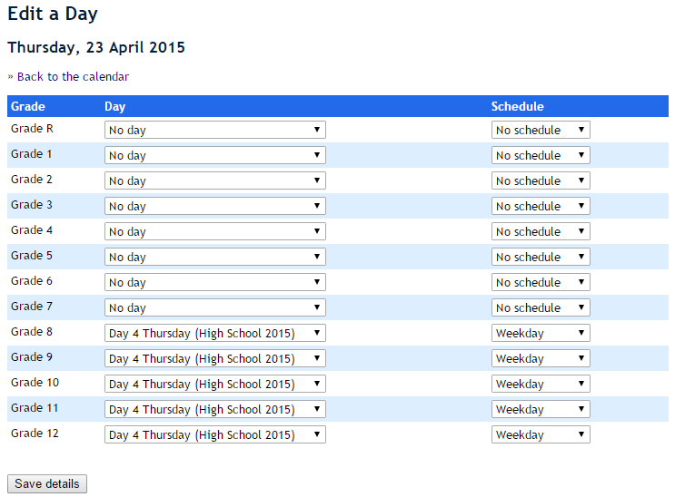

On this page, you can change the schedule for one or more grades and change the day that is associated with each grade.

If you have a guest speaker on a specific day, you can change the schedule for that day by first creating a new schedule (see above) and then assigning that schedule to the grades.

If you wish to run the timetable from a different day, simply choose the new day from the dropdown list. Note that ADAM does not do any checking to ensure that there are no clashes. Thus if you mix days that result in any timetabling clashes - intentionally or accidentally - ADAM will not alert you to this fact in any way.

It is also possible to set no lessons for a particular grade (perhaps they are on an excursion or writing exams). Simply change the timetable day to “No day” for that grade.

#### Removing an entire day from the timetable {#h-r5ylfz7mxkpi}

On public holidays, you may wish to remove the lessons from the timetable. From the screen that lists the calendar days, click on the **remove** link next to the date of a public holiday.

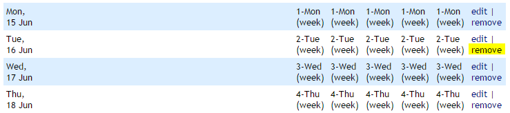

## Subscribing to a Timetable {#h-8xmm4hc11xwi}

<iframe src="https://www.youtube.com/embed/_Uy2YPnefjs" frameborder="0" allow="accelerometer; autoplay; encrypted-media; gyroscope; picture-in-picture" allowfullscreen></iframe>

When looking at a staff or student timetable, also in the pupil portal, a link is provided to an iCAL file which is a standard method of importing calendar entries. This is supported by all major calendaring software, including Outlook, Google Calendar and the iOS Calendar apps.

The exact method of adding a calendar to these programs is different and you are encouraged to search for the instructions for your chosen calendaring software. However, for all of these, you will require two things.

1.  Your ADAM installation must be visible from the greater Internet. Typically, if you can work on ADAM from home, this is in place.
2.  You will need the URL of your timetable. This is provided as a link at the top of your timetable (whether staff or pupil). Right-click and copy the link address. You can now use this to subscribe to the calendar from within your favourite app.

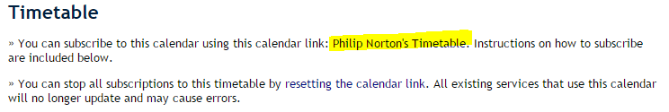

*Please note that* *[pupils require privileges](security-administration-for-families-and-pupils.md#h-mg1sc7iv8w2n)* *to view and subscribe to their calendars in the Parent and Pupil Portal.*

## Resetting a Timetable Link {#h-rrg907re98m0}

When you copy the timetable URL for the first time, ADAM will generate a random 30-letter key that can access your timetable alone. Guessing this key is statistically impossible so if someone doesn’t know your key, they won’t be able to subscribe to your calendar.

However, it may happen that you wish to change this random key to prevent someone who has access to your timetable from continuing to receive updates to it. This can be done using the option at the top of your calendar:

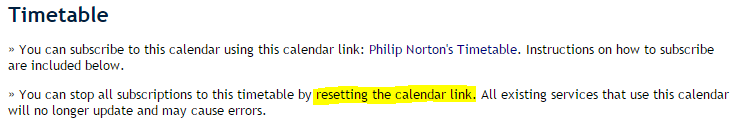

Changing this calendar link will cause *all* existing calendar subscriptions to break. You will need to resubscribe any calendars that you use to the new link.
