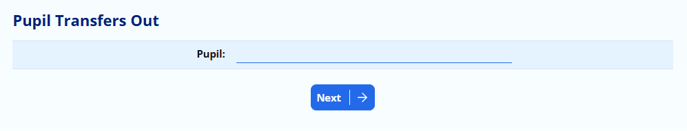
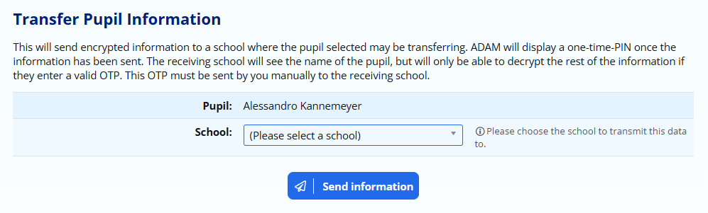
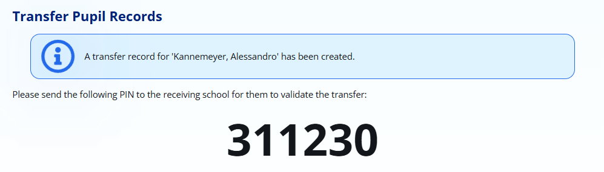
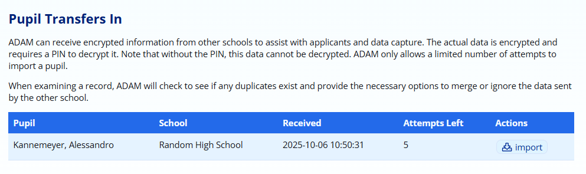
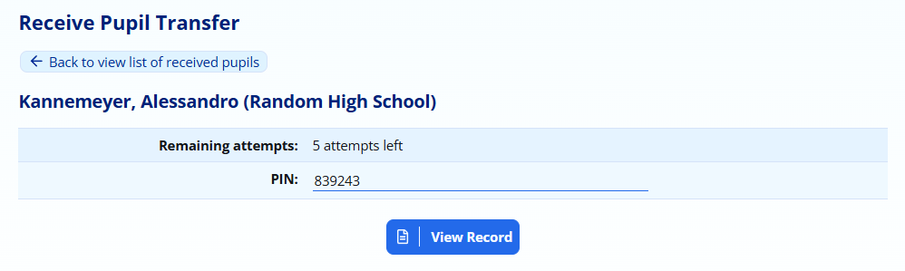
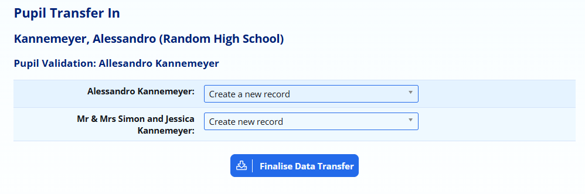

# Transferring Pupil Information Between Schools {#h-gzpu9gv34kdg}

ADAM is capable of allowing individual pupil records to be transferred between ADAM schools. This is useful for feeder prep schools where children apply to the high school automatically, for example.

The following information is transferred:

-   Pupil Profile Information

-   Past reports
-   Current photograph
-   Name pronunciation recording

-   Family Profile Information

## Security Considerations {#h-sgofcl888bt1}

Sharing personal information is something that needs to be done carefully and with authorisation of the people concerned. Doing so without permission is likely to be a breach of the POPI Act.

To this end, ADAM has some precautions built in to mitigate against accidental data breaches.

-   Information can only be “pushed” from one school to another. It is not possible to “request” or “pull” information from a school.
-   Information is encrypted before sending with the exception of the first and last names of the pupil and the school that sent the information. Sending schools are provided with a PIN code that must be sent to the receiving school to decrypt the information. Without the PIN, the information cannot be read.
-   Transfer requests can have the PIN entered incorrectly 4 times. On the 5th time, the information will be deleted from the receiving database.
-   Transfer requests that have not been actioned within a week are deleted.

## Initial Setup {#h-ov1pjrv6k9i8}

The receiving school should nominate one or more people to be notified of incoming data transfers. Navigate to the [Site Settings](changing-site-settings.md#h-3j2qqm3) and on the **Admissions** tab, scroll down to the bottom for the section **Pupil Transfers In**. Add in one or more email addresses, separated by commas, that should be notified when a new pupil is transferred to the school.

## Transfers Out {#h-pjrs1tbqyf55}

All data transfers are initiated by the school with the information who wish to transfer it to a school without the information.

Click on **Admissions → Pupil Administration → Pupil transfers out**.

Enter the name of the pupil and click on **Next**.

Select a school to transfer the information to and click on **Send information**.

ADAM now begins the process of transferring information from your ADAM server to the selected school. ADAM will show your a 6-digit PIN number which must be sent to the receiving school. Without this PIN, they will be unable to do anything with the transferred information.

## Transfer In {#h-i93rqmams6hb}

When a pupil’s information is transferred to your server, you will be notified by email (see [Initial Setup](#h-ov1pjrv6k9i8) above). You can also navigate to **Admissions → Pupil Administration → Pupil Transfers In**.

Clicking on this list will show you a list of pupils waiting for processing:

Click on the **import** button to begin the process.

Enter the PIN and click on **View Record**:

With the correct PIN, ADAM will be able to decode the received information and check to see whether there are any duplicate pupils or families in the database. Assuming there are none, click on **Finalise Data Transfer**:

If there are duplicate records, you have the choice of keeping your existing information, or you can get ADAM to create a new duplicate record. Note that this is not advisable!

If ADAM has transferred any existing documents (photographs, reports, name pronunciation audio), these will be linked to the chosen pupil profile.
