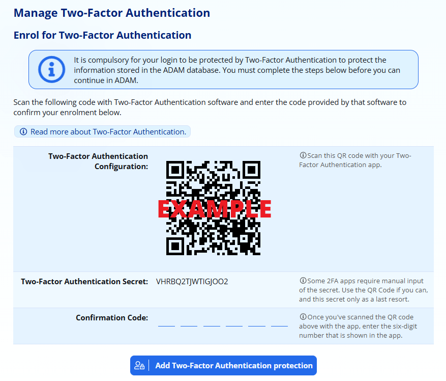
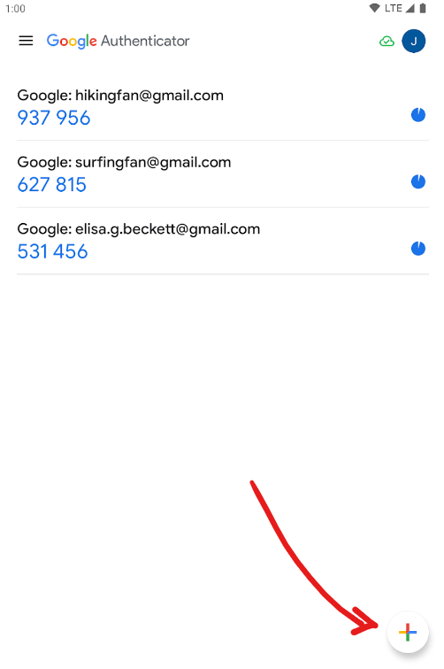
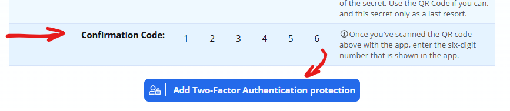
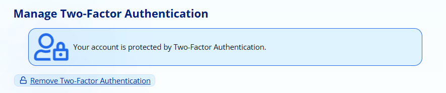
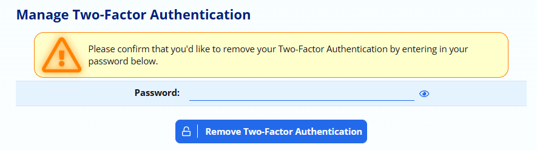
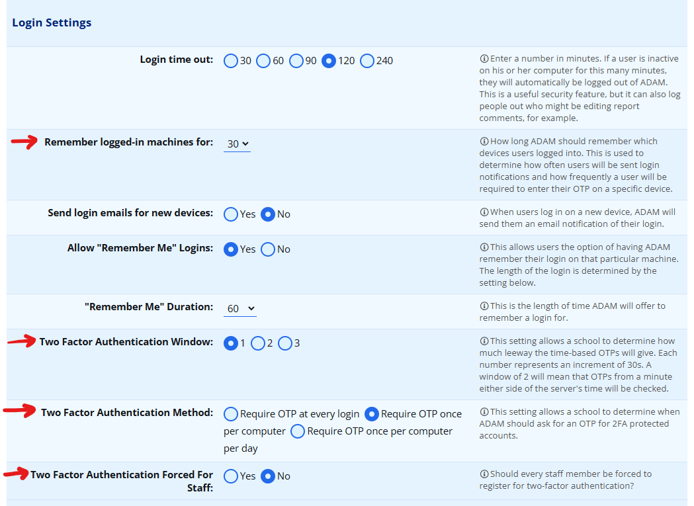

# Two-Factor Authentication {#h-b1063cc7cpby}

## Introduction {#h-187mizzfwor6}

The data stored in the ADAM database is very sensitive data. To help protect this data, ADAM allows you to protect your account with Two-Factor Authentication (2FA).

Two-factor authentication is used by many banks to ensure that your transactions are genuine: when you initiate a payment or transaction, you are asked to type in a a “one-time-PIN” (OTP) or approve the transaction from your phone. The OTP, or the approval from your phone, is known as the “second factor” in the authentication process.

An account protected with Two-Factor Authentication will not allow a login without the one-time-PIN.

ADAM’s two-factor authentication system works using an Authenticator App that must be installed onto your phone. The Authenticator App will generate the One Time PIN. It is not sent by SMS and it is not linked to any specific phone number. After it has been set up, the app will not require any airtime or data to use.

***NB: 2FA is automatically enforced for all elevated privilege accounts. Schools can optionally require that all staff make use of 2FA. Any staff member can add 2FA to their account using voluntary enrolment.***

## Supported Authenticator Apps {#h-yl9vruhmlx8o}

There are many different Authentor Apps that you can use. Popular ones include **Google Authenticator** (by Google LLC), **Microsoft Authenticator** (by Microsoft Corporation), or **Twilio Authy Authenticator** (previously simply “Authy”, by Twilio).

Google Authenticator

Microsoft Authenticator

Twilio Authy Authenticator

All of these apps are available for download from your preferred app store.

If your school makes use of Google Workspace, we recommend using the Google Authenticator. If your school makes use of Microsoft 365, we recommend using Microsoft Authenticator.

## Adding Two-Factor Authentication to your account {#h-29mftoqewdvu}

First, [download and install an authenticator app](#h-yl9vruhmlx8o) from your app store.

Visit your ADAM login screen and login as normal.

**Compulsory Enrolment:** If you are forced to add 2FA to your account, you will immediately be taken to the following screen after you log in to set up 2FA.

**Voluntary Enrolment:** If you are enabling 2FA voluntarily, visit **Staff → Security Administration → Manage Two-Factor Authentication**.

ADAM will display the following screen:

*Note that in the picture above, we have intentionally corrupted the QR code so that you cannot scan this example! You must scan the QR code that appears on* ***your*** *screen! That QR code contains the “Two-Factor Authentication Secret” which is shown below. Scanning the QR cide is a short-cut to save you from having to type that secret code into your phone.*

Now, open the two-factor authenticator app that you installed from your app store. Find and choose the option to “Add a new account”. The app will ask for the necessary permissions to access the camera and scan the code.

For example, in the Google Authenticator App, you would click on the “+” icon that appears at the bottom right of the screen:

*An example of three accounts that have been set up for Two-Factor Authentication and how they appear in the Google Authenticator App. If you use a different App, it will look different!*

Once the QR code has been scanned, and confirmed, The Authenticator App will then show the account in the list, and a six-digit number will appear below it.

The last step is to confirm to ADAM that the secret has been successfully saved in your Authenticator App. Do this by entering in the One-Time PIN that is shown on your app to confirm. Type it in to the **Confirmation Code** block.

Finally, click on the button at the bottom of the screen: **Add Two-Factor Authentication Protection** to confirm the PIN and add 2FA to your account.

If you entered the confirmation PIN correctly, you will see this screen:

If you entered the OTP incorrectly, ADAM will display an error message. Simply retry entering the PIN. If it fails again, you may need to re-scan the QR code.

## Removing Two-Factor Authentication {#h-2hm8qbjlvrnd}

Once you have added two-factor authentication, you can remove 2FA by visiting **Staff → Security Administration → Manage Two-Factor Authentication**. If it is enabled on your account, you will see the following:

Click on the **Remove Two-Factor Authentication** option at the bottom to begin the process.

You must then enter your ADAM password to confirm that you’d like to remove Two-Factor Authentication from your account:

Once removed, ADAM will show the options to re-enrol your account in the Two-Factor Authentication setup, including a new QR code. If you see the QR code, then your account is no longer protected by Two-Factor Authentication.

Please note that if your account requires Two-Factor Authentication, if you remove it, you will be forced to re-add two factor authentication immediately and will not be able to use ADAM until this is done.

## Frequently Asked Questions {#h-qv2e32ird20o}

### ADAM is not sending me the OTP. How do I log in? {#h-fn4mqq9jdils}

ADAM does not send the One-Time PIN (OTP) - it is generated by the Authenticator App on your phone. You need to open the Authenticator App and get the OTP from within the App.

The OTP is generated by the App. It does not use any data and does not require you to have any airtime on your phone, and you don’t need any cell reception.

### How do I log in if I don’t have my phone with me? {#h-5lrwtlti8ga5}

The short answer is that you can’t!

Your ADAM administrator will be able to [remove two-factor authentication from your account](#h-ta6m1glm98oa). You will then be able to log in normally without having to provide a one-time-PIN.

Again, note that if you choose to re-enable two-factor authentication on your account, you will need to scan a new QR code which will generate different OTPs to your old scan.

If you are the ADAM administrator from your school and you lose your phone and are therefore unable to login to ADAM, you will need to contact us for support. We will then need to perform a manual verification process to ensure that your request is genuine.

### I have a new phone or don’t have the App installed anymore. How do I log in? {#h-s4nwp25nnhcb}

The short answer is that you can’t.

See above for how to have Two Factor Authentication removed from your account to allow a log in.

### I removed the app because I don’t want to use two factor authentication any more. Now I can’t log in. {#h-xxulapi88g0c}

Please be aware that the only time that ADAM and your Authenticator App will communicate is when the QR code is first scanned. After that, there is no synchronisation or communication of any kind between ADAM and the Two-Factor Authentication app that is installed on your phone.

!!! warning
    If you remove the app from your phone, or remove the ADAM OTP from within the app, it does not remove Two-Factor Authentication protection from your account. If you remove the code from your app before you remove two-factor authentication from your account, you will no longer be able to log in.

Similarly, if you remove the protection from your account, it does not automatically remove the code from your app.

If you lose your phone or are unable to generate an OTP for whatever reason (perhaps your battery is flat), only your [ADAM administrator can remove the 2FA protection](#h-ta6m1glm98oa) from your account.

### I have two ADAM logins and need to scan two different QR codes for the two different accounts. Can I do this? {#h-16nmwamj9lze}

Yes, most authenticator apps will support multiple accounts. Please be aware that if you scan a second QR Code for the same ADAM server, the Authenticator App *may* ask you if you want to replace the OTP.

Most authenticator apps will also allow you to rename the OTP entry so that you can differentiate between the two entries in your phone.

### The Authenticator App shows me two OTPs. Which one do I use? {#h-9tglsl5pibug}

If you remove and re-add Two-Factor Authentication, you will have to scan a new QR Code. Sometimes this means that your Authenticator App will have two entries. Each time ADAM generates a new QR code, it comes with a different secret code which means that every QR code will provide different OTPs.

You cannot use the OTPs generated by an old entry. Please make sure that you remove any old entries that are no longer applicable to avoid confusion!

Sometimes it can be easier to have your ADAM administrator remove your Two-Factor Authentication and then sign up from scratch. Once two factor authentication has been removed from your account, please remember to remove all OTP entries in your Authenticator App before scanning the new QR code.

### I can’t enrol in 2FA because my confirmation code is wrong. {#h-u665ef97fcay}

This is very rare, but it can happen. Please make sure that your phone time is accurate.

If this issue suddenly affects lots of users, and if your server is hosted on your network at school, it could also be an issue with the server’s time synchronisation and your network administrator may have to investigate further.

OTPs are generated according to the time of day. The ADAM server knows the current time, your phone knows the current time, and so at any specific time, ADAM can check if the code is the correct one that should be generated by the app.

Most phones will set their time automatically from external sources - often from the network provider. In general these times are accurate to within a few seconds of universal time. However, some phones have been seen to NOT update their time and run a minute or more out of sync with universal time.

If this happens, there will be a mismatch between the codes that your phone generates and the code that the server is expecting.

## Setting up your ADAM server for Two-Factor Authentication {#h-6e2wh5ojpymj}

2FA is ready to be used by any individual staff member and no additional setup is required. However, it is possible to force that 2FA is used by all staff and some other settings that control how often the OTP is requested.

### Two-Factor Authentication Settings {#h-2wco9g5ryhcj}

Within the Site Settings, navigate to **Security** tab and scroll down to the **Login Settings** heading.

The relevant settings are highlighted below:

### 2FA Authentication Windows {#h-dowb5p8fl82o}

The **Two-Factor Authentication Window** determines how many OTPs should be allowed on either side of the window. Because OTPs are time-based, discrepancies in the user’s cellphone time and server time can play a factor.

In most scenarios, these two clocks should be independently set (phones by GPS, servers by network time servers (NTP)) and should be very close to one another. This might not always be possible. To increase the life-span of an OTP, increase the window.

Each window represents 30 seconds. The default setting is 2 and will cause the server to check OTPs 2 windows ahead and 2 windows behind its current time to allow for time discrepancies. This can be increased to 3 (not advised) which effectively increases the lifespan of any OTP to 3 minutes - 1,5 minutes behind and 1,5 minutes ahead of the server’s current time.

1 is the most secure setting and 3 is the least secure setting. This is because smaller windows mean it is harder to “steal” and later use an OTP because it is valid for a shorter period of time.

### Forced Use of 2FA {#h-99swwcxg3sxt}

Administrators can force all staff members to make use of Two-Factor Authentication by changing a setting the [Site Settings](changing-site-settings.md#h-3j2qqm3). Within the Site Settings, navigate to **Security** tab and scroll down to the **Login Settings** heading.

Change the setting **Two-Factor Authentication Forced For Staff** to “Yes”.

When implementing 2FA across your entire staff body, we encourage a phased in approach before implementing this setting. Please be sure to conduct training with your staff that use ADAM and get as many of them as possible to use the feature to [voluntarily enrol](#h-29mftoqewdvu) for two-factor authentication before it becomes a mandatory requirement.

### Changing How Frequently is the OTP required {#h-u4cnlqne7ckn}

The **Two-Factor Authentication Method** determines when users will be requested for their OTP. The default option is at every login, but this can be frustrating to users who make use of ADAM throughout the day. Other options are to remember it once per computer or once per computer per day.

#### Require OTP at every login {#h-y3yuhktt2u25}

If this is set, your staff members will have to enter their OTP each time they log into ADAM. This is very secure, but can also be frustrating for your staff, especially for those that use it many times per day.

#### Require OTP once per computer per day {#h-cgdqmuqtmjh9}

ADAM will ask the users once each day on each device that the user logs in with for their OTP. This is the best balance between security and usability without frustrating users too much.

#### Require OTP once per computer {#h-28keddvutf8t}

Whenever ADAM detects that a user is using a new computer, it will ask them for an OTP. If they are using a computer that they’ve used in the past, ADAM won’t ask them for an OTP. This is normally fine for users who have dedicated computers that they alone use. Note that ADAM may still ask for an OTP from time-to-time, but it may be as infrequently as once per month.

If the “once per computer” option is chosen, then ADAM will ask for the OTP each time the user logs in on a new computer. Have a look at the **Remember logged-in machines for** setting. This means that ADAM will forget about a computer after a certain number of days and will automatically re-ask for the OTP when it does.

ADAM uses a cookie stored on the devices to remember its identity. If the cookies are cleared, ADAM will effectively see the computer as a new device and ask the user for their OTP. Cookies are also specific to user sessions, browsers and more. Switching to a different web-browser on the same computer will also count as a new device and will require a new OTP.

## Removing Two Factor Authentication for another staff member {#h-ta6m1glm98oa}

If a user is enrolled for Two Factor Authentication, they can remove 2FA authentication by navigating to **Administration → Security Administration → Manage Two Factor Authentication** and then clicking on the **Remove 2FA** option next to their name in the list.

!!! warning
    Note that if 2FA is reinstated by a user after being removed, their app will have to be updated with a new QR Code. ADAM does not allow a previous code to be used. The code should be removed from the 2FA app when 2FA is disabled from the account.

## Troubleshooting 2FA and OTPs {#h-np58fehb888b}

The most common issues arise from the fact that the OTP is time-based.

If, for example, there is a delay in entering the OTP, the OTP may expire. Although the OTP changes every 30 seconds, ADAM will allow an OTP to be used for a short while after it disappears from the app. This is to help offset the any potential differences in clocks between the phone and the server.

Because the OTPs are time-based, it is important that the server and the phone both have accurate time of day set. Most phones have their time set via their GPS chips and so are normally accurate within a second. Servers should be synchronised to an internet time server and be configured with the correct timezone and are similarly normally accurate within a second.
