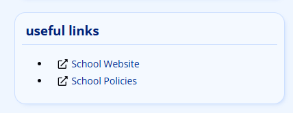
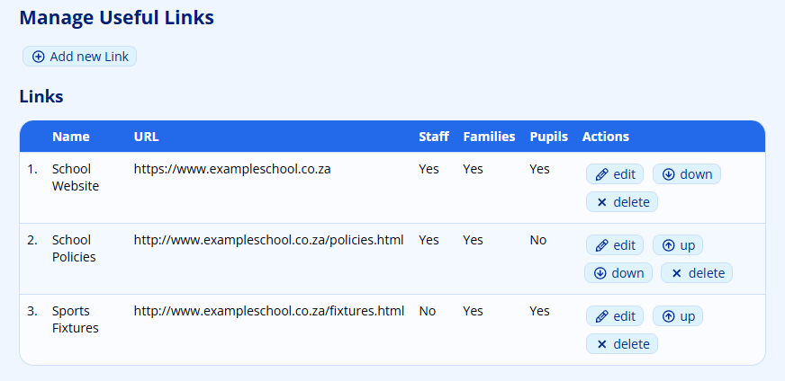
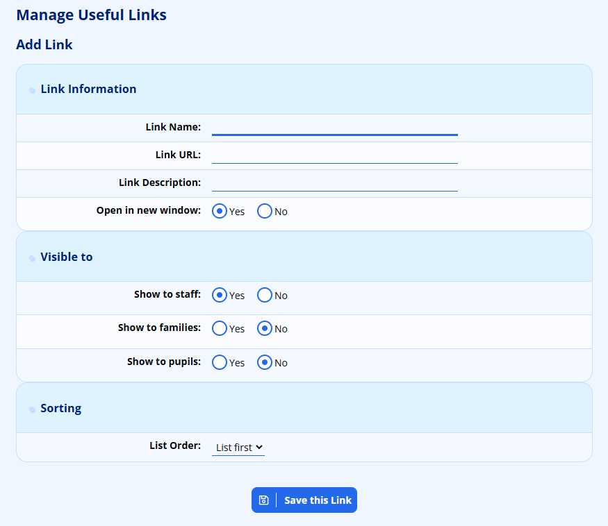
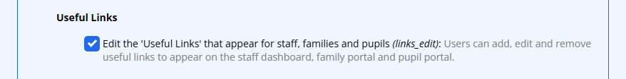

# Useful Links

Useful Links are short, named web links that ADAM displays to your users. They are an easy way to point staff, parents and pupils to the resources they use most often, such as your school website, a library catalogue, a homework portal, a calendar of events or a payment page.

A link can now be shown to any combination of three audiences — **staff**, **families** and **pupils** — so the same screen lets you publish a link to everyone, or only to the group it is relevant to.

## Where Useful Links Appear

Each user only ever sees the links that have been flagged for them:

* **Staff** see their links in a “Useful Links” card on the main ADAM dashboard — the page that loads when they log in.
* **Families** see their links on the Family Portal home page.
* **Pupils** see their links on the Pupil Portal home page.

The family and pupil links are only useful once you have opened the portals to those audiences. See [Parent and Pupil Portal](parent-and-pupil-portal.md#parent-and-pupil-portal) for how to enable portal access.

Every link is shown with an external-link icon. If you supplied a description, it appears next to the link and also as a tooltip when the user hovers over it. Links set to open in a new window will do so, leaving ADAM open in the original tab.

If no links have been flagged for a particular audience, the “Useful Links” section is hidden for that audience entirely.

## Managing Useful Links

To manage your links, go to the “**Administration**” tab, and under the “**Site Administration**” heading click on “**Manage ‘Useful Links’**”.

This screen lists every link you have created, showing its **Name**, **URL** and which audiences — **Staff**, **Families** and **Pupils** — it is visible to. Each link has its own **edit**, **up**, **down** and **delete** buttons in the **Actions** column.

### Adding or Editing a Link

Click the “**Add new Link**” button to create a link, or the “**edit**” button beside an existing one. Either way you are presented with the same form, grouped into sections.

Under **Link Information**:

* **Link Name** — the text the user clicks on. Keep this short and descriptive.
* **Link URL** — the full web address the link points to, for example `https://www.example.co.za`.
* **Link Description** — an optional sentence describing the link. It is shown beside the link and as a hover tooltip.
* **Open in new window** — set to **Yes** to open the link in a new browser tab, or **No** to open it in the current tab.

Under **Visible to**:

* **Show to staff** — defaults to **Yes**.
* **Show to families** — defaults to **No**.
* **Show to pupils** — defaults to **No**.

Set each of these to **Yes** or **No** to control exactly who sees the link. A link with **Show to staff** and **Show to families** set to **Yes**, for example, appears for staff and parents but not for pupils. The defaults mean that a brand-new link behaves like the older staff-only links until you choose to extend it to families or pupils.

You can also set where the link sits in the list using the **List Order** dropdown in the **Sorting** section.

When you are finished, click “**Save this Link**”.

### Reordering Links

The links appear to your users in the order shown on the management screen. Use the “**up**” and “**down**” buttons beside each link to move it earlier or later in the list, or set its position with the **List Order** dropdown when adding or editing it. The new order takes effect immediately for every audience.

### Deleting a Link

To remove a link, click the “**delete**” button beside it and confirm when prompted. Deleting a link removes it permanently and it will no longer appear for any audience.

## Controlling Who Can Manage Links

Access to the management screen is governed by a privilege, grouped under **Site Admin → Useful Links** when [editing a staff privilege group](security-administration-for-staff.md#security-administration-for-staff). The option reads “**Edit the ‘Useful Links’ that appear for staff, families and pupils**”. Grant it to the staff members who should be able to add, edit and remove these links.

