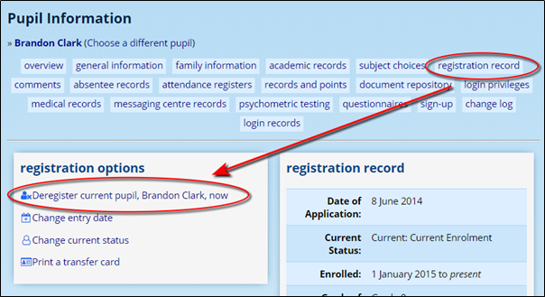
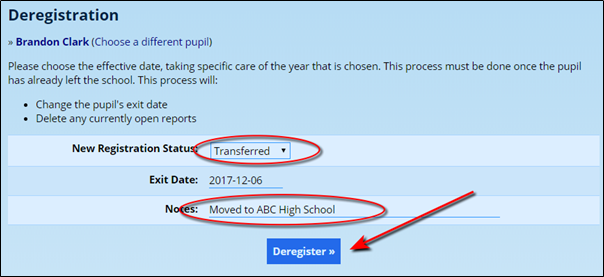
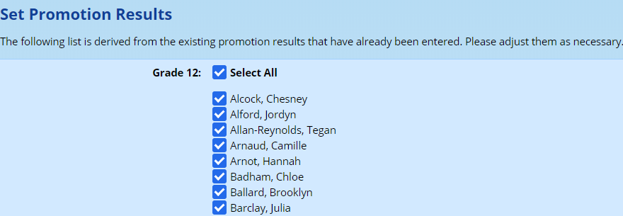
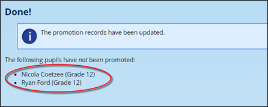
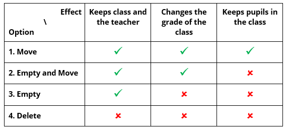
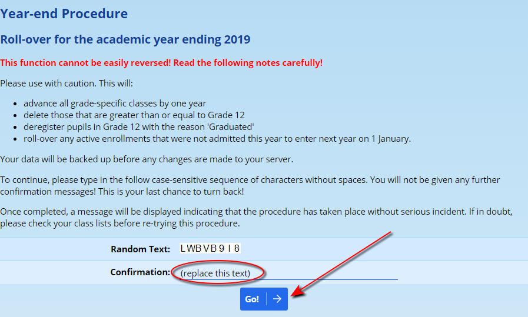
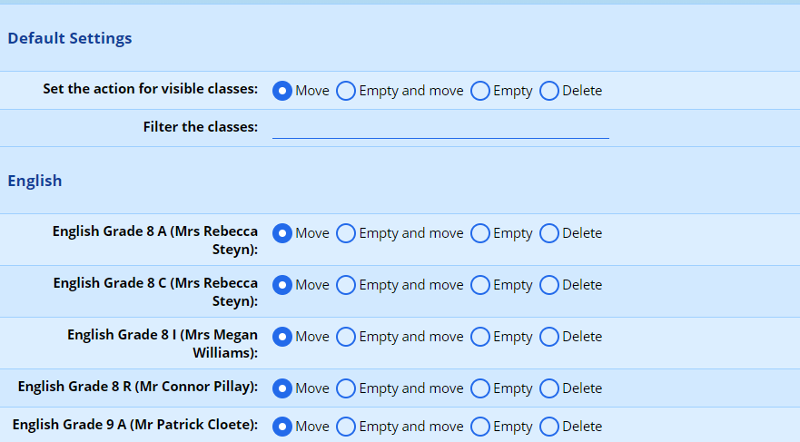
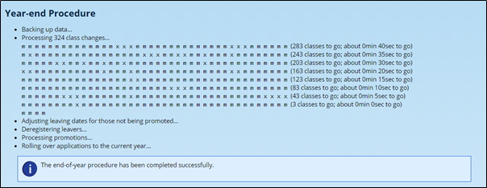

# Year-end Functions {#h-2gb3jie}

The following video provides a walk through of the process. Each step is also described below.

<iframe src="https://www.youtube.com/embed/E0Ek21XQAqM" frameborder="0" allow="accelerometer; autoplay; encrypted-media; gyroscope; picture-in-picture" allowfullscreen></iframe>

## Before You Begin {#h-so7smz9ci41l}

Please ensure that your ADAM installation meets the following requirements:

-   **Ensure that there are no open** **[reporting periods](reporting-period-administration.md#h-1a346fx)****.** ADAM will warn you during the upgrade if there are any open. In particular, check that the reporting **period end-date** has passed and that the reporting period is **published**.
-   **Download a copy of your** **[SA-SAMS database](roll-calls.md#h-74ctdmgnp3ca)** before you proceed with the roll-over. Getting this database after the roll-over requires restoring a backup copy. Most provinces require a submission of the SA-SAMS database at year-end.
-   **The roll-over process will affect your class lists.** Until you have an opportunity to add in your classes for the following year, we suggest that you temporarily [remove the privilege which allows pupils and families to see a list of teachers](security-administration-for-families-and-pupils.md#h-mg1sc7iv8w2n) in the pupil and parent portal. This will, of course, depend on how you perform the roll-over and which options you choose when processing your classes below.
-   **Check your graduating grades.** ADAM allows for a school to have multiple exit points. These are defined by the [graduating grades](grade-settings.md#h-2iq8gzs). During the roll-over, any pupil in a graduating grade is moved to the alumni status.

## Step 1: Process any Transferring Students {#h-f4y7iemabqkr}

Once your academic year is over, it is time to process the pupils who are leaving the school for any reason *other than graduation* from last year offered by your school. If you are a primary school, for example, then this would exclude your Grade 7 learners and, if you are a high school, this would exclude your Grade 12 learners. ADAM takes care of graduating pupils separately and automatically.

If you **don’t know** which pupils might be transferring, don’t worry: deregistering pupils can be done later and their date of leaving set retroactively. You can deregister a pupil at any time using this same process.

-   On the **Pupils** tab, click on **Pupil Info** which is found under the **Pupil Administration** heading and search for the pupil to be deregistered.
-   Once their profile is loaded, click on the **Admissions Records** section within their profile.
-   Choose the option to **Deregister current pupil now**.

-   Choose a reason for their exit and enter a note if you’d like to record more detail about why they have left.
-   **Please ensure that you do not choose the last day of term as date of deregistration.** If you do, ADAM will consider the pupil as not reaching the last day of term. The date of their deregistration should be their first day NOT at the school!

Repeat these steps for each transferring pupil.

## Step 2: Finalising Promotion Decisions {#h-7rslyudg2la5}

This step tells ADAM which pupils should be moved up into the next grade and which pupils should not be. Although ADAM can calculate promotion decisions based on results, these calculated decisions may not always reflect accurate promotions and transfers to subsequent grades. For this reason, ADAM asks you to check which pupils must be moved to the next grade, and which should be kept in the same grade.

ADAM will assume that any pupil with a promotion result of “Fail” will not be promoted. This assumption can easily be changed by following the instructions below. A pupil who reflects “Fail” in their promotion decision can most certainly be promoted! As it happens, the promotion decision calculated by ADAM’s promotion results is only a guide and ADAM does not enforce this decision, letting you override it easily.

Additionally, if a decision regarding a pupil’s promotion is made only after the roll-over is complete, don’t worry: it is possible to change the promotions later. Changing it after the roll-over requires a [slightly more manual approach](pupil-information.md#h-w9dei5qt9594) which is otherwise automated in the roll-over process.

-   On the **Administration** tab, click on **Finalise Promotion Results** under the **Year-End Functions** heading.
-   Select the **current academic year** to process promotions. ADAM allows you to choose a previous year, but this *should only be used in special circumstances and under guidance from support staff!* For a standard end-of-year procedure, you will always choose the year of the academic cycle just past.

-   A list of pupils will appear. If ADAM has determined a promotion status for the pupil, they will have a tick next to their names. If they have been determined to fail, there will be no tick. You may change these ticks as you require. Many administrators click on the “Select All” tickbox at the top and then go through and manually deselect the pupils who are being held back a year.

-   Click on the **Save Results** button to record these changes. It is possible to come back and change these promotion decisions, but all changes must be completed before moving to Step 3, below.
-   In the confirmation screen, a list of pupils who are NOT progressing to a higher grade will be displayed. Double check this list and, if necessary, repeat the process described in Step 2 to correct the list to ensure that the correct pupils are promoted.

## Step 3: The Roll-Over {#h-2tmajck1x4hi}

The largest and most important aspect of the roll-over is telling ADAM how to help you simplify the process of creating new classes for the following academic year.

### Background Information {#h-6a02slgja8sf}

ADAM will ask you what it should do with all the classes that you have created on your system for the current academic year. There are four possible options:

1.  **Move** will transfer all currently registered students in the class into the next grade.

Using this option will cause “Grade 8 C English” to become “Grade 9 C English” and all the pupils that were in “Grade 8 C English” will now be in “Grade 9 C English”.

Use this option if the class will remain largely the same from year to year, even if the teacher will change.

-   If the grade year exceeds the maximum allowed at the school (e.g. “Grade 12 A Mathematics” would become “Grade 13 A Mathematics”) then the class will automatically be deleted.
-   Moving has *no effect* on classes that are not assigned to a specific grade. So “Blue House” will remain “Blue House” and all pupils will remain registered for it.

2.  **Empty and move** will remove all students from the class and change the grade year associated with the class to the next year. This is useful when the subject will be carried through to the following year but the class groups will change significantly.

Using this option will cause “Grade 8 C English” becomes “Grade 9 C English”, but the pupils who were in “Grade 8 C English” will no longer be registered for an English class. “Grade 9 C English” will still have the same teacher, but none of the pupils.

-    If the class has no grade assigned to it, then this option is equivalent to “Empty”.

3.  **Empty** will leave the class as is, but deregister all students from the class.

Using this option will cause “Grade 8 C English” to remain as “Grade 8 C English” and all the pupils who were registered for “Grade 8 C English” will no longer be registered for an English class.

Use this option if you have the same classes with the same teachers in the same grades each year. This is mostly used with Primary Schools.

4.  **Delete** will deregister all pupils from the class and delete it.

The following table summarises these four options:

If a class is not assigned to a grade (e.g. a sports house or school club), then the options that offer to “change the grade of the class” (i.e. the two options which involve “Moving”) will simply ignore the grade-change aspect of that instruction. This effectively means that for classes with no grade assigned, options 2 (Empty and Move) and 3 (Empty) are identical.

If a class has the same grade as the final grade allowed in the school, then options 1, 2 and 4 will all result in that class being deleted since it will have an invalid grade.

If you choose to “change a grade” for a class (options 1 or 2) in the highest grade of the school, that class will be deleted.

The following examples might provide some context for when to use the different options:

-   In a high school, subjects like “Geography” and “History” in Grades 10 and 11 usually keep the same enrolments from year to year. These classes would be set with option 1 (“Move”) to merely change the class grade, but keep the pupils enrolled. If the teacher changes, this could be done later.

-   If the class is going to change significantly in its make up, it might help to have a new, empty class ready in the following grade, but to remove the pupils from it which will allow them to be entered into new classes. In this scenario, choose option 2 (“Empty and Move”). *This option is chosen least often. This is not to say that it is* never *chosen, but you are probably doing something inefficient if this is your default option!*
-   In primary schools, class teachers generally remain the same in each grade. It may thus be best to choose option 3 (“Empty”). This will keep the classes for a particular grade, but deregister the pupils who will have moved up to the next grade.

-   Finally, any class which does not need to be taken into account in the following year should be removed using option 4 (“Delete”).

-   If the grade of the class is already at the highest grade that the school allows, then the class will also be deleted if options 1 or 2 are chosen. This is because there is no valid higher grade for those classes to move to.

### Performing the Roll-over {#h-bpc4c6x9umkt}

-   On the **Administration** tab under the **Year-End Functions** heading, click on the **Perform year-end functions** option.
-   If ADAM detects any problems at this point, you will be notified. Common problems include:

1.  Having a reporting period still open. All reporting periods must be closed and finalised. Ideally, the publishing date should also have passed.

2.  Not having processed the promotions yet (see [Step 2](#h-7rslyudg2la5)).

If, however, ADAM gives you the option of entering in a random string of letters and numbers to proceed with the roll-over, then your system has met all the requirements.

-   Type in the random characters and click on the “**Go!**” button.

-   ADAM now shows you a list of all the classes in the school. At the top of the list is a **Default Setting** which allows you to choose how to deal with classes in bulk.

Any of the classes that are visible on the page will be updated to match the selection chosen in the “Default Settings” at the top. By typing in the **Filter the classes** block, the list of classes will be filtered to only show classes that contain the text that you have specified. For example, if you were to type **Grade 5**, then only the classes containing the text “Grade 5” would be displayed. At this point, if you were to select a new option at the top, all the classes shown (in our example, “Grade 5”) would be updated to match. Clearing the text would then show all the classes again.

-   Once you are happy with the options chosen for each class, you are ready for the final step in this process. Click on the “**Next**” button at the bottom of the screen.

-   At this point, **ADAM creates a backup of the database** and, once done, begins transferring pupils, and performing the required operations on the classes. This process should take between 1 and 5 minutes. Please be patient! If you end up waiting for longer than 5 minutes, please contact us!

-   ADAM will the process the roll-over and move the classes as you’ve requested. You will see a report that the end-of-year procedure has been completed successfully.

Once ADAM has completed the roll-over, you will notice that as you work your way back to the menu and into other functions in ADAM, ADAM will report that it is in “**Roll-over mode**”. This happens only if the roll-over was completed before the end of the calendar year. If the roll-over is performed at the start of the next calendar year (in January), then ADAM will not enter the roll-over mode. “Roll-over mode” automatically stops automatically on 1 January when normal operation can resume.

In roll-over mode, ADAM will assume that the date for a number of operations is 1 January of the following year. This allows you to start working on your classes.

## Step 4: Processing New Admissions {#h-osvutrvhdj7e}

New admissions to the school need to be registered as current pupils in order that they can be registered into classes.

-   On the **Admissions** tab, under the **Pupil Administration** heading, click on the **Process admissions and enrolments** option.
-   ADAM will show a list of pupils waiting to be admitted into the school for that year.

-   Note that if someone’s admissions date is set for the following year, in error perhaps, then they will not show up on this list until their entry date has been changed. This can be done by visiting the **Pupil Info** page and clicking on their **Admissions Records**. There should be an option to change their entry date.

-   Any pupils whose entry dates have passed are automatically selected, but other pupils can also be selected to enrol. These pupils will have their entry dates change to the current date. If ADAM is in roll-over mode, this will automatically be 1 January.

-   Click on “**Enrol pupils**” at the bottom of the screen to process the enrolments.

-   ADAM will show a list of pupils that have been enrolled.

## Step 5: Create a Term 1 Reporting Period {#h-z4k6ga60xp0w}

**Please do this step as part of your roll-over! Don’t leave it until later!**

Until a new reporting period is created, you may find that each pupil, in the search menus, will still have their default class from the year before showing. This can be disconcerting since this often will include the incorrect grade.

In addition, when messaging pupils, ADAM will look to the last class registration that co-incided with a reporting period (which, if you like, “confirms” the registration). Without a reporting period created for the new year, the last reporting period will have last year’s classes and - importantly - include any children that might have left and ignore and new pupils that may have arrived.

As soon as a reporting period is created, ADAM will be able to accurately determine the correct – and new – class information to show in that search list.

-   On the Reporting tab, click on the Add reporting period option under the Reporting Period Administration heading.

-   Enter the name, short name and the start and end dates of the reporting period. If you know the rest of the information, then you can add that in also, but it can always be updated later.

## Step 6: Update Class Registrations and Class Details {#h-plc92d9mndcx}

This final step is to ensure that the class registrations are accurate for the following year.

1.  Add new classes – especially for junior grades if the classes were “moved up” as part of the roll-over procedure.

2.  Edit details of classes where teachers or class descriptions might change.

3.  Enrol pupils into the classes as required.

If you need any help with the year-end procedure, e-mail help is available throughout December with a 24-hour turnaround on requests. Telephonic support may be available, but unfortunately cannot be guaranteed during this holiday time.

---
